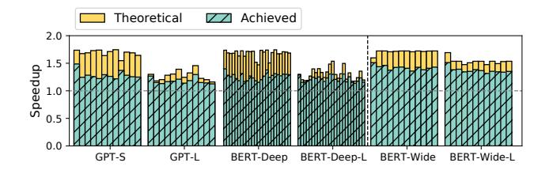
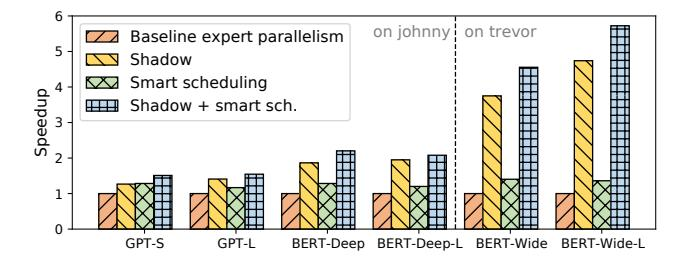
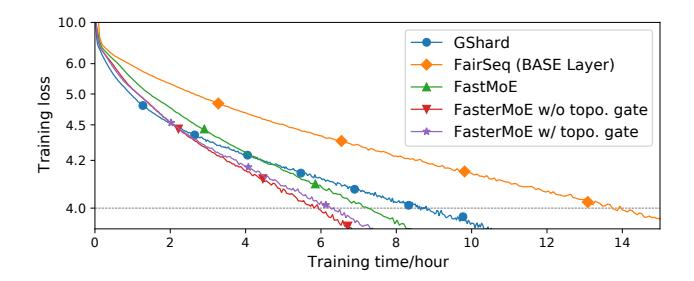

# 5.5 Dynamic Shadowing and Smart Scheduling Analysis

The optimizations are tested separately to better understand the performance gain brought by each of them.

We inspect the latency and the shadowed experts in specific iterations, as shown in Figure 11. We observe that popularity of experts is highly dynamic, and 19% experts are shadowed on average. The shadowing strategy succeeded in reducing latency of iterations accordingly. A maximum speedup of 1.97× is achieved when 1 expert is shadowed.

Figure 11. Effect of shadowing.

The theoretical upper bound of the smart schedule's speedup in every layer, calculated as  $\frac{Lat_{\text{comm}} + Lat_{\text{comp}}}{\max\{Lat_{\text{comm}}, Lat_{\text{comp}}\}}$ , is compared with the actual speedup in Figure 12. We suggest that there is up to 1.71× speedup ideally, and we achieve up to 1.42×. In some layers, our implementation reaches up to 99% of the theoretical speedup. We observe that the real speedup is closer to the upper bound in larger models and with more workers, because of relatively lower startup overhead.

Figure 12. Speedup of smart scheduling per layer.

**Figure 13.** Speedup of the optimizations separately.

As shown in Figure 13, performing dynamic shadowing brings up to  $1.95 \times$  speedup on *johnny*, and  $4.74 \times$  on *trevor*. Smart scheduling speeds training up by  $1.40 \times$ . When they are jointly utilized,  $2.20 \times$  speedup is observed on *johnny*, and  $5.72 \times$  observed on *trevor*.

#### 5.6 Speedup of the Topology-aware Gate

Figure 14. Training loss w.r.t. time.

**Table 3.** Time and iterations @LM-loss = 4.0

| System                                           | Time/hour | Iterations | Iter. time/ms |
|--------------------------------------------------|-----------|------------|---------------|
| GShard [11]                                      | 8.58      | 30.9k      | 1000          |
| FairSeq (BASE Layer) [12]                        | 13.7      | 21.0k      | 2355          |
| FastMoE [7]                                      | 7.19      | 12.2k      | 2117          |
| FasterMoE w/o topo. gate FasterMoE w/ topo. gate | 5.81      | 13.0k      | 1609          |
|                                                  | 6.25      | 15.3k      | 1471          |

The loss curve when training MoE-GPT is presented in Figure 14, and their convergence time is shown in Table 3. GShard, although with the lowest iteration time, takes  $2.38\times$  more steps than a faithful top-2 gate in FastMoE. BASE

Layer [12] also takes significantly more steps to converge. It even takes more time in each iteration due to its strict matching algorithm and extra communication overhead.

When only dynamic shadowing and smart scheduling are enabled, indicated by FasterMoE w/o topo. gate, the loss curve is almost identical to FastMoE, with 1.33× speedup per iteration. Although the per-iteration latency is not as low as other state-of-the-art systems, these optimizations do not modify expert selection, thus not incurring extra steps towards convergence. When the topology-aware gate is enabled together with dynamic shadowing and smart scheduling, indicated by FasterMoE w/ topo. gate, the iterations are 9.4% faster, whereas 18% more steps are taken, similar to other baselines that modify the selection. Overall, Faster-MoE is 1.37× and 2.19× faster than GShard and BASE Layers, respectively.

#### 6 Related Work

Parameter server [10, 13, 14] is the earliest system to support data parallelism, soon replaced by Horovod [30] using allreduce for better performance. Asynchronous partial model updating methods [15, 16, 18, 32] are introduced to speed up convergence in heterogeneous environment for data parallelism. SuperNeurons [35] places large models on a single GPU by a fine-grained memory management method. ZeRO Offload [28] reduces memory consumption of data parallelism by swapping data to host memory, and the data is further off-loaded to disks [26]. Megatron-LM [20] is a dedicated training system for pre-training, with an insightful model parallelism method for transformer blocks. TOFU [36] and FlexFlow [9] are general systems that provide optimal hybrid of data and model parallelism via execution simulator and searching. Another approach to save memory is pipeline parallelism [19], and it can be mixed with data parallelism [4].

BERT [3] and GPT [1, 24] are popular pre-trained models for language comprehension and generation, respectively. GShard [11] based on Mesh TensorFlow[31] first introduces expert parallelism. BASE layers [12], as a part of FairSeq [21], is another MoE training system from the PyTorch [23] community, using a matching algorithm for expert assignment.

#### 7 Conclusion

We present FasterMoE to address the challenges in distributed training of MoE models with a performance model and several optimizations. Performance is modeled by an accurate predictor of communication and computation, and a novel DDL-Roofline that shows the theoretical upper bound of a specific training task on a given platform. Guided by the performance model, we propose a dynamic shadowing approach that can reduce the overhead introduced by load imbalance. The synchronous operators are split into smaller

tasks between worker groups, and smartly scheduled to execute concurrently, minimizing communication overhead. We also design an expert selection approach to avoid congestion in the network, achieving higher throughput with promising convergence speed. FASTERMOE enables training large dynamic MoE model with up to 17.87× more efficiency.

