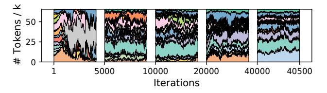
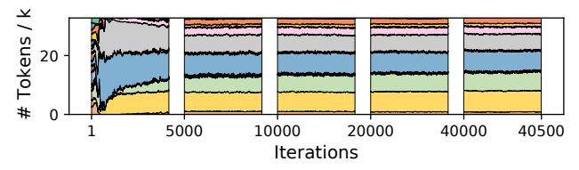

# 2 Background and Challenges

#### 2.1 Transformer: Backbone of Pre-trained Models

Transformer [34] is the state-of-the-art structure to process sequences. Most pre-trained models are based on sequences,

Weights and residuals are not presented in this figure.

**Figure 2.** Structure of a transformer block.

such as texts [3], proteins [29], or even pixels in images [22], making transformers as the basic structure of many pretrained models. As shown in Figure 2, a transformer block consists of two parts, namely attention and multi-layer perceptron (MLP).

The attention layer extracts the relationship of tokens of a sequence by performing dot product between each pair of tokens in a specific linear space, represented by Q and K. The resulting matrix of the pairwise product is called attention matrix. The attention matrix is used to add up embedding vectors of different tokens with weight, from V to F, extracting the relationship between them. The result of the attention layer is fed into an MLP layer, which typically consists of two huge fully-connected (FC) layers in a transformer block. The most time-consuming computation of a transformer block is general matrix multiplication (GeMM) that occurs in the MLP layer.

#### 2.2 MoE Structure

MoE [17] is found to have strong ability in modern large-scale pre-trained models. The key idea of MoE is that it has a number of small models, namely *experts*, constituting a large model, given the intuition that different small models are experts in different domains, and can be only activated when the data in its domain are input.

In transformers, the MLP layer is commonly extended by MoE. When processing a token, only a few experts that best fit their domain are activated. Recall that in a non-MoE transformer model, there are two adjacent FC layers in an MLP. These dense layers become giant when scaling up the model size, making the GeMM computation too heavy. In an MoE model, the weight matrices of the GeMMs are split along certain dimensions, so that each part still produces an output of the same size, while the GeMM computation remains small. In other words, MoE allows an increase in model parameters without increasing computation, making it currently the most feasible approach to produce pre-trained models of trillion-scale and beyond.

For a given input, an additional module, **gate**, is introduced to decide which experts should be activated. A gate is

commonly a small FC layer to compute a fit score for each expert, and the experts with top k fit scores are selected.

## 2.3 Parallel Strategies

Data, model, and expert parallelism are three commonly used parallel strategies in distributed training.

**Data parallelism** duplicates parameters of the model across all workers. Each worker is then given a different batch of training samples. Workers synchronize gradients globally and update the model after each iteration. Although there is no communication within each iteration, the size of the model must not exceed the capacity of a single worker, making it impossible to scale up to large models.

Model parallelism partitions weight tensors along certain dimensions, i.e., models are split into partitions and placed on different workers. All workers process the global batch together, and compute using its corresponding partition of weight. After each layer, the embedding vectors are aggregated and re-distributed. However, model parallelism cannot scale up to very large models with high-efficiency, as it is limited by the partition dimensions and by the large communication overhead that exists between layers.

**Figure 3.** Partitioning of tensors in expert parallelism, with related communication.

**Expert parallelism** is a specific method of parallelism for MoE models, which is first proposed by GShard [11]. As shown in Figure 3, experts are placed on different workers and each worker takes a different batch of training samples. For non-MoE layers, expert parallelism behaves the same as data parallelism. In MoE layers, tokens in the sequence are sent to workers where their desired experts reside. Similar to model parallelism, the outputs of each MoE layer are exchanged again to be organized back into original sequences for the computation of the next layer. As MoE models often have numerous experts, expert parallelism can scale up with model size better than model parallelism.

#### 2.4 Challenges and Observations

When training transformers using expert parallelism, a set of challenges greatly influence training efficiency. In this section, we describe such challenges.

Skewed expert selection leads to dynamic load imbalance. We use an example to describe this challenge. As

shown in Figure 3, expert 0 receives 3 tokens, 3× more workload than expert 2. As a result, worker 2 idles for a long time before the next communication starts, not making full use of its available computational power. Given that training data naturally follow a skewed distribution, some experts are more likely to be selected more than others.

(b) Layer 8 of MoE-GPT.

Areas with different colors represent different experts.

**Figure 4.** Distribution of expert selection in some iterations when training different MoE models.

We collect the expert selection of each token when training two real-world models of 16 experts to observe the actual popularity of different experts. Some iterations during the training are sampled and visualized in Figure 4. Fast-changing uneven distributions are observed in the first 500 iterations. In the MoE layer shown in Figure 4a, the popularity of experts keeps changing through the whole training process. Figure 4b shows another layer in a different model, in which popularity is more stable, while there are still many unpopular experts. In fact, zooming in the figure, many tiny stripes are seen, indicating that these experts are unpopular, although still faithfully processing their domain-specific data. At the same time, 4 out of 16 experts are processing about 20% of all tokens, 3.2× the average.

The more popular experts are receiving more tokens than the less popular ones, leaving the workers they run on more heavily loaded. This dynamic behavior affects hardware utilization and decreases training efficiency of the model, as it is not making full use of the available computational resources. Therefore, the first challenge presented by an MoE training system is to handle dynamic load imbalance caused by skew expert selection.

**Synchronous execution mode of operations is inefficient.** The all-to-all operation in expert parallelism is commonly implemented by synchronous operators provided by

communication libraries, such as MPI [6] or NCCL [8]. Considering that a non-uniform expert selection leads to imbalance in both computation and communication, this synchronized execution method leads to a higher waste of resources. When performing either communication or computation, the other hardware ends up underutilized, while they could be used to process other operations. However, it is not easy to split an all-to-all communication, as dependencies exist between different communication and computation tasks. Deadlocks can be easily introduced if the order of data transfer is not properly designed. Therefore, the second challenge is how to efficiently organize communication and computation tasks to be executed in parallel.

Expert parallelism causes severe network contention. Lastly, we highlight the incompatibility between expert assignment and network topology. In every iteration, multiple communication operations are performed simultaneously, which can incur a large performance degradation due to a few saturated links. Since the expert assignment of the tokens dictates the load balance and communication path, performing a smart assignment of tokens can help to lower the end-to-end latency of training without affecting the quality of the models. Therefore, the third challenge is how to design a network topology-aware token assignment strategy to avoid severe network contention.

