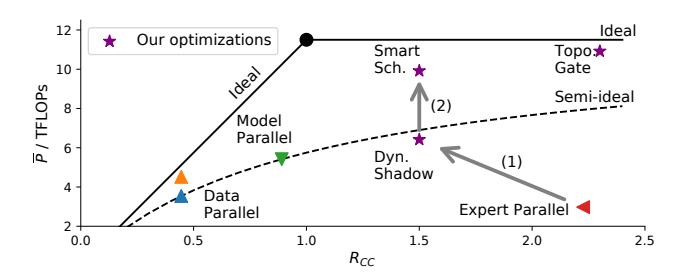

# 3 Performance Modeling

To estimate and analyze the performance of a training task, we first build models for computation and communication separately. Then, we introduce a roofline-like model to study how communication latency and computation latency determine the overall training efficiency jointly.

Notations used in the model are defined in Table 1.

Table 1. Notations used in the model

| Notation | Definition                                |
|----------|-------------------------------------------|
| Lat      | Latency of an operation                   |
| P        | Throughput of computation                 |
| W        | Bandwidth of a specific link              |
| T        | Traffic                                   |
| B        | Number of tokens for certain data         |
| H        | Length of embedding vectors               |
| α        | Fraction of intermediate embedding in MLP |

#### 3.1 Load-aware Computation Modeling

As mentioned above, GeMM is the major computation when training transformers. Modern massive computation devices, e.g., GPUs, are highly optimized for regular computation, such as GeMM, achieving very high performance. According to our measurement, an NVIDIA Tesla V100 GPU can achieve more than 90% of its peak throughput when running GeMMs

for typical model sizes and batch sizes in transformers. Therefore, we predict the computation latency of forward in an MLP layer in a transformer block by the formula below.

$$Lat_{comp} = \max_{w \in workers} \left\{ \frac{4B_w \alpha H^2}{P_w} \right\}$$
 (1)

 $B_w$  denotes the batch size on worker w, given that the batch size of modules on different workers may differ in expert parallelism. H is the length of the tokens' embedding vectors, and  $\alpha H$  is the length of the intermediate embedding between FC layers in MLP. As a single FMA operation accounts for 2 operations, each FC execution then takes  $2B_w\alpha H^2$  operations. There are 2 FCs, resulting in the constant factor 4.  $P_w$  denotes the average throughput of w to perform GeMM. The end-to-end latency is the maximum latency of each single worker, as all the workers have to exchange features after computation. As a result, load imbalance in computation is reflected by this formula.

A potential issue is that for workers whose  $B_w$  are very small, it may not achieve good utilization of its computation device, which results in an incorrect latency estimation. However, although peak performance is not achieved, computation latency with a small  $B_w$  is commonly no larger than that with a huge  $B_w$ . As the huge  $B_w$  dominates the overall computation latency, this inaccuracy in prediction does not invalidate its effectiveness.

#### 3.2 Topology-aware Communication Modeling

According to LogP model [2], the overall latency of communication consists of overhead and latency. The feature vector of each token is commonly larger than 1024, indicating that the minimum granularity of transferring data is more than 4KB. Therefore, we simplify the model by regarding the overhead in communication as negligible. Bandwidth of interconnections can be fully utilized if we assume that there is no congestion. Given that there are commonly multiple accelerators within a node, each being a worker, we should not only consider inter-node connection, but also intra-node connection, such as PCIe, UPI, and NVLink.

We adopt a topology-aware model to predict the latency of collective communication operations. Assume that a link l has a bandwidth of  $W_l$  in a single direction, with traffic of size  $T_l$  flowing through it. The end-to-end latency of the communication is calculated as follows.

$$Lat_{\text{comm}} = \max_{l \in \text{links}} \left\{ \frac{T_l}{W_l} \right\} \tag{2}$$

 $W_l$  can be determined by hardware specifications and by performing point-to-point bandwidth benchmarks. We highlight that the network topology graph is **directed**. To obtain  $T_l$ , we model each link as an edge in the graph. Two directed edges are used to represent a duplex link, considering traffic in both directions separately. Because in a load-imbalanced situation, traffic on two directions of a link may differ greatly.

the effective bandwidth of the link does not directly equal to that when both directions are busy.

The traffic on each link depends on the algorithm and routing policy. Different methods are used for different operations to compute the traffic on each edge. We show how 3 types of common communications are modeled below.

**All-to-all-v** is used to route tokens from its position in the sequence to their desired experts. Due to the flexibility of expert selection, traffic between each pair of workers is highly variable. We assume that all-to-all operations simply create links between all pairs of workers, and transfer data simultaneously. The path between each pair of workers is calculated by an algorithm according to the type of topology. For each pair of workers, the traffic between them is accumulated on all directed edges along the path.

**All-reduce** operator is widely used in synchronizing data, including the gradients of duplicated model parameters in data parallelism, and embedding vectors in model parallelism. Applying ring all-reduce [30] on a tensor of size S on each of n workers results in having each of them sending a total of  $2\frac{n-1}{n}S$  to its neighbor in a pipeline.

**Broadcast and reduce** are as regular as all-reduce, utilizing ring connection and pipeline to lower its latency. But different from all-reduce, they only send messages of total size *S* through each link.

#### 3.3 DDL-Roofline Model

We propose a Distributed Deep Learning (DDL) Roofline model to characterize the performance of a specific training task on a given cluster.

Computation and communication are two key factors in parallel MoE models. Thus, we define the ratio of computation-communication  $R_{CC}$ , presenting on the X axis of the DDL-Roofline, as follows.

$$R_{CC} = \frac{Lat_{\text{comp}}}{Lat_{\text{comm}}} \tag{3}$$

 $Lat_{\rm comp}$  and  $Lat_{\rm comm}$  denote the latency of computation and communication estimated by our predictor, respectively.  $R_{CC}$  denotes whether the task is bounded by computation or communication. When  $R_{CC} > 1$ , computation time dominates the end-to-end latency, otherwise communication takes up most of the latency. This ratio indicates the direction of applying different optimizations.

The variable of the Y axis is  $\overline{P}$ , the average computation throughput of all workers. When training an MoE MLP layer, it can be calculated as follows.

$$\overline{P} = \frac{12\alpha H^2 \sum_w B_w}{N Lat_{e2e}} \tag{4}$$

 $12\alpha H^2 \sum_w B_w$  denotes the total computation to be processed by all experts for all tokens, and N is the number of workers.  $Lat_{e2e}$  is the end-to-end latency of an iteration by estimation or measure. For example, in synchronous expert

parallelism, we estimate it by  $Lat_{\rm e2e} = 3Lat_{\rm comp} + 4Lat_{\rm comm}$ , as there are in total 3 rounds of computation in both forward and backward, and 4 rounds of communication.  $\overline{P}$  intuitively reflects the average utilization of all worker devices, and can also directly indicate the scalability of a system.

**Figure 5.** DDL-Roofline model showing different parallelisms and optimizations of FASTERMOE.

Ideally, communication and computation are performed simultaneously, and we obtain a roofline-like polyline as theoretical upper bound shown by a solid line in Figure 5. It is calculated as follows.

$$\overline{P}_{\text{ideal}} = P_w \min\{1, R_{CC}\} \tag{5}$$

We also highlight a semi-ideal curve by dashes, which refers to full hardware utilization when the training is performed in a synchronous way.

$$\overline{P}_{\text{semi-ideal}} = P_w \frac{Lat_{\text{comp}}}{Lat_{\text{comp}} + Lat_{\text{comm}}}$$

$$= P_w \frac{R_{CC}}{R_{CC} + 1}$$
(6)

In the semi-ideal case, the end-to-end latency is the sum of communication latency and computation latency. Different from the original roofline model [37] that depicts a program on a single device, where memory access and computation are naturally executed simultaneously, distributed training programs commonly requires significant optimizations on the system to execute them at the same time.

Given a training task and its parallel configuration, DDL-Roofline helps to better understand the training throughput of the model. Below, we show a few examples of how parallel strategies are reflected with DDL-Roofline in Figure 5 when training a specific transformer model.

**Data parallelism** is shown by 2 points on the left part of the ideal polyline. As synchronizing gradients for an MoE MLP layer involves performing all-reduce on  $2N\alpha H^2$  elements, it is too expensive, resulting in a poor  $R_{CC}$ . However, as the all-reduce may be overlapped with backward computation, it can move slightly above the semi-ideal curve.

**Model parallelism** has larger  $R_{CC}$  as it introduces less communication. It performs 2 all-reduce on an embedding matrix

of B tokens, totally sized 2NBH. Compared to data parallelism, it reduces communication of  $\frac{\alpha H}{B} > 1$ . But when synchronizing embedding vectors, no other computation can be performed. This characteristic forces model parallelism to be performed synchronously, and stops the point from moving above the semi-ideal curve.

**Expert parallelism** introduces more latency on computation than communication, due to load imbalance, so it has large  $R_{CC}$  but poor  $\overline{P}$ , far below the semi-ideal curve. Optimizations in FasterMoE are also presented in Figure 5. We indicate their characteristics in DDL-Roofline in the following Section.

