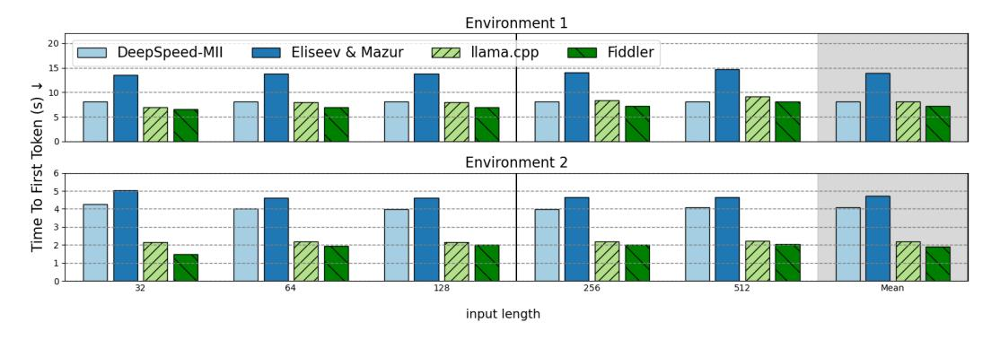
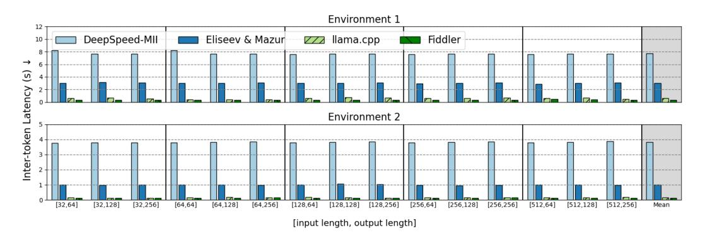

# F BREAKDOWN OF THE LATENCY

Figure [4](#page-8-0) shows the performance as measured by the number of generated tokens divided by endto-end latency. To complement the data, Figure [11](#page-15-1) and Figure [12](#page-16-0) show the Time To First Token (TTFT) and Inter-Token Latency (ITL) separately. In terms of TTFT, *Fiddler* shows an average of 1.13 times speedup across different input lengths among all baselines in 2 environments. In terms of ITL, *Fiddler* shows an average of 1.43 times speedup across different input and output lengths among all baselines in 2 environments.

Figure 11: The Time-To-First-Token (TTFT) comparison (lower is better).

Figure 12: The Inter-Token Latency (ITL) comparison (lower is better).