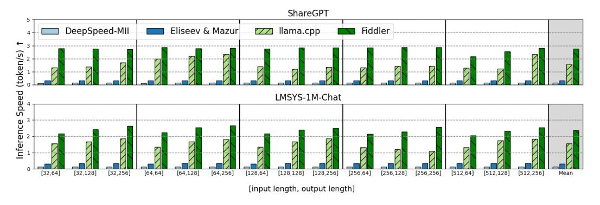
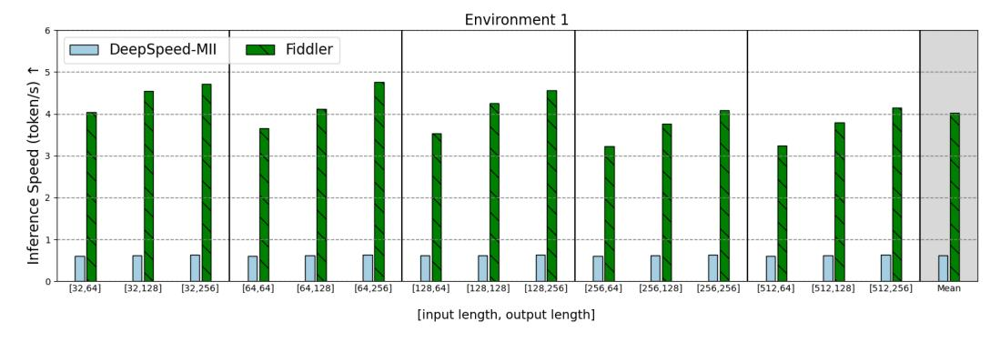

# D SENSITIVITY STUDY ON DATASET

Figure 9: The end-to-end performance comparison by the number of tokens generated per second (same as scenario a , higher is better), with two different datasets The rightmost set of bars shows the average of 15 configurations.

In this section, we analyze the sensitivity of *Fiddler*'s performance on input datasets since MoE models' routing behavior can be affected by the characteristics of input data distribution. Figure [9](#page-14-2) compares the performance of *Fiddler* with ShareGPT [\(ShareGPT\)](#page-10-11) and LMSYS-Chat-1M datasets [\(Zheng et al., 2024\)](#page-11-13), both of which are datasets of conversation between humans and chatbots. Aside from the dataset, experimental setups are the same as scenario a in [§4,](#page-6-0) and we use Environment 1.

On average, *Fiddler* outperforms the state-of-the-art system (llama.cpp) by 1.81 times for the ShareGPT dataset and 1.56 times for the LMSYS dataset. These results show *Fiddler*'s robustness to different distributions of inputs.

## E APPLICABILITY OF *Fiddler* FOR DIFFERENT MODELS

In the [§4,](#page-6-0) we evaluated the Mixtral-8x7B model because it is the only MoE model that is supported by all of the baselines. However, our system is designed to be model-agnostic within the family of MoE models. To demonstrate this, Figure [10](#page-15-0) presents *Fiddler*'s performance for the Phi-3.5-MoE model [\(Abdin et al., 2024\)](#page-9-17). We show the comparison against DeepSpeed-MII, since it is the only baseline system that supports this model.

Figure 10: The end-to-end performance comparison of Phi-3.5-MoE model by the number of tokens generated per second (same as scenario a , higher is better.)

The results are consistent with the Mixtral-8x7B model, and *Fiddler* outperforms DeepSpeed-MII with 6.5 times on average. It shows the applicability of *Fiddler* beyond Mixtral-8x7B model.

