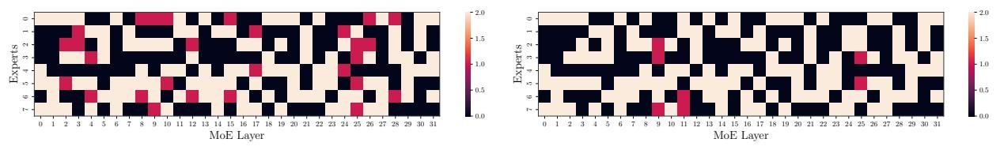

# 3.2. Understanding the Merits of Task-Agnostic Budget Finetuning

In this section, we attempt to unveil the true merits of the iterative *estimate-prune-finetune* procedure of MoE lottery subnetworks. To investigate the benefits contributed by iterative pruning and task-agnostic finetuning, we present perfor-

mance comparison for one-shot, iterative pruning, and MoE lottery subnetworks. Firstly, Table 2 illustrate the improved language modeling abilities measured using validation perplexity of C4 dataset where MoE lottery networks (with Min-EAN and Min-EGE criterion) can achieve  $\sim 3 \times$  better performance compared to one-shot pruning, while iterative pruning without any finetuning can still achieve  $\sim 2 \times$  superior performance. It is also interesting to note that even the random expert selection baseline significantly benefits from iterative pruning and finetuning with  $\sim 9.5$  points better perplexity than one-shot pruning. Secondly, Table 3 presents the improved zero-shot downstream performance (no in-context examples) of MoE lottery subnetworks over one-shot and iterative pruning at varying sparsity levels on MMLU and WinoGrande. Clearly, it can be observed that while one-shot pruning starts performing worse than random guess with merely a 25% sparsity ratio; MoE lottery networks performance doesn't drop below random guess even at non-trivial sparsity ratio (62.5%-75.0%). Moreover, the the contribution of iterative estimate-prune-finetune become more notable with increasing sparsity ratios.

Next, we ask an interesting question: How does task-agnostic finetuning, which aims to re-adjust the router weight, influence the load distribution across experts? To this end, Figure 6 illustrates the expert load distribution5 of remaining experts of a MoE layer from Mixtral-8×7B

 $^5$ Expert (e) Load: Given a fixed number of input tokens, # tokens processed by the expert e.

|            | Criterion (c)= Min-Activation Norm | 0%    | 12.5% | 25%   | 37.5% | 50%   | 62.5% | 75%   |
|------------|------------------------------------|-------|-------|-------|-------|-------|-------|-------|
| MMLU       | One-shot Pruning                   |       | 52.97 | 43.97 | 13.55 | 18.91 | 12.63 | 5.82  |
|            | Iterative Pruning                  | 60.01 | 48.51 | 47.81 | 45.63 | 3574  | 29.71 | 23.88 |
|            | MoE Lottery Networks               |       | 49.54 | 49.65 | 47.13 | 40.79 | 37.24 | 28.12 |
| WinoGrande | One-shot Pruning                   |       | 55.13 | 50.09 | 37.45 | 36.91 | 20.44 | 24.63 |
|            | Iterative Pruning                  | 56.59 | 55.90 | 52.17 | 49.96 | 48.53 | 47.11 | 50.35 |
|            | MoE Lottery Networks               |       | 55.92 | 52.98 | 50.96 | 49.56 | 49.30 | 50.74 |

Table 3. Improved Zero-shot Downstream Performance: Downstream task performance comparison of MoE Lottery Subnetworks identified using criterion (c) with respect to Iterative and One-shot pruning in zero-shot setting (no in-context examples). MoE Lottery networks tend to have superior abilities to follow instructions required to complete the downstream tasks.

Figure 5. Dropped Experts Distribution with 50% Sparsity: (a) Difference of experts identified to be dropped with *one-shot pruning* in comparison with *moe-lottery pruning*, (b) Difference of experts identified to be dropped with *iterative pruning* in comparison with *moe-lottery pruning*. Light Bisque color corresponding to an expert  $(e_L^i)$  indicates agreement across both pruning techniques to drop  $e_L^i$ , Dark pink indicates disagreement to drop, while Black indicates agreement to retain  $e_L^i$ .

Figure 6. Improved load balancing across experts (l=6~&~30) for Mixtral-8×7B Base model before and after task-agnostic finetuning with C4.

Base model with 50% expert sparsity ratio before (dashed red line) and after (solid green line) task-agnostic finetuning using C4 dataset. It can be clearly observed that our proposed finetuning subroutine can significantly help in induced skewness in load distribution across experts due to expert droping and removal of its entry from the router gating function. Note that a well-balanced load distribution across experts is encouraged to facilitate better GPU memory utilization and speedup.

