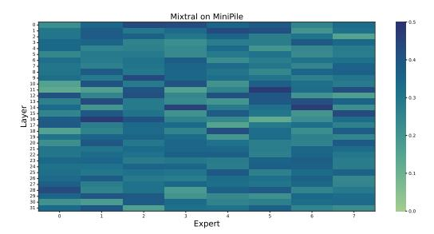
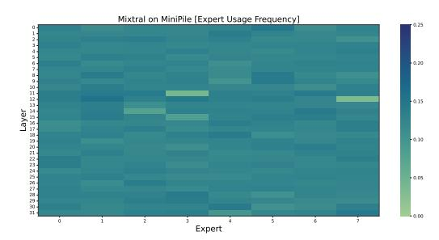
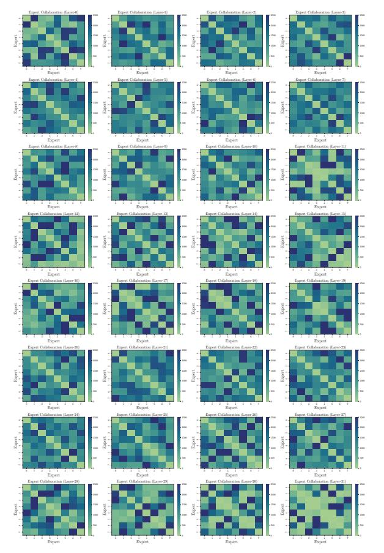
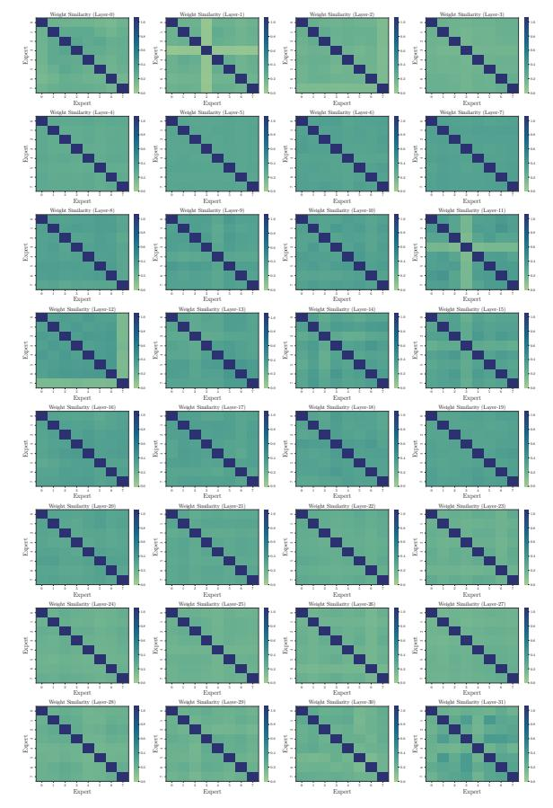

# 5. Expert Dropping v/s LLM Weight Pruning Techniques

LLM weight pruning algorithm (Yin et al., 2023b; Jaiswal et al., 2023b; Sun et al., 2023; Frantar & Alistarh, 2023) involves removing non-significant weights parameters by setting them to zero. Recent hardware advancements have enabled practical speedup for structural N:M sparsity patterns (Nvidia, 2020; Zhou et al., 2021). In this section, we investigate the downstream task performance of the expertlevel sparsification method with the representative weight pruning baselines (random, magnitude, and wanda). For expert-level sparsification, we present MoE lottery networks with random and minimum activation norm criterions to identify dominant experts. Provided the hardware supported 2:4 weight sparsity patterns, we choose expert drop ratio (r=4) per layer to achieve 50% sparsification for both categories for fair comparison.

Table 4 summarizes the performance comparison in zero-shot setting for all baselines and MoE Lottery subnetwork for Mixtral-8×7B Base and Instruct checkpoints. It can be observed that expert-level sparsification can achieve  $\sim 3.6\%$  average performance gain over the Wanda pruning

| Model        | Method                 | Sparsity | Arc-c | ARC-e | HellaSwag | MMLU  | WinoGrande | Average |
|--------------|------------------------|----------|-------|-------|-----------|-------|------------|---------|
|              | None                   | r = 8    | 78.18 | 91.94 | 64.88     | 60.01 | 56.59      | 70.32   |
|              | Random Pruning         | 2:4      | 19.47 | 48.90 | 28.90     | 17.05 | 22.07      | 27.27   |
| Mixtral 8×7B | Magnitude Pruning      | 2:4      | 31.07 | 69.76 | 43.23     | 42.77 | 38.56      | 45.07   |
| MIXTRAI 8×7B | Wanda Pruning          | 2:4      | 43.82 | 70.16 | 53.16     | 50.21 | 48.96      | 52.91   |
|              | Min-EAN Expert Pruning | r = 4    | 60.02 | 71.41 | 50.78     | 51.33 | 49.56      | 56.62   |
|              | None                   | r = 8    | 81.86 | 93.21 | 78.06     | 64.67 | 63.77      | 76.31   |
|              | Random Pruning         | 2:4      | 23.68 | 56.42 | 37.01     | 22.15 | 29.07      | 31.94   |
| Mixtral 8×7B | Magnitude Pruning      | 2:4      | 54.96 | 69.44 | 57.18     | 29.08 | 40.79      | 50.29   |
| Instruct     | Wanda Pruning          | 2:4      | 61.92 | 80.23 | 62.90     | 51.05 | 55.30      | 62.28   |
|              | Min-EAN Expert Pruning | r = 4    | 68.50 | 83.59 | 64.46     | 48.56 | 54.65      | 63.95   |

Table 4. Expert-level Sparsification V/s LLM Weight Pruning: Downstream task performance comparison in zero-shot setting (no in-context example) of Mixtral 8×7B base and Instruct when compressed using expert-level sparsification techniques v/s SoTA LLM pruning methods.

while a notable  $\sim 16.2\%$  improvement on ARC-c downstream task. In addition, we also find that the performance benefits for Base model is comparatively superior than Instruct suggesting it is favorable to perform expertlevel dropping on the Base model before instruction tuning.

#### 6. Conclusion

In this paper, we provide a detailed investigation of multiple expert importance estimation techniques (MC-Suite) to identify the best recipe for selecting the least knowledgeable experts that can be dropped without sacrificing the vital knowledge and capabilities of the SMoE. We propose to adopt a iterative pruning strategy with task-agnostic finetuning as a correction measure to minimize the drastic impact on SMoE capabilities. We present and experimentally validate an interesting conjecture that during expert dropping, SMoE instruction following capabilities are predominantly hurt, and SMoE performance can be notably recovered with a few-shot demonstration or supervised finetuning. In our future work, we plan to investigate and disentangle the instruction-following abilities and pretraining knowledge across the parameters of SMoE experts.

#### References

Artetxe, M., Bhosale, S., Goyal, N., Mihaylov, T., Ott, M., Shleifer, S., Lin, X. V., Du, J., Iyer, S., Pasunuru, R., Anantharaman, G., Li, X., Chen, S., Akin, H., Baines, M., Martin, L., Zhou, X., Koura, P. S., O'Horo, B., Wang, J., Zettlemoyer, L., Diab, M., Kozareva, Z., and Stoyanov, V. Efficient large scale language modeling with mixtures of experts, 2022. URL https://arxiv.org/abs/2112.10684.

Bandari, A., Yin, L., Hsieh, C.-Y., Jaiswal, A., Chen, T., Shen, L., Krishna, R., and Liu, S. Is c4 dataset optimal for pruning? an investigation of calibration data for llm pruning. In *Proceedings of the 2024 Conference on* 

Empirical Methods in Natural Language Processing, pp. 18089–18099, 2024.

Brown, T. B., Mann, B., Ryder, N., Subbiah, M., Kaplan, J., Dhariwal, P., Neelakantan, A., Shyam, P., Sastry, G., Askell, A., Agarwal, S., Herbert-Voss, A., Krueger, G., Henighan, T., Child, R., Ramesh, A., Ziegler, D. M., Wu, J., Winter, C., Hesse, C., Chen, M., Sigler, E., Litwin, M., Gray, S., Chess, B., Clark, J., Berner, C., McCandlish, S., Radford, A., Sutskever, I., and Amodei, D. Language models are few-shot learners, 2020. URL https://arxiv.org/abs/2005.14165.

Chen, T., Huang, S., Xie, Y., Jiao, B., Jiang, D., Zhou, H., Li, J., and Wei, F. Task-specific expert pruning for sparse mixture-of-experts, 2022. URL https://arxiv.org/abs/2206.00277.

Chen, T., Zhang, Z., Jaiswal, A., Liu, S., and Wang, Z. Sparse moe as the new dropout: Scaling dense and self-slimmable transformers. *arXiv preprint arXiv:2303.01610*, 2023.

Dai, D., Deng, C., Zhao, C., Xu, R. X., Gao, H., Chen, D., Li, J., Zeng, W., Yu, X., Wu, Y., Xie, Z., Li, Y. K., Huang, P., Luo, F., Ruan, C., Sui, Z., and Liang, W. Deepseekmoe: Towards ultimate expert specialization in mixture-of-experts language models, 2024. URL https://arxiv.org/abs/2401.06066.

DeepSeek-AI, Liu, A., Feng, B., Wang, B., Wang, B., Liu, B., Zhao, C., Dengr, C., Ruan, C., Dai, D., Guo, D., Yang, D., Chen, D., Ji, D., Li, E., Lin, F., Luo, F., Hao, G., Chen, G., Li, G., Zhang, H., Xu, H., Yang, H., Zhang, H., Ding, H., Xin, H., Gao, H., Li, H., Qu, H., Cai, J. L., Liang, J., Guo, J., Ni, J., Li, J., Chen, J., Yuan, J., Qiu, J., Song, J., Dong, K., Gao, K., Guan, K., Wang, L., Zhang, L., Xu, L., Xia, L., Zhao, L., Zhang, L., Li, M., Wang, M., Zhang, M., Zhang, M., Tang, M., Li, M., Tian, N., Huang, P., Wang, P., Zhang, P., Zhu, Q., Chen, Q., Du, Q., Chen, R. J., Jin, R. L., Ge, R., Pan, R., Xu, R., Chen,

- R., Li, S. S., Lu, S., Zhou, S., Chen, S., Wu, S., Ye, S., Ma, S., Wang, S., Zhou, S., Yu, S., Zhou, S., Zheng, S., Wang, T., Pei, T., Yuan, T., Sun, T., Xiao, W. L., Zeng, W., An, W., Liu, W., Liang, W., Gao, W., Zhang, W., Li, X. Q., Jin, X., Wang, X., Bi, X., Liu, X., Wang, X., Shen, X., Chen, X., Chen, X., Nie, X., Sun, X., Wang, X., Liu, X., Xie, X., Yu, X., Song, X., Zhou, X., Yang, X., Lu, X., Su, X., Wu, Y., Li, Y. K., Wei, Y. X., Zhu, Y. X., Xu, Y., Huang, Y., Li, Y., Zhao, Y., Sun, Y., Li, Y., Wang, Y., Zheng, Y., Zhang, Y., Xiong, Y., Zhao, Y., He, Y., Tang, Y., Piao, Y., Dong, Y., Tan, Y., Liu, Y., Wang, Y., Guo, Y., Zhu, Y., Wang, Y., Zou, Y., Zha, Y., Ma, Y., Yan, Y., You, Y., Liu, Y., Ren, Z. Z., Ren, Z., Sha, Z., Fu, Z., Huang, Z., Zhang, Z., Xie, Z., Hao, Z., Shao, Z., Wen, Z., Xu, Z., Zhang, Z., Li, Z., Wang, Z., Gu, Z., Li, Z., and Xie, Z. Deepseek-v2: A strong, economical, and efficient mixture-of-experts language model, 2024. URL <https://arxiv.org/abs/2405.04434>.
- Dettmers, T., Pagnoni, A., Holtzman, A., and Zettlemoyer, L. Qlora: Efficient finetuning of quantized llms. *ArXiv*, abs/2305.14314, 2023. URL [https:](https://api.semanticscholar.org/CorpusID:258841328) [//api.semanticscholar.org/CorpusID:](https://api.semanticscholar.org/CorpusID:258841328) [258841328](https://api.semanticscholar.org/CorpusID:258841328).
- Du, N., Huang, Y., Dai, A. M., Tong, S., Lepikhin, D., Xu, Y., Krikun, M., Zhou, Y., Yu, A. W., Firat, O., et al. Glam: Efficient scaling of language models with mixture-ofexperts. In *International Conference on Machine Learning*, pp. 5547–5569. PMLR, 2022.
- Dubey, A., Chatterjee, M., and Ahuja, N. Coreset-based neural network compression, 2018. URL [https://](https://arxiv.org/abs/1807.09810) [arxiv.org/abs/1807.09810](https://arxiv.org/abs/1807.09810).
- Fang, G., Ma, X., Song, M., Mi, M. B., and Wang, X. Depgraph: Towards any structural pruning, 2023. URL <https://arxiv.org/abs/2301.12900>.
- Fedus, W., Zoph, B., and Shazeer, N. Switch transformers: Scaling to trillion parameter models with simple and efficient sparsity. *Journal of Machine Learning Research*, 23(120):1–39, 2022.
- Frankle, J. and Carbin, M. The lottery ticket hypothesis: Finding sparse, trainable neural networks. *arXiv preprint arXiv:1803.03635*, 2018.
- Frankle, J. and Carbin, M. The lottery ticket hypothesis: Finding sparse, trainable neural networks. In *International Conference on Learning Representations*, 2019. URL [https://openreview.net/forum?](https://openreview.net/forum?id=rJl-b3RcF7) [id=rJl-b3RcF7](https://openreview.net/forum?id=rJl-b3RcF7).
- Frantar, E. and Alistarh, D. Sparsegpt: Massive language models can be accurately pruned in one-shot. In *International Conference on Machine Learning*, pp. 10323– 10337. PMLR, 2023.

- Frantar, E., Ashkboos, S., Hoefler, T., and Alistarh, D. Gptq: Accurate post-training quantization for generative pre-trained transformers. *ArXiv*, abs/2210.17323, 2022. URL [https://api.semanticscholar.](https://api.semanticscholar.org/CorpusID:253237200) [org/CorpusID:253237200](https://api.semanticscholar.org/CorpusID:253237200).
- Gou, J., Yu, B., Maybank, S. J., and Tao, D. Knowledge distillation: A survey. *International Journal of Computer Vision*, 129(6):1789–1819, March 2021. ISSN 1573-1405. doi: 10.1007/s11263-021-01453-z. URL [http://dx.](http://dx.doi.org/10.1007/s11263-021-01453-z) [doi.org/10.1007/s11263-021-01453-z](http://dx.doi.org/10.1007/s11263-021-01453-z).
- Guan, C., Wang, X., Zhang, Q., Chen, R., He, D., and Xie, X. Towards a deep and unified understanding of deep neural models in nlp. In *International Conference on Machine Learning*, 2019. URL [https://api.semanticscholar.](https://api.semanticscholar.org/CorpusID:174800317) [org/CorpusID:174800317](https://api.semanticscholar.org/CorpusID:174800317).
- Han, S., Pool, J., Tran, J., and Dally, W. J. Learning both weights and connections for efficient neural networks, 2015. URL [https://arxiv.org/abs/](https://arxiv.org/abs/1506.02626) [1506.02626](https://arxiv.org/abs/1506.02626).
- Han, S., Mao, H., and Dally, W. J. Deep compression: Compressing deep neural networks with pruning, trained quantization and huffman coding, 2016. URL [https:](https://arxiv.org/abs/1510.00149) [//arxiv.org/abs/1510.00149](https://arxiv.org/abs/1510.00149).
- He, S., Dong, D., Ding, L., and Li, A. Demystifying the compression of mixture-of-experts through a unified framework. *arXiv preprint arXiv:2406.02500*, 2024.
- Hoang, D. N., Liu, S., Marculescu, R., and Wang, Z. REVIS-ITING PRUNING AT INITIALIZATION THROUGH THE LENS OF RAMANUJAN GRAPH. In *The Eleventh International Conference on Learning Representations*, 2023. URL [https://openreview.net/forum?](https://openreview.net/forum?id=uVcDssQff_) [id=uVcDssQff\\_](https://openreview.net/forum?id=uVcDssQff_).
- Hong, J., Duan, J., Zhang, C., Li, Z., Xie, C., Lieberman, K., Diffenderfer, J., Bartoldson, B., Jaiswal, A., Xu, K., et al. Decoding compressed trust: Scrutinizing the trustworthiness of efficient llms under compression. *arXiv preprint arXiv:2403.15447*, 2024.
- Jaiswal, A., Gan, Z., Du, X., Zhang, B., Wang, Z., and Yang, Y. Compressing llms: The truth is rarely pure and never simple. *arXiv preprint arXiv:2310.01382*, 2023a.
- Jaiswal, A., Liu, S., Chen, T., and Wang, Z. The emergence of essential sparsity in large pre-trained models: The weights that matter. *arXiv preprint arXiv:2306.03805*, 2023b.
- Jaiswal, A., Yin, L., Zhang, Z., Liu, S., Zhao, J., Tian, Y., and Wang, Z. From galore to welore: How low-rank weights non-uniformly emerge from low-rank gradients. *arXiv preprint arXiv:2407.11239*, 2024.

- Jaiswal, A. K., Ma, H., Chen, T., Ding, Y., and Wang, Z. Training your sparse neural network better with any mask. In *International Conference on Machine Learning*, pp. 9833–9844. PMLR, 2022.
- Jaiswal, A. K., Liu, S., Chen, T., Ding, Y., and Wang, Z. Instant soup: Cheap pruning ensembles in a single pass can draw lottery tickets from large models. In *International Conference on Machine Learning*, pp. 14691– 14701. PMLR, 2023c.
- Jiang, A. Q., Sablayrolles, A., Roux, A., Mensch, A., Savary, B., Bamford, C., Chaplot, D. S., Casas, D. d. l., Hanna, E. B., Bressand, F., et al. Mixtral of experts. *arXiv preprint arXiv:2401.04088*, 2024.
- Kaplan, J., McCandlish, S., Henighan, T., Brown, T. B., Chess, B., Child, R., Gray, S., Radford, A., Wu, J., and Amodei, D. Scaling laws for neural language models, 2020. URL [https://arxiv.org/abs/2001.](https://arxiv.org/abs/2001.08361) [08361](https://arxiv.org/abs/2001.08361).
- Kim, J., Lee, J. H., Kim, S., Park, J., Yoo, K. M., Kwon, S. J., and Lee, D. Memory-efficient finetuning of compressed large language models via sub-4-bit integer quantization. *ArXiv*, abs/2305.14152, 2023. URL [https://api.semanticscholar.](https://api.semanticscholar.org/CorpusID:258841104) [org/CorpusID:258841104](https://api.semanticscholar.org/CorpusID:258841104).
- Kim, Y. J., Awan, A. A., Muzio, A., Salinas, A. F. C., Lu, L., Hendy, A., Rajbhandari, S., He, Y., and Awadalla, H. H. Scalable and efficient moe training for multitask multilingual models, 2021. URL [https://arxiv.](https://arxiv.org/abs/2109.10465) [org/abs/2109.10465](https://arxiv.org/abs/2109.10465).
- Koishekenov, Y., Berard, A., and Nikoulina, V. Memoryefficient nllb-200: Language-specific expert pruning of a massively multilingual machine translation model, 2023. URL <https://arxiv.org/abs/2212.09811>.
- LeCun, Y., Denker, J., and Solla, S. Optimal brain damage. In Touretzky, D. (ed.), *Advances in Neural Information Processing Systems*, volume 2. Morgan-Kaufmann, 1989. URL [https://proceedings.neurips.](https://proceedings.neurips.cc/paper_files/paper/1989/file/6c9882bbac1c7093bd25041881277658-Paper.pdf) [cc/paper\\_files/paper/1989/file/](https://proceedings.neurips.cc/paper_files/paper/1989/file/6c9882bbac1c7093bd25041881277658-Paper.pdf) [6c9882bbac1c7093bd25041881277658-Paper](https://proceedings.neurips.cc/paper_files/paper/1989/file/6c9882bbac1c7093bd25041881277658-Paper.pdf). [pdf](https://proceedings.neurips.cc/paper_files/paper/1989/file/6c9882bbac1c7093bd25041881277658-Paper.pdf).
- Lee, N., Ajanthan, T., and Torr, P. Snip: Single-shot network pruning based on connection sensitivity. In *International Conference on Learning Representations*, 2019. URL [https://openreview.net/forum?](https://openreview.net/forum?id=B1VZqjAcYX) [id=B1VZqjAcYX](https://openreview.net/forum?id=B1VZqjAcYX).
- Li, P., Jin, X., Cheng, Y., and Chen, T. Examining posttraining quantization for mixture-of-experts: A benchmark, 2024a. URL [https://arxiv.org/abs/](https://arxiv.org/abs/2406.08155) [2406.08155](https://arxiv.org/abs/2406.08155).

- Li, P., Zhang, Z., Yadav, P., Sung, Y.-L., Cheng, Y., Bansal, M., and Chen, T. Merge, then compress: Demystify efficient smoe with hints from its routing policy, 2024b. URL <https://arxiv.org/abs/2310.01334>.
- Li, Y., Du, X., Jaiswal, A., Lei, T., Zhao, T., Wang, C., and Wang, J. Idea prune: An integrated enlarge-andprune pipeline in generative language model pretraining. 2025. URL [https://api.semanticscholar.](https://api.semanticscholar.org/CorpusID:276903261) [org/CorpusID:276903261](https://api.semanticscholar.org/CorpusID:276903261).
- Lin, J., Tang, J., Tang, H., Yang, S., Dang, X., and Han, S. Awq: Activation-aware weight quantization for llm compression and acceleration. *ArXiv*, abs/2306.00978, 2023. URL [https://api.semanticscholar.](https://api.semanticscholar.org/CorpusID:258999941) [org/CorpusID:258999941](https://api.semanticscholar.org/CorpusID:258999941).
- Lin, S., Lyu, P., Liu, D., Tang, T., Liang, X., Song, A., and Chang, X. Mlp can be a good transformer learner. In *Proceedings of the IEEE/CVF Conference on Computer Vision and Pattern Recognition*, pp. 19489–19498, 2024.
- Liu, S., Chen, T., Zhang, Z., Chen, X., Huang, T., Jaiswal, A., and Wang, Z. Sparsity may cry: Let us fail (current) sparse neural networks together! *arXiv preprint arXiv:2303.02141*, 2023a.
- Liu, Z., Li, J., Shen, Z., Huang, G., Yan, S., and Zhang, C. Learning efficient convolutional networks through network slimming, 2017. URL [https://arxiv.org/](https://arxiv.org/abs/1708.06519) [abs/1708.06519](https://arxiv.org/abs/1708.06519).
- Liu, Z., Oguz, B., Zhao, C., Chang, E., Stock, P., Mehdad, Y., Shi, Y., Krishnamoorthi, R., and Chandra, V. Llm-qat: Data-free quantization aware training for large language models. *arXiv preprint arXiv:2305.17888*, 2023b.
- Lu, X., Liu, Q., Xu, Y., Zhou, A., Huang, S., Zhang, B., Yan, J., and Li, H. Not all experts are equal: Efficient expert pruning and skipping for mixture-of-experts large language models. *arXiv preprint arXiv:2402.14800*, 2024.
- Mishra, A., Latorre, J. A., Pool, J., Stosic, D., Stosic, D., Venkatesh, G., Yu, C., and Micikevicius, P. Accelerating sparse deep neural networks, 2021. URL [https://](https://arxiv.org/abs/2104.08378) [arxiv.org/abs/2104.08378](https://arxiv.org/abs/2104.08378).
- Mittal, S., Bengio, Y., and Lajoie, G. Is a modular architecture enough? *Advances in Neural Information Processing Systems*, 35:28747–28760, 2022.
- Molchanov, P., Tyree, S., Karras, T., Aila, T., and Kautz, J. Pruning convolutional neural networks for resource efficient inference, 2017. URL [https://arxiv.org/](https://arxiv.org/abs/1611.06440) [abs/1611.06440](https://arxiv.org/abs/1611.06440).
- Molchanov, P., Mallya, A., Tyree, S., Frosio, I., and Kautz, J. Importance estimation for neural network pruning, 2019. URL <https://arxiv.org/abs/1906.10771>.

- Muzio, A., Sun, A., and He, C. Seer-moe: Sparse expert efficiency through regularization for mixture-of-experts. *arXiv preprint arXiv:2404.05089*, 2024.
- Nvidia. Nvidia a100 tensor core gpu architecture. *https://www.nvidia.com/content/dam/enzz/Solutions/Data-Center/nvidia-ampere-architecturewhitepaper.pdf*, 2020.
- Paul, M., Chen, F., Larsen, B. W., Frankle, J., Ganguli, S., and Dziugaite, G. K. Unmasking the lottery ticket hypothesis: What's encoded in a winning ticket's mask?, 2022. URL <https://arxiv.org/abs/2210.03044>.
- Rajbhandari, S., Li, C., Yao, Z., Zhang, M., Aminabadi, R. Y., Awan, A. A., Rasley, J., and He, Y. Deepspeed-moe: Advancing mixture-of-experts inference and training to power next-generation ai scale, 2022. URL [https://](https://arxiv.org/abs/2201.05596) [arxiv.org/abs/2201.05596](https://arxiv.org/abs/2201.05596).
- Sanyal, A., Torr, P. H., and Dokania, P. K. Stable rank normalization for improved generalization in neural networks and gans. In *International Conference on Learning Representations*, 2020. URL [https://openreview.](https://openreview.net/forum?id=H1enKkrFDB) [net/forum?id=H1enKkrFDB](https://openreview.net/forum?id=H1enKkrFDB).
- Sarkar, S., Lausen, L., Cevher, V., Zha, S., Brox, T., and Karypis, G. Revisiting smoe language models by evaluating inefficiencies with task specific expert pruning, 2024. URL <https://arxiv.org/abs/2409.01483>.
- Shazeer, N., Mirhoseini, A., Maziarz, K., Davis, A., Le, Q., Hinton, G., and Dean, J. Outrageously large neural networks: The sparsely-gated mixture-of-experts layer. *arXiv preprint arXiv:1701.06538*, 2017a.
- Shazeer, N., Mirhoseini, A., Maziarz, K., Davis, A., Le, Q., Hinton, G., and Dean, J. Outrageously large neural networks: The sparsely-gated mixture-of-experts layer, 2017b. URL [https://arxiv.org/abs/](https://arxiv.org/abs/1701.06538) [1701.06538](https://arxiv.org/abs/1701.06538).
- Shen, M., Yin, H., Molchanov, P., Mao, L., Liu, J., and Alvarez, J. M. Structural pruning via latency-saliency knapsack, 2022. URL [https://arxiv.org/abs/](https://arxiv.org/abs/2210.06659) [2210.06659](https://arxiv.org/abs/2210.06659).
- Sun, M., Liu, Z., Bair, A., and Kolter, J. Z. A simple and effective pruning approach for large language models. *arXiv preprint arXiv:2306.11695*, 2023.
- Xiao, G., Lin, J., Seznec, M., Wu, H., Demouth, J., and Han, S. Smoothquant: Accurate and efficient post-training quantization for large language models, 2024. URL <https://arxiv.org/abs/2211.10438>.
- Yin, L., Liu, S., Jaiswal, A., Kundu, S., and Wang, Z. Junk dna hypothesis: A task-centric angle of llm

- pre-trained weights through sparsity. *arXiv preprint arXiv:2310.02277*, 2023a.
- Yin, L., Wu, Y., Zhang, Z., Hsieh, C.-Y., Wang, Y., Jia, Y., Pechenizkiy, M., Liang, Y., Wang, Z., and Liu, S. Outlier weighed layerwise sparsity (owl): A missing secret sauce for pruning llms to high sparsity. *arXiv preprint arXiv:2310.05175*, 2023b.
- Zhang, Z., Jaiswal, A., Yin, L., Liu, S., Zhao, J., Tian, Y., and Wang, Z. Q-galore: Quantized galore with int4 projection and layer-adaptive low-rank gradients. *arXiv preprint arXiv:2407.08296*, 2024.
- Zhangheng, L., Liu, S., Chen, T., Jaiswal, A. K., Zhang, Z., Wang, D., Krishnamoorthi, R., Chang, S., and Wang, Z. Sparse cocktail: Every sparse pattern every sparse ratio all at once. In *Forty-first International Conference on Machine Learning*.
- Zhao, J., Zhang, Z., Chen, B., Wang, Z., Anandkumar, A., and Tian, Y. Galore: Memory-efficient llm training by gradient low-rank projection. *arXiv preprint arXiv:2403.03507*, 2024.
- Zhou, A., Ma, Y., Zhu, J., Liu, J., Zhang, Z., Yuan, K., Sun, W., and Li, H. Learning n: m fine-grained structured sparse neural networks from scratch. *arXiv preprint arXiv:2102.04010*, 2021.
- Zoph, B., Bello, I., Kumar, S., Du, N., Huang, Y., Dean, J., Shazeer, N., and Fedus, W. St-moe: Designing stable and transferable sparse expert models. *arXiv preprint arXiv:2202.08906*, 2022.

### A. Related Work

SMoE and Its Superiority. It is widely acknowledged that scaling model size benefits performance by enhancing learning capacity and generalization ability [\(Brown](#page-9-2) [et al.,](#page-9-2) [2020;](#page-9-2) [Kaplan et al.,](#page-11-10) [2020\)](#page-11-10). To achieve more efficient model scaling, Sparsely activated Mixture-of-Experts (SMoE) [\(Shazeer et al.,](#page-12-10) [2017b;](#page-12-10) [Zoph et al.,](#page-12-11) [2022;](#page-12-11) [Du et al.,](#page-10-12) [2022\)](#page-10-12) has emerged as a widely adopted approach, enabling the training of larger models with negligible additional computational overhead [\(Jiang et al.,](#page-11-8) [2024;](#page-11-8) [Dai et al.,](#page-9-3) [2024;](#page-9-3) [DeepSeek-AI et al.,](#page-9-4) [2024\)](#page-9-4). Given the predominance of Transformer architectures in NLP, numerous research efforts have focused on incorporating MoE layers within the feed-forward neural networks of these models. In pursuit of enhanced SMoE models, various iterations of the standard MoE architecture have been proposed. For example, DeepSeek-MoE [\(Dai et al.,](#page-9-3) [2024;](#page-9-3) [DeepSeek-AI et al.,](#page-9-4) [2024\)](#page-9-4) utilizes a large number of finely segmented experts, designating a subset as shared experts to capture common knowledge. More recently, Mixtral [\(Jiang et al.,](#page-11-8) [2024\)](#page-11-8) has demonstrated that SMoE can achieve performance comparable to full-parameter LLMs while utilizing significantly fewer active parameters.

Compression for LLMs and SMoEs. LLMs have demonstrated remarkable success. However, their substantial memory and computational requirements pose deployment challenges. Numerous model compression techniques have been proposed to address this issue. Algorithmically, these methods can be classified into three main categories: 1 Quantization, which converts float32 weights or activations to lower-bit representations[\(Lin et al.,](#page-11-6) [2023;](#page-11-6) [Frantar et al.,](#page-10-2) [2022;](#page-10-2) [Jaiswal et al.,](#page-11-11) [2022;](#page-11-11) [Xiao et al.,](#page-12-12) [2024\)](#page-12-12); 2 Pruning, which eliminates less critical components, such as weights, neurons, or layers [\(LeCun et al.,](#page-11-12) [1989;](#page-11-12) [Li et al.,](#page-11-13) [2025;](#page-11-13) [Han](#page-10-13) [et al.,](#page-10-13) [2016;](#page-10-13) [Zhangheng et al.;](#page-12-13) [Sun et al.,](#page-12-7) [2023\)](#page-12-7); 3 Knowledge distillation, which transfers knowledge from a larger model to a smaller one [\(Gou et al.,](#page-10-14) [2021;](#page-10-14) [Li et al.,](#page-11-14) [2024b;](#page-11-14) [Rajbhandari et al.,](#page-12-14) [2022\)](#page-12-14). In this study, we concentrate on model pruning for compression, which is generally divided into *structured* and *unstructured* approaches. Structured pruning methods [\(Liu et al.,](#page-11-15) [2017;](#page-11-15) [Molchanov et al.,](#page-11-16) [2019;](#page-11-16) [Shen et al.,](#page-12-15) [2022;](#page-12-15) [Fang et al.,](#page-10-15) [2023\)](#page-10-15) eliminate entire structured components of a network, facilitating straightforward GPU acceleration. Existing techniques primarily rely on weight or activation statistics of neurons [\(Dubey et al.,](#page-10-16) [2018;](#page-10-16) [Bandari et al.,](#page-9-5) [2024;](#page-9-5) [Molchanov et al.,](#page-11-17) [2017\)](#page-11-17). Unstructured methods [\(Han et al.,](#page-10-17) [2015;](#page-10-17) [Paul et al.,](#page-12-16) [2022;](#page-12-16) [Hoang et al.,](#page-10-18) [2023\)](#page-10-18) operate at the individual weight level, preserving performance at higher sparsity levels but typically requiring additional effort to enable GPU speedups [\(Mishra et al.,](#page-11-18) [2021\)](#page-11-18).

SMoE architectures enable the scaling of LLMs but neces-

sitate substantial memory to host experts while exhibiting expert redundancy. To address these challenges, numerous studies have also focused on developing SMoE-modelspecific compression techniques. Initial approaches [\(Chen](#page-9-6) [et al.,](#page-9-6) [2022;](#page-9-6) [Kim et al.,](#page-11-19) [2021;](#page-11-19) [Koishekenov et al.,](#page-11-20) [2023;](#page-11-20) [Sarkar et al.,](#page-12-17) [2024\)](#page-12-17) propose expert pruning based on utilization metrics; however, these methods often resulted in diminished performance. Subsequent research [\(Rajbhan](#page-12-14)[dari et al.,](#page-12-14) [2022;](#page-12-14) [Fedus et al.,](#page-10-6) [2022;](#page-10-6) [Artetxe et al.,](#page-9-7) [2022\)](#page-9-7) explores the creation of smaller models, either dense or SMoE-based, with reduced layer counts through knowledge distillation (KD). While effective, this approach demands significant computational resources and fails to address the inherent redundancy among experts. More recently, MC-SMoE [\(Li et al.,](#page-11-14) [2024b\)](#page-11-14) dynamically merges experts during inference time, though it is limited to specific tasks. Besides pruning-based methods, there are also a few works that specifically study quantization in SMoE models [\(Li et al.,](#page-11-21) [2024a\)](#page-11-21).

### B. Training Duration and MoE Lottery Networks

MoE lottery subnetworks rely on *estimate-prune-finetune* procedure to mitigate the abrupt impact of expert dropping of the resultant subnetwork. More specifically, finetuning routine using pre-training objectives helps in balancing expert load distribution and performance improvement. One natural question that arises is: *Given the enormous computational cost of finetuning SMoEs, how much finetuning will be sufficient to achieve a reasonable performance gain facilitated by it?*

| Training Tokens →     | 0.25M | 0.51M | 1.13M | 2.27M |
|-----------------------|-------|-------|-------|-------|
| Mixtral 8×7B          | 13.55 | 13.51 | 13.05 | 13.01 |
| Mixtral 8×7B Instruct | 14.82 | 14.19 | 14.02 | 14.08 |

Table 5. Performance comparison (perplexity) wrt. total training tokens used in task-agnostic finetuning of Mistral checkpoints with 75% expert dropping.

Table [5](#page-13-1) presents the performance (perplexity) of Mixtral-7×8B Base and Instruct model checkpoints when 6 out of 8 experts are dropped from every layer using the Minimum Expert Activation Norm (Min-EAN) criterion. Each column in Table [5](#page-13-1) indicates the total number of training tokens used during the finetuning subroutine of the MoE Lottery Subnetwork. It can be clearly observed that the benefits of task-agnostic finetuning saturates after a certain amount of training tokens. More specifically, we found that ∼1 million training tokens are sufficient to address the abrupt impact created by expert dropping and any additional finetuning brings marginal or no gain in performance.

### C. Additional Experimental Setup

| Hyperparameter             | CommonsenseQA | WinoGrande    | MMLU          | ARC-Easy     | BoolQ        |
|----------------------------|---------------|---------------|---------------|--------------|--------------|
| Train Samples (avg. words) | 9741(28.00)   | 63238 (39.96) | 1531 (84.97)  | 2247 (48.16) | 9427 (14.81) |
| Test Samples (avg. words)  | 1221(27.75)   | 1267(40.20)   | 14042 (84.28) | 2372 (48.42) | 3270 (14.70) |
| Batch Size                 | 8             | 8             | 4             | 8            | 8            |
| Max_length                 | 512           | 512           | 512           | 512          | 512          |
| Training Steps             | 2500          | 2500          | 1000          | 1500         | 2500         |
| Learning Rate              | 0.0001        | 0.0001        | 0.0001        | 0.0001       | 0.0001       |

*Table 6.* Hyperparamters settings for zero-shot downstream fine-tuning of Mistral-8×7B models.

Our experiments are conducted on Mixtral MoE Base and Instruct downloaded from HuggingFace. For activation and gradient criterions, we propose to use a taskagnostic calibration C4 validation set of 256 samples with max\_seq\_len of 2048. As suggested in Table 5, the benefits of task-agnostic finetuning saturates with no significant benefits of prolonged finetuning, we propose a progressive scheduler for number of training tokens required for k rounds of MoE lottery pruning to miminize compute requirements. More specifically, we double the amount of tokens every round starting from 0.2M tokens for first round. We used adamw with a cosine learning scheduler with maximum learning rate of 1e - 6. With the availability of 8×A100, we use a batch size of 8 and every round we reset the optimizer. Additional details for our downstream finetuning tasks are provided in Table 6 and we followed the exactly same settings for all compression level.

## D. Performance comparison with SoTA MoE Expert Pruning Methods

| Method               | Total Expert Sparsity(\u00e7) | Accuracy Drop from Dense $(\downarrow)$ | Memory $Usage(\downarrow)$ | Speedup(↑) |
|----------------------|-------------------------------|-----------------------------------------|----------------------------|------------|
| Dense                | 0                             | 0                                       | ×1                         | ×1         |
| Random               | 50%                           | 20.46                                   | ×0.55                      | ×1.27      |
| (Lu et al., 2024)    | 50%                           | 14.38                                   | ×0.55                      | ×1.27      |
| (Muzio et al., 2024) | 50%                           | 13.78                                   | ×0.55                      | ×1.27      |
| Ours                 | 50%                           | 13.05                                   | ×0.55                      | ×1.27      |

Table 7. Comparison with baseline approaches. MC-Suite Criterion (Min-EAN) achieves the minimal accuracy drop from the dense baseline at all expert sparsity levels. For (Muzio et al., 2024) we use the numbers reported in the paper due to unavailability of code to reproduce.

### E. MoE Experts and MC-Suite Criterions

Figure 8. Experts Vocabulary Coverage Criterion (EVC): Illustration of experts vocabulary coverage corresponding to different MoE layers from Mixtral-8×7B Base model. Experts with minimum vocabulary coverage are better candidates for dropping.

Figure 9. Experts-Usage Frequency (EUF): Expert usage frequency indicate how frequently an expert e is activated and above heatmap indicate experts from different MoE layers from Mixtral-8×7B Base model. Interestingly, it can be observed that there multiple experts with significantly low expert usage making them good candidate for expert dropping.

Figure 10. Experts-Expert Collaboration (ECC): Snapshot of Expert-Expert Collaboration estimated using C4 dataset for Mixtral-8×7B Base model. Least dominant expert are identified as expert which have highest collaboration with rest of other experts within corresponding layer.

Figure 11. Expert Input Token Similarity (ETS): Snapshot of Expert-Expert Input token similarity estimated using C4 dataset for Mixtral-8×7B Base model. Higher level of input token similarity indicate existence of redundancy and can be used as a signal to identify least dominant expert.

Figure 12. Experts Activation Similarity (EAS): Snapshot of Expert-Expert Activation similarity estimated using C4 dataset for Mixtral-8×7B Base model. Least dominant expert are identified as expert which have highest similarity with rest of other experts within corresponding layer.

Figure 13. Experts Activation Entropy (EAE): Heatmap corresponding to activation entropy estimated for different experts using C4 dataset for Mixtral-8×7B Base model. Interesting, we find that activation entropy gradually increases as we move from intial layers to terminal MoE layers. Experts with minimal activation entropy within a MoE layer are better candidates for dropping. Note that even in some initial layers, it can be observed that some experts carry notable entropy and dropping them lead to significant performance degradation.

Figure 14. Experts Gradient Entropy (EGE): Illustration of the gradient entropy estimated using C4 dataset for Mixtral-8×7B Base model. We found a strong positive co-relation between the experts with high activation entropy and gradient entropy. Similar to activation entropy, we found two experts in Layer 1 and 2 of the checkpoint having significantly high gradient rntropy and dropping them lead to abrupt performance drop.

Figure 15. Experts Weight Similarity (EWS): Heatmap illustrating the weigh similarity acorss 8 experts corresponding to 32 MoE layers of Mixtral-8×7B Base model. Expert with highest weight similarity across remaining 7 experts becomes the better candidate for expert dropping.