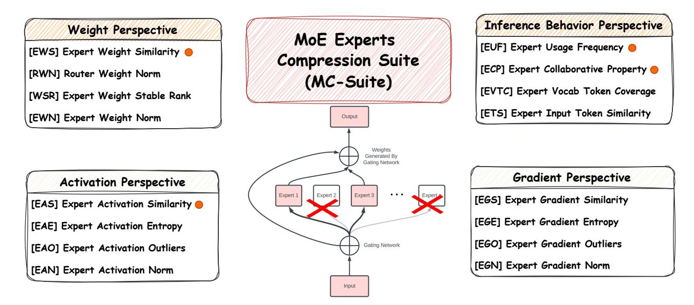
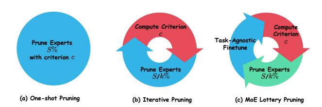

# 2. MoE Experts Compression Suite (MC-SUITE): An Exhaustive Basket of Strategies to Find Fantastic Experts

Mixture-of-Experts (MoE) architecture has been recently gaining enormous attention for the scaling up of LLMs while maintaining roughly constant FLOPs. By incorporating multiple expert networks and employing a sparse gating mechanism, MoE achieves efficient computation, enabling the development of larger models within the constraints of limited computational resources [\(Fedus et al.,](#page-10-6) [2022;](#page-10-6) [Jiang](#page-11-8)

1Our experiments in Section [3.3](#page-7-0) illustrate that subnetworks identified from one-shot vs. iterative pruning are significantly different. We conclude that iterative pruning helps in improving subnetwork quality while additional finetuning helps in retaining the capabilities of subnetwork to avoid abrupt performance degradation.

2Our experiments in Appendix [B](#page-13-0) confirms that a limited number of training iterations are sufficient to address the sub-optimal state of MoE subnetwork produced after expert-level sparsification.

Figure 1. MoE Experts Compression Suite (MC-Suite): A comprehensive basket of criterions (c) to investigate dominant experts across different SMoE blocks from weight, expert behavior, intermediate activations, and gradient behavior perspective. Criterion with  $\odot$  indicate it has been previously explored either in exactly the same formulation or with slight variation. Based on the score of a criterion  $(\text{score}_c^e)$  estimated within a MoE layer, an expert (e) is identified and removed.

Figure 2. Wikitext Perplexity of Mixtral  $8 \times 7B$  pretrained checkpoint when removing a single expert e from layer l.

et al., 2024). Despite its advantages, MoE suffers from extensive memory costs, which hinder its practical deployment and widespread adoption. For example, the Mixtral-8×7B MoE model takes around 180GB memory while only 28GB parameters are activated for each input token3. In parallel to conventional model compression techniques like weight sparsity, quantization, and distillation; the architecture design of MoEs facilitates a unique opportunity for *expert-level sparsification* which involves identifying and removing the least important experts or connections.

Figure 2 presents the wikitext perplexity of Mixtral-8×7B by dropping a single expert e from layer l. It can be clearly **noted** that some experts tend to have an abrupt impact on the performance of the pre-trained checkpoint compared

to others4. Therefore, it is critically important to carefully identify the subset of *least important* experts, which are pruned to match the desired sparsity level with minimal impact on performance. In this section, we present MoE Experts Compression Suite (MC-Suite), a first comprehensive benchmark to investigate expert importance using a wide spectrum of novel and previously explored (*e.g.*, expert usage frequency) criterions broadly categorized in four groups: weight-guided expert importance, inference behavior based importance, activation-guided importance, and gradient-guided importance.

### 2.1. Preliminaries and Notations

Consider an MoE-based transformer model  $M_L$  with L MoE layers for processing a set of input tokens  $\mathcal{X} = \{x_1, x_2, ..., x_t\}$ . A standard MoE layer  $(M_l)$  is composed of a set of n experts  $\mathcal{E} = \{E_1, E_2, ..., E_n\}$  with corresponding weights  $\{W_1, W_2, ..., W_n\}$  and a gating function G with weight matrix  $W_G^{d \times n}$ . The gating function is responsible for selecting which experts will be activated for a given input token  $x_i$  by estimating selection score  $G(x_i) \in \mathbb{N}$  with respect to all experts in  $\mathcal{E}$ . The input token  $x_i$  is processed by top-k experts with scaled highest score, and the expert's outputs (intermediate activations)  $\mathcal{A} = \{a_1, a_2, ..., a_k\}$  are combined into a weighted sum based on affinity score provided by the gating function. It

&lt;sup>3The estimates are calculated using full precision (float32).

&lt;sup>4Some Experts are Special: Across our experiments, we found that dropping of special experts lead to abrupt performance drop and this behavior is consistent for different tasks and datasets.

can be summarized as follows:

$$\mathcal{K}_i = \text{top-}k(\text{softmax}(\boldsymbol{G}(x_i)), k) \tag{1}$$

$$y_i = \sum_{m \in \mathcal{K}_i} \mathbf{G}_m(x_i) \cdot \mathbf{E}_m^{\mathbf{W}_m}(x_i)$$
 (2)

where  $\mathcal{K}_i$  indicated the top-k indices of the selected experts for token  $x_i$ ,  $G_m(x_i)$  and  $E_m^{W_m}$  represents the affinity score and output for m-th expert for token  $x_i$ . min or max corresponds to minimum and maximum value of the criterion across all experts.

### 2.2. Weight-Guided Expert Importance

① Expert Weight Similarity Criterion (EWS): In this criterion, we flatten the weights of all experts of layer l of M and calculate pairwise cosine similarity across them. Depending on the min or max argument, we select expert  $E_p$  which have min or max cosine similarity with  $\mathcal{E} - \{E_p\}$ .

$$\begin{aligned} \cos_{n\times n} &= \texttt{pairwise-cos}_{\forall (p,q)\in\mathcal{E}\times\mathcal{E}}(\texttt{flatten}(\boldsymbol{W}_{\boldsymbol{E}_p})) \\ &\text{drop-index} &= \texttt{min/max}_{\forall p\in\mathcal{E}}\big\{\texttt{sum}(\cos_{[p,:]}) - \cos_{[p,p]}\big\} \end{aligned} \tag{3}$$

② Router Weight Norm Criterion (RWN): Given a token, the router gating function is responsible for selecting top-k experts from n available experts using its weight matrix  $W_G^{d\times n}$ . RWN aims to understand the role of the gating weights corresponding to  $E_p$  in  $W_G$  to estimate its importance

$$\label{eq:drop-index} \begin{aligned} \text{drop-index} &= \min / \max \big\{ \text{norm}_{l2}(\boldsymbol{W}_{\boldsymbol{G}}^{d \times n}, \text{dim=1}) \big\} \end{aligned} \tag{4}$$

③ Expert Weight Stable Rank Criterion (WSR): Stable rank of an expert weight matrix ( $W_{E_p}$ ) is defined as  $\frac{\sum_{i=1}^r \sigma_i^2(W_{E_p})}{\sigma_1^2(W_{E_p})}$ , where  $\sigma_i$  refers to the *i*-th sorted singular value of  $W_{E_p}$ . Recently, stable-rank has been studied in the context of LLM layer importance, generalizability, and downstream adaption ability (Sanyal et al., 2020; Jaiswal et al., 2024; Zhang et al., 2024) and we aim to extend it for estimation of expert importance.

$$\operatorname{drop-index} = \min / \max \big\{ \operatorname{stable-rank}_{\forall p \in \mathcal{E}}(\boldsymbol{W}_{\boldsymbol{E}_p}) \big\} \tag{5}$$

**4** Expert Weight Norm Criterion (EWN): In this criterion, we calculate the l2-norm of weights of all experts of layer l of model M. Depending on the min or max argument, we select expert  $E_p$  that has min or max weight norm for dropping.

$$drop-index = min/max\{norm_{l2}(\boldsymbol{W}_{\boldsymbol{E}_n})\}$$
 (6)

#### 2.3. Inference-Guided Expert Importance

① Expert Usage Frequency Criterion (EUF): In this criterion, we define expert usage with a calibration dataset (e.g., C4 validation for MC-Suite). Expert usage is estimated by the ratio of tokens that activate  $E_p$  with a fixed calibration set. Note that we experimentally found that expert usage frequency is **not** strongly tied to the choice of calibration dataset. Given  $\mathcal{X}$  as calibration set with t-tokens and  $\mathcal{K}_i$  be the top-k experts for token i, we select expert  $E_p$  as:

$$\operatorname{drop-index} = \min / \max_{\forall p \in \mathcal{E}} \left\{ \sum_{x_i \in \mathcal{X}} \mathbb{1}[\mathcal{K}_i \cap \{E_p\}] \neq \emptyset \right\}$$
 (7)

② Expert-Expert Collaboration Criterion (ECC): Expert-Expert collaboration count is as defined as the number of times two experts  $E_p$  and  $E_q$  are selected to process a token  $x_i$ . Let  $\mathcal{X}$  as calibration set with t-tokens and  $\mathcal{K}_i$  be the top-k experts for token i, we define:

collaboration-matrix
$$_{(\mathbf{E}_{p},\mathbf{E}_{q})\in(\mathcal{E}\times\mathcal{E})}^{n\times n} = \sum_{x_{i}\in\mathcal{X}}\mathbb{1}[\mathcal{K}_{i}\cap\{E_{p},E_{q}\} == \{E_{p},E_{q}\}]$$
(8)

Given the collaboration matrix, we select the expert pair  $(E_p, E_q)$  wrt. the min or max argument and drop-index is identified as the expert that tends to have lower usage frequency.

③ Expert Vocabulary Coverage Criterion (EVTC): Expert vocabulary coverage is defined as the fraction of unique tokens from the model vocabulary, which is processed by a given expert  $\mathcal{E}_p$ . Consider  $\mathcal{V}$  be the model vocabulary and  $\mathcal{X}_p$  are the tokens from calibration set  $\mathcal{X}$  which are routed to expert  $\mathbf{E}_p$  by gating function, we select  $\mathbf{E}_p$  as:

$$\operatorname{drop-index} = \min / \max_{\boldsymbol{y} \in \mathcal{E}} \left\{ \operatorname{unique}(\mathcal{X}_p) / |\mathcal{V}| \right\} \quad (9)$$

**4 Expert Input Token Similarity (ETS):** In this criterion, we aim to estimate the input token-level similarity across experts. More specifically, with  $\mathcal{X}_p$  as the tokens routed to expert  $\boldsymbol{E}_p$ , we generate:

$$\begin{array}{l} \operatorname{token-similarity-matrix}_{(\boldsymbol{E}_p,\boldsymbol{E}_q)\in(\mathcal{E}\times\mathcal{E})}^{n\times n} = \operatorname{count}(\mathcal{X}_p\cap\mathcal{X}_q) \\ \operatorname{Given the token similarity matrix, we select the expert pair} \end{array}$$

Given the token similarity matrix, we select the expert pair  $(E_p, E_q)$  wrt. the min or max argument and drop-index is identified as the expert that tends to have lower usage frequency.

#### 2.4. Activation-Guided Expert Importance

① Expert Activation Similarity Criterion (EAS): Given the calibration set of tokens  $\mathcal{X}$ , we accumulate the activation of tokens routed to experts  $(\mathcal{A}_{E_p})$  using forward hooks. We first generate the activation similarity matrix across each

expert pair depending on min or max argument, we select expert  $E_p$  which have min or max activation similarity with  $\mathcal{E}-\{E_p\}$ .

$$\begin{aligned} \text{activation-similarity}_{(E_p, E_q)}^{n \times n} &= \frac{1}{|\mathcal{A}_{E_p}| \times |\mathcal{A}_{E_q}|} \\ &\sum_{(a_m, a_n) \in (\mathcal{A}_{E_p} \times \mathcal{A}_{E_q})} \text{cosine}(a_m, a_n) \end{aligned}$$

 $\mathsf{drop\text{-}index} = \texttt{min/max}_{\forall p \in \mathcal{E}} \big\{ \texttt{sum}(\mathsf{activation\text{-}similarity}_{[p,:]})$ 

$$-\text{activation-similarity}_{[p,p]}$$
 (11)

② Expert Activation Entropy Criterion (EAE): Entropy is the measurement of information quantity and we extended (Lin et al., 2024) entropy quantification strategy for convolution feature maps to expert activation. More specifically, in MC-Suite, the entropy of an expert activation ( $A_{E_p}$ ) is proportional to the summation of the logarithm of the standard deviation of each hidden dimension:

$$H(\mathcal{A}_{E_p}) \propto \sum_{j} \log[\sigma(\mathcal{A}_{E_p}^{j})]$$
 (12)

where,  $\sigma(\mathcal{A}_{E_p}^j)$  calculate the standard deviation of  $j_{th}$  hidden dimension of the activation and sum it to obtain activation entropy and select expert  $E_p$  which have min or max activation entropy.

- ③ Expert Activation Distribution Outliers (EAO): In this criterion, we estimate outliers in the normally distributed activation of experts. More specifically, given  $\mathcal{A}_{E_p}$  as the activations of expert  $E_p$ , we estimate mean  $(\mu_{\mathcal{A}_{E_p}})$  and standard deviation  $(\sigma_{\mathcal{A}_{E_p}})$  across the hidden dimension and count outliers outside the interval  $\mu_{\mathcal{A}_{E_p}} \pm c \times \sigma_{\mathcal{A}_{E_p}}$  with value of c = 3.
- **(4)** Expert Activation Norm (EAN): In this criterion, we calculate the l2-norm across the hidden dimension for the accumulated activation ( $\mathcal{A}_{E_p}$ ) of expert  $E_p$ . Overall activation norm of  $E_p$  is estimated as the sum of l2-norm over all hidden dimensions and the drop-index is given as:

$$drop-index = \min/\max_{\forall p \in \mathcal{E}} \left\{ sum(norm_{l2}(\mathcal{A}_{E_p}, dim=0)) \right\}$$
(13)

### 2.5. Gradient-Guided Expert Importance

(1) Expert Gradient Similarity Criterion (EAS): Given the calibration set of tokens  $\mathcal{X}$ , we first pass it through the model in batches and accumulate the gradient for all the expert's weight matrices. Consider  $W_{E_p}^g$  be the gradient corresponding to the weight matrix of expert  $E_p$ . We flatten the gradient matrix for all experts of layer l and calculate the pairwise cosine similarity across them.

$$\begin{aligned} \cos_{n\times n} &= \operatorname{pairwise-cos}_{\forall (p,q)\in\mathcal{E}\times\mathcal{E}}(\operatorname{flatten}(\boldsymbol{W}_{\boldsymbol{E}_p}^g)) \\ &\operatorname{drop-index} &= \operatorname{min/max}_{\forall p\in\mathcal{E}} \left\{\operatorname{sum}(\cos_{[p,:]}) - \cos_{[p,p]}\right\} \\ &(14) \end{aligned}$$

(2) Expert Gradient Entropy Criterion (EAE): Gradient entropy is a measurement of information encoded (Guan et al., 2019) within them, and it can be a well-suited indicator for judging the expert importance with the privilege of finetuning. Similar to activation entropy, we estimate gradient entropy by calculating the standard deviation across the hidden dimension of accumulated gradients as:

$$H(\boldsymbol{W}_{\boldsymbol{E}_p}^g) \propto \sum_{i} \log[\sigma(\boldsymbol{W}_{\boldsymbol{E}_p}^{g^j})]$$
 (15)

- ③ Expert Gradient Outliers Criterion (EAO): In this criterion, we estimate the number of outliers in the accumulated gradients of experts. Given  $W_{E_p}^g$  corresponding to weight of expert  $E_p$ , we count number of outliers outside interval  $\mu_{W_{E_p}^g} \pm c \times \sigma_{W_{E_p}^g}$  with value of c = 3.
- **4** Expert Gradient Norm Criterion(EAN): In this criterion, we calculate the l2-norm of gradients of weights for all experts of layer l of model M. Depending on the min or max argument, we select expert  $E_p$  that has min or max gradient norm for dropping.

$$\text{drop-index} = \min / \max \left\{ \text{norm}_{l2}(\boldsymbol{W}_{\boldsymbol{E}_n}^g) \right\} \quad \ (16)$$

Figure 3. Overview of Different Expert Pruning Strategies: Given a target expert sparsity of S%, (a) One-shot pruning: removes S% of experts from each layer L from MoE based on one-time estimation of criterion c; (b) Iterative pruning: removes S/k% of experts before re-estimation of criterion c for k-rounds; (a) MoE Lottery pruning: removes S/k% of experts followed by task-agnostic budget finetuning using calibration data before reestimation of criterion c for k-rounds.

