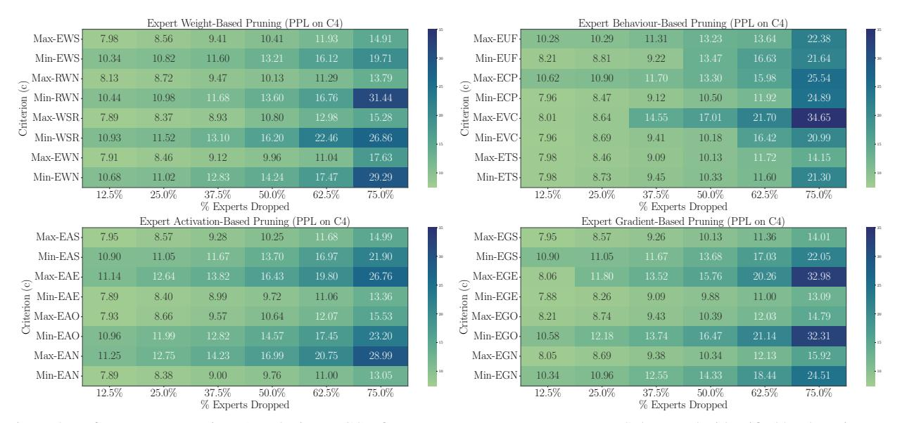

# 3. MoE Lottery Subnetworks: Blessing From task-agnostic budget fintetuning

Expert-level sparsification of SMoEs involves identifying r experts with the least importance using criterions outlined in Section 2 and discarding them to reduce exorbitant memory requirements of loading n experts. Dropping experts require explicit handling of the routing gate function by removing the entry corresponding to dropped experts. In our work, we found that gating function is highly sensitive to any modification and an ad-hoc deletion of r entries from the router matrix (i.e.,  $\mathbf{W}^{d\times n} \to \mathbf{W}^{d\times n-r}$ ) not only lead to significant performance degradation but also induces heavier load on few among remaining n-r experts. Prior

Figure 4. Performance comparison (perplexity on C4) of Mixtral-8×7B Base Lottery Subnetworks identified by dropping experts iteratively using various criterions from MC-Suite. Original Mixtral-8×7B Base checkpoint achieves 7.44 perplexity on C4 validation set. Min & Max represents an expert (e) with minimum/maximum score of a criterion (c).

works have limited exploration of *one-shot* removal of r experts to achieve a sparsity ratio of s% and overlooked attention at finetuning to address the sub-optimal state of SMoE subnetwork after sparsification.

In this work we adopt motivation from the success of lottery ticket hypothesis (Frankle & Carbin, 2018; 2019) and explore: ① iterative pruning of experts in k-rounds to attain sparsity ratio of s%; ② incorporation of task-agnostic finetuning on next token prediction task to stabilize the suboptimal state of SMoE subnetworks. Moreover, an iterative pruning strategy with re-estimation of importance criterion enables taking into account the impact of thee removal of the first round of experts on deciding the importance of remaining experts. We propose MoE Lottery Subnetwork, which relies on iterative estimate-prune-finetune procedure as shown in Figure 3. Note that we choose to state budget finetuning because we found that one doesn't require extensive finetuning iterations but a marginal amount is sufficient to obtain desirable performance gains (Appendix B).

Our experimental results in this section have two-folds. Firstly, we perform a comprehensive evaluation of the criterions of MC-Suite (Section 2) using MoE lottery subnetworks with varying sparsity ratios of  $s \in \{12.5\%, ..., 75.0\%\}$ . Secondly, we aim to understand the merits of iterative pruning and task-agnostic budget finetuning by selecting top-performing MC-Suite criterions.

### 3.1. MC-Suite and MoE Lottery Subnetworks

MC-Suite consists of a series of criterions from four diverse perspectives that provide "clues" for identifying experts that contribute least to the original SMoE model and thus can be discarded. Given a criterion c from MC-Suite, we study both maximizing and minimizing c while generating the MoE lottery subnetworks to understand the characteristics of retained experts and its impact on the final performance. Figure 4 presents the C4 validation perplexity of MoE lottery subnetworks of Mixtral-8×7B Base model where an expert e from a MoE layer l is dropped subjected to maximum or minimum value of c across other fellow experts in l. Table 1 presents the comparison of best-performing criterions from four different perspectives of MC-Suite along with randomly selected expert dropping baseline. It can be clearly observed that the usage of criterions from MC-Suite significantly helps in improving the performance of MoE lottery subnetworks. In our experimental setting, we choose to drop 32 experts (i.e., 12.5% sparsity) in every round of iterative pruning with one expert per layer. Our experiments found that a non-uniform dropping of experts per layer by estimating c globally creates bottleneck layers, with some layers having significantly high sparsity while some remain unpruned, leading to diminished finetuning benefits and sharding simplicity.

The benefits of MC-Suite are <u>not</u> limited to exploration of the best recipe to identify least important experts for dropping, but extends in deriving many valuable hidden insights of important experts. We comprehend few interesting findings as: ① activation and gradient-guided criterions (minimum activation norm and gradient entropy) that take into account both input tokens and model parameters achieves the *superior performance* over conventional criterions such as expert usage, expert weight similarity,

| Criterion (c)                     | 12.5% | 25.0% | 37.5% | 50.0% | 62.5% | 75.0% |
|-----------------------------------|-------|-------|-------|-------|-------|-------|
| Random Dropping (One-shot)        | 9.01  | 11.02 | 11.95 | 15.21 | 21.10 | 34.47 |
| Random Dropping (Iterative)       | 9.78  | 11.12 | 13.06 | 15.46 | 22.76 | 38.94 |
| Random Dropping (w. MoE Lottery)  | 9.66  | 10.54 | 11.83 | 13.71 | 18.23 | 33.05 |
| Max-Router Weight Norm (RWN)      | 8.47  | 9.00  | 9.87  | 10.70 | 13.50 | 17.26 |
| Max-Expert Token Similarity (ETS) | 8.28  | 8.82  | 9.50  | 10.43 | 12.48 | 16.03 |
| Min-Expert Gradient Entropy (EGE) | 8.17  | 8.84  | 9.54  | 10.45 | 11.88 | 15.08 |
| Min-Expert Activation Norm (EAN)  | 8.18  | 8.63  | 9.21  | 9.99  | 11.43 | 14.02 |

Table 1. Performance comparison (perplexity on C4) of Mixtral-8×7B Instruct Lottery Subnetworks identified by various top-performing criterions from MC-Suite. Original Mixtral-8×7B Instruct checkpoint achieves 7.82 perplexity on C4 validation set.

| % Experts Dropped    | Random Dropping |           | Min-Activation Norm (Min-EAN) |          |           | Min-Gradient Entropy (Min-EGE) |          |           |             |
|----------------------|-----------------|-----------|-------------------------------|----------|-----------|--------------------------------|----------|-----------|-------------|
| ie Ziiperio Ziropped | One-shot        | Iterative | MoE Lottery                   | One-shot | Iterative | MoE Lottery                    | One-shot | Iterative | MoE Lottery |
| 0%                   |                 |           |                               |          | 7.44      |                                |          |           |             |
| 12.5%                | 11.25           | 7.94      | 7.89                          | 7.95     | 7.90      | 7.89                           | 7.89     | 7.89      | 7.88        |
| 25.0%                | 12.74           | 10.98     | 11.01                         | 8.56     | 8.53      | 8.38                           | 8.47     | 8.41      | 8.26        |
| 37.5%                | 13.89           | 13.19     | 12.22                         | 12.87    | 9.35      | 9.00                           | 13.33    | 9.48      | 9.09        |
| 50.0%                | 17.08           | 15.85     | 14.13                         | 14.74    | 10.44     | 9.76                           | 15.37    | 10.72     | 9.88        |
| 62.5%                | 30.41           | 18.79     | 20.60                         | 21.36    | 12.55     | 11.00                          | 22.21    | 12.81     | 11.00       |
| 75.0%                | 36.92           | 32.73     | 27.33                         | 30.59    | 17.39     | 13.05                          | 35.83    | 17.70     | 13.09       |

Table 2. Improved Language Modeling Abilities: Performance comparison of MoE Lottery Subnetworks identified using criterion (c) with respect to Iterative and One-shot pruning. MoE Lottery Subnetworks, which are supplemented with task-agnostic finetuning, are able to restore a better optimal state impacted by ad-hoc derivation from their dense counterpart.

etc.; 2 surprisingly, l2-norm of router weight matrix turn out to be the best performing candidate in comparison to other expert weight based criterions; (3) dropping experts with higher vocabulary coverage lead to a significant drop in performance which indicate efforts to improve specialization across experts in MoEs can be non-conducive for expert-level sparsification; (4) dominant experts tends to have lower stable-rank, which aligns with recent findings of (Jaiswal et al., 2024; Zhang et al., 2024) that LLMs weight matrices which are critical and well-trained also have comparatively lower stable-rank with further compression potential with orthogonal techniques like low-rank factorization; (5) our **novel** criterion of *entropy quantification of activa*tion and gradient aiming to measures information encoded within them, turns out to best performing recipes for estimating expert importance and also favorable for downstream task finetuning. Interestingly, while comparing the impact of expert-level sparsification for Mixtral-8×7B Base and Instruct checkpoints, we found that task-agnostic finetuning has comparatively lower benefits for Instruct in comparison to Base model suggesting to perform expert dropping before instruction tuning.

