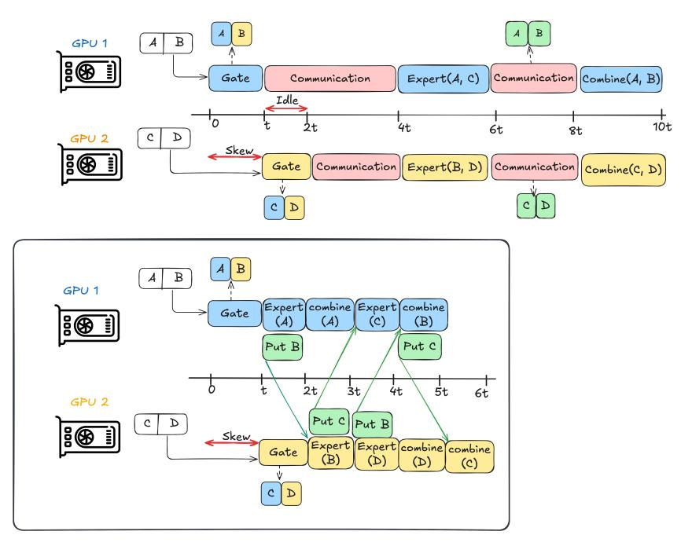

# A Supplementary Motivation

Figure 13: Overlapped Schedule (bottom) showing how idle time from the sequential schedule (top) is repurposed for computation. FlashMoE implements the overlapped schedule.

In Figure [14,](#page-17-1) we present empirical cumulative and raw distributions of *AlltoAll* kernel runtime from distributed training of a 1.3B GPT-3 MoE model across 32 A100 and 8 V100 GPUs. We use this result to motivate the severity and prevalence of straggler effects. In Figure [14b,](#page-17-1) we observe P95 communication performance degradation of 1.32X when compared to the mean actual kernel time. This performance reduction is rather tame as the underlying hardware is a supercomputer well-tuned against "software jitter" [\[36\]](#page-12-9). However, we observe a more severe p95 performance loss of 11X in a single-node Virtual Machine (VM). In line with prior HPC works [\[37,](#page-12-10) [38\]](#page-12-11), we argue that obviating the inherent barrier in this synchronous collective communication would allow GPUs to repurpose this observed idle time for downstream computation as depicted in Figure [13.](#page-16-0)

Table 2: Straggler Delay within Synchronous *All-to-All* communication. We capture the distribution of delay induced by stragglers across many steps. Let Actual Time ta denote the fastest kernel execution time across all GPUs, and Total Time t be the maximum recorded step time. We define Delay as the maximum difference between t and ta. Note Delay is idle time. For the 1x8 V100, we profile 1750 steps and 600 steps for the 8x4 A100. See Figure [14](#page-17-1) for the raw distribution.

| System               | # Nodes | # GPUs | Median | p95   |
|----------------------|---------|--------|--------|-------|
| Commercial VM (V100) | 1       | 8      | 3.1x   | 11.4x |
| Supercomputer (A100) | 8       | 32     | 1.09x  | 1.32x |

