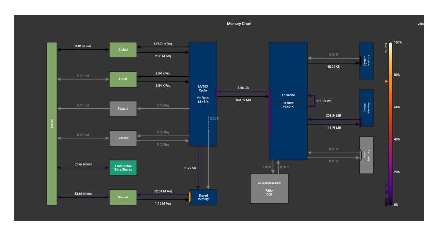

# H FP16 Memory Throughput

(a) Memory subsystem throughput for FP16

(b) Memory subsystem throughput for FP32

Figure 16: Here, we report the total A100 memory throughput for both FP16 (top) and FP32 (bottom) variants of FlashMoE. Notably, the FP16 implementation issues approximately 2× more shared memory instructions compared to its FP32 counterpart under identical workloads. We attribute this inefficiency to suboptimal shared memory layouts in FlashMoE when operating on half-precision data. While this bottleneck is addressable through improved layout strategies, we leave its resolution to future work.