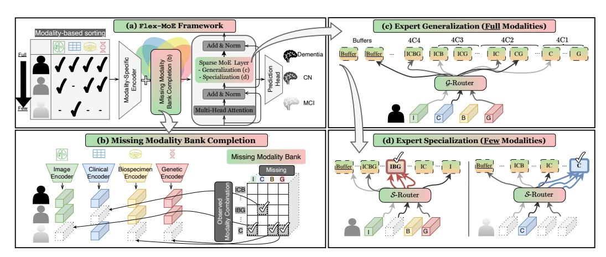

# 3 Methods

#### 3.1 Preliminaries and Notations

Why Sparse Mixture-of-Experts? Given a multimodal nature, we choose to utilize Sparse Mixtureof-Experts (SMoE) [\[55\]](#page-13-6) due to its computational efficiency and its ability to handle multimodal data by effectively alleviating the gradient conflict optimization issue between modalities [\[50\]](#page-13-7). To briefly introduce SMoE, Traditional Mixture-of-Experts (MoE) models [\[23,](#page-11-5) [28,](#page-11-6) [9,](#page-10-7) [70\]](#page-14-6) evolved by incorporating sparsity into their structure, optimizing computational efficiency and model performance. SMoE selectively activates only the most relevant experts for a given task, reducing overhead and improving scalability. This innovation is particularly beneficial in handling complex, high-dimensional datasets across diverse applications. It has been widely used in vision [\[54,](#page-13-8) [40,](#page-12-10) [16,](#page-10-8) [2,](#page-10-9) [18,](#page-11-7) [62,](#page-13-9) [69,](#page-14-7) [1,](#page-10-10) [49\]](#page-12-11) and language processing [\[35,](#page-12-12) [30,](#page-11-8) [78,](#page-14-8) [77,](#page-14-9) [79,](#page-14-10) [25\]](#page-11-9) fields, dynamically assigning different parts of the network to specific tasks [\[41,](#page-12-13) [3,](#page-10-11) [20,](#page-11-10) [11\]](#page-10-12) or data modalities [\[32,](#page-11-11) [44\]](#page-12-1). Research has shown its effectiveness in classification tasks in digital number recognition [\[20\]](#page-11-10) and medical signal processing [\[3\]](#page-10-11). In this work, we further explore the use of SMoE to model arbitrary modality combinations and address the missing modality scenario.

Notation. Formally, the SMoE consists of multiple experts, denoted as f1, f2, . . . , f|E| , where |E| represents the total number of experts, and a router, R, which is responsible for the routing mechanism and sparsely selects the top-k experts. For a given embedding or token x, the router R

engages the top-k experts based on the highest scores obtained from softmax function with learnable gating function,  $g(\cdot)$  (usually one or two layer MLP), and output  $\mathcal{R}(\mathbf{x})_i$ , where i denotes the expert index. This process can be described as follows:

$$\mathbf{y} = \sum_{i=1}^{|E|} \mathcal{R}(\mathbf{x})_i \cdot f_i(\mathbf{x}),$$

$$\mathcal{R}(\mathbf{x}) = \text{Top-K}(\text{softmax}(g(\mathbf{x})), k),$$

$$\text{TopK}(\mathbf{v}, k) = \begin{cases} \mathbf{v}, & \text{if } \mathbf{v} \text{ is in the top } k, \\ 0, & \text{otherwise.} \end{cases}$$
(1)

#### 3.2 Our approach: Flex-MoE

In this section, we present our novel algorithm, Flex-MoE, specifically designed to flexibly address the challenge of missing modalities in the multimodal domain. We start by sorting the samples based on their number of observed modalities. Following a modality-specific encoder, we supplement the embeddings for missing parts via missing modality bank completion. This effectively manages missing modalities by learning embedding banks that capture the information specific to observed modality combinations. Next, a Transformer coupled with an SMoE layer is employed. We introduce an expert generalization and specialization step to optimize modality utilization by fully leveraging samples with complete modalities and obtaining modality combination-specific knowledge through samples with fewer modalities. A comprehensive illustration of Flex-MoE is provided in Figure 3. Throughout the details in the following section, while our work is exemplified through the AD domain for predicting AD stages using four representative modalities—image, clinical, biospecimen, and genetic—it is important to note that Flex-MoE can be generalized to any other multimodal domain.

Figure 3: The comprehensive illustration of our proposed methodology, Flex-MoE. (a) Overall framework of Flex-MoE. Given samples with diverse modality combinations, we first sort the samples based on their number of available modalities in descending order, and then pass through the modality-specific encoder. (b) Each encoder is only trained with their available samples. For the missing embeddings, we introduce a missing modality bank containing learnable embeddings given the observed modality combination with their corresponding missing modality index. Equipped with this embedding, Flex-MoE passes through the Transformer where the FFN layer is replaced with a Sparse MoE layer. Here, (c) full modality samples take charge of training generalized experts in a balanced manner via  $\mathcal{G}$ -router, then (d) the remaining few modality combinations further specialize the expert knowledge with  $\mathcal{S}$ -Router, which fixes the top-1 gate as the corresponding observed modality combination expert. In this figure, top-2 selection of experts is illustrated as an example.

## 3.2.1 Missing Modality Bank Completion

Given a set of samples with their own modalities, it is straightforward to pass them through modality-specific encoders, such as a 3D-CNN for MRI images. However, we are dealing with a *missing* 

modality scenario in multimodal data, where specific modalities are often missing based on their observed modality combinations. Thus, it is common to use padded or imputed inputs for the corresponding missing modalities in a multimodal setting. This approach becomes troublesome when considering interactions between modalities. For instance, given a batch with samples, some samples might have image, genetic, and clinical modalities, while others might be missing image and genetic modalities. In such cases, the image encoder and genetic encoder would take zero-padded or hypothesized imputed inputs derived from the missing samples, which are synthetic and of lower quality than the observed ones. This negatively affects the training of modality-specific encoders. Additionally, heavy imputation for each modality in a multimodal setting increases time complexity, which is not desirable in clinical settings.

Given this situation, we propose training each encoder *solely with observed samples* to fully leverage the potential of the encoder by using only observed inputs. Unlike existing approaches, our design principle considers modality combinations to ensure robust and flexible training and effective handling of missing modalities. As illustrated in Figure 1, each patient has diverse symptoms and personalized treatments, leading to variations in available modalities. For example, patients might lack image and genomic modalities (i.e., possessing only biospecimen and clinical modalities) due to various reasons such as patient conditions, resource limitations, or specific clinical settings [22, 51]. Imputing these missing modalities must be handled within this context, rather than applying a global learnable representative embedding for each modality without considering the observed environment.

Therefore, we propose a learnable missing modality bank. Given the number of modality combinations without fully observed scenarios, the total cases would be, given a modality set  $\mathcal{M} = \{\mathcal{I}, \mathcal{C}, \mathcal{B}, \mathcal{G}\}, \sum_{m=1}^{|\mathcal{M}|-1} {|\mathcal{M}| \choose m} = 2^{|\mathcal{M}|} - 1.$  The resulting missing modality bank can be defined as  $\mathbf{B} \in \mathbb{R}^{2^{|\mathcal{M}|}-1\times|\mathcal{M}|}$ . By using this bank, the concatenated embedding of all modalities for patient i,  $\mathbf{h}_i = [\mathbf{e}_i^{\mathcal{I}}, \mathbf{e}_i^{\mathcal{C}}, \mathbf{e}_i^{\mathcal{B}}, \mathbf{e}_i^{\mathcal{G}}]$  would be represented as follows:

$$\mathbf{e}_{i}^{m} = \begin{cases} \text{Encoder}^{m}(i) & \text{if modality } m \text{ is observed in sample } i \\ \mathbf{B}_{\mathcal{M}\backslash m,m} & \text{otherwise} \end{cases}, \quad \forall m \in \{\mathcal{I}, \mathcal{C}, \mathcal{B}, \mathcal{G}\}$$
 (2)

where  $\mathbf{e}_i^m \in \mathbb{R}^d$  denotes the embedding from the corresponding modality m for patient i, and d is the hidden dimension. Here, the main idea of the missing modality bank completion is to supplement missing modalities from a predefined bank, ensuring robust data integration with observed ones. For example, if a patient lacks clinical data but has imaging, biospecimen, and genetic data, the observed modalities pass through their specific encoders. The missing clinical embedding is supplemented from the missing modality bank, indexed by the observed modalities (e.g.,  $\mathbf{B}_{\mathcal{M}\backslash m,m} = \mathbf{B}_{\{\mathcal{I},\mathcal{G},\mathcal{B}\},\mathcal{C}\}$ ). By doing so, the encoder for each modality can be trained without encountering non-observed, incomplete input features. Then, we move on to the Transformer layer, where the FFN layer is replaced by an SMoE layer, a common approach in the SMoE domain [24, 38, 10].

#### 3.2.2 Expert Generalization & Specialization

While adopting the SMoE backbone, it is important to note that our environment differs from concurrent SMoE studies, especially in terms of multimodal learning with missing modalities. In this context, choosing the most relevant tokens is challenging for experts, since the significance, i.e., the quality of input information, varies with the missing modalities. This significantly motivates us to take a distinct approach from concurrent SMoE studies, where the input token is derived from fully observed scenarios. To address the unique challenges of the missing modality scenario, we propose a modality combination-specific MoE design. Specifically, we assign expert indices based on all possible modality combinations. For example, 'IGCB' is assigned as 0, 'IGC' as 1, ..., up to 'B' as 14. The remaining experts act as buffers, allowing the Router to select the most relevant top-k experts and activate them automatically. This approach leaves room for flexibility and maintains the initial intuition of the MoE design.

Generalization It now becomes clear why the samples used for training Flex-MoE are sorted in descending order. Inspired by curriculum learning [7, 63], where easy samples are presented first and more challenging samples appear later, we regard the level of difficulty as the number of missing modalities. We first train our SMoE layer with easy samples, where all modalities are fully observed. Using this intersection as a gold standard, we initially train all the experts in the MoE model. The procedure essentially follows the vanilla SMoE design as described in Equation 1, but with one key

difference: the input tokens consist only of inputs where all modalities are fully observed. Hence, we refer to this router as the Generalized Router, G-Router. This approach leverages the completeness of information in these samples, which should be fully utilized before specializing the experts in their respective areas. To ensure balanced activation of the experts initially, which will later specialize, we incorporate the load and importance balancing loss [\[55\]](#page-13-6), which will later be exemplified in Equation [4.](#page-5-0)

Specialization Once the experts are initially trained using fully observed samples, we aim to specialize each expert, which is the key advantage of the MoE design. We leverage the remaining samples, which encompass diverse modality combination configurations. Each modality combination requires its own specialized expertise. For instance, samples with Image, Biospecimen, and Genetic data will have a corresponding expert index activated through the top-1 gating mechanism to fully utilize the specialized knowledge of that expert (i.e., expert 'IBG' in Figure [3\)](#page-3-0). To effectively specialize the modality combination-specific experts, we propose a Specialized Router design, S-Router, which encompasses following technical novelties. First, to facilitate targeted expert selection when an input token is provided, we avoid manually replacing the selected routing policy with our preferred choice in a post-hoc manner, which would stop the continuous gradient flow. Instead, we innovatively introduce a cross-entropy loss between the top-1 expert selection and the targeted expert indices for each token by the S-Router. Formally, this can be described as follows:

$$\mathcal{L}_{ce} = -\sum_{j=1}^{n} \mathcal{MC}(\mathbf{x}_{j}) \log(\max(\mathcal{S}\text{-Router}(\mathbf{x}_{j})))$$
(3)

where MC(xj ) denotes the modality combination index of a given token xj in a total of n tokens. max(S-Router(xj )) denotes the maximum prediction probability of the corresponding activated expert index, which corresponds to the probability of the top-1 expert index. By comparing these two, the router is trained to activate the corresponding expert index for a given input token with a certain modality combination. Thus, the specialized knowledge inherent in specific modality combinations is naturally contained within the target expert.

Moreover, when calculating load and importance balancing loss [\[55\]](#page-13-6), we specifically compute the loss for the *remaining* top-k-1 experts, as the top-1 selection is manually handled and thus considered biased rather than balanced. We aim for the selection of the remaining k-1 experts to occur in a balanced manner, allowing interaction with other related modality combinations. Formarlly, it can be expressed as follows:

$$\mathcal{L}_{\text{balance}} = \text{CV}^2 \left( \sum_{j}^{N} \text{importance}_j \right) + \text{CV}^2 \left( \sum_{j}^{N} \text{load}_j \right)$$
 where  $\text{importance}_e = \sum_{i}^{N} g_{ie}, \ \text{load}_e = \sum_{i}^{N} \delta(g_{ie} > 0), \quad \forall e \in E \setminus e_{\text{top-1}}$  (4)

where CV2 (x) = σ(x) µ(x) 2 , σ(x) is the standard deviation of x, µ(x) is the mean of x, gie is the gate value for sample i with expert index e as discussed in Equation [1,](#page-3-1) and δ(· > 0) is an indicator function that is 1 when the inner value is greater than 0. E \ etop-1 denotes the set of expert indices excluding the top-1 selected expert index. This ensures that the resulting MoE model not only retains global knowledge but also incorporates specialized expert knowledge tailored to specific modality combinations. During the inference phase, the specified expert index for a particular modality combination can be activated alongside other experts, enabling predictions to consider both the specific modality combination and intersections with other modalities.

Finally, the output embeddings of the Sparse MoE layer pass through a 1-layer MLP prediction head to predict one of the three stages of AD, i.e., Dementia, CN, or MCI. To further facilitate a curriculum-learning approach, we first use warm-up epochs with sorted samples, followed by shuffled samples for the remaining epochs. This strategy enhances generalizability across diverse input samples, enabling better handling of variability during the inference phase.

