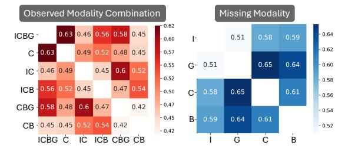
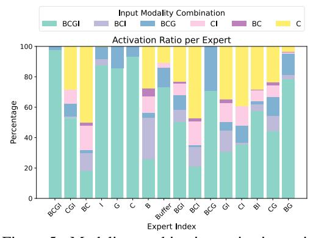
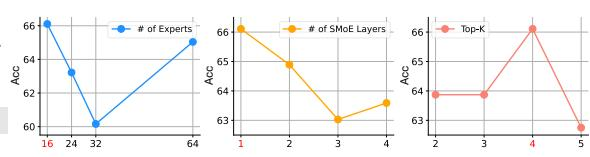

# 4.1 Experimental Setting

ADNI Dataset Alzheimer's Disease Neuroimaging Initiative (ADNI) is a landmark multimodal AD dataset that tracks disease progression and pathological changes, comprising of comprehensive imaging, genetic, clinical, and biospecimen data ([\[64\]](#page-14-12), [\[67\]](#page-14-13)). The imaging data in ADNI includes magnetic resonance imaging (MRI) and positron emission tomogrpahy (PET). The genetic data includes a variety of genetic information, including genotyping data such as APOE genotyping and single nucleotide polymorphisms. The clinical data includes demographics, physical examinations, and cognitive assessments. Biospecimens such as blood, urine, and cerebrospinal fluid are also collected. ADNI has established standardized multi-center protocols and provides open access to qualified researchers, making it a gold-standard resource in the field ([\[65\]](#page-14-14), [\[66\]](#page-14-15)). Before integrating all modalities, to address the initial missing data within each modality, we applied simple mean imputation [\[39\]](#page-12-15) for each column. For more detailed data table with preprocessing steps for each modality, please refer to Appendix [A.1.](#page-15-0)

MIMIC-IV Dataset We use the Medical Information Mart for Intensive Care IV (MIMIC-IV) database [\[27\]](#page-11-14), which contains de-identified health data for patients who were admitted to either the emergency department or stayed in critical care units of the Beth Israel Deaconess Medical Center in Boston, Massachusetts24. MIMIC-IV excludes patients under 18 years of age. We take a subset of the MIMIC-IV data, where each patient has at least more than 1 visit in the dataset as this subset corresponds to patients who likely have more serious health conditions. For each datapoint, we extract ICD-9 codes, clinical text, and labs and vital values. Using this data, we perform binary classification on one-year mortality, which foresees whether or not this patient will pass away in a year. We drop visits that occur at the same time as the patient's death. In order to align the experimental setup with the ADNI data, which does not contain temporal data, we take the last visit for each patient.

Baselines We compare the performance of Flex-MoE with various state-of-the-art baselines across modality-specific, e.g., image or genetic, and multimodal approaches. For the image-only modality, we first experimented with 3D MRI scans by utilizing a 3D CNN [\[17\]](#page-10-15) and an architecture that combines 3D CNN and 3D CLSTM [\[68\]](#page-14-1). To decrease computational complexity, we also extracted 2D slices from the 3D volumes. For 2D MRI scans, we implemented the VGG architecture with pre-trained weights and applied layer-wise transfer learning [\[43\]](#page-12-6), as well as a modified ResNet-18 network [\[45\]](#page-12-7). For the genetic-only approach, we employed a ResNet-34 based architecture to handle the high-dimensional genetic data [\[36\]](#page-12-8). In ADNI dataset, we further implemented domain speicfic baselines, such as auto-encoder and 3D CNN-based architecture that incorporates imaging, genetic, and clinical data [\[59\]](#page-13-0), and a GRU-based architecture that considers imaging, genetic, clinical, and biospecimen data [\[33\]](#page-12-2). Moreover, we include ShaeSpec [\[60\]](#page-13-1), which utilizes a spectral attention mechanism to emphasize important features across modalities, and mmFormer [\[76\]](#page-14-2), which is based on transformer-based multimodal fusion with an attention mechanism. For multimodal approaches in both ADNI and MIMIC-IV, we incorporate the recent FuseMOE [\[19\]](#page-11-4) model, which directly integrates multimodal data through a mixture of experts strategy, as the most straightforward baseline. Additionally, we compare the following methods: MulT [\[57\]](#page-13-11), which captures cross-modal interactions through cross-attention mechanisms; MAG [\[52\]](#page-13-12), which fuses multimodal features by mapping them to an adaptation vector; TF [\[73\]](#page-14-16), which combines multimodal embedding sub-networks and a tensor fusion layer; and LIMoE [\[44\]](#page-12-1), which addresses training stability in multimodal learning using entropy regularization based on contrastive learning.

Experimental Settings. To ensure a fair comparison with other baselines, we used the best hyperparameter settings provided in the original papers. If not available, we tuned the learning rate in 1e-3, 1e-4, 1e-5, the hidden dimension in 64, 128, 256, and the batch size in 8, 16. For our proposed method, we searched the number of experts in 16, 32, and Top-k in 2, 3, 4. We set the coefficient of the sum of additional losses (importance and load balancing) combined with our cross-entropy loss to 0.01, scaling it within the task classification loss. For the dataset split, we chose 70% for training, with the remaining 30% split evenly between validation and test sets (15% each). It is important to note that, to share the same inference space, where single and multimodal baselines should both be able to predict, we opted to choose the intersection as the test and validation sets. This means that during the training phase, the dataset can be incomplete. For the multi-modal baselines, if they had the ability to impute or interact with other modalities, we leveraged their methods. Otherwise, we used zero-padding to facilitate batch-wise training. For single-modal and multi-modal baselines

that solely work on the intersection region, we filtered that data and used it during training. All experiments were conducted using NVIDIA A100 GPUs. Each experiment was run three times with different seeds to ensure reproducibility, and the results were averaged. The optimal hyperparameter settings for Flex-MoE can be found in Appendix [A.2.](#page-16-0)

Table 1: Performance on ADNI dataset with ACC metric across different models and modality combinations, given the Image (I, ), Genetic (G, ), Clinical (C, ), and Biospecimen (B, ) modalities. MC denotes observed modality combination.

|            | Modalities |   |   |   |      | Dataset: ADNI / Metric: ACC |         |                                                                                                                         |    |      |     |       |  |                  |
|------------|------------|---|---|---|------|-----------------------------|---------|-------------------------------------------------------------------------------------------------------------------------|----|------|-----|-------|--|------------------|
| MC         |            |   |   |   | [59] | [33]                        | ShaSpec | mmFormer                                                                                                                | TF | MulT | MAG | LIMoE |  | FuseMoE Flex-MoE |
| I, G       | •          | • |   |   |      |                             |         | 54.81 ±1.45 53.59 ±2.98 48.09 ±0.66 49.85 ±4.92 59.94 ±0.40 60.32 ±0.95 59.94 ±1.00 59.29 ±0.95 60.41 ±0.87 61.08 ±0.78 |    |      |     |       |  |                  |
| I, C       | •          |   | • |   |      |                             |         | 44.35 ±1.99 57.15 ±1.58 47.62 ±1.81 51.96 ±4.23 54.53 ±0.66 50.14 ±1.05 52.19 ±2.90 52.38 ±3.46 53.13 ±1.97 56.49 ±2.55 |    |      |     |       |  |                  |
| I, B       | •          |   |   | • |      |                             |         | 40.80 ±2.94 57.61 ±1.86 50.98 ±2.09 51.45 ±3.53 52.57 ±2.06 51.17 ±2.88 52.47 ±4.11 53.87 ±2.75 49.67 ±1.97 60.41 ±0.26 |    |      |     |       |  |                  |
| G, C       |            | • | • |   |      |                             |         | 51.91 ±1.39 52.85 ±2.47 52.85 ±2.65 49.58 ±4.45 38.38 ±3.03 46.03 ±5.42 40.34 ±6.11 35.76 ±6.24 38.84 ±2.42 60.60 ±0.26 |    |      |     |       |  |                  |
| G, B       |            | • |   | • |      |                             |         | 45.01 ±1.30 52.66 ±3.63 58.54 ±2.97 48.45 ±4.56 42.20 ±1.78 39.40 ±2.91 40.52 ±2.52 36.88 ±5.04 37.91 ±0.80 63.59 ±1.04 |    |      |     |       |  |                  |
| C, B       |            |   | • | • |      |                             |         | 44.63 ±0.92 63.68 ±0.48 59.10 ±2.69 47.71 ±4.49 39.68 ±2.38 44.54 ±0.82 40.15 ±2.58 43.98 ±0.00 37.91 ±0.80 60.50 ±0.82 |    |      |     |       |  |                  |
| I, G, C    | •          | • | • |   |      |                             |         | 55.12 ±2.38 54.72 ±0.28 49.30 ±3.17 46.49 ±3.57 54.06 ±1.98 60.97 ±0.95 61.34 ±0.61 53.50 ±2.25 60.97 ±1.32 63.21 ±1.73 |    |      |     |       |  |                  |
| I, G, B    | •          | • |   | • |      |                             |         | 56.12 ±3.44 55.28 ±3.44 52.85 ±0.53 47.15 ±6.43 54.44 ±2.26 53.03 ±1.95 54.15 ±1.06 53.97 ±1.08 52.85 ±1.00 62.28 ±2.75 |    |      |     |       |  |                  |
| I, C, B    | •          |   | • | • |      |                             |         | 43.79 ±0.69 60.97 ±2.60 52.85 ±3.30 47.18 ±4.68 52.29 ±1.47 49.86 ±1.50 53.24 ±0.50 54.97 ±0.00 49.67 ±1.00 64.05 ±1.78 |    |      |     |       |  |                  |
| G, C, B    |            | • | • | • |      |                             |         | 45.28 ±1.85 53.87 ±3.35 62.09 ±3.27 46.38 ±4.24 43.33 ±4.43 43.32 ±6.74 37.25 ±1.99 40.99 ±2.62 34.64 ±1.95 65.36 ±1.38 |    |      |     |       |  |                  |
| I, G, C, B | •          | • | • | • |      |                             |         | 52.10 ±0.99 55.64 ±1.86 52.84 ±0.53 58.92 ±6.58 57.24 ±3.05 58.82 ±0.82 61.44 ±1.61 55.18 ±4.22 59.52 ±1.00 66.11 ±1.14 |    |      |     |       |  |                  |

Table 2: Performance on MIMIC-IV dataset with ACC metric across different models and modality combinations, given the Lab and Vital values (L, ), Clinical Notes (N , ), and ICD-9 Codes (C, ) modalities. MC denotes observed modality combination.

|          |   | Modalities |   | Dataset: MIMIC-IV / Metric: ACC |             |             |             |             |             |  |  |
|----------|---|------------|---|---------------------------------|-------------|-------------|-------------|-------------|-------------|--|--|
| MC       |   |            |   | TF                              | MulT        | MAG         | LIMoE       | FuseMoE     | Flex-MoE    |  |  |
| L, N     | • | •          |   | 60.05 ±1.96                     | 57.96 ±7.25 | 62.72 ±2.36 | 63.80 ±1.99 | 60.50 ±3.82 | 76.14 ±0.73 |  |  |
| L, C     | • |            | • | 64.13 ±3.39                     | 62.47 ±2.01 | 60.13 ±1.97 | 64.89 ±1.46 | 63.31 ±3.21 | 75.15 ±0.55 |  |  |
| N , C    |   | •          | • | 60.97 ±2.36                     | 62.23 ±2.81 | 59.41 ±4.15 | 64.27 ±4.05 | 64.77 ±3.05 | 74.96 ±1.59 |  |  |
| L, N , C | • | •          | • | 63.11 ±2.17                     | 64.62 ±0.44 | 62.87 ±2.50 | 61.61 ±2.37 | 63.90 ±1.72 | 76.81 ±0.90 |  |  |

#### 4.2 Primary Results

In Table [1](#page-7-0) and Table [2,](#page-7-1) we provide a comprehensive comparison of Flex-MoE with various multimodal baselines. We have the following observations: (1) Overall, Flex-MoE performs effectively in diverse multimodal settings, fully harnessing its potential as more modalities become available. This is supported by the large margin of improvement (7.6% and 11.07% over the best performing baselines, MAG and the most recent work FuseMoE, respectively, in full modality settings in Table [1\)](#page-7-0). (2) Although the recently proposed FuseMoE [\[19\]](#page-11-4) suggested its ability to handle missing scenarios, the lack of effective modality combination creates a bottleneck in such AD domain, even performing worse when a smaller number of modalities is used (FuseMoE performs better with three modalities than with full modalities), which is not optimal given the diverse missing modality scenarios. (3) Despite its specific characteristics in the AD domain [\[33,](#page-12-2) [59\]](#page-13-0), the reliance on intersection data and the lack of consideration for how missing modalities relate to observed modality combinations have been overlooked. (4) Overall, the performance gain derived from Flex-MoE can be attributed to its unique ability to cope with diverse modality combinations through a missing modality bank, and its capability to fully harness the knowledge of samples via a generalization followed by a specialization step for experts. For additional results on different metrics, such as Macro-F1 and AUC, please refer to Appendix [A.3.](#page-16-1)

## 4.3 Effectiveness of Modality Combination Consideration

To validate the effectiveness of the two essential modules of Flex-MoE—the *missing modality bank* and the *unique SMoE design*—under a missing modality scenario, we evaluate them followingly.

First, to evaluate the effectiveness of the missing modality bank introduced in Figure [3](#page-3-0) (b), we assess whether it captures relevant embedding information given an observed modality combination. Specifically, we validate this by examining the inter-relationship between modalities, focusing on

the consistency of how the missing modality bank handles missing information. In Figure [4,](#page-8-0) we measure the cosine similarity between observed modality combinations. The key observation is that (1) with more overlapping modality combination, it tends to share more similar embedding information. This is evident in the left side of Figure [4,](#page-8-0) where the full modality scenario (ICBG) shows higher similarity with ICB and CBG (0.56 and 0.58, respectively) compared to IC and CB (0.46 and 0.45). The clinical modality (C) is most similar across combinations, which aligns with the dataset characteristic that clinical data is present in all input combinations, as shown in Figure [2.](#page-1-1) On the right side of Figure [4,](#page-8-0) the similarity between missing modalities is shown. When (2) modality G is missing, it is more similar to the cases where C and B are missing compared to I, suggesting that certain missing modalities share more commonality in how they are handled by the model. This insight underscores the importance of careful consideration when modeling missing modalities and demonstrates how the missing modality bank effectively captures necessary embedding information in terms of modality combination.

Furthermore, in Figure [5,](#page-8-0) we show the activation ratio of input modality combinations across each expert index, i.e., possible modality combinations. We observe two key findings: (1) Thanks to expert generalization using full modality samples (BCGI), generalized knowledge is distributed across all experts. This allows each expert to leverage commonly shared knowledge while activating the most relevant inputs for the downstream task. (2) Expert specialization enables each expert to acquire specialized knowledge. For instance, in the case of the BCG expert, the two most activated input tokens were BCGI and its corresponding token, BCG. Similarly, for the BCI and CI experts, they not only possess general knowledge from BCGI but also hold their own specialized knowledge from BCI and CI, respectively, to effectively handle these inputs. This demonstrates that when a certain modality combination is provided, the top-1 expert is successfully selected, allowing it to supplement its specialized and necessary information. Overall, these routing experiments demonstrate that Flex-MoE contains both globally generalized and locally expertspecific knowledge, achieved by leveraging samples with both full and fewer modalities.

Figure 4: Cosine similarity between observed modality combination and missing modality, corresponding to row and column in missing modality bank.

Figure 5: Modality combination activation ratio.

## 4.4 Comprehensive Evaluation

Ablation Study. In this section, we investigate the crucial components that contribute most positively to the performance gain of Flex-MoE. From Table [3,](#page-9-0) we observe that (1) when both expert specialization and generalization are absent, the performance drop is most severe. Additionally, (2) the performance decline in the embedding bank negatively affects overall performance, indicating that the missing modality bank combined with expert generalization and specialization is crucial for handling missing modality scenarios. Furthermore, (3) the sorting based on descending order appear most effective as the expert generalization occurs first withi the full modality samples.

Sensitivity Study. In Figure [6,](#page-9-0) we also varied the hyperparameters used in this study. We examined the number of experts, number of SMoE layers and top-k selection. We found that (1) employing many experts does not always guraantee a higher performance compared to its increase in complexity, showing using 16 experts apeear to be a suitable choice to equip fine-grained specialized knowledge. (2) Using sing a single layer of the SMoE was most effective, as stacking more layers or adding a Transformer block caused an overload to parameter learning. Additionally, (3) compared to the commonly used top-2 gating network in concurrent SMoE studies, we found that top-4 selection was

Table 3: Ablation study of Flex-MoE

| ruere et rierumen etuaj |       |       |
|-------------------------|-------|-------|
|                         | ACC   | F1    |
| Flex-MoE                | 66.11 | 64.73 |
| w/o ES                  | 62.75 | 60.79 |
| $w/o \{ES + EG\}$       | 62.49 | 60.07 |
| w/o embedding bank      | 63.87 | 62.48 |
| w/o sorting - random    | 62.65 | 60.70 |
| w/o sorting - ascending | 63.87 | 62.22 |

Figure 6: Sensitivity analysis of Flex-MoE. The hyper-parameters include the number of experts, the number of SMoE layers and Top-*k* expert selection. For the experiment, ADNI dataset with full modalities is used.

the most effective. This is because manually assigning the top-1 expert index to the target modality combination leaves more room for better harmonization with the SMoE design.

**Complexity Study.** In Table 4, we further verify the benefits of utilizing the SMoE design in terms of mean time per iteration, GFLOPs, and the number of parameters compared to the baselines. We observed the following: (1) Compared to recent baseline FuseMoE, Flex-MoE achieves notable efficiency gains (e.g., 22.74%, 1.15%, and 89.17% gain in mean time, GFLOPs, and # of parameters, respectively.) while delivering higher performance. (2) Although TF appears to be a lightweight design in the  $\mathcal{I}, \mathcal{G}$  and  $\mathcal{I}, \mathcal{G}, \mathcal{C}$  settings, it trades off computational efficiency with significantly lower performance compared to Flex-MoE. (3) Notably, as the number of modalities increases, existing models tend to become more complex in terms of GFLOPs and the number of parameters to manage the additional complexity. However, Flex-MoE remains robust and efficient, maintaining higher performance due to its effective use of sparsely activated experts, brought by the SMoE framework.

| Modality                                             | Metric                         | TF               | MulT             | MAG              | LIMOE            | FuseMoE          | Flex-MoE                |
|------------------------------------------------------|--------------------------------|------------------|------------------|------------------|------------------|------------------|-------------------------|
|                                                      | Mean Time (s) $(\downarrow)$   | 12.40            | 12.85            | 11.64            | 12.65            | 18.68            | 12.73                   |
| $\mathcal{I},\mathcal{G}$                            | GFLOPs (↓)                     | 59.05            | 59.24            | 59.06            | 59.24            | 59.74            | 59.06                   |
| 2,5                                                  | # of Parameters $(\downarrow)$ | 33,370,898       | 37,343,683       | 36,454,595       | 37,344,707       | 264,680,387      | 36,516,807              |
|                                                      | Accuracy (†)                   | $59.94 \pm 0.40$ | $60.32 \pm 0.95$ | $59.94 \pm 1.01$ | $59.29 \pm 0.95$ | $60.41 \pm 0.87$ | <b>61.08</b> $\pm 0.78$ |
|                                                      | Mean Time (s) $(\downarrow)$   | 13.80            | 23.28            | 14.55            | 14.64            | 18.68            | 14.53                   |
| $\mathcal{I},\mathcal{G},\mathcal{C}$                | GFLOPs $(\downarrow)$          | 59.05            | 59.59            | 59.06            | 59.32            | 59.74            | 59.06                   |
| $\mathcal{L}, \mathcal{G}, \mathcal{C}$              | # of Parameters (↓)            | 34,424,162       | 40,185,923       | 36,504,643       | 37,960,643       | 340,929,475      | 36,685,511              |
|                                                      | Accuracy (†)                   | $54.06 \pm 1.98$ | $60.97 \pm 0.95$ | $61.34 \pm 0.61$ | $53.50 \pm 2.25$ | $60.97 \pm 1.32$ | <b>63.21</b> ±1.73      |
|                                                      | Mean Time (s) $(\downarrow)$   | 15.83            | 38.70            | 16.04            | 17.96            | 20.71            | 16.00                   |
| $\mathcal{I},\mathcal{G},\mathcal{C},\mathcal{B}$    | GFLOPs (↓)                     | 59.39            | 60.12            | 59.06            | 59.41            | 59.76            | 59.07                   |
| $\mathcal{L}, \mathcal{G}, \mathcal{C}, \mathcal{B}$ | # of Parameters (↓)            | 119,483,922      | 46,409,667       | 36,504,643       | 38,638,531       | 340,929,475      | 36,916,167              |
|                                                      | Accuracy (†)                   | $57.24 \pm 0.35$ | $58.82 \pm 0.82$ | $61.44 \pm 1.16$ | $55.18 \pm 2.42$ | $59.52 \pm 1.00$ | <b>66.11</b> ±1.14      |

Table 4: Complexity comparsion of mean time, GFLOPs, and # of parameters in ADNI dataset.

#### 5 Conclusion

While multimodal learning brings new opportunities and challenges across various domains, including medical fields, existing approaches struggle to handle arbitrary modality combinations, especially in missing modality scenarios, often relying on single modalities or complete datasets. In this work, we propose a flexible multimodal learning framework, Flex-MoE, capable of managing arbitrary subsets of available modalities. By carefully considering modality combination, it leverages a learnable embedding bank to capture missing modality information and utilizes a unique SMoE design to enhance expert generalization and specialization. Extensive experiments on the representative ADNI and MIMIC-IV datasets validate its effectiveness in handling diverse modality combinations. Future work includes extending the framework to explore the scaling laws of available modalities, which in turn presents numerous modality combinations, offering significant room for further improvement.

**Societal Impact and Limitation:** The proposed algorithm has the potential to significantly improve early diagnosis and treatment outcomes for patients, reducing the burden on healthcare systems. However, its effectiveness can be limited by the availability of comprehensive and high-quality patient data, and there may be challenges in integrating this tool into existing clinical workflows.

**Acknowledgement** This work is supported by RF1-AG063481, R01-AG071174, Gemma Academic Program, and OpenAI Researcher Access Program.

