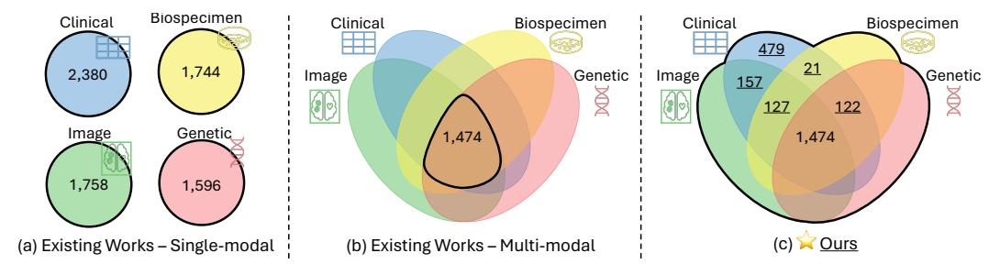

# Flex-MoE: Modeling Arbitrary Modality Combination via the Flexible Mixture-of-Experts

Sukwon Yun1, Inyoung Choi2, Jie Peng3, Yangfan Wu3, Jingxuan Bao2, Qiyiwen Zhang2, Jiayi Xin2, Qi Long2, Tianlong Chen1

1University of North Carolina at Chapel Hill 2University of Pennsylvania 3University of Science and Technology of China

{swyun, tianlong}@cs.unc.edu, {inyoungc, jiayixin}@seas.upenn.edu, {pengjieb, ustc\_wyf}@mail.ustc.edu.cn {jingxuan.bao, qiyiwen.zhang}@pennmedicine.upenn.edu, qlong@upenn.edu

#### **Abstract**

Multimodal learning has gained increasing importance across various fields, offering the ability to integrate data from diverse sources such as images, text, and personalized records, which are frequently observed in medical domains. However, in scenarios where some modalities are missing, many existing frameworks struggle to accommodate arbitrary modality combinations, often relying heavily on a single modality or complete data. This oversight of potential modality combinations limits their applicability in real-world situations. To address this challenge, we propose Flex-MoE (Flexible Mixture-of-Experts), a new framework designed to flexibly incorporate arbitrary modality combinations while maintaining robustness to missing data. The core idea of Flex-MoE is to first address missing modalities using a new missing modality bank that integrates observed modality combinations with the corresponding missing ones. This is followed by a uniquely designed Sparse MoE framework. Specifically, Flex-MoE first trains experts using samples with all modalities to inject generalized knowledge through the generalized router  $(\mathcal{G}$ -Router). The  $\mathcal{S}$ -Router then specializes in handling fewer modality combinations by assigning the top-1 gate to the expert corresponding to the observed modality combination. We evaluate Flex-MoE on the ADNI dataset, which encompasses four modalities in the Alzheimer's Disease domain, as well as on the MIMIC-IV dataset. The results demonstrate the effectiveness of Flex-MoE, highlighting its ability to model arbitrary modality combinations in diverse missing modality scenarios. Code is available at: https://github.com/UNITES-Lab/flex-moe.

#### 1 Introduction

In many fields, including healthcare, language, and vision, multimodal learning [6, 75, 37, 44] has emerged as a crucial approach for integrating data from multiple sources such as clinical records, imaging, and genetic data. Multimodal data enables more comprehensive analysis and decision-making, offering the potential for improved diagnosis and prediction in various applications [59, 33, 68]. However, a prominent challenge across these domains is the missing modality scenario [76, 60], where not all modalities are consistently available for every instance due to diverse reasons such as individualized data collection protocols or the variable availability of certain modalities.

Figure 2: Data statistics from a real-world multimodal dataset (e.g., the Alzheimer's Disease Neuroimaging Initiative (ADNI)), where patients exhibit unique combinations of available modalities. Existing approaches focus on either (a) single-modality data or (b) complete multimodal data, losing the potential to leverage other combinations. Our approach incorporates all possible modality combinations, offering a more robust solution to the missing modality scenario.

As an representative example, in Alzheimer's Disease (AD) [4], one of the most prevalent neurodegenerative disorders, handling this inherently multimodal data is crucial for accurate diagnosis (Figure 1). AD datasets often include a combination of clinical symptoms, imaging data [42], and genetic profiles [48]. However, in real-world clinical settings, not all these modalities are readily available for each patient. Some data, such as clinical and imaging data, may be available from routine visits, whereas other data, such as genetic or biospecimen information, may

Figure 1: Multimodal AD.

require additional time to collect. This leads to incomplete datasets, which poses a challenge for existing models that tend to either rely heavily on single modalities or only utilize complete data, thereby missing the opportunity to leverage the full potential of multimodal learning (Figure 2).

**Single Modality and Complete Data Reliance.** The reliance on single-modality data or complete data across many frameworks is a significant limitation in real-world scenarios, where missing data is the norm rather than the exception. As seen in Figure 2, many current models either work with single-modality data or focus on the intersection of modalities, neglecting the potential contribution of partially available modalities. In healthcare, particularly for diseases such as AD, this often leads to missed opportunities in diagnosis and treatment due to the inability to fully exploit multimodal data when some modalities are missing.

Oversight of Modality Combinations. Beyond the challenge of missing modalities, there is also the need to model the interactions between available modalities properly. Different combinations of modalities can provide complementary information, and each combination may hold unique significance for downstream tasks. For example, in AD diagnosis, combining biospecimen data and imaging data can reveal key insights: cerebrospinal fluid biomarkers may indicate early signs of AD [21], while functional MRI can highlight cognitive impairments [42]. Hence, it is essential to develop models that not only handle missing modalities but also effectively utilize the available modality combinations.

Given the general challenge of the missing modality scenario in multimodal learning, we propose a novel framework, Flex-MoE (Flexible Mixture-of-Experts), to flexibly incorporate arbitrary modality combinations while maintaining robustness to missing data. Flex-MoE first sort samples based on the available modalities and process them through modality-specific encoders. For missing modalities, we introduce a learnable missing modality bank, which provides learnable embeddings for missing modalities based on the observed ones. This approach ensures that the model can handle incomplete datasets effectively. Our framework also builds upon Sparse Mixture-of-Experts (SMoE) design, allowing us to generalize the expert knowledge from complete data (samples with all modalities) through the  $\mathcal{G}$ -Router, followed by a specialized  $\mathcal{S}$ -Router for handling fewer modality combinations. Each expert becomes specialized in handling different modality combinations, ensuring that the model can effectively process any combination of modalities. We demonstrate the effectiveness of Flex-MoE through comprehensive experiments on several real-world datasets, including the Alzheimer's Disease Neuroimaging Initiative (ADNI), which involves four key modalities for AD stage prediction, and the MIMIC-IV dataset. The results confirm the robustness of Flex-MoE in diverse missing modality scenarios.

The contributions of this work can be summarized as follows:

- ⋆ We introduce a flexible framework that effectively incorporates arbitrary modality combinations and addresses the missing modality scenario across various domains.
- ⋆ Flex-MoE features a novel approach, including a missing modality bank and generalized and specialized expert training, which ensures robustness to missing modality scenario.
- ⋆ Extensive experiments on real-world datasets, including ADNI and MIMIC-IV, showcase the consistent and robust performance of Flex-MoE in handling diverse modality combinations.

