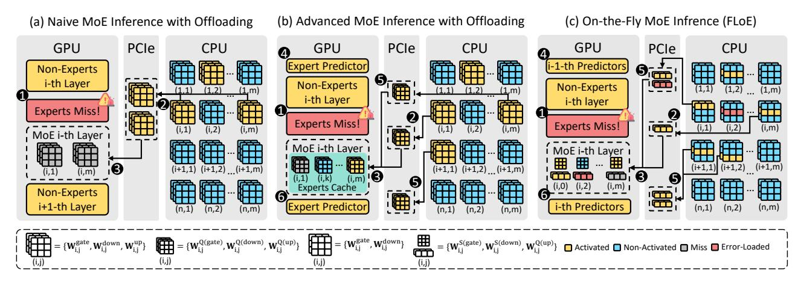

## FloE: On-the-Fly MoE Inference on Memory-constrained GPU

Yuxin Zhou \* 1 2 Zheng Li \* 1 2 Jun Zhang 1 2 Jue Wang 1 Yiping Wang 3 Zhongle Xie 1 2 Ke Chen 1 2 Lidan Shou 1 2

## Abstract

With the widespread adoption of Mixture-of-Experts (MoE) models, there is a growing demand for efficient inference on memory-constrained devices. While offloading expert parameters to CPU memory and loading activated experts on demand has emerged as a potential solution, the large size of activated experts overburdens the limited PCIe bandwidth, hindering the effectiveness in latency-sensitive scenarios. To mitigate this, we propose FloE, an on-the-fly MoE inference system on memory-constrained GPUs. FloE is built on the insight that there exists substantial untapped redundancy within sparsely activated experts. It employs various compression techniques on the expert's internal parameter matrices to reduce the data movement load, combined with low-cost sparse prediction, achieving perceptible inference acceleration in wall-clock time on resource-constrained devices. Empirically, FloE achieves a 9.3× compression of parameters per expert in Mixtral-8×7B; enables deployment on a GPU with only 11GB VRAM, reducing the memory footprint by up to 8.5×; and delivers a 48.7× inference speedup compared to DeepSpeed-MII on a single GeForce RTX 3090—all with only a 4.4% ∼ 7.6% average performance degradation.

## 1. Introduction

Mixture of Experts (MoE) models including DeepSeek-R1 [\(DeepSeek-AI,](#page-9-0) [2025\)](#page-9-0), GPT-4 [\(OpenAI,](#page-10-0) [2023\)](#page-10-0), Phi-4 [\(Abdin et al.,](#page-9-1) [2024b\)](#page-9-1), Mixtral [\(Jiang et al.,](#page-10-1) [2024\)](#page-10-1), etc., offer a paradigm shift in the large language model (LLM) architecture by introducing sparsely activated experts. These

*Proceedings of the* 41 st *International Conference on Machine Learning*, Vancouver, Canada. PMLR 267, 2025. Copyright 2025 by the author(s).

sparse LLMs contextually activate only a subset of experts per token, significantly reducing inference costs while maintaining generative performance. However, the abundance of idle, non-activated experts during MoE inference significantly hampers efficient GPU memory utilization, making it challenging to deploy MoE models on memory-constrained GPUs. For instance, running inference for Mixtral-8×7B, where two experts are activated, requires approximately 94GB of VRAM in FP16 precision. Of this, 30% of the activated parameters (27.3GB) are utilized during decoding, while the remaining 66.8GB is occupied by non-activated experts, resulting in significant inefficiency [\(Shin et al.,](#page-11-0) [2024\)](#page-11-0).

To address the problem, offloading techniques [\(Sarkar et al.,](#page-11-1) [2023;](#page-11-1) [Eliseev & Mazur,](#page-9-2) [2023;](#page-9-2) [Hwang et al.,](#page-10-2) [2024;](#page-10-2) [Song](#page-11-2) [et al.,](#page-11-2) [2024a;](#page-11-2) [Xue et al.,](#page-11-3) [2024a;](#page-11-3) [Tang et al.,](#page-11-4) [2024\)](#page-11-4), which unmount expert parameters to CPU memory and load them into GPU memory on demand for each input, offers a natural solution. However, offloading shifts the decoding bottleneck from memory-bound to I/O-bound, as transferring billions of parameters through the low-bandwidth PCIe bus incurs substantial data transfer delays. For comparison, the DRAM-to-VRAM bandwidth (32GB/s for PCIe 4.0) is orders of magnitude lower than the bandwidth between GPU memory and on-chip computation units (300GB/s). Consequently, existing MoE inference systems with expert offloading, designed for edge-side continuous serving scenarios (i.e., single-batch latency-sensitive inference) [\(Kong](#page-10-3) [et al.,](#page-10-3) [2024;](#page-10-3) [Eliseev & Mazur,](#page-9-2) [2023;](#page-9-2) [Hwang et al.,](#page-10-2) [2024;](#page-10-2) [Sarkar et al.,](#page-11-1) [2023;](#page-11-1) [Tang et al.,](#page-11-4) [2024\)](#page-11-4), still fail to support *on-the-fly* inference, where the loading process is *perceptible* to the user because its overhead cannot be hidden by the model computation. Ultra-low-bit quantization effectively reduces the size of transmitted parameters to mitigate the latency of activated expert loading [\(Eliseev & Mazur,](#page-9-2) [2023;](#page-9-2) [Sarkar et al.,](#page-11-1) [2023\)](#page-11-1), but at the cost of significantly degraded generation performance. Thus, a pressing question emerges:

*How can we hide the I/O overhead of activated experts within model computation to enable on-the-fly MoE inference on the memory-constrained GPU while minimizing generation performance degradation?*

In this paper, we present an on-the-fly MoE inference system, coined FloE, for consumer-grade devices. FloE reduces the I/O overhead of the experts, namely the transfer cost of the matrices for up, gate, and down projections, via

\*Equal contribution 1The State Key Laboratory of Blockchain and Data Security, Zhejiang University 2Hangzhou High-Tech Zone (Binjiang) Institute of Blockchain and Data Security 3 Paul G. Allen School of Computer Science & Engineering, University of Washington. Correspondence to: Zhongle Xie <xiezl@zju.edu.cn>, Lidan Shou <should@zju.edu.cn>.

a hybrid compression mechanism (Section [3.2\)](#page-2-0). Despite the utilization of the well-known inter-expert sparsity, the compression exploits the vast, untapped intra-expert sparsity in MoE models with a novel contextual sparsification scheme (Section [3.2.1\)](#page-2-1), balancing the transfer cost and the downstream performance. In detail, the system first identifies low-magnitude, no-salient output activations of up projection and then removes the corresponding channel weights from the gate and down projections. Meanwhile, we observe that the up projection matrix has limited sensitivity on performance against quantization, motivating us to enable the ultra-low-bit quantization in FloE to reduce the transfer overhead further (Section [3.2.2\)](#page-3-0).

Although the hybrid compression reduces per-transfer cost for MoE models, the pipelining between transfer and computation is prevented due to the sequential execution of routing, quantized up projection computation, and DRAM expert fetching, inhibiting on-the-fly inference. Therefore, we investigate the weights and the input during the computation and locate a high similarity between the shared hidden state input before routing and up projection of the MoE model. Based on the finding, we devise two efficient yet effective sparsity predictors: (1) an inter-expert learning-based predictor to guide the routing of the activation expert of the next layer with the hidden state of the current layer; (2) an intra-expert reused-based predictor precomputing the context sparsity distribution with the hidden state of the current layer and the reused up projection. The two predictors, with the help of prefetching, enable the pipelining of transfer and computation for on-the-fly inference. (Section [3.3\)](#page-4-0)

To integrate all the techniques above, we at last propose an efficient sparse kernel and compact asynchronous transfer from DRAM to VRAM to achieve system-wide efficiency (Section [3.4\)](#page-5-0). The experimental study on various GPU specs and downstream tasks evidence the efficiency and efficacy of FloE (Section [4\)](#page-6-0). Notably, for the popular Mixtral-8×7B, FloE achieves 9.3× parameter compression per expert, enables deployment on a GPU with just 11GB VRAM , and delivers a 2.6× inference speedup on an RTX 3090, with only 4.4%∼7.6% average performance degradation.

## 2. Related Work

Experts Offloading. Efficient deployment of MoE models faces substantial challenges due to their parameter counts, particularly under resource constraints. Current inference frameworks like Llama.cpp [\(llama.cpp\)](#page-10-4), Hugging-Face Accelerate [\(Gugger et al.,](#page-10-5) [2022\)](#page-10-5), and DeepSpeed Inference [\(Aminabadi et al.,](#page-9-3) [2022\)](#page-9-3) employ experts offloading by selectively transferring VRAM-dominant expert weights to DRAM [\(Sheng et al.,](#page-11-5) [2023\)](#page-11-5). However, constrained PCIe bandwidth creates transfer bottlenecks during CPU-GPU expert transfers [\(Kamahori et al.,](#page-10-6) [2024\)](#page-10-6).

To mitigate this, prefetching strategies predict and preload

required experts through two paradigms: experience-based statistical methods using offline activation traces [\(Sarkar](#page-11-1) [et al.,](#page-11-1) [2023\)](#page-11-1) (limited to top-1 expert activation strategy [\(Fe](#page-9-4)[dus et al.,](#page-9-4) [2022\)](#page-9-4)), and intermediate result-driven approaches leveraging hidden states [\(Eliseev & Mazur,](#page-9-2) [2023;](#page-9-2) [Hwang](#page-10-2) [et al.,](#page-10-2) [2024;](#page-10-2) [Song et al.,](#page-11-2) [2024a;](#page-11-2) [Tang et al.,](#page-11-4) [2024\)](#page-11-4) or prior expert indices [\(Xue et al.,](#page-11-3) [2024a\)](#page-11-3). The former fails under multiexpert activation due to exponential path growth [\(Dai et al.,](#page-9-5) [2024\)](#page-9-5), while the latter faces an accuracy-latency tradeoff: early-stage predictions from intermediate results [\(Song et al.,](#page-11-2) [2024a\)](#page-11-2) diminish prefetching accuracy, necessitating costly expert reloads, whereas adjacent-layer predictions [\(Hwang](#page-10-2) [et al.,](#page-10-2) [2024;](#page-10-2) [Eliseev & Mazur,](#page-9-2) [2023\)](#page-9-2) prevent computationcommunication overlap.

While ultra-low-bit expert quantization reduces transfer overhead at the cost of accuracy [\(Eliseev & Mazur,](#page-9-2) [2023;](#page-9-2) [Sarkar et al.,](#page-11-1) [2023\)](#page-11-1), CPU-based partial computation [\(Kama](#page-10-6)[hori et al.,](#page-10-6) [2024;](#page-10-6) [Xue et al.,](#page-11-6) [2024b;](#page-11-6) [Tang et al.,](#page-11-4) [2024\)](#page-11-4) achieves limited acceleration due to insufficient throughput for high-dimensional matrix operations.

In contrast to our focus on on-the-fly inference in latencysensitive scenarios, alternative offloading solutions, such as MoE-lightning [\(Cao et al.,](#page-9-6) [2024\)](#page-9-6), are primarily designed for high-throughput inference in offline scenarios.

Sparsity in LLMs. Maintaining model quality while minimizing parameter transfer necessitates synergistic sparsity and quantization. Weight pruning [\(Sun et al.,](#page-11-7) [2023;](#page-11-7) [Frantar](#page-9-7) [& Alistarh,](#page-9-7) [2023;](#page-9-7) [Ma et al.,](#page-10-7) [2023\)](#page-10-7) zeroes subsets of LLM weights to reduce computational/memory overhead but faces performance degradation and hardware compatibility issues on consumer-grade devices.

Activation sparsity—conditional computation via zero-rich hidden states—naturally occurs in ReLU-based MLPs [\(Liu](#page-10-8) [et al.,](#page-10-8) [2023;](#page-10-8) [Alizadeh et al.,](#page-9-8) [2023;](#page-9-8) [Shin et al.,](#page-11-0) [2024\)](#page-11-0) but diminishes in modern architectures using non-ReLU MLPs (e.g., SwiGLU [\(Shazeer,](#page-11-8) [2020\)](#page-11-8)), limiting direct applicability. Recent research has thus concentrated on reintroducing activation sparsity within newer architectures [\(Mirzadeh et al.,](#page-10-9) [2023;](#page-10-9) [Zhang et al.,](#page-11-9) [2024;](#page-11-9) [Song et al.,](#page-11-10) [2025;](#page-11-10) [2024b\)](#page-11-11), but requires extensive pretraining (billions of tokens). Trainingfree activation sparsity [\(Lee et al.,](#page-10-10) [2024a;](#page-10-10) [Liu et al.,](#page-10-11) [2024\)](#page-10-11), achieved through activation magnitude pruning in SwiGLUbased LLMs, remains tailored for dense models with uniform parameter utilization across inputs.

## 3. FloE: On-the-Fly MoE Inference

## 3.1. MoE Inference with Offloading

Figure [1\(](#page-2-2)a) illustrates naive MoE inference with offloading. Non-expert weights, frequently activated during inference, reside persistently in VRAM and are computed on the GPU. Expert weights, due to their sparse activation, are offloaded to DRAM. If certain experts' weights are missing from

Figure 1. Comparison of MoE inference offloading systems for memory-constrained GPUs: (a) Naive MoE Inference with Offloading; (b) Advanced MoE Inference with Offloading; (c) On-the-Fly MoE Inference (FloE).

VRAM (Figure 1(a) **①**), the system transfers these weights over the PCIe bus (Figure 1(a) **②**), after which the GPU proceeds with subsequent computations (Figure 1(a) **③**).

As mentioned in the introduction, expert offloading shifts the decoding bottleneck from memory-bound to I/O bound. Specifically, the expert transferring from DRAM to VRAM incurs long latency. For example, the expert in the Mixtral-8×7B model has over 300MB of FP16 parameters, taking nearly 15ms to transfer over a 16-channel PCIe 4.0 bus, whilst a single expert's computation on a GeForce RTX 3090 takes only about 5ms.

Figure 1(b) shows advanced MoE offloading (Eliseev & Mazur, 2023; Sarkar et al., 2023; Hwang et al., 2024; Song et al., 2024a; Xue et al., 2024a; Tang et al., 2024)(detailed related works discussion in Section 2). Despite the process in the naive solution, an extra expert predictor (Figure 1(b) ) is implemented to prognosticate the expert visiting in the near future. The prognosticated expert, as shown as Figure 1(b) , is quantized and preloaded in a GPU-resident expert cache (Figure 1(b) ), managed by a replacement policy. Compared to the naive solution, the advanced MoE offloading can achieve better transfer efficiency due to the usage of the expert predictor and the cache.

Next, we present FloE, an inference system that delivers on-the-fly MoE model inference on consumer-grade GPUs. FloE uses a hybrid compression scheme—integrating contextual sparsity and ultra-low-bit quantization (Figure 1(c) —detailed in Section 3.2. In Section 3.3, FloE introduces dual predictors (Figure 1(c) ) for inter- and intra-expert sparsity to accurately prefetch activated compressed weights (Figure 1(c) ) while minimizing DRAM usage. Finally, Section 3.4 describes system co-optimizations that further enhance FloE's efficiency.

#### 3.2. Expert Hybrid Compression

As shown in Figure 1, in a SwiGLU-based MoE model, each expert  $\mathcal{E}_{ij}$  consists of three matrices  $\{\mathbf{W}_{ij}^{\text{gate}}, \mathbf{W}_{ij}^{\text{down}}, \mathbf{W}_{ij}^{\text{up}}\}$ .

We denote the number of layers and the number of experts per layer as m and n, respectively. Although advanced MoE offloading proposes compressing experts using ultra-low-bit quantization (e.g., INT2, INT1) to reduce transfer costs, this significantly degrades model performance.

We argue that applying a uniform ultra-low-bit quantization strategy  $\mathbb{Q}(\cdot)$  across all matrices (see Figure 1(b)  $\{\mathbf{W}_{ij}^{\mathbb{Q}(\text{gate})}, \mathbf{W}_{ij}^{\mathbb{Q}(\text{down})}, \mathbf{W}_{ij}^{\mathbb{Q}(\text{up})}\}$ ) within an expert fails to strike an optimal balance between efficiency and performance. Thus, FloE introduces a unique twist with a hybrid strategy that tailors compression methods to the properties of the projection matrices. Specifically, contextual activation sparsity  $\mathbb{S}(\cdot)$  is applied to the gate projection  $\mathbf{W}_{ij}^{\text{gate}}$  and down projection  $\mathbf{W}_{ij}^{\text{down}}$  to produce  $\mathbf{W}_{ij}^{\text{S}(\text{gate})}$  and  $\mathbf{W}_{ij}^{\text{S}(\text{down})}$ . Meanwhile, ultra-low-bit quantization  $\mathbb{Q}(\cdot)$  (INT2) is used for the up projection  $\mathbf{W}_{ij}^{\text{up}}$  to yield  $\mathbf{W}_{ij}^{\text{Q}(\text{up})}$ .

