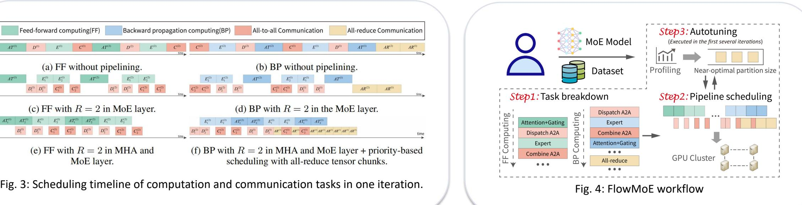

# **FlowMoE — Key Ideas**

- **Unified pipeline scheduling strategy:** Schedules MHA, gating, expert, and A2A together.
- **Priority scheduling mechanism for heterogeneous communication tasks:** Cut all-reduce chunks and execute them in all-to-all task gaps.
- **Lightweight adaptive optimizer and system integration:** Tiny Bayesian optimizer for automatic tuning. Deploying FlowMoE to the PyTorch engine.

