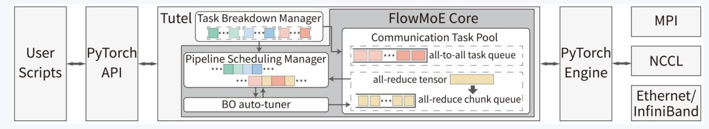

# **System Implementation & Conclusion**

### **System Implementation**

- **Framework:** Implemented on PyTorch , leveraging Tutel for optimized communication.
- **Compatibility:** Supports multiple optimization frameworks and communication stacks.

### **Conclusions**

- The unified scheduling across all major MoE-related tasks.
- Enabling the optimal coexistence of heterogeneous communication tasks.
- Substantially advancing distributed pipeline training.
- Open-source: github.com/ZJU-CNLAB/FlowMoE

