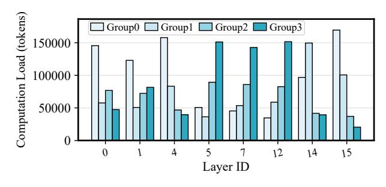

## GRACE-MoE: Grouping and Replication with Locality-Aware Routing for Efficient Distributed MoE Inference

Yu Han 1 Lehan Pan 1 Jie Peng 1 Ziyang Tao 1 Hanqi Zhu 1 Wuyang Zhang 1 Yanyong Zhang 1

## Abstract

Sparse Mixture of Experts (SMoE) enables scalable parameter growth in large language models (LLMs) by selectively activating a subset of experts, and its large parameter count necessitates distributed deployment for inference. However, distributed inference faces a critical dilemma: although communication overhead constitutes the primary bottleneck, reducing it often exacerbates computational load imbalance, leading to resource waste. In this paper, we present GRACE-MoE, which stands for Grouping and Replication with Locality-Aware Routing for SMoE inference. GRACE-MoE is a lossless co-optimization framework that integrates expert grouping to reduce communication and dynamic replication to correct load skew, together with locality-aware routing to resolve replica selection. To underpin this coordinated optimization in multi-node settings, GRACE-MoE adopts a hierarchical sparse communication design that reduces crossnode traffic while implicitly aligning execution across nodes, thereby mitigating synchronization overhead. Experiments on diverse models and multi-node, multi-GPU environments demonstrate that GRACE-MoE efficiently reduces endto-end inference latency, achieving up to 4.66× speedup over existing systems, and the code will be released upon acceptance.

## 1. Introduction

Large language models (LLMs) built on the Transformer architecture [\(Vaswani et al.,](#page-10-0) [2017\)](#page-10-0) demonstrate substantial performance gains as parameter counts increase [\(Brown](#page-8-0) [et al.,](#page-8-0) [2020\)](#page-8-0), but scaling dense models by simply enlarging parameters incurs prohibitive computation and memory

*Preprint.*

costs [\(Kaplan et al.,](#page-8-1) [2020;](#page-8-1) [Clark et al.,](#page-8-2) [2022\)](#page-8-2). The Sparse Mixture-of-Experts (SMoE) architecture mitigates this by partitioning parameters into experts and activating only a small subset per token, thereby enabling "large-parameter but small-computation" scaling [\(Shazeer et al.,](#page-9-0) [2017\)](#page-9-0). Recent SMoE systems, such as GShard [\(Lepikhin et al.,](#page-8-3) [2021\)](#page-8-3) and Switch Transformer [\(Fedus et al.,](#page-8-4) [2022\)](#page-8-4), have reached trillion-parameter scales, underscoring this potential.

Unfortunately, the massive parameter scale of SMoE exceeds the memory and computation capacity of a single device (i.e., a GPU), necessitating distributed deployment with expert parallelism, combined with data parallelism [\(Lep](#page-8-3)[ikhin et al.,](#page-8-3) [2021;](#page-8-3) [Zhai et al.,](#page-10-1) [2023\)](#page-10-1). In this setting, experts within each MoE layer are partitioned across GPUs and coordinated through All-to-All communication. This design introduces two critical bottlenecks for inference: communication overhead and computational load[1](#page-0-0) imbalance.

Each MoE layer involves two rounds of All-to-All communication, dispatching tokens to experts and aggregating results. Repeated across layers, this amplifies latency, making communication the primary bottleneck in SMoE inference [\(He et al.,](#page-8-5) [2022;](#page-8-5) [Gale et al.,](#page-8-6) [2023\)](#page-8-6). In cross-node settings with limited bandwidth, All-to-All communication accounts for over 70% of a single MoE layer's execution time and about 40% of overall end-to-end inference latency across layers [\(Li et al.,](#page-9-1) [2023;](#page-9-1) [Hwang et al.,](#page-8-7) [2023\)](#page-8-7). Meanwhile, the gating network naturally skews token routing, creating "hot" and "cold" experts that cause load imbalance, overloading some GPUs while leaving others idle and wasting computing resources [\(Lewis et al.,](#page-9-2) [2021;](#page-9-2) [Clark et al.,](#page-8-2) [2022;](#page-8-2) [He et al.,](#page-8-5) [2022\)](#page-8-5). Prior work typically addresses these two issues in isolation, but improving one often worsens the other. For example, methods that reduce communication often concentrate co-activated experts, which increases load skew. Such trade-offs can often be tolerated within a single node, where high-bandwidth links and tight synchronization partially mask their impact. However, in multi-node settings, limited cross-node bandwidth amplifies both effects: communication overhead becomes dominant, while load imbalance further exacerbates communication tail latency [\(Go](#page-8-8)

1University of Science and Technology of China. Correspondence to: Wuyang Zhang <wuyangz@ustc.edu.cn>, Yanyong Zhang <yanyongz@ustc.edu.cn>.

1[Computational load refers to the number of tokens assigned](#page-8-8) [to an expert, or the total over a group or GPU.](#page-8-8)

- (a) Uniformity constraint vs. communication traffic
- (b) Number of replicated experts vs. computational load balance

Figure 1. Impact of grouping uniformity constraint and number of replicated experts. Analysis of OLMoE with 2 nodes  $\times$  2 GPUs per node. Rep-Act-x denotes replication of x highly activated experts shared across HG groups; HG denotes hierarchical grouping.

& Mahajan, 2025), delaying global synchronization. As a result, jointly mitigating communication overhead and computational load imbalance in multi-node SMoE inference remains an open challenge.

At the system level, this communication bottleneck manifests in how All-to-All communication is implemented in multi-node deployments. Most existing systems adopt a flat global All-to-All communication pattern that requires strict synchronization across all ranks within a communication group. In heterogeneous clusters where high-bandwidth intra-node links (e.g., NVLink) coexist with significantly slower cross-node links (e.g., Ethernet), global synchronization is often limited by the slowest links. This straggler effect substantially amplifies synchronization overhead and constitutes another critical scalability bottleneck for distributed multi-node, multi-GPU systems.

In this paper, we propose **GRACE-MoE**, a lossless cooptimization framework for multi-node SMoE inference. **GRACE-MoE** consists of two tightly coupled phases: ① Grouping & Replication and @ Routing, performed in the offline and online phases. During the offline phase, we group experts based on affinity (i.e., co-activation frequency) to reduce cross-device2 All-to-All communication, directly mitigating the communication bottleneck. We further replicate highly activated experts from the most heavily loaded groups, with the number of replicas dynamically determined by load skew, to alleviate computational load imbalance without excessive redundancy. In the online phase, we design a topology-aware routing strategy to determine which replica executes the computation. This strategy prioritizes local replicas and employs weighted round-robin with load prediction across remote replicas when necessary, maintaining load balance while limiting cross-node traffic. To make such joint optimization effective in multi-node environments, we introduce a hierarchical sparse communication design that reduces cross-node synchronization overhead through implicit alignment of execution across nodes, mitigating long-tail latency. Together, these designs reconcile the conflicting objectives of communication efficiency and load balancing under the constraints of multi-node SMoE inference. Experiments on various MoE models and multi-node, multi-GPU setups show that **GRACE-MoE** reduces communication latency and alleviates load imbalance without accuracy degradation, reducing end-to-end inference latency by up to 78.55% compared to existing systems. The main contributions of this work are summarized as follows:

- Understanding trade-offs in SMoE inference. We identify the inherent trade-off between communication efficiency and load balancing.
- A lossless co-optimization framework. We propose a framework that jointly optimizes communication efficiency and load balance without accuracy loss.
- Hierarchical sparse communication architecture.
   We introduce a physically global yet logically sparse communication scheme for multi-node, multi-GPU SMoE inference.

#### 2. Related Work

Efficient SMoE Inference Systems. Various systems have been proposed to accelerate SMoE inference, such as DeepSpeed-MoE (Rasley et al., 2020), Tutel (Hwang et al., 2023), and MegaBlocks (Gale et al., 2023), which optimize SMoE through kernel optimization, adaptive parallelism, and computation reformulation as block-sparse matrix multiplications. Further throughput improvements involve scheduling, memory management, and pipelining, as exemplified by Lina (Li et al., 2023), vLLM (Kwon et al., 2023), Klotski (Fang et al., 2025), and others (Shen et al., 2022; Liu et al., 2023; Huang et al., 2023; Eliseev & Mazur, 2023; Zheng et al., 2024; Kong et al., 2024; Li et al., 2024; Wei et al., 2024; Yu et al., 2024; Hwang et al., 2024; Zhang et al., 2025b; Suo et al., 2025). Despite these advances, communication overhead and load imbalance remain critical bottlenecks in expert-parallel inference.

&lt;sup>2Cross-device communication includes both intra-node and cross-node cases.

Figure 2. Overview of **GRACE-MoE**. (a) Profiling expert selections to build affinity matrices. (b) Grouping high-affinity experts on the same device and dynamically replicating hot experts to balance computational load. (c) Adaptive routing reduces communication by prioritizing local replicas and balances requests via weighted round-robin with load prediction across remote replicas.

Expert Grouping, Replication and Routing. Some methods reduce communication through uniform expert grouping, such as C2R (Zhang et al., 2025a), Occult (Luo et al., 2025), and others (Yao et al., 2024; Li et al., 2025). Among them, C2R and Occult achieve substantial communication savings for top-k models but are lossy due to routing pruning and exacerbate load imbalance. Other works mitigate imbalance via expert replication or flexible placement (He et al., 2022; Nie et al., 2023; Wang et al., 2023; Wu et al., 2024; Skiadopoulos et al., 2025; Zeng et al., 2025; Go & Mahajan, 2025; DeepSeek-AI, 2025), yet most target training rather than inference and do not explicitly optimize communication. Existing works mainly optimize either communication or load balance, while joint optimization remains largely unexplored, especially in multi-node settings.

## 3. Observations

Motivated by the communication overhead and load imbalance discussed in Section 1, we analyze communication traffic in intra-node and cross-node settings. Under top-k routing, each token activates k experts per layer, and C2R (Zhang et al., 2025a) shows that expert activations exhibit strong co-activation patterns. We define expert affinity as the frequency with which two experts are co-activated by the same tokens. Grouping experts by affinity naturally yields uneven group sizes. Uniform grouping enforces equal experts per group, whereas non-uniform grouping re-

laxes this constraint and allows group sizes to follow affinity structure. As shown in Figure 1a, relaxing the uniformity constraint better exploits affinity and reduces cross-device traffic compared to Vanilla and C2R, while uniform grouping disrupts co-activation and limits optimization. However, affinity-based grouping concentrates frequently co-activated experts into the same groups, increasing the chance that certain devices receive disproportionately more tokens and exacerbating computational load imbalance, especially under non-uniform grouping. This trade-off is evident in Figure 1a, where grouping strategies that reduce communication traffic lead to worse load imbalance, motivating our design.

Beyond grouping, communication patterns introduce additional challenges in multi-node settings. Aggregating token copies destined for the same node can reduce expensive cross-node bandwidth consumption, but this is unsupported by flat global All-to-All and motivates hierarchical All-to-All. However, conventional hierarchical implementations decompose communication into multiple stages, incurring extra kernel launches and synchronization overhead. More critically, physically partitioning communication groups across nodes without global coordination leads to progress decoupling, where faster groups contend more aggressively for cross-node bandwidth and force slower groups to stall, resulting in long-tail latency. This imbalance propagates to subsequent intra-node communication stages, causing GPU spin-waiting and amplified synchronization overhead.

(a) Group-level load analysis across layers

(b) Per-expert load within the heaviest group

Figure 3. Computational load distribution after hierarchical grouping. (a) In OLMoE, affinity clustering concentrates load on a few groups. (b) In Layer 5, the heaviest group's per-expert load shows overload from a few frequently activated experts.

## 4. Method

To address the trade-off observed in Section 3, we propose **GRACE-MoE**, a hybrid optimization framework built on profiling of routing behaviors. During profiling, per-layer expert selections are recorded to construct expert affinity matrices and load statistics. Guided by this analysis, the framework integrates offline non-uniform hierarchical expert grouping (Section 4.1) and dynamic replication based on load skew (Section 4.2) with online locality-aware routing with load prediction (Section 4.3). As illustrated in Figure 2, this comprehensive design effectively reduces communication overhead and improves computational load balance in multi-node, multi-GPU SMoE inference, while maintaining model accuracy.

## 4.1. Expert Grouping: Communication-Centric Optimization

The objective of expert grouping is to colocate high-affinity experts on the same GPU to reduce cross-device communication. We build on spectral clustering to design a hierarchical grouping scheme for multi-node, multi-GPU topologies.

Non-Uniform Grouping of Experts Based on Intra-Layer **Affinity.** Spectral clustering produces groups with dense intra-connections and sparse inter-connections, aligning with our communication-centric goal. As observed in Section 3, affinity-based grouping tends to form uneven group sizes but better captures co-activation patterns, thereby reducing communication. We therefore apply spectral clustering to the expert affinity matrix to generate fully nonuniform groups, with sizes determined solely by affinity. Although fully non-uniform grouping reduces communication, it leads to computational load imbalance that is even more severe than in the uniform scheme. To mitigate this, we propose controlled non-uniform grouping, regulated by a non-uniformity ratio r that bounds group-size deviations. Given an ideal group size  $E = \frac{n}{D}$ , where n is the number of experts per layer and D is the number of groups, actual sizes are restricted to  $[E - \delta, E + \delta]$ , where  $\delta = E \cdot r$ . The choice

of r is critical: too small a value splits high-affinity experts and increases communication, while too large a value creates substantial group size disparity and worsens load imbalance. We model the selection of r as an optimization problem that balances affinity utilization against grouping non-uniformity. We define intra-group affinity utilization U(r) and size deviation S(r) as

$$U(r) = \frac{\sum_{C \in \mathcal{C}(r)} \sum_{\substack{i,j \in C \\ \sum_{i,j} A_{i,j}}} A_{i,j}}{\sum_{i < j} A_{i,j}}.$$
 (1)

$$S(r) = \sqrt{\frac{1}{D} \sum_{d=1}^{D} (|C_d| - E)^2}.$$
 (2)

where r is the candidate ratio,  $\mathcal{C}(r) = \{C_1, \dots, C_D\}$  denotes the grouping with D groups, and  $A \in \mathbb{R}^{n \times n}$  is the affinity matrix, with  $A_{i,j}$  denoting the affinity between experts i and j. By plotting (S(r), U(r)), we select the knee point as the optimal r, preserving affinity while avoiding excessive size gaps. The validity of this choice is empirically confirmed in Appendix A.1. After determining r, we refine fully non-uniform grouping by reassigning experts with the lowest intra-group affinity to candidate groups with higher affinity, yielding a scheme with controlled non-uniformity. Details of the algorithm are provided in Appendix A.2.

Hierarchical Grouping for Distributed Expert Placement. In multi-node, multi-GPU scenarios, we adopt a hierarchical grouping (HG) strategy. At the cross-node level, experts within each layer are divided into N large groups mapped to nodes. Since cross-node communication is much more expensive, we apply fully non-uniform grouping to maximize intra-node affinity and minimize cross-node traffic. Within each node, these groups are further partitioned into G smaller groups mapped to individual GPUs, where controlled non-uniform grouping is applied to balance group size while preserving affinity. This two-level strategy achieves communication optimization across the topology: affinity is maximized within GPUs, weaker across

*Figure 4.* End-to-end inference latency and MoE layer time. Comparison of GRACE-MoE and all baselines under different workloads and cluster settings.

GPUs in the same node, and rare across nodes. As a result, communication overhead is significantly reduced.

## 4.2. Expert Replication: Computational Load Balance-Centric Optimization

The affinity-based expert grouping scheme reduces communication but also aggravates the inherent computational load imbalance of SMoE models. High-affinity experts are frequently co-activated, and when grouped together, they tend to overload their hosting GPU. To mitigate this imbalance while preserving the communication benefits of grouping, we propose dynamic expert replication.

Selection of Experts for Replication. The root cause of load imbalance in SMoE inference lies in a small number of experts being frequently activated. We therefore replicate highly activated experts. As shown in Figure [1b,](#page-1-1) starting from hierarchical grouping, we replicate different numbers of such experts by placing one replica on each GPU. The results show that replicating only a few experts yields limited improvement, while a moderate replication level significantly reduces load imbalance. However, further increasing the number of replicated experts brings only marginal additional benefits. We attribute this to redundant replication, which degrades the system toward data parallelism, disrupts affinity-based grouping, and incurs unnecessary memory overhead. Hence, the replication scope must be carefully constrained. As illustrated in Figure [3,](#page-3-1) after grouping, only

a few groups in each layer handle the majority of tokens, and the overload mainly stems from a small number of frequently activated experts. We therefore replicate only these experts within the heaviest group rather than the entire group, preserving intra-group affinity and communication benefits while avoiding redundancy and wasted resources.

Dynamic Replica Allocation Based on Load Skew. Since expert activation distributions and grouping results vary across layers, the computational load skew of the heaviest group also differs. Therefore, we propose a dynamic replication (DR) strategy driven by load skew. After generating the expert groups in each layer, profiling data are used to calculate the load Wi of each group, yielding the maximum Wmax and mean load W. The computational load skew factor (ρ) is defined as Wmax/W, and the number of replicas is determined by Equation [\(3\)](#page-4-1).

$$n_{\text{replica}} = \min \left( \max \left( 1, \lfloor \rho \rfloor \right), \ n_{\text{gpu}} - 1 \right).$$
 (3)

Within the heaviest group, experts are ranked by individual load, and those whose cumulative load exceeds Wmax · nreplica 1+nreplica are identified as hot experts. These experts are then replicated onto the nreplica most underutilized GPUs. The original primary replicas remain, while additional replicas serve only as secondary copies, keeping the grouping structure intact. This mechanism effectively redistributes the workload of hotspot GPUs while maintaining communication efficiency, significantly mitigating the imbalance amplified by grouping.

