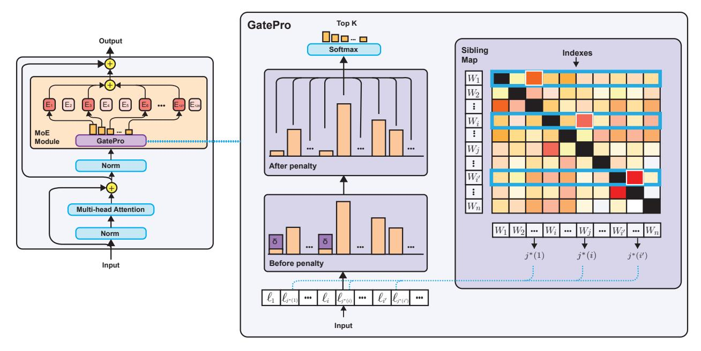
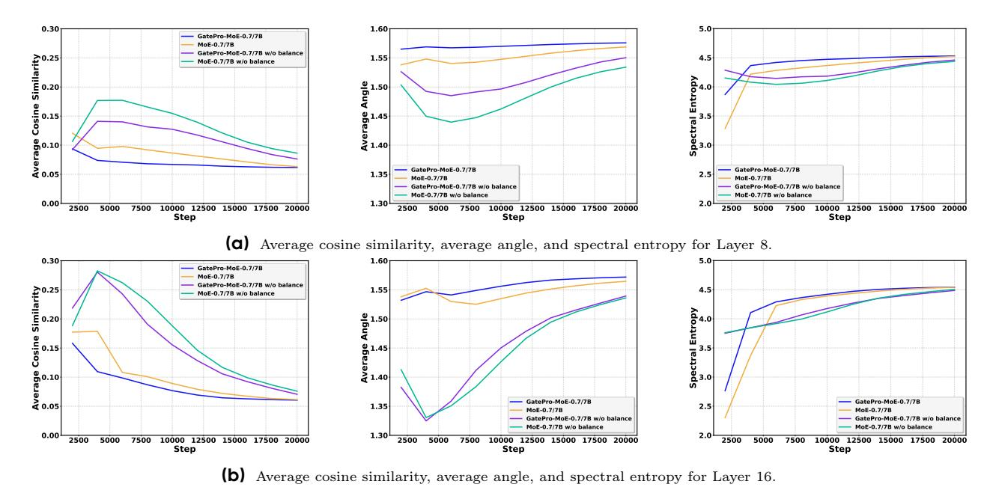

# **GatePro: Parameter-Free Expert Selection Optimization for Mixture-of-Experts Models**

**Chen Zheng**<sup>1</sup> , **Yuhang Cai**<sup>2</sup> , **Deyi Liu**<sup>1</sup> , **Jin Ma**<sup>1</sup> , **Yiyuan Ma**<sup>1</sup> , **Yuan Yang**<sup>1</sup> , **Jing Liu**<sup>1</sup> , **Yutao Zeng**<sup>1</sup> , **Xun Zhou**<sup>1</sup> , **Siyuan Qiao**<sup>1</sup>

> <sup>1</sup>ByteDance Seed, <sup>2</sup>UC Berkeley

## **Abstract**

Modern large language models leverage Mixture-of-Experts (MoE) architectures for efficient scaling, but face a critical challenge: functionally similar experts are often selected simultaneously, creating redundant computation and limiting effective model capacity. Existing auxiliary balance loss methods improve token distribution but fail to address the underlying expert diversity problem. We introduce GatePro, a novel parameter-free method that directly promotes expert selection diversity. GatePro identifies the most similar expert pairs and introduces localized competition mechanisms, preventing redundant expert co-activation while maintaining natural expert specialization. Our comprehensive evaluation demonstrates GatePro's effectiveness across model scales and benchmarks. Analysis demonstrates GatePro's ability to achieve enhanced expert diversity, where experts develop more distinct and complementary capabilities, avoiding functional redundancy. This approach can be deployed hot-swappable during any training phase without additional learnable parameters, offering a practical solution for improving MoE effectiveness.

**Date:** October 16, 2025

**Correspondence:** Chen Zheng at [chen.zheng1@bytedance.com](mailto:chen.zheng1@bytedance.com)

## **1 Introduction**

The rapid advancement of large language models (LLMs) has demonstrated remarkable capabilities across diverse natural language processing tasks [\[2,](#page-11-0) [24,](#page-12-0) [28\]](#page-12-1). However, scaling dense models faces significant challenges, including rising computational costs, memory requirements, and training instabilities [\[18,](#page-11-1) [20\]](#page-12-2). As model parameters grow from billions to trillions, the computational burden becomes prohibitive for both training and inference. Meanwhile, performance gains often plateau or become marginal [\[27,](#page-12-3) [31\]](#page-12-4).

Mixture of Experts (MoE) models have emerged as a compelling solution to address these scalability challenges by activating only a subset of parameters for each input token [\[15,](#page-11-2) [25\]](#page-12-5). In Transformer architectures [\[29\]](#page-12-6), MoE layers replace the traditional feed-forward network (FFN) with multiple parallel experts, each a specialized FFN [\[21\]](#page-12-7). A gating mechanism routes each token to its top-k experts, while others remain inactive, enabling dramatic scaling of model capacity while maintaining manageable computational costs [\[4,](#page-11-3) [14\]](#page-11-4). However, early MoE implementations suffer from severe load imbalancing issues, where a few experts receive the majority of tokens while others are underutilized [\[6,](#page-11-5) [25\]](#page-12-5). To address this challenge, auxiliary balance loss functions were introduced [\[15,](#page-11-2) [21,](#page-12-7) [25,](#page-12-5) [37\]](#page-13-0). These methods successfully improve expert load distribution by penalizing uneven token assignments, ensuring that computational resources are better utilized across all experts.

While auxiliary balance loss effectively addresses load balancing, it overlooks a more fundamental problem: **expert selection diversity**. We observe that MoE models experience significant expert activation delays during early pre-training, where the gating mechanism initially concentrates tokens on a few dominant experts and only gradually expands to utilize additional experts as training progresses. This narrow initial focus creates a cascade of problems: many experts remain undertrained during crucial early learning phases, limiting the model's ability to leverage its full capacity during foundational learning. Moreover, even after the gating mechanism eventually learns to distribute tokens more broadly, similar experts tend to be co-activated, creating functional redundancy rather than true specialization.

The fundamental issue stems from current expert selection mechanisms focusing solely on load balance while ignoring functional diversity. Auxiliary balance losses [\[15,](#page-11-2) [37\]](#page-13-0) achieve uniform token distribution by encouraging broader expert utilization over time. However, they operate independently of expert functionality. This approach fails to address the core problem that functionally similar experts can still be co-activated as long as load balance is maintained. Consequently, even when all experts receive adequate tokens, the selected subset for any given input may exhibit significant functional overlap, compromising representational capacity, particularly in deeper layers where expert specialization is crucial for optimal performance.

To address the expert selection diversity challenge, we propose GatePro, a novel parameter-free approach that directly promotes diverse expert selection through localized competition mechanisms. Our motivation stems from the observation that expert selection can be viewed as a competitive propagation process between experts, where the influence of one expert's selection propagates to affect others based on their functional similarities. GatePro employs targeted localized competition between the most similar expert pairs, ensuring that functionally redundant experts cannot be simultaneously selected while preserving natural specialization for dissimilar experts. This competitive propagation enables GatePro to achieve enhanced expert diversity, where experts develop more distinct and complementary capabilities, avoiding functional redundancy.

To validate GatePro's effectiveness, we conduct extensive experiments across different model scales, varying expert pool sizes, and multiple training stages. We evaluate GatePro during both pretraining from scratch and continued training (CT) phases, tracking performance from early to advanced stages to demonstrate robustness across different training scenarios. Additionally, we perform analysis to understand how GatePro achieves improved expert utilization and selection diversity.

In summary, this work makes the following contributions:

- (1). We identify expert selection diversity as a fundamental challenge overlooked by existing MoE approaches and propose GatePro, a parameter-free approach that promotes diverse expert selection through competitive propagation between functionally similar experts. GatePro is hot-swappable, allowing expert diversity enhancement without additional learnable parameters.
- (2). We provide comprehensive experimental evaluation across multiple model scales and benchmarks, demonstrating that GatePro consistently outperforms baseline MoE models, with particularly strong benefits during all training phases.
- (3). We conduct comprehensive mechanistic analysis through expert utilization tracking and gating similarity evaluation, revealing that GatePro significantly accelerates expert activation, reduces expert similarity, increases selection entropy, and maintains diversity patterns, with particularly significant improvements in deeper layers where expert specialization is most critical.

## **2 Related Work**

Sparse MoE and routing. MoE architectures scale model capacity through sparse activation and learned routing. As a foundational contribution, Shazeer et al. [\[25\]](#page-12-5) introduced sparsely-gated layers with token-choice routing. Building on this, Switch Transformer [\[15\]](#page-11-2) simplified the original design and proposed the widely used load-balancing loss (LBL) to encourage balanced expert utilization in large language models. ST-MoE [\[39\]](#page-13-1) identified instability caused by LBL and introduced the z-loss, which regularizes router logits to maintain stable magnitude. GShard [\[21\]](#page-12-7) further combined auxiliary balancing with expert capacity limits and a random routing strategy for secondary expert selection. To mitigate persistent imbalance, Lewis et al. [\[22\]](#page-12-8) proposed the BASE layer, reframing token–expert assignment as a linear assignment problem, while Clark et al. [7] extended this with optimal transport formulations and a reinforcement learning-based router. Other work focuses on smoothing Top-k routing decisions: DSelect-k [16] approximates Top-k with a differentiable formulation, while Dong et al. [13] cast routing as a minimum-cost maximum-flow problem with a differentiable SoftTopK operator to improve efficiency and balance. Skywork-MoE [32] introduced gating-logit normalization and layerwise adaptive coefficients to stabilize training and encourage diversity, while AdaMoE [35] dynamically adjusts the number of experts per token. Our proposed GatePro differs from these approaches: rather than auxiliary losses or heavy optimization, it employs a loss-free gating mechanism with localized competition between similar gates, simultaneously improving load balancing and expert diversity.

MoE in Open-Source Models. MoE designs have been widely adopted in recent open-source large language models, though routing and balancing strategies vary considerably. DeepSeek-V3 [12] proposes a bias-based, auxiliary-loss-free strategy that dynamically adjusts per-expert biases to achieve balance without explicit loss terms, while DeepSeek-V2 [11] uses dual balancing objectives (expert utilization and token allocation) and device-limited routing to minimize communication costs. Qwen3-MoE [33] scales this paradigm with 128 experts and 8 active per token, introducing global-batch load balancing to aggregate statistics across devices for smoother gradients. OLMoE [23] provides a fully reproducible baseline, combining Top-k token-choice routing, Switch-style LBL, and a router z-loss for logit stabilization. LLaMA-MoE [38] similarly applies dropless Top-k routing with Switch-style balancing. In contrast, models like Mixtral-8×7B/22B [19], GPT-OSS [3], DBRX [10], and Grok-2 [1] disclose expert counts and Top-k settings but do not specify loss formulations, suggesting reliance on Switch-derived techniques.

## 3 Approach

In this section, we present GatePro, a parameter-free approach for improving expert selection diversity in Mixture-of-Experts models. We first provide the mathematical formulation of conventional MoE layers, then introduce our gate similarity computation and localized ompetition mechanism, as shown in Figure 1.

#### 3.1 Preliminaries: Mixture-of-Experts Layer

Consider a standard MoE layer with N experts  $\{E_1, E_2, \dots, E_N\}$ , where each expert  $E_i$  is typically a feed-forward network. We will use [N] to denote the index set  $\{1, 2, \dots, N\}$ . Given an input token  $\mathbf{x} \in \mathbb{R}^d$ , the router produces expert logits:

$$\ell(\mathbf{x}) := \mathbf{W}_g \cdot \mathbf{x} + \mathbf{b}_g \in \mathbb{R}^N, \tag{1}$$

where  $\mathbf{W}_g \in \mathbb{R}^{N \times d}$  and  $\mathbf{b}_g \in \mathbb{R}^N$ . Through this paper, we set  $\mathbf{b}_g \equiv 0$  and use  $\ell_i(\cdot)$  to denote the *i*-th component of this function. We first select the top-k expert subset by logits:

$$\mathcal{T}_k(\ell(\mathbf{x})) := \underset{I \subset [N], |I| = k}{\operatorname{arg max}} \sum_{i \in I} \ell_i(\mathbf{x}).$$
(2)

Then we normalize only over the selected set to get mixture weights:

$$\alpha_i(\mathbf{x}) := \begin{cases} \frac{\exp(\boldsymbol{\ell}_i(\mathbf{x}))}{\sum_{j \in \mathcal{T}_k(\boldsymbol{\ell}(\mathbf{x}))} \exp(\boldsymbol{\ell}_j(\mathbf{x}))}, & i \in \mathcal{T}_k(\boldsymbol{\ell}(\mathbf{x})), \\ 0, & i \notin \mathcal{T}_k(\boldsymbol{\ell}(\mathbf{x})). \end{cases}$$
(3)

The MoE output is the sparsely weighted combination of expert outputs:

$$\mathbf{y} \coloneqq \sum_{i \in [N]} \alpha_i(\mathbf{x}) \cdot E_i(\mathbf{x}). \tag{4}$$

<span id="page-3-0"></span>

**Figure 1** The GatePro Approach.

## **3.2 GatePro Approach**

GatePro addresses the expert selection problem by pronouncing both functional diversity and load balance. While existing methods treat expert selection as a token distribution challenge, GatePro recognizes that the critical issue is functional redundancy among co-selected experts. By introducing localized competition between the most similar expert pairs, GatePro encourages diversity in expert selection while maintaining the original model capacity. Unlike existing MoE optimization methods that rely on auxiliary losses or additional parameters, GatePro operates through a competitive propagation mechanism that directly prevents functionally similar experts from being co-activated.

**Gate Similarity Computation.** The first step in GatePro is to identify which expert pairs are most likely to provide redundant functionality. We conceptualize this as analyzing how expert specializations propagate through their gating patterns. Experts with similar gating weight vectors tend to be activated by similar types of tokens, indicating that their learned specializations have propagated along similar directions in the parameter space, potentially leading to functional overlap.

We define the cosine similarity matrix of the gating weights S ∈ R <sup>n</sup>×<sup>n</sup> as:

<span id="page-3-1"></span>
$$S_{ij} := \frac{\langle \mathbf{w}_{g,i}, \mathbf{w}_{g,j} \rangle}{|\mathbf{w}_{g,i}| \cdot |\mathbf{w}_{g,j}|}$$
 (5)

where wg,i and wg,j are the i-th and j-th rows of the gating weight matrix Wg. This similarity matrix captures how specialization patterns have propagated across experts during training, with values ranging from -1 to 1. Higher similarity values indicate that experts have developed along similar specialization trajectories, suggesting potential redundancy that requires competitive selection.

**Localized Competition Mechanism.** Once we have identified similar expert pairs, the next challenge is promoting expert diversity without disrupting natural specialization patterns. We introduce localized competition between the most similar expert pairs, rather than applying global constraints that may interfere with all experts. The key insight of localized competition is that if two experts exhibit highly similar gating patterns, allowing both to be selected simultaneously provides diminishing returns and creates redundancy. Therefore, we encourage competitive selection that favors the expert with stronger activation for the current token, promoting enhanced expert diversity.

For each expert i, we identify its most similar counterpart:

$$j^*(i) := \arg\max_{j \neq i} S_{ij} \tag{6}$$

The competition winner is determined based on the gating probabilities for the current input token:

winner
$$(i, j^*(i))[\mathbf{x}] := \begin{cases} i & \text{if } \ell_i(\mathbf{x}) \ge \ell_{j^*(i)}(\mathbf{x}) \\ j^*(i) & \text{otherwise} \end{cases}$$
 (7)

This token-specific competition ensures that the selection depends on the actual relevance of each expert for the current input. The losing expert is suppressed by applying a constant negative penalty to its logit:

$$\tilde{\ell}_i(\mathbf{x}) := \begin{cases} \ell_i(\mathbf{x}) & \text{if winner}(i, j^*(i))[\mathbf{x}] = i\\ \ell_i(\mathbf{x}) - \lambda & \text{if winner}(i, j^*(i))[\mathbf{x}] = j^*(i) \end{cases}$$
(8)

where  $\lambda$  is a positive constant (typically  $\lambda = 10^{-4}$ ). This aggressive penalty mechanism effectively eliminates the losing expert from consideration while maintaining numerical stability. Then we compute the mixture weights by the suppressed logits  $\ell(\mathbf{x})$ :

<span id="page-4-1"></span>
$$\tilde{\alpha}_{i}(\mathbf{x}) \coloneqq \begin{cases} \frac{\exp(\tilde{\ell}_{i}(\mathbf{x}))}{\sum_{j \in \mathcal{T}_{k}((\tilde{\ell}(\mathbf{x})))} \exp(\tilde{\ell}_{j}(\mathbf{x}))}, & i \in \mathcal{T}_{k}(\tilde{\ell}(\mathbf{x})), \\ 0, & i \notin \mathcal{T}_{k}(\tilde{\ell}(\mathbf{x})). \end{cases}$$
(9)

The final output is computed as follows:

$$\tilde{\mathbf{y}} := \sum_{i \in [N]} \tilde{\alpha}_i(\mathbf{x}) \cdot E_i(\mathbf{x}). \tag{10}$$

where  $\tilde{\mathbf{y}}$  is the final output that benefits from improved expert diversity through the GatePro competition mechanism. The GatePro approach is summarized in Algorithm 1. The computational overhead is minimal compared to the base MoE computation. The cosine similarity matrix computation has  $O(N^2d)$  complexity. The competitive selection requires only O(N) complexity per token. Without requiring additional parameters, GatePro can be easily integrated into existing MoE architectures.

#### <span id="page-4-0"></span>Algorithm 1 GatePro Approach

```
Require: Input token x, gating weights \mathbf{W}_g, penalty \lambda, experts \{E_1, \ldots, E_N\}
Ensure: Final MoE output \tilde{\mathbf{y}}
 1: Compute original logits: \ell = \mathbf{W}_q \mathbf{x}
 2: Compute gate similarity matrix: S by equation 5
 3: Find most similar pairs: j^*(i) = \arg \max_{i \neq i} \mathbf{S}_{ii} for each i
 4: Initialize penalty mask: \delta = 0
 5: for each expert i \in \{1, 2, \dots, N\} do
         if \boldsymbol{\ell}_i < \boldsymbol{\ell}_{j^*(i)} then \delta_i = -\lambda
 6:
 7:
 9: end for
10: Apply penalties: \tilde{\ell} = \ell + \delta
11: Select top-k experts: \mathcal{T}_k(\tilde{\ell}(\mathbf{x}))
12: Compute probabilities: \tilde{\alpha}(\mathbf{x}) by equation 9
13: Compute final output: \tilde{\mathbf{y}} = \sum_{i \in [N]} \tilde{\alpha}_i(\mathbf{x}) \cdot E_i(\mathbf{x})
14: return \tilde{\mathbf{y}}
```

Unlike auxiliary loss methods that require careful tuning and may interfere with training, GatePro can be enabled or disabled during training without additional learnable parameters, which we call hot-swappable. This feature allows flexible deployment and creates persistent improvements that benefit the model even after GatePro is disabled. More detailed analysis is shown in Section B.

## 4 Experiments

In this section, we evaluate the effectiveness of GatePro across multiple model scales and benchmarks. We conduct comprehensive experiments on various downstream tasks to demonstrate the consistent improvements achieved by our parameter-free approach.

## 4.1 Experimental Setup

We conduct GatePro experiments on two different model scales: Seed-MoE-0.7B/7B and Seed-MoE-1.3B/13B. Both models use sparse MoE architectures with top-k expert selection where k=6. We train models from scratch using the same training configurations to ensure a fair comparison between baseline MoE models and GatePro. We systematically track model performance at multiple training intervals ranging from early (100B tokens) to advanced training stages (up to 1.2T tokens) to deeply understand the impact of GatePro throughout training. The training utilized distributed computing across 8 nodes with a total of 64 GPUs. The training incorporated advanced optimization techniques including FSDP [36] and Flash Attention [9].

The evaluation is conducted on six diverse benchmarks covering factual knowledge (MMLU-Pro [30] and MMLU [17]), knowledge and commonsense reasoning (BBH [26] and HellaSwag [34]), arithmetic reasoning (GSM8K [8]), and code generation (MBPP [5]).

#### 4.2 Main Results

Figure 2 and Figure 3 show that GatePro consistently outperforms baseline models across different model scales and training stages, including both pretraining and Continuous Training (CT). GatePro delivers substantial early-stage gains, faster convergence, and higher final accuracy without additional parameters beyond minimal gate similarity computations, validating its practical applicability.

<span id="page-5-0"></span>

Figure 2 Performance comparsion on Seed-MoE-0.7B/7B pretrain stage.

GatePro demonstrates immediate and sustained advantages throughout the entire pretraining process. Notably, GatePro shows clear improvements as early as 100B tokens across all evaluated benchmarks and maintains these gains through training completion. At the Seed-MoE-0.7B/7B scale, MMLU-Pro achieves 16.9% compared to baseline's 14.1% at 100B tokens, with the advantage persisting to 21.8% vs. 20.5% at 500B tokens. Similarly,

GSM8K demonstrates early improvements with GatePro achieving 23.6% compared to baseline's 22.1% at 100B tokens, expanding to 45.0% vs. 43.0% at 500B tokens. Additional benchmarks confirm this pattern: MMLU exhibits 1.7% early gains that persist with 0.6% advantage at 500B tokens, while BBH shows 0.8% improvements at both stages. These results strongly suggest that GatePro effectively achieves enhanced expert selection diversity, enabling more efficient use of model capacity throughout the entire training process.

When scaling to Seed-MoE-1.3B/13B, GatePro's advantages persist and further expand. At this larger scale, GatePro maintains consistent improvements across all benchmarks throughout the extended training period. MMLU-Pro demonstrates steady gains, with the baseline achieving 24.2% compared to GatePro's 25.6% at 300B tokens, and the advantage persisting with baseline at 30.6% versus GatePro's 31.6% at 1.2T tokens. Complex reasoning tasks show particularly strong benefits: BBH improves from the baseline's 41.8% to GatePro's 42.3% at 300B tokens and expands to 49.8% versus 50.7% at 1.2T tokens, while GSM8K rises from 64.7% to 65.5% at 1.2T tokens. These results demonstrate that reasoning-intensive tasks particularly benefit from diversified expert selection, highlighting GatePro's capacity to mitigate gate redundancy even at large scales. Moreover, factual knowledge tasks like MMLU and HellaSwag show more incremental gains across all training stages. Overall, these findings confirm that GatePro's benefits scale effectively with model size and training duration, demonstrating robust performance improvements across diverse task categories.

<span id="page-6-0"></span>

Figure 3 Performance Comparsion on Seed-MoE-1.3B/13B pretrain stage.

#### 4.3 GatePro Performance Analysis on MoE CT Stage

We further examine GatePro's efficacy through detailed performance comparisons at the Continuous Training (CT) stage for MoE models at Seed-MoE-0.7B/7B and Seed-MoE-1.3B/13B, as summarized in Table 1. At the Seed-MoE-0.7B/7B scale, GatePro yields overall improvement from 51.92% to 52.55%, demonstrating strong performance across diverse capabilities. The method exhibits significant gains in arithmetic reasoning, with GSM8K improving by 1.9 percentage points (from 63.3% to 65.2%), indicating enhanced mathematical problem-solving capacity. Complex reasoning abilities also benefit substantially, as evidenced by BBH's improvement from 46.7% to 47.2%. Beyond reasoning tasks, GatePro achieves meaningful improvements in factual knowledge (MMLU-Pro increasing from 30.7% to 31.4%), commonsense reasoning, and code generation (MBPP rising from 42.2% to 43.0%). The improvements highlight GatePro's capacity to enhance expert diversity across multiple domains.

<span id="page-7-0"></span>

| Model    |                  | Benchmarks |      |      |           |       |      | Overall |
|----------|------------------|------------|------|------|-----------|-------|------|---------|
|          |                  | MMLU-Pro   | MMLU | BBH  | HellaSwag | GSM8K | MBPP |         |
| 0.7B/7B  | Seed-MoE         | 30.7       | 62.2 | 46.7 | 66.4      | 63.3  | 42.2 | 51.92   |
|          | Seed-GatePro-MoE | 31.4       | 62.1 | 47.2 | 66.4      | 65.2  | 43.0 | 52.55   |
| 1.3B/13B | Seed-MoE         | 41.8       | 71.7 | 62.5 | 73.6      | 77.7  | 56.4 | 63.95   |
|          | Seed-GatePro-MoE | 42.2       | 72.0 | 62.5 | 74.6      | 79.7  | 58.3 | 64.88   |

**Table 1** Performance Comparison on CT stage. Best results are highlighted in **blue**.

Scaling to Seed-MoE-1.3B/13B, GatePro continues to demonstrate notable improvements, enhancing overall performance from 63.95% to 64.88%. At this larger scale, the advantages become even more pronounced in specific capability areas. Arithmetic reasoning shows the most substantial gain, with GSM8K improving from 77.7% to 79.7%, suggesting that GatePro's diversified expert selection particularly benefits mathematical computation at scale. Code generation capabilities exhibit similarly strong improvements, with MBPP rising from 56.4% to 58.3%, demonstrating enhanced algorithmic reasoning and program synthesis abilities. GatePro also achieves consistent gains across factual knowledge tasks (MMLU-Pro from 41.8% to 42.2%), and commonsense reasoning (HellaSwag improving from 73.6% to 74.6%).

Across both model scales, these results underscore that GatePro's benefits are not limited to a single cognitive domain but rather extend across the full spectrum of language understanding, reasoning, and generation tasks. The consistent improvements at both Seed-MoE-0.7B/7B and Seed-MoE-1.3B/13B scales, with particularly strong advantages in computation-intensive capabilities such as arithmetic reasoning and code generation, confirm GatePro's robustness in leveraging increased model capacity. This broad applicability demonstrates that GatePro effectively enhances expert diversity to benefit diverse domains, with the advantages scaling effectively as model capacity increases.

#### **4.4 Comparision with OLMoE**

To further validate GatePro's generalizability, we extend evaluation to the open-source OLMoE-1B/7B architecture [\[23\]](#page-12-12), as presented in Table [2.](#page-7-1) This experimental setup follows the original open-source OLMoE configuration exactly without any architectural modifications. This analysis serves to demonstrate that GatePro's effectiveness applies across both Seed-MoE architectures and widely-adopted MoE implementations in the research community.

<span id="page-7-1"></span>

| Model               | Benchmarks |           |               |       |      |         |
|---------------------|------------|-----------|---------------|-------|------|---------|
|                     | MMLU       | HellaSwag | ARC-Challenge | PIQA  | COPA | Overall |
| OLMoE-1B-7B         | 37.6       | 69.0      | 39.46         | 76.87 | 86.0 | 61.8    |
| OLMoE-GatePro-1B-7B | 38.3       | 69.4      | 40.57         | 77.69 | 86.7 | 62.5    |

**Table 2** Performance comparison on OLMoE (400B tokens). Best results are highlighted in **blue**.

The results demonstrate consistent improvements across all evaluated benchmarks. For knowledge tasks, MMLU shows an improvement from 37.6% to 38.3%. The ARC-Challenge benchmark exhibits notable enhancement, achieving a 1.1% improvement that validates effective expert specialization for knowledgeintensive queries. Commonsense reasoning capabilities are enhanced across multiple tasks, with PIQA improving by 0.82% and COPA advancing by 0.7%. Even the challenging HellaSwag benchmark shows stable enhancement with a 0.4% improvement that validates GatePro's consistent benefits across varying degrees of expert redundancy. Furthermore, the overall performance metric demonstrates a substantial 0.7% absolute improvement across the benchmarks. The improvements demonstrate GatePro's robustness when applied to different architectural foundations and confirm its ability to improve expert diversity in diverse reasoning scenarios. The OLMoE experimental results demonstrate that GatePro approach is effective across diverse MoE implementations, establishing it as a broadly applicable solution for improving expert utilization.

<span id="page-8-0"></span>

**Figure 4** Zero token count progression across different layers during training with 128 experts. The figure shows comparison between different configurations across shallow and deep layers: MoE w/o balance loss (green), GatePro w/o balance loss (purple), MoE (orange), and GatePro (blue).

## 5 Expert Utilization Analysis

To validate our hypothesis that GatePro promotes more efficient expert utilization and enhanced expert selection diversity, we track expert activation patterns throughout training by monitoring zero token counts: the number of experts receiving zero tokens at each training step. This metric serves as a direct indicator of expert underutilization. Figure 4 shows the Seed-MoE-0.7B/7B progression of zero token counts across six representative layers for four configurations: Baseline without balance loss, GatePro without balance loss, Baseline, and GatePro. We analyze the results from two key perspectives: Accelerated Expert Activation and Layer-Dependent Utilization Patterns.

Accelerated Expert Activation. GatePro accelerates expert activation across all network layers. In shallow layers, while all configurations eventually converge to near-zero unused experts, GatePro consistently exhibits steeper initial decline curves. For instance, in Layer 7, GatePro without balance loss reduces the number of unused experts from 128 to 20 within the first 1500 steps, whereas the baseline without balance loss requires nearly 2500 steps to achieve a similar reduction. This demonstrates that GatePro achieves superior load balancing performance through its diversity-driven competitive propagation mechanism.

After applying balance loss, both baseline and GatePro show improved convergence, with GatePro achieving faster convergence - reaching 20 unused experts in only 1000 steps, compared to 2000 steps for baseline. The acceleration advantage is amplified in middle and deep layers. In Layer 14, GatePro reduces unused experts from 128 to 20 in approximately 1500 steps, while baselines require 3000 steps. These results indicate that GatePro and balance loss complement each other in MoE models rather than operating redundantly. Similar acceleration patterns appear consistently in deeper layers, demonstrating that GatePro's competitive propagation mechanism maintains effectiveness across different network depths throughout the architecture. This accelerated activation demonstrates enhanced specialization, where experts develop more distinct capabilities.

<span id="page-9-0"></span>

**Figure 5** Expert gating similarity analysis for Seed-MoE with 128 experts. Metrics at Layer 8 and Layer 16. Each row shows four metrics: average cosine similarity, average angle, and spectral entropy.

Layer-Dependent Utilization Patterns. We observe that deeper layers require significantly more training steps to achieve full expert utilization compared to shallow layers. Shallow layers typically reach near-zero unused experts within 4000 steps, while deeper layers require more steps to achieve similar utilization levels. This depth-dependent activation delay suggests that expert specialization in deeper layers is inherently more challenging, as these layers must learn more complex and abstract representations that require longer training periods to establish clear functional boundaries between experts. This pattern holds consistently across different expert pool sizes. As shown in Figure 6, when we scale from 128 to 256 experts, we observe similar depth-dependent behaviors: shallow and middle layers show relatively modest differences between configurations. However, in deeper layers, the convergence becomes significantly slower, requiring 10000 steps for complete activation. GatePro maintains its acceleration advantages across both 128 and 256 expert configurations, demonstrating effective scaling with increased expert pool sizes. This reinforces GatePro's importance in deeper layers where baseline methods face the greatest activation challenges.

