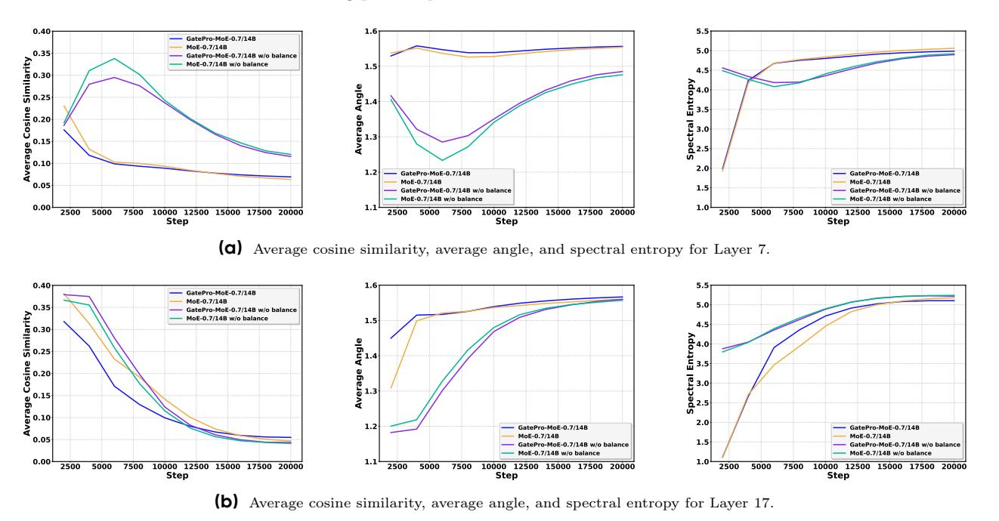

# **B** Hot-Swappable Training Analysis

To validate GatePro's "hot-swappable" deployment flexibility, we conducted experiments with different training phase configurations, where models transition between GatePro-MoE and MoE during training. Table 3 presents performance results across different switching schedules using the GatePro-MoE 0.7B/14B architecture with 256 experts.

| Training Configuration      | MMLU-Pro | MMLU | BBH  | GSM8K | MBPP |
|-----------------------------|----------|------|------|-------|------|
| 100B GatePro-MoE → 400B MoE | 28.7     | 61.4 | 43.0 | 40.9  | 43.1 |
| 200B GatePro-MoE → 300B MoE | 29.0     | 62.5 | 43.4 | 41.3  | 43.1 |
| 300B GatePro-MoE → 200B MoE | 29.7     | 63.1 | 43.8 | 41.6  | 44.7 |
| 400B GatePro-MoE → 100B MoE | 30.0     | 63.2 | 44.5 | 41.6  | 45.5 |
| 500B GatePro-MoE (Full)     | 30.1     | 63.4 | 44.2 | 42.0  | 44.9 |

**Table 3** Performance comparison across GatePro-MoE 0.7B/14B training schedules with 256 experts. Arrow notation indicates training phase transitions (e.g., "100B GatePro-MoE → 400B MoE" means training with GatePro for the first 100B tokens, then disabling GatePro and continuing training with standard MoE for the remaining 400B tokens).

The results reveal a clear trend: longer initial training with GatePro leads to progressively better final performance. The configuration with 400B tokens of GatePro training followed by 100B tokens of standard training achieves the best performance on BBH (44.5%) and MBPP (45.5%), while the full 500B GatePro training achieves the highest scores on MMLU-Pro (30.1%), MMLU (63.4%), and GSM8K (42.0%). This pattern suggests that GatePro's diversity benefits accumulate over training, with longer exposure to competitive propagation leading to better expert specialization.

These findings validate GatePro's practical value for real-world deployment scenarios. Organizations can strategically apply GatePro during computationally intensive early training phases to establish good expert diversity, then switch to standard training for resource efficiency without sacrificing performance gains. The parameter-free nature ensures that such transitions require no architectural modifications or hyperparameter retuning, making deployment decisions purely operational rather than technical.

The results demonstrate that GatePro's competitive propagation mechanism creates persistent improvements in expert utilization patterns that continue to benefit the model even after the mechanism is disabled. This "training legacy effect" makes GatePro particularly valuable for practitioners seeking to optimize training efficiency while maintaining model quality across different deployment constraints.

## **C Extended Gating Similarity Analysis**

In this section, we provide precise definitions of the evaluation metrics used in our analysis and present additional results from runs with 256 experts. These metrics are designed to capture different aspects of expert diversity and specialization within the mixture-of-experts layer. Formally, we define the following:

• **Average Cosine Similarity.** This metric measures the overall alignment between expert gating vectors. It is computed as the mean absolute cosine similarity across all pairs of experts:

Average cosine similarity := 
$$\frac{2}{N(N-1)} \sum_{1 \leq i < j \leq N} |S_{ij}|$$
.

Lower values indicate that experts tend to activate on different tokens, while higher values suggest stronger redundancy.

• **Average Angle.** Complementary to cosine similarity, we also compute the average angle between experts:

Average angle := 
$$\frac{2}{N(N-1)} \sum_{1 \le i < j \le N} \arccos(S_{ij}).$$

A larger average angle indicates greater orthogonality between expert behaviors, whereas smaller angles correspond to more overlapping activation patterns.

• **Spectral Entropy.** To capture the diversity of expert activations at a more global scale, we consider the entropy of the singular values of the similarity matrix S. Let σ1, σ2, . . . , σN denote the singular values. We normalize them by:

$$\tilde{\sigma}_i := \frac{\sigma_i + \epsilon}{\sum_{i \in [N]} \sigma_i + N \cdot \epsilon}, \qquad \epsilon = 10^{-8},$$

and define the entropy as

$$\text{Spectral entropy} \coloneqq -\sum_{i \in [N]} \tilde{\sigma}_i \log \tilde{\sigma}_i.$$

Intuitively, this metric reflects how evenly spread the similarity spectrum is: higher entropy implies more balanced expert specialization, while lower entropy suggests that only a few dominant modes exist.

For average cosine similarity and spectral entropy, larger values indicate that expert directions are more dispersed, which corresponds to better diversity. In contrast, for average angle, smaller values imply the same effect. Consistent with the patterns we observed earlier in Fig. 5, the 256-expert results in Fig. 7 highlight two key trends:

- Balanced expert utilization. GatePro achieves more uniform and equitable distribution of tokens across experts compared to the baseline, preventing collapse where only a few experts dominate.
- Sharp and concentrated similarity distribution. GatePro produces histograms with sharper peaks concentrated near zero similarity, whereas models trained without the balance loss exhibit skewed and unstable distributions, reflecting poor expert diversification.

**Figure 7** Expert gating similarity analysis for Seed-MoE with 256 experts. Metrics at Layer 7 and Layer 17. Each row shows four metrics: average cosine similarity, average angle, and spectral entropy.