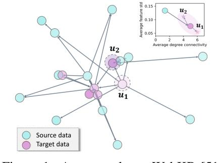
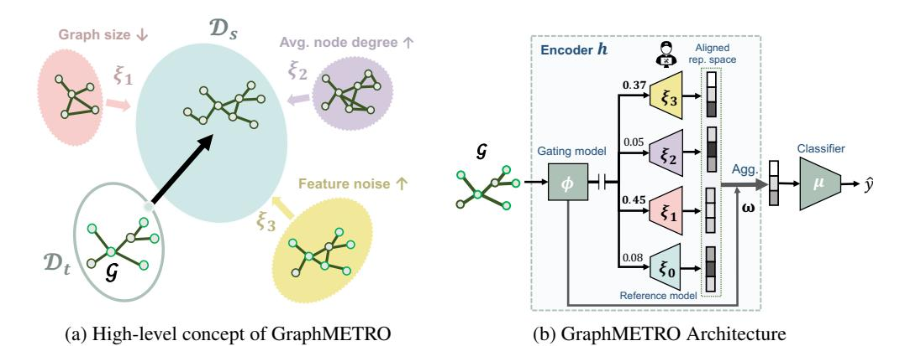

# 1 Introduction

The intricate nature of real-world graph data introduces a wide variety of distribution shifts and

heterogeneous graph variations [\[47,](#page-12-1) [30,](#page-11-1) [43,](#page-12-2) [26\]](#page-11-2). For instance, in a social graph, some user nodes can experience reduced activity and profile alterations, while other user nodes may see increased interactions. More broadly, such shifts go beyond the group-wise pattern and further contribute to the heterogeneous nature of graph data. In Figure [1,](#page-0-0) we provide a real-world example on a webpage network dataset, where, besides the general distribution shift from source to target distribution, two webpage nodes u1 and u2 in the target domain exhibit varying degrees of change in their content features. These inherent shifts and complexity accurately characterize the dynamics of real-world graph data, *e.g.,* social networks [\[2,](#page-10-0) [19\]](#page-11-3) and ecommerce graphs [\[76\]](#page-13-0).

Above the diverse graph variants, Graph Neural Networks (GNNs) [\[21,](#page-11-4) [25,](#page-11-5) [10\]](#page-10-1) have become a prevailing method for downstream graph tasks. Standard evaluation often

Figure 1: An example on WebKB [\[51,](#page-12-0) [20\]](#page-11-0). It illustrates (1) The distribution shift from source to target (the thick arrow in the upper right) and (2) Instance-wise heterogeneity in the target distribution (the thin arrows pointing to u1 and u2).

∗Equal Senior Authorship

Figure 2: Overview of GraphMETRO on graph classification tasks. (a) High-level Concept: As a simple example, the distribution shift from a target graph  $\mathcal{G} \in \mathcal{D}_t$  to a source distribution  $\mathcal{D}_s$  is decomposed along three shift dimensions: graph size  $(\xi_1)$ , node degree  $(\xi_2)$ , and feature noise  $(\xi_3)$ . Note that the shift components can be customized and expanded based on downstream tasks.

(b) Architecture: Given an input graph, the gating model  $\mu$  decomposes the instance-specific distribution shift into the contributions from the shift components. Then, each expert model  $\xi_i$  (i > 0) is tasked with generating referential invariant representations (cf. Section 3 for the definition) w.r.t. an assigned shift component.  $\xi_0$  is a reference model used for aligning the representation spaces of the expert models. The final representation is aggregated from the experts' output and is referentially invariant to any distribution shifts, which is then input to the classifier.

adopts random data splits for training and testing GNNs. However, it overlooks the complex distributional shifts naturally occurring in the real world. Moreover, compelling evidence shows that GNNs are extremely vulnerable to graph data shifts [79, 26, 20]. Thus, our goal is to build GNN models that generalize better to real-world data splits and graph dynamics described earlier.

Previous research on GNN generalization has mainly focused on two lines: (1) Data-augmentation training procedures that learn environment-robust predictors by augmenting the training data with the environment changes. For example, works have looked at distribution shifts related to graph size [49, 14], node features [26, 8, 27], and node degree or local structure [65, 39], assuming that the target data adhere to a designated shift type. (2) Learning environment-invariant representations or predictors either through inductive biases learned by the model [69, 67], through regularization [4, 32, 75], or a combination of both [72, 11, 80].

However, the real-world distribution shifts and graph dynamics are unknown. Specifically, the distribution shift could be any fusion of multiple shift dimensions, each characterized by unique statistical properties [26, 20, 50], which is rarely covered by single-dimension synthetic augmentation or fixed combinations of shift dimensions used in data augmentation approaches. Moreover, as seen in Figure 1, graph data may involve instance-wise heterogeneity, lacking stable properties from which invariant predictors can be learned [47, 30]. Here, the standard strategy of learning invariant predictors or representations must contend with a combinatorially large number of distribution shift variations. Thus, previous works may not be well-equipped to address this challenging task effectively.

Here we propose a novel and general framework, GraphMETRO. The key to our approach is to decompose any unknown shift into multiple shift components and learn predictors that can adapt to the graph heterogeneity observed in the target data. Figure 2a shows an example of our method on graph-level tasks, where the shift from the target graph data  $\mathcal{G} \in \mathcal{D}_t$  to the source distribution  $\mathcal{D}_s$  is decomposed into two strong shift components controlling feature noise and graph size, while the shift component controlling average node degree is identified as irrelevant. Specifically, the shift components are constructed such that each possesses unique statistical characteristics. Moreover, the contribution of each shift component to the shift is determined by an influence function that encodes the given graph  $\mathcal{G}$  and source distribution  $\mathcal{D}_s$ . This design enables breaking down the generalization problem into (1) inference on strong shift components and their contributions as surrogates for any distributional or heterogeneous shifts, and (2) mitigation toward the surrogate shifts, where the individual shift components are interpretable and more tractable.

For the first subproblem, we design a hierarchical architecture composed of a gating model and multiple expert models, inspired by the mixture-of-experts (MoE) architecture [\[24\]](#page-11-8). As shown in Figure [2b,](#page-1-0) the gating model takes any given node or graph data and identifies strong shift components that govern the localized distribution shift, while each expert model corresponds to an individual shift component. Second, to further mitigate surrogate distribution shifts, we train the expert models to generate referentially invariant representations with respect to their corresponding shift components, which are then aggregated as the final representation vector. Moreover, the expert outputs must align properly in a common representation space to prevent extreme divergence in the aggregated representation. Consequently, we design a novel objective to ensure a smooth training process. Finally, during the evaluation process, we integrate outputs from both the gating and expert models for final representations.

This process effectively generates invariant representations across complex distributional shifts. To highlight, our method achieves the best performance on four node- and graph-level tasks from the GOOD benchmark [\[20\]](#page-11-0), which involves a diverse set of natural distribution shifts such as user language shifts in gamer networks and university domain shifts in university webpage networks. GraphMETRO achieves a 67% relative improvement over the state-of-the-art on the WebKB dataset [\[51\]](#page-12-0). On synthetic datasets, our method outperforms Empirical Risk Minimization (ERM) by 4.6% on average. To the best of our knowledge, GraphMETRO is the first to explicitly target complex distribution shifts that resemble real-world settings.

The key benefits of GraphMETRO are as follows:

- A novel paradigm: GraphMETRO provides a new approach to aid GNN generalization by decomposing and mitigating complex distributional shifts via a mixture-of-experts architecture.
- Superior performance: It outperforms state-of-the-art methods on real-world datasets with natural splits and shifts, demonstrating promising generalization ability.
- Enhanced interpretability: GraphMETRO offers insights into the shift types of graph data by identifying and interpreting strong shift components.

