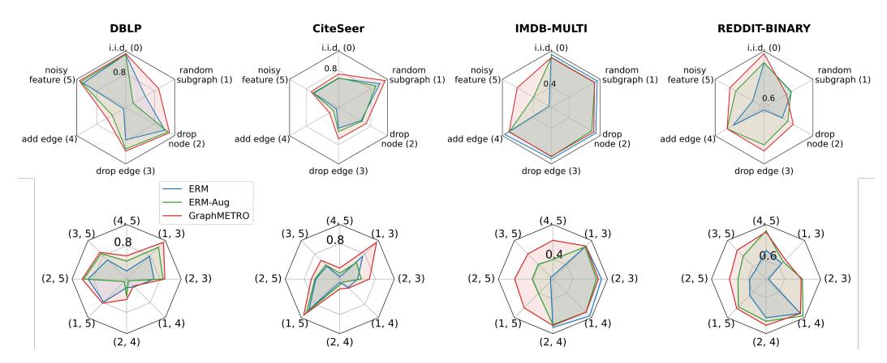
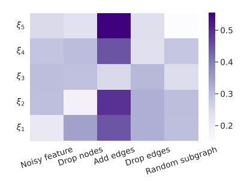
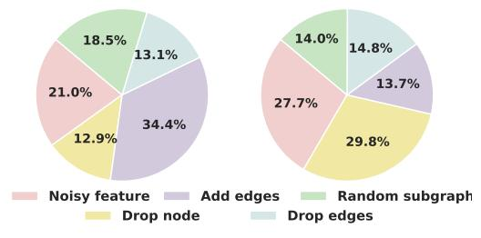

# 4 Experiments

We perform systematic experiments on both real-world (Section [4.1\)](#page-6-0) and synthetic datasets (Section [4.2\)](#page-7-0) to validate the generalizability of GraphMETRO under complex distribution shifts.

#### 4.1 Applying GraphMETRO to Real-world Datasets

We perform experiments on real-world datasets, which introduce complex and natural distribution shifts. In these scenarios, the test distribution may not precisely align with the mixture mechanism encountered during training.

Datasets. We use four classification datasets, *i.e.,* WebKB [\[51\]](#page-12-0), Twitch [\[55\]](#page-12-15), Twitter [\[78\]](#page-14-6), and GraphSST2 [\[78,](#page-14-6) [58\]](#page-13-15), using the dataset splits from the GOOD benchmark [\[20\]](#page-11-0), which exhibit various real-world covariate shifts. Specifically, WebKB is a 5-class prediction task that predicts the classes of university webpages, with nodes split based on different university domains, demonstrating a natural challenge of applying GNNs trained on some university data to other unseen data. Twitch is a binary classification task that predicts whether a user streams mature content, with nodes split mainly by user language domains. Twitter and GraphSST2 are real-world grammar tree graph datasets,

Figure 3: Accuracy on synthetic distribution shifts. The first row shows the testing accuracy on single shift components. We label the distribution by the clockwise order. The second row shows the testing accuracy on distribution shifts with multiple shift components, where each testing distribution is a composition of two different transformations. For example, *(1, 5)* denotes a testing distribution where each graph is controlled by *random subgraph (1)* and *noisy feature (5)* shift components. We include the numerical values in Appendix [E.](#page-20-1)

where graphs from different domains differ in sentence length and language style, posing a direct challenge of generalizing to different language lengths, styles, and contexts.[3](#page-7-1)

Baselines. We use ERM and domain generalization baselines, including DANN [\[17\]](#page-10-14), IRM [\[1\]](#page-10-6), VREx [\[28\]](#page-11-19), GroupDRO [\[56\]](#page-12-16), and Deep Coral [\[62\]](#page-13-16). Moreover, we compare GraphMETRO with robustness/generalization techniques for GNNs, including DIR [\[69\]](#page-13-2), OODGAT [\[59\]](#page-13-10), GSAT [\[45\]](#page-12-8), and CIGA [\[6\]](#page-10-7) for graph classification tasks, and SR-GCN [\[85\]](#page-14-4), EERM [\[67\]](#page-13-3), and G-Mixup [\[22\]](#page-11-14) for node classification tasks.

Training and evaluation. We use an individual GNN encoder for each expert in the experiments. Additionally, we include the results of using a shared module among experts in Appendix [D.1](#page-19-0) due to space limitations. For evaluation metrics, we use ROC-AUC on Twitch and classification accuracy on the other datasets following [\[20\]](#page-11-0). See Appendix [B](#page-17-0) for details about the architectures and optimizer.

Results. In Table [1,](#page-6-1) we observe that GraphMETRO consistently outperforms the baseline models across all datasets. It achieves notable improvements of 67.0% and 4.2% relative to EERM on the WebKB and Twitch datasets, respectively. When applied to graph classification tasks, Graph-METRO shows significant improvements, as the baseline methods exhibit similar performance levels. Importantly, GraphMETRO can be applied to both node- and graph-level tasks, whereas many graph-specific methods designed for generalization are limited to one of these tasks. Additionally, GraphMETRO does not require any domain-specific information during training.

Main Conclusion. The observation that GraphMETRO is the best-performing method demonstrates its significance for real-world applications, as it excels in handling unseen and wide-ranging distribution shifts. This adaptability is crucial, as real-world graph data often exhibit unpredictable shifts that can affect model performance. Thus, GraphMETRO ' versatility ensures its reliability across diverse domains, safeguarding performance in complex real-world scenarios. In Appendix [D.2](#page-19-1) and [D.3,](#page-20-2) we provide two studies on the impact of the alignment term controlled by λ and the stochastic transform function choices on the model performance, analyzing the sensitivity and success of GraphMETRO .

#### 4.2 Inspect GraphMETRO on Synthetic Datasets

Following the experiments on real-world datasets, we perform experiments on synthetic datasets to further inspect and validate the effectiveness of our approach.

3We specifically exclude datasets with synthetic shifts from the GOOD benchmark. We leave the applications to molecular datasets in the GOOD benchmark for future work, as it requires designing shift components based on expert knowledge.

(a) Invariance matrix on Twitter dataset

(b) **Mixture of distribution shifts** on WebKB (left) and Twitch (right) identified by GraphMETRO.

Figure 4: (a) Invariance matrix on the Twitter dataset. Lighter colors indicate a higher invariance of representations produced by each expert. Small values on the diagonal elements of the invariance matrix indicate that each expert excels at generating invariant representations *w.r.t.* the specific shift component. (b) Mixture of distribution shifts identified by GraphMETRO. Higher values indicate a strong shift component in the testing distribution.

**Datasets**. We use graph datasets from citation and social networks. For node classification tasks, we use DBLP [16] and CiteSeer [73]. For graph classification tasks, we use REDDIT-BINARY and IMDB-MULTI [46]. See Appendix B for dataset processing and details of the transform functions.

**Training and evaluation**. We adopt the same encoder architecture for Empirical Risk Minimization (ERM), ERM with data augmentation (ERM-Aug), and the expert models of GraphMETRO. For ERM-Aug training, we augment the training datasets using the same transform functions we used to construct the testing environments. Finally, we select the model based on the in-distribution validation accuracy and report the testing accuracy on each environment from five trials. See Appendix B for detailed settings and hyperparameters.

**Results.** Figure 3 illustrates our model's performance across single (the first row) and multiple (the second row) shift components. In most test distributions, GraphMETRO exhibits significant improvements or performs on par with two other methods. Notably, on the IMDB-MULTI dataset with noisy node features, GraphMETRO outperforms ERM-Aug by 5.9%, and it enhances performance on DBLP by 4.4% when dealing with random subgraph sampling. In some instances, GraphMETRO even demonstrates improved results on in-distribution datasets, such as a 2.9% and 2.0% boost on Reddit-BINARY and DBLP, respectively. This could be attributed to the increased model expressiveness of the MoE architecture or weak distribution shifts that can exist in the randomly split testing datasets.

