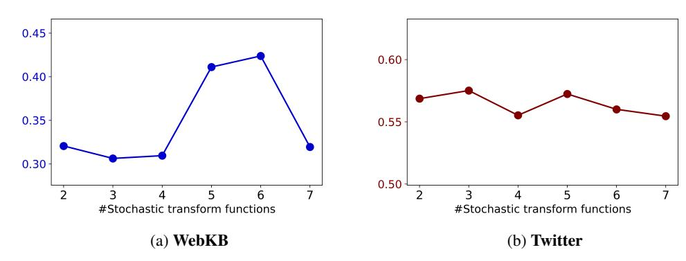

# D Ablation Studies

### <span id="page-19-2"></span><span id="page-19-0"></span>D.1 Design Choices of Expert Models

|                       | WebKB | Twitch | Twitter | SST2  |
|-----------------------|-------|--------|---------|-------|
| GraphMETRO (original) | 41.11 | 53.50  | 57.24   | 81.87 |
| GraphMETRO (w/o L1)   | 23.22 | 50.58  | 56.14   | 78.98 |
| GraphMETRO (Shared)   | 31.14 | 52.69  | 57.15   | 81.68 |

Table 4: Experiment results comparing different design choices for expert models. Results are averaged over five runs.

In the main paper, we discussed the trade-off between model expressiveness and memory utilization in expert model design. Here, we investigate a configuration where multiple experts share a GNN encoder but use individual MLPs to customize their output representations. Table [4](#page-19-2) presents the comparative results.

Our experiments show a performance decrease when sharing the GNN encoder, which we attribute to limitations in the expressiveness of the customized modules. This may hinder alignment with the reference model and reduce the experts' ability to remain invariant to specific shift components. The concept of "being invariant to all shifts" using a shared module seems insufficient in this case. Nevertheless, this configuration still outperforms baseline models from Table [1,](#page-6-1) thanks to the gating model's ability to selectively use relevant experts and the objective function's ability to generate invariant representations.

### <span id="page-19-1"></span>D.2 Alignment Design

When the alignment term is removed (λ = 0), performance drops significantly, especially for WebKB, where accuracy falls from 41.11 to 18.79. This suggests that without alignment, the expert models develop distinct representation spaces, which, when aggregated, lead to higher variance and

|                       | WebKB | Twitch | Twitter | SST2  |
|-----------------------|-------|--------|---------|-------|
| GraphMETRO (original) | 41.11 | 53.50  | 57.24   | 81.87 |
| GraphMETRO (λ = 0)    | 18.79 | 50.88  | 56.97   | 81.15 |

Table 5: Validating GraphMETRO design to align expert models with the reference model.

loss of useful information. The predictor heads, such as MLPs, struggle to process these mixed representations. The alignment mechanism is thus crucial for maintaining a coherent representation space, allowing the model to capture interactions more effectively and improving overall performance.

#### <span id="page-20-2"></span>D.3 Choice of Transform Functions

<span id="page-20-3"></span>

Figure 5: Impact of transform function choices on model performance. Each number of transform functions corresponds to a specific set of transformations.

We investigate how the choice and number of stochastic transform functions impact the performance of GraphMETRO , ranging from 2 to 7 functions. These functions are applied in the following sequential order:

```
[noisy_node_feat, add_edge, drop_edge, drop_node,
random_subgraph, drop_path, node_feat_shift]
```

We use the first n functions and their paired combinations (excluding trivial combinations like adding and dropping edges) during the training of GraphMETRO . Due to computational constraints, we do not explore all possible combinations of the n distinct functions but focus on specific sets of transformations.

Figure [5](#page-20-3) shows the results on the WebKB and Twitter datasets. A consistent trend emerges: increasing the number of stochastic transform functions generally leads to a decline in performance. For example, performance on WebKB drops from 42.4% to 31.9%. This decline can be attributed to: (1) some stochastic functions introducing noise unrelated to the target distribution shifts, and (2) the gating model's expressiveness being insufficient to handle a larger number of transformations, leading to noisier predictions.

