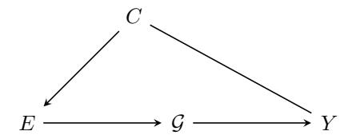

# A Theoretical Analysis

We provide a theoretical justification for why GraphMETRO can effectively address complex graph distribution shifts and outperform existing approaches. Our analysis focuses on three key aspects: (1) the limitations of existing methods, (2) how GraphMETRO overcomes these limitations, and (3) the theoretical guarantees of our approach.

### A.1 Limitations of Existing Approaches

Consider a graph classification task with the following causal model:

where G is the input graph, Y is the label, E is an unobserved environment variable, and C is an unobserved confounder.

Existing approaches primarily focus on learning environment-invariant predictors f(G) such that:

$$P(Y|f(\mathcal{G}), E = e) \approx P(Y|f(\mathcal{G})), \quad \forall e \in \mathbb{E}$$
 (4)

However, these methods face significant challenges when:

- The environment space E is vast and complex.
- The distribution shifts are heterogeneous across instances.
- The shifts involve multiple interacting components.

