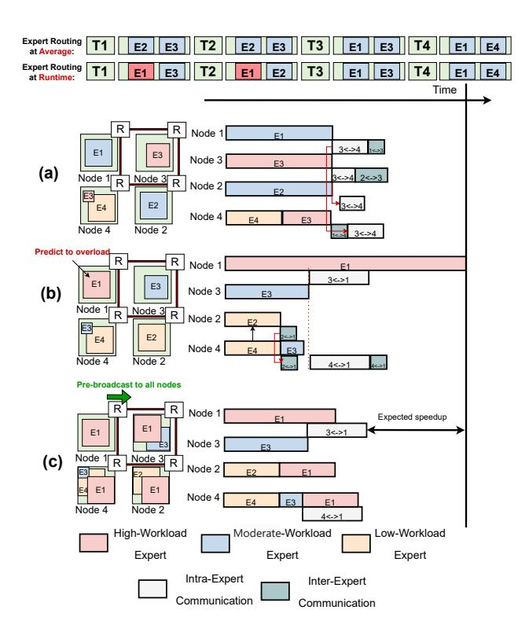

# A. Experimental Setup

- 1) Models: We evaluate the performance of our proposed approach using three MoE models: Mixtral-8x7B-Instruct [2] (mixtral), DeepSeek-V2-Lite-Chat [12] (deepseek) and Qwen2-57B-A14B-Instruct [25] (qwen). All the models are large-scale MoE architectures that benefit from expert parallelism and tensor parallelism, and they are deployed on 3D NMP architectures with different mesh sizes and hardware configurations. The key parameters for both models are summarized in Table IV.
- 2) Baselines: The baseline deployment strategies include Tensor Parallelism (TP), Expert Parallelism (EP), and a hybrid TP-EP approach with compute balance. In the hybrid strategy, the 2D mesh is divided into sub-regions—8 for deepseek and qwen, and 2 for mixtral. Each sub-region applies EP, with TP used internally to parallelize expert computation. Experts are appropriately assigned to sub-regions

Fig. 7: (a) Static deployment, (b) Computation load detection, (c) Pre-broadcast the expert with the highest load and dispatch tokens to appropriate nodes without inducing additional communication overhead.

TABLE IV: Model Parameters for mixtral, deepseek and qwen

| Parameter                   | mixtral | deepseek | qwen |
|-----------------------------|---------|----------|------|
| Number of Experts           | 8       | 64       | 64   |
| Experts per Token (Routing) | 2       | 6        | 8    |
| Number of Layers            | 32      | 27       | 28   |
| Hidden Size                 | 4096    | 2048     | 3584 |
| Intermediate Size           | 14336   | 1408     | 2560 |

to balance computation load, with each expert placed in only one sub-region. This strategy is widely used to mitigate load imbalance in large-scale systems.

3) Evaluation Metrics: We evaluate the performance of our approach and the baselines using the following metrics:

**Normalized TBT (Time-Between-Tokens):** The latency between tokens during inference divided by that latency in Tensor Parallelism.

**MoE Decomposed Latency:** The time taken to process a batch of tokens in MoE layers, including both computation and communication time.

- Computation Latency: The time spent on performing computations within each node.
- Communication Latency: The time spent on transferring data between nodes.
- 4) Dataset: We use the MT Bench dataset [28] for evaluation, which is a widely adopted benchmark for LLMs, designed to measure the performance of LLMs on various tasks.

*5) Offline Optimization:* The proposed Optimal Placement Strategy Searching process typically takes several hours for the entire procedure, which is acceptable as it only needs to be performed once.

