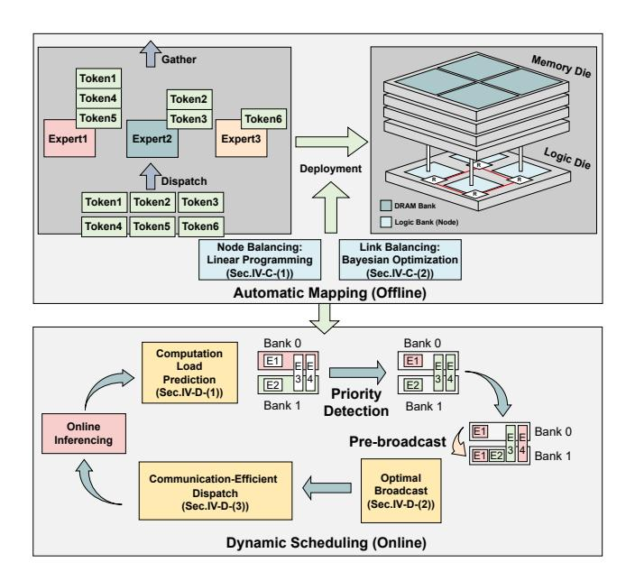
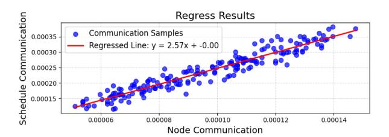
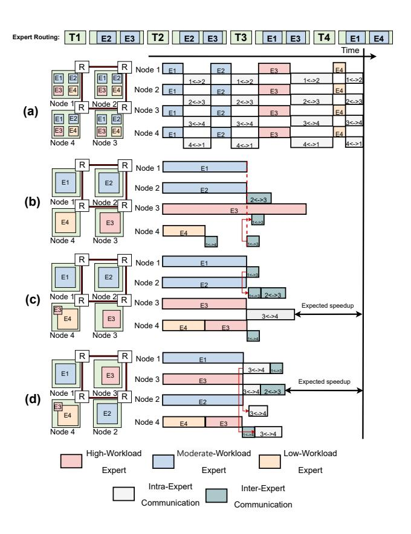

# A. Overview

Fig. 4 provides an overview of the HD-MoE framework, which consists of an offline mapping phase and an online inference phase. The offline phase involves automated hybrid expert mapping on 3D NMP with Node Balance (Sec. IV-C1) and Link Balance (Sec. IV-C2) optimization techniques. During online inference, dynamic scheduling is employed to predict computation load, prioritize experts (Sec. IV-D1), and pre-broadcast the expert with highest load (Sec. IV-D2),

Fig. 4: Overview of HD-MoE

ensuring efficient resource utilization without inducing additional communication overhead (Sec. IV-D3).

## B. Performance Analytical Model

We first build a performance analytical model to estimate the total inference cost, including computation and communication estimation.

1) Computation Overhead Modeling: The computation time  $t_{\rm comp}$  is determined by the maximum load across all computing nodes, reflecting expert utilization imbalance. For each node c, the load depends on the placement matrix  $P_{ic}$ , where  $P_{ic}$  denotes the proportion that expert i is assigned to node c. The explanation of other parameters is listed in the table II. The formula is defined as:

$$t_{\text{comp}} = \max_{c} \left\{ \frac{\sum_{i=0}^{E-1} P_{ic} f_i B \cdot 2h \cdot IS}{\text{comp}} \right\}$$
 (1)

Here,  $2h \cdot IS$  is the computation volume per token,  $f_iB$  denotes the number of tokens that activate expert i, and  $P_{ic}f_iB$  is the effective number of tokens that node c needs to process.

We emphasize that the variables  $P_{ic}$  are continuous rather than binary, allowing our hybrid placement strategy to partially distribute expert computation across multiple nodes (similar to Tensor Parallelism). This design improves deployment flexibility, alleviates hotspots, and enhances compute balance.

However, this introduces a trade-off with communication overhead. Splitting experts across nodes requires data transfers, which can increase both transfer volume and communication irregularity. Balancing computation load and communication overhead is crucial for optimal MoE performance on 3D PNM architectures.

2) Communication Overhead Modeling: We adopt a discrete-event simulation framework to model irregular all-to-all communications in 2D mesh architectures, extracting the total schedule time as communication overhead.

**Discrete-Event Simulation for Accurate Latency Estimation.** We build a discrete-event simulator to model the latency of irregular all-to-all communication in 2D mesh networks, which mainly consists of the following parts:

TABLE II: Explanation of Parameter Meanings.

| Parameter                 | Meaning                                     |  |  |
|---------------------------|---------------------------------------------|--|--|
| $t_{\rm comp}$            | Computation time                            |  |  |
| $t_{\rm comm}$            | Communication time                          |  |  |
| $\hat{t}_{\mathrm{comm}}$ | Linear Approximation for communication time |  |  |
| c                         | Index of computing nodes                    |  |  |
| $\overline{E}$            | Total number of experts                     |  |  |
| $\overline{e}$            | Number of experts activated per token       |  |  |
| $P_{ic}$                  | Proportion of expert i placed on node c     |  |  |
| $f_i$                     | Activation frequency of expert i            |  |  |
| B                         | Batch size                                  |  |  |
| h                         | Hidden dimension                            |  |  |
| IS                        | MoE intermediate size                       |  |  |
| D                         | Number of nodes                             |  |  |
| comp                      | Computational throughput of a node          |  |  |
| BW                        | NoC link bandwidth                          |  |  |
| G                         | Expert groups                               |  |  |
| $\overline{g}$            | Index of expert groups                      |  |  |
| $f_g$                     | Co-activation frequency of expert group $g$ |  |  |

- Communication Task Generation: For each token's activated expert group, we first map experts to their physical nodes (src) and identify a target node (dst) for aggregation (e.g., randomly choose a node that is activated by this token).
- XY Routing Path Calculation: We use a cached XY routing algorithm to generate minimal-hop paths (Manhattan distance) between source and destination nodes.
- Event Scheduling and Link Management: Communication tasks are split into chunks and scheduled in a priority queue. Transmission time is calculated based on available bandwidth and link occupancy. A link schedule dictionary tracks link availability, ensuring tasks are scheduled promptly and avoiding collisions.

**Linear Approximation for Optimization.** To enable efficient deployment optimization via linear programming (LP), we approximate the communication latency using a node-traffic model:

$$\hat{t}_{\text{comm}} = \frac{4}{\text{BW}} \max_{c} \left\{ \sum_{g \in G} \left( \prod_{i \in g} \lceil P_{ic} \rceil \right) f_g B h \right\}$$
 (2)

Here,  $\lceil P_{ic} \rceil$  indicates whether expert i is activated on node c, and  $\prod_{i \in g} \lceil P_{ic} \rceil$  checks if any expert in group g is placed on node c. If any expert in group g is placed, the data volume for transfer is  $4f_gBh$ , assuming FP32 representation. The total communication volume that node c needs to send is given by  $\sum_{g \in G} \left(\prod_{i \in g} \lceil P_{ic} \rceil\right) 4f_gBh$ .

We empirically validate the accuracy of the proposed linear approximation model. By comparing the estimated communication latency  $\hat{t}_{\text{comm}}$  with the latency values obtained from simulation  $t_{\text{comm}}$ , we observe a strong linear correlation between the two. The fitting results are shown in Fig. 5.

As a result, the relationship can be approximated as:

$$t_{\text{comm}} = \gamma \hat{t}_{\text{comm}} \tag{3}$$

where  $\gamma$  is a scaling coefficient determined through linear regression. Experimental results show that the coefficient of determination  $(R^2)$  consistently exceeds 0.9 across various scenarios, confirming the model's reliability in estimating communication overhead for LP.

In structured communication patterns like ring-based all-reduce [26], commonly used in TP training and inference, the communication algorithm is regular and deterministic. In such cases, total

Fig. 5: The fitting results illustrating the relationship between schedule-based communication mechanisms and node communication patterns ( $R^2 = 0.96$ ).

TABLE III: Comparison between the analytical modeling and ASTRA-sim-based simulation results for Ring-AllReduce.

| Latency | Bandwidth | Analytical Results | Simulation Results |
|---------|-----------|--------------------|--------------------|
| 0.1 us  | 25 Gb/s   | 673 us             | 668 us             |
| 5 us    | 25 Gb/s   | 751 us             | 879 us             |
| 0       | 20 Gb/s   | 671 us             | 692 us             |

communication time nearly equals per-node communication time due to the algorithm's balanced nature.

$$t_{\rm comm} \approx \hat{t}_{\rm comm} \approx \frac{4Bh}{\rm BW}$$
 (4)

This implies that  $\gamma=1$  for ring all-reduce, demonstrating that our linear communication model is not only accurate for irregular all-to-all traffic, but also directly applicable to structured communication paradigms such as tensor parallel all-reduce.

We validate our analytical model by comparing its results with the widely used distributed deep learning simulator ASTRA-sim [27] for the ring all-reduce operation. As shown in the table III, the latency predictions from the analytical model closely match the simulation results, demonstrating strong alignment between the two. This confirms that our analytical model provides a reliable estimate of latency and can be effectively used for performance prediction and optimization in similar distributed systems.

#### C. Optimal Placement Strategy Searching

We propose a two-stage **Node-Link Balance Co-optimization** strategy for efficiently deploying MoE models on 3D NMP architectures. The placement problem is divided into a logical optimization stage that balances computational load and reduces communication volume, and a physical mapping stage to minimize link-level congestion. This separation of logical workload and physical interconnects simplifies the placement problem, as detailed in the following stages.

1) Node Balance Optimization via Linear Programming: In the first stage of our co-optimization framework, we focus on balancing computational and communication workloads across logical compute clusters, abstracting away their physical topology. Given the large number of variables and the combinatorial nature of the expert placement problem, manual tuning becomes infeasible. Therefore, we adopt a linear programming (LP) formulation to enable automated and scalable optimization across diverse hardware configurations and inference scenarios. The LP model simultaneously considers computation bottlenecks and approximated communication costs using the linear estimator  $\hat{t}_{\text{comm}}$  derived earlier. The LP Optimization Problem is modeled as follows:

The notations of the LP formulation are defined in Table II. Among them, the continuous variables  $P_{ic} \in [0, 1]$  represent the proportion

of expert i's workload assigned to cluster c. The binary variables  $Z_{ic} \in \{0,1\}$  indicates whether expert i is active on cluster c.

Then we define some constraints to guarantee the legal mapping and efficiently search for the optimal allocation strategy.

$$Z_{ic} \ge P_{ic}, \quad \forall (i, c)$$
 (5)

$$\sum_{c} P_{ic} = 1, \quad \forall i$$
 (6)

$$t_{\text{comp}} \ge \frac{\sum_{i=0}^{E-1} P_{ic} f_i B \cdot 2h \cdot IS}{\text{comp}}, \quad \forall c$$
 (7)

$$t_{\text{comm}} \ge \frac{4Bh}{\text{BW}} \sum_{g \in G} f_g \left( \sum_{i \in g} Z_{ic} \right), \quad \forall c$$
 (8)

$$0 < \sum_{i}^{E-1} P_{ic} f_i \le \left(\frac{1}{R_{CC}} + 1\right) \frac{e}{D}, \quad \forall c$$
 (9)

$$R_{CC} = \frac{t_{\text{comp}}}{t_{\text{TP,comm}}} = \frac{BW \cdot IS \cdot e}{2D \cdot \text{comp}}$$
 (10)

Constraints 5 and 6 handle expert placement and workload assignment across nodes. Constraints 7 and 8 ensure balanced computation and communication times, minimizing bottlenecks.

Constraints 9 and 10 restrict node workload to avoid imbalance, with an upper bound set by the theoretical compute + communication time of TP inference. These constraints prune suboptimal placements early, reducing search space complexity and improving solver convergence without sacrificing optimality.

Finally, we can represent and minimize the node-level inference overhead, defined as a combination of computation time and communication time:

$$\min t_{\text{node\_overhead}}$$
 (11)

$$t_{\text{node\_overhead}} = t_{\text{comp}} + 2t_{\text{comm}} = t_{\text{comp}} + 2\gamma \hat{t}_{\text{comm}}$$
 (12)

Here,  $\gamma$  is the scaling coefficient empirically derived from simulation (Sec. IV-B2), and the factor 2 accounts for the cost of all-to-all dispatch and all-to-all gather, which constitute a pair of symmetric communication operations.

This LP formulation enables a globally coordinated placement strategy that balances computation and communication, providing a foundation for the second stage of physical mapping.

2) Link Balancing via Bayesian Optimization: In this stage, the logical clusters are mapped to physical nodes on the 2D mesh network. The objective here is to minimize link congestion and improve communication tail latency. We adopt Bayesian Optimization to search for low-congestion mapping strategies, as it is well-suited for problems with expensive evaluations and relatively smooth objective functions—e.g., swapping nearby clusters causes only minor changes in communication cost. This enables efficient exploration of the mapping space with minimal simulation overhead.

Figure 6 illustrates example placements under four parallelism strategies, highlighting the trade-offs between computation balance and communication overhead in MoE inference. MoE communication can be categorized into Intra-Expert Communication, where a single expert is split across nodes and requires result aggregation (as in Tensor Parallelism), and Inter-Expert Communication, where multiple experts activated by the same token need to exchange and aggregate results. In (a), TP achieves balanced computation by splitting all experts across nodes, but incurs heavy Intra-Expert communication as each token triggers all-reduce operations. In (b), EP avoids Intra-Expert communication, with only sparse Inter-Expert communication—e.g., between E1 (Expert 1) and E3 via Node 4. However,

Fig. 6: (a) TP: balanced computation but heavy communication; (b) EP: light communication but imbalanced computation, (c) Hybrid parallel with node balance: balanced computation but irregular communication; (d) Hybrid parallel with node-link balance: balanced computation and uncongested, regular communication.

tokens T1, T2, and T3 all activate E3, leading to overload on Node 3 and poor resource utilization. In (c), Node Balance optimization redistributes part of E3 to Node 4 to balance computation. Yet, this split introduces Intra-Expert communication between Nodes 3 and 4, causing link congestion along the  $3\rightarrow4$  path while leaving other links underutilized. In (d), Node-Link Balance adjusts the physical mapping (e.g., swapping Node 2 and Node 3), allowing the synchronization between Nodes 3 and 4 to be routed via  $3\rightarrow1\rightarrow4$  and  $3\rightarrow2\rightarrow4$ , which alleviates link congestion and achieves both balanced computation and regular, uncongested communication.

#### D. Dynamic Placement Strategy

We propose a runtime-adjustable deployment strategy for dynamic expert routing in MoE inference, consisting of three key components: congestion-aware expert prediction, cost-optimal broadcasting, and communication-efficient token routing.

1) Priority Detection and Computation Prediction: We leverage temporal locality in expert activations to predict computation hotspots in the next layer. For each expert i on node c, we define a priority score that estimates its future compute cost:

$$prio_{ic} = \frac{2P_{ic}\hat{f}_i \cdot IS}{comp} \tag{13}$$

Here,  $\hat{f}_i$  is the predicted activation frequency of expert i. The expert with the highest priority on the most congested node is selected for

pre-broadcast, repeating this process for a limited number of iterations based on the previous layer's inference latency.

- 2) Optimal Broadcast Chunk Size: Broadcasting an expert involves splitting it into chunks of size c, with the following trade-offs:
  - Larger chunks reduce hops, lowering latency.
  - Smaller chunks reduce per-hop traffic but increase transmission delays.

The traditional  $\alpha$ - $\beta$  communication model can clearly describe this kind of trade-off:

$$latency = \alpha (2\sqrt{D} + \frac{h \cdot IS}{c})$$
 (14)

$$bandwidth = \beta(h \cdot IS + 2c\sqrt{D})$$
 (15)

$$t_{\text{pre b}} = \text{latency} + \text{bandwidth}$$
 (16)

Here, k is the number of pre-broadcast iterations allowed within the runtime window. The model yields a lower bound:

$$t_{\text{pre\_b}} \ge h \cdot IS \cdot \beta k + 2\alpha \sqrt{D} + 2\sqrt{2\sqrt{D}\beta k\alpha h \cdot IS}$$
 (17)

This bound is tight when the chunk size c is selected optimally as:

$$c = \sqrt{\frac{\alpha h \cdot IS}{2\beta k \sqrt{D}}} \tag{18}$$

This provides a solution for the most efficient pre-broadcast under a given runtime window constraint.

3) Communication-Efficient Dispatch: After expert broadcasting, each token can be routed to any node holding a copy of its activated experts. To avoid incurring additional communication overhead, we restrict the routing candidates to nodes where the routed experts are already present. Among these candidates, the token is dispatched to the node with the lowest current compute load, minimizing workload imbalance without introducing extra data movement.

An example of dynamic expert scheduling is illustrated in Fig. 7. Subfigure (a) shows the static deployment from Fig. 6, which performs efficiently under averaged expert activation patterns. However, during real inference, as shown in (b), expert activation becomes highly skewed—Expert 1 (E1) turns into a bottleneck due to concentrated token routing. Our priority detection mechanism can anticipate such overload at runtime, identifying E1 as a high-demand expert in advance. As shown in (c), E1 is then **pre-broadcast** to all nodes before execution. Tokens such as T2 and T4 are routed to Node 2 and Node 4 respectively, both holding E1, thus avoiding additional Inter-Expert communication. This not only balances the computation load but also improves communication efficiency.

## V. EXPERIMENTAL RESULTS

