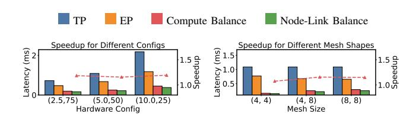
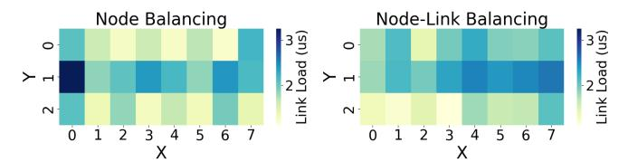
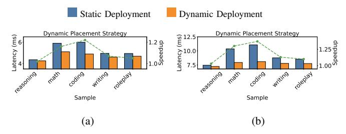

# *C. Ablation Study*

We further conduct an ablation study focused on the contribution of the Node Balance, Link Balance, and Dynamic scheduling optimization for deepseek.

*1) Node Balancing:* We first evaluate the effect of the Node Balance stage in Fig. [10.](#page-7-2) It achieves 1.0× to 3.0× speedup over TP and EP, and 1.5× over Hybrid TP-EP across various configurations, by improving compute load balance (vs. EP) and reducing communication volume (vs. TP and hybrid).

Better computation latency: Next, we specifically examine Node Balance's effect on compute imbalance in EP, by measuring its impact on computation latency within MoE layers As shown in Fig. [11,](#page-7-3) on average, Node Balance reduces EP's compute tail latency by 2.0×, confirming its effectiveness in mitigating the routing skew commonly observed in MoE models.

Better load balance: Fig. [12](#page-7-4) shows per-node compute and communication load before and after applying Node Balance. The optimized placement achieves noticeably better load balance than standard EP, which often exhibits severe hotspots.

*2) Link Balancing:* We further evaluate the contribution of the Link Balance stage by isolating its impact on communication latency in Fig. [13.](#page-7-5) Specifically, we compare against three baselines: TP, Hybrid TP-EP with Compute-Balanced, and the Node Balance without physical mapping optimization.

Better communication latency: Thanks to the Bayesian Optimization–based mapping strategy, Link Balance produces more communication-friendly mappings by assigning logical clusters to physical nodes in a topology-aware manner. This significantly reduces link congestion and results in lower communication latency than TP and hybrid baselines, which rely on regular but heavy communication.

Compared to the Node Balance–only deployment, Link Balance can also achieve an average 1.2× reduction in communication latency, highlighting the importance of mapping logical clusters to physical nodes with awareness of network structure.

Less link congestion: Fig. [14](#page-7-6) visualizes NoC link utilization using heatmaps. Compared to the Node Balance stage, the optimized placement after Link Balance leads to visibly more balanced linklevel traffic, with less link congestion and better distribution across the mesh.

*3) Dynamic Placement Strategy:* To assess the impact of the Dynamic Placement Strategy, we compare the performance of static and dynamic expert placement strategies. In these experiments, we sample multiple expert routing traces in various types of questions from the MT Bench dataset, focusing on tasks with varying expert activation patterns. We compare the latency and speedup between static (generating from reasoning questions) and dynamic strategies under two different hardware configurations and broadcasting settings:

Hardware Configuration: (5 TFLOPS, 50 GB/s bandwidth) with 512 batch size, which has enough time to pre-broadcast 2 experts per layer, the results are shown in Fig. [15\(](#page-7-7)a).

Hardware Configuration: (2.5 TFLOPS, 75 GB/s bandwidth) with 512 batch size, which has enough time to pre-broadcast 5 experts per layer, the results are shown in Fig. [15\(](#page-7-7)b).

Better performance in various scenarios: The results are shown in Fig. [15,](#page-7-7) which indicates that the Dynamic Placement Strategy provides significant speedups and maintains relatively stable inference latency across a variety of real-time inference scenarios. Notably, for tasks such as math and coding problems, which have huge differences from reasoning, the dynamic approach significantly reduces MoE layer latency compared to static deployments. Specifically, when broadcasting 2 experts per layer, the average speedup achieved by the dynamic strategy is 1.15×, and when broadcasting 5 experts per layer, the average speedup increases to 1.25×.

These results highlight the effectiveness of dynamic expert scheduling in reducing latency by adapting to inference-time workload and

Fig. 8: End-to-end Speedup for Different Hardware Configurations

Fig. 9: End-to-end Speedup for Different Mesh Shapes

Fig. 10: Node Balancing Speedup for DeepSeekMoE

Fig. 11: Node Balancing Speedup in Computation for DeepSeekMoE

Fig. 12: Visualization of Node-Level Resource Utilization With and Without Node Balance Optimization

Fig. 13: Link Balancing Speedup for DeepSeekMoE

Fig. 14: Visualization of Link-Level Resource Utilization With and Without Link Balance Optimization

Fig. 15: Latency and Speedup Comparison Between Static and Dynamic Placement Strategies Under Varying Inference Scenarios. (a) Pre-broadcast 2 experts, (b) Pre-broadcast 5 experts.

## VI. CONCLUSION

This paper presents **HD-MoE**, an offline **Automatic Hybrid Parallelism** strategy, combined with online **Dynamic Scheduling**, for efficiently deploying MoE models on 3D NMP architectures. By integrating Node Balance, Link Balance, and Dynamic Placement, our approach effectively reduces computation and communication latency in MoE layers, improving both load balancing and resource utilization. Experimental results show that our method outperforms baseline strategies, achieving a speedup ranging from  $1.1 \times$  to  $1.8 \times$  over TP and  $1.1 \times$  to  $1.5 \times$  over EP. These findings demonstrate the value of optimizing expert placement and dynamic scheduling for MoE deployment on NMP architectures.

improving both computation and communication efficiency.

