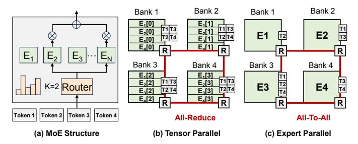

# I. INTRODUCTION

Mixture-of-Experts (MoE) has become a widely adopted architecture for Large Language Models (LLMs) [\[1,](#page-8-0) [2\]](#page-8-1). By selectively activating only a small subset of experts, MoE significantly reduces the computational demands while maintaining model capacity. However, the sparse activation mechanism exacerbates the memorybound problem, particularly on edge devices with limited memory bandwidth and small batch sizes.

The recent emerging 3D Near-Memory Processing (NMP) architectures seem to be a promising solution for memory-bound problems [\[3,](#page-8-2) [4\]](#page-8-3). 3D NMP vertically stacks DRAM dies directly on top of logic dies using high-bandwidth interconnects. In contrast to conventional von Neumann architectures, the vertical stacking of 3D NMP allows multiple memory banks to be accessed independently and in parallel, enabling fine-grained, high-throughput data access. This makes 3D NMP particularly suitable for MoE inference workloads.

This work was supported in part by NSFC under Grant 62495102 and Grant 92464104, in part by the National Key Research and Development Program under Grant 2024YFB4505004, in part by Beijing Municipal Science and Technology Program under Grant Z241100004224015, and in part by 111 Project under Grant B18001.

†Equal Contribution ∗Corresponding author: meng.li@pku.edu.cn

While MoE's bandwidth efficiency makes it suitable for 3D NMP deployment, the architectural shift from GPU-style shared memory to distributed NoC-based designs introduces new mapping challenges. The distributed nature of 3D NMP, with its bank-local memory organization, requires careful co-design of expert parallelism and communication routing strategies to maintain performance. As illustrated in Figure [1,](#page-1-0) current approaches employ either Tensor Parallelism [\[5\]](#page-8-4) (TP) or Expert Parallelism [\[6\]](#page-8-5) (EP): TP distributes each expert's parameter tensor across banks while EP assigns complete experts to different banks. This presents a fundamental trade-off: TP achieves better workload balance but incurs substantial all-reduce communication overhead, whereas EP minimizes communication but suffers from workload imbalance due to varying expert utilization.

Previous works on GPU clusters have explored combining EP with replication of frequently activated experts to achieve both workload balance and low communication overhead. This method has been adopted by DeepSeek-AI to deploy its DeepSeek-R1 model [\[1\]](#page-8-0). However, this approach is impractical for 3D NMP due to its limited memory capacity. Furthermore, the dynamic and imbalanced nature of expert activation patterns significantly complicates mapping and scheduling decisions, requiring more sophisticated optimization strategies tailored to the constraints of 3D NMP architectures.

To address the challenge of dynamic expert activation, several studies focusing on offloading scenarios have investigated dynamic scheduling of experts [\[7](#page-8-6)[–10\]](#page-8-7). In these scenarios, experts are stored in secondary storage, with on-demand loading becoming the primary bottleneck. These studies demonstrate that MoE models often exhibit high activation similarity between adjacent layers, which can be exploited for prefetching to alleviate the on-demand loading overhead.

In light of these challenges and opportunities, we propose HD-MoE, a hybrid and dynamic parallelism framework designed for MoE inference on 3D NMP architectures. Reducing latency on distributed systems requires both balancing computation utilization and minimizing communication cost, while also addressing memory limitations. To achieve this, HD-MoE adopts a hybrid parallelism approach, as illustrated in Figure [1\(](#page-1-0)c). Experts with low activation frequency are mapped using Expert Parallelism to minimize communication overhead, while high-frequency experts utilize Tensor Parallelism to maximize computational resource utilization. Additionally, HD-MoE incorporates an online dynamic expert placement strategy to mitigate the impact of the dynamic activation pattern. The related codes can be accessed at [https://github.com/angerybob/HD-MoE.](https://github.com/angerybob/HD-MoE)

The key contributions of HD-MoE are summarized as follows:

• Performance Analytical Model. We develop a unified per-

Fig. 1: Expert Deployment and Computation Timeline in (a) Tensor Parallel, (b) Expert Parallel, and (c) Hybrid parallel.

Fig. 2: MoE structure and two parallel strategies

formance analysis framework applicable to diverse hardware configurations and parallelism strategies.

- Automated Hybrid Parallelism. We propose an efficient placement strategy searching method that combines TP and EP to optimize computation and communication overheads.
- Dynamic Placement. We introduce a dynamic expert placement strategy, which adjusts expert deployment in real-time based on the inference workload, ensuring optimal performance even in different inference scenarios.
- We conduct extensive experiments to validate our approach, demonstrating significant improvements in both TBT latency and speedup compared to baseline methods.

#### II. BACKGROUND

