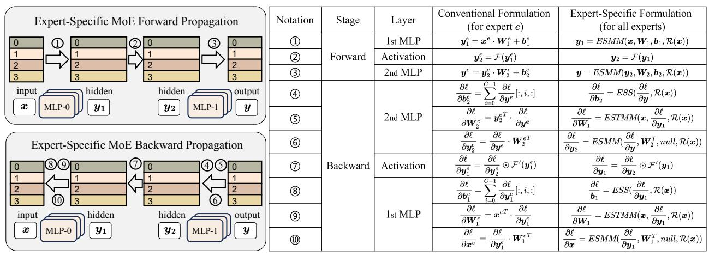
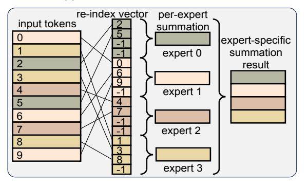
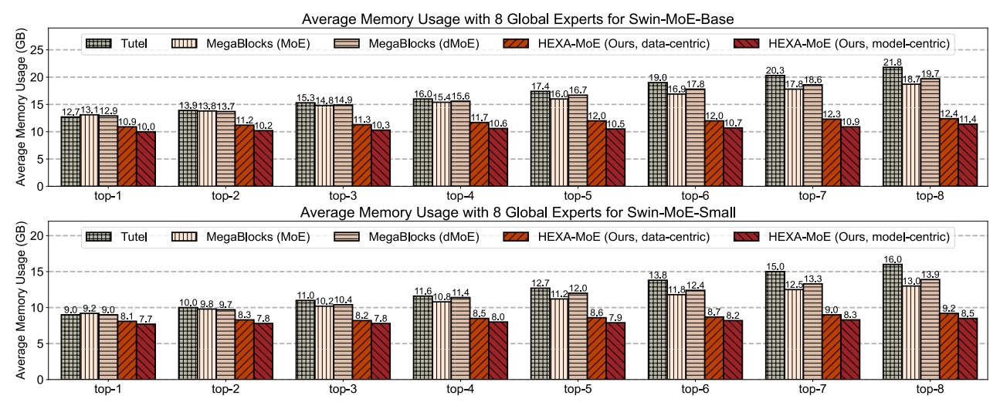
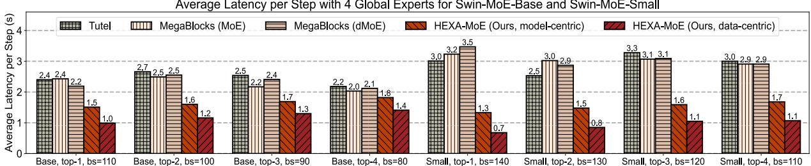
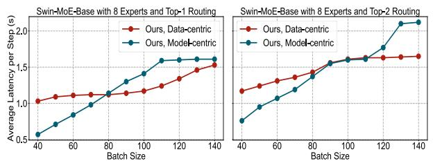

# 2. Related Works

Scaling Transformers with MoE. Transformer models can be scaled up via the Mixture-of-Experts (MoE) for better learning capacity and generalization while enjoying a sublinear increase in computation overhead due to its sparsity. It has been proven in many research fields such as natural language processing [\(Fedus et al.,](#page-8-12) [2022;](#page-8-12) [Jiang et al.,](#page-8-5) [2024;](#page-8-5) [Du et al.,](#page-8-13) [2022\)](#page-8-13), machine vision [\(Riquelme et al.,](#page-9-3) [2021;](#page-9-3) [Fan](#page-8-14) [et al.,](#page-8-14) [2022\)](#page-8-14) and multi-modal learning [\(Bao et al.,](#page-8-15) [2022\)](#page-8-15).

Open-Source MoE Training Libraries. FastMoE [\(He](#page-8-16) [et al.,](#page-8-16) [2021\)](#page-8-16) pioneered the first PyTorch open-source implementation for distributed MoE. Based on it, Faster-MoE [\(He et al.,](#page-8-9) [2022a\)](#page-8-9) proposes dynamic shadowing and smart scheduling to tackle load imbalance and improve parallelism. Tutel [\(Hwang et al.,](#page-8-7) [2023\)](#page-8-7) implements switchable parallelism and dynamic pipelining, improving adaptability and scalability. MegaBlocks [\(Gale et al.,](#page-8-8) [2023\)](#page-8-8) proposes block-sparse operations and corresponding GPU kernels to mitigate dynamic routing issues in MoEs.

Improving efficiency for MoE computing. MoE computing faces significant challenges in communication and memory. Recent research has explored alleviating them from various perspectives: Lina [\(Li et al.,](#page-8-10) [2023\)](#page-8-10) proposes to dynamically schedule resources to reduce latency and tackle the all-to-all bottleneck. Janus [\(Liu et al.,](#page-8-11) [2023\)](#page-8-11) proposes a data-centric paradigm that replaces traditional all-to-all communication with asynchronous expert fetching, enabling overlapped communication and computation for enhanced

Figure 2. Comparison between conventional and expert-specific formulation for MoE computing. We take top-1 routing for illustration and present the corresponding relation of each formula in the MoE forward and backward propagation.

parallelism. ScheMoE (Shi et al., 2024) proposes a generic scheduling framework for optimal communication and computation scheduling during MoE training. MPMoE (Zhang et al., 2024) accelerates MoE training through adaptive and memory-efficient pipeline parallelism. SmartMoE (Zhai et al., 2023) proposes an efficient searching algorithm to identify optimization opportunities within an expanded hybrid parallelism space, tailored for data-sensitive MoE models. PipeMoE (Shi et al., 2023) adaptively pipelines communications and computations in MoE to mask communication latency. It also provides an optimal strategy to determine pipeline degree to minimize overall iteration time.

**Principles of GPU Acceleration** Modern GPUs provide massive threads for parallel execution, grouped into *thread-blocks*, and executed on streaming multiprocessors (SMs). GPUs have a memory hierarchy, outlined as large but slow-accessed high bandwidth memory (HBM), and small but faster-accessed shared memory (SRAM). Matrix multiplication is optimized on GPU with *tiling*, *i.e.*, partitioning the output matrix into small 2D blocks, where each block is computed by a *thread-block* in parallel. The size of individual blocks can be adjusted to improve runtime performance.

#### 3. Method

We first formulate the forward and backward propagation for a single MoE layer with GeMM and expert-specific operators respectively (Sec. 3.1), which deliver exact results in different manner. After that, we expound the details for our specialized kernel (Sec. 3.2), where a novel expert-specific fused operator is introduced for parallel MoE backward pass. These empower HEXA-MoE with high computational efficiency. Next, we consider different workload scales, and adapt HEXA-MoE efficiently to both *data*- and *model*-centric settings (Sec. 3.3). Finally, we adapt HEXA-MoE to heterogeneous devices, and provide an expert allocation approach to minimize the average latency so as to utilize better heterogeneous computing capacities (Sec. 3.4).

#### 3.1. MoE Computing Formulation

**MoE Computing with GeMM.** To employ GeMM for expert computing, we need to calibrate the amount of dispatched tokens for each expert via token padding or discarding. Taking top-1 routing as an example, we formulate the forward and backward propagation in Figure 2, denoting  $\ell$  as loss value and  $\boldsymbol{x}^e$  as the  $N_e$  tokens dispatched to expert e. In backward propagation, the gradients of the output have been provided by the auto-differentiation program.

Based on dispatch and combine, all variables can be derived via basic matrix operations such as summation and multiplication. Although we can utilize the high-performance GeMM interface, these operations are memory inefficient, since the workload of each expert varies dynamically in each step, and token padding or discarding has to be employed to construct new mini-batches for local experts. It can be overcome by our expert-specific design.

MoE Computing with Expert-Specific Operators. Based on the above formulations, we propose to refactor the MoE workflow in an in-place manner to address the teaser of inefficiency and dynamic. Specifically, we find that the forward and backward propagation of a single MoE layer can be reformulated with 3 basic specialized operators from an expert-specific perspective, namely *expert-specific* operators. We take top-1 routing for illustration, while formulations for top-k routing are provided in Appendix B.

- **©** Expert-specific matrix multiplication (ESMM): Given input x with N tokens, routing choice  $\mathcal{R}(x)$ , weight W and bias b, the output  $y = ESMM(x, W, b, \mathcal{R}(x))$ , where  $y_i$  is derived from  $x_i$ ,  $W_{\mathcal{R}(x_i)}$  and  $b_{\mathcal{R}(x_i)}$ .
- **Expert-specific summation** (ESS): Given input x with N tokens and routing choice  $\mathcal{R}(x)$ , the output  $y = ESS(x, \mathcal{R}(x))$ , where tokens routed to expert e are added up and recorded in y[e].
- **8** Expert-specific transposed matrix multiplication (*ESTMM*): the inputs include  $x_1$  and  $x_2$ , both with N

(a) Re-Index Vector Construction

(b) Expert-Specific Matrix Multiplication

(c) Expert-Specific Summation (d) Expert-Specific Transposed Matrix Multiplication Figure 3. Illustration of the proposed operators. We take 10 tokens, 4 global experts, and tiling size 4 as an example. For ESTMM, the 2 input batches are in a re-indexed format, while for others both the raw batch and re-index vector are provided.

tokens, and the routing choice  $\mathcal{R}(\boldsymbol{x})$ . Both  $\boldsymbol{x}_1$  and  $\boldsymbol{x}_2$  are the ESMM result of  $\boldsymbol{x}$ , thus sharing the same routing choice. The output  $\boldsymbol{y} = ESTMM(\boldsymbol{x}_1, \boldsymbol{x}_2, \mathcal{R}(\boldsymbol{x}))$ . For the i-th channel of  $\boldsymbol{x}_1$  and j-th channel of  $\boldsymbol{x}_2$ , we first prepare a zero vector  $\boldsymbol{c}$  with E elements, and accumulate  $\boldsymbol{x}_1[m,i] \cdot \boldsymbol{x}_2[m,j]$  to  $\boldsymbol{c}[\mathcal{R}(\boldsymbol{x}_m)]$  for all  $0 \leq m < N$ . After that we assign  $\boldsymbol{c}[k]$  to  $\boldsymbol{y}[k,i,j]$  for all  $0 \leq k < E$ .

Based on these *expert-specific* operators, we can now implement MoE computing in a novel in-place manner, as formulated in Figure 2. We compare each stage between our method and conventional formulation, and the output of each token is ensured to be consistent for both cases. In forward pass, *ESMM* serves as an alternative to GeMM, while in backward pass, the gradient of *y* is also provided by the auto-differentiation program. *ESS* performs as an alternative to tensor summation, while *ESMM* and *ESTMM* are designed as 2 specialized cases for matrix multiplication from the expert-specific perspective. The expert-specific design enables HEXA-MoE to be a completely static framework at runtime, introducing almost no redundant FLOPs.

### 3.2. Optimized CUDA Implementations

**Re-Index based Expert-Specific Operators.** To implement tiled matrix multiplication for the expert-specific operators, the HBM I/O should be re-directed, since naively implement them cannot fully utilize GPU locality as well as tensor cores, which restricts runtime performance. In

HEXA-MoE, we introduce re-index vector as I/O guidance, illustrated in Figure 3(a). Specifically, we re-organize the order of token indices based on the routing choice, *i.e.*, gathering the token indices routed to the same expert into a sub-vector, and padding it with -1 to make it divisible by the tiling size. Algorithm details are provided in Appendix B.

For ESMM, we illustrate it in Figure 3(b), where a threadblock first loads a sub-vector, followed by input tokens based on the vector values, as well as the corresponding expert parameters. Since the loaded tokens are routed to the same expert, we only need to load weights for one expert. We then accumulate the dot product results along the dimension of the input feature, and write the result back to HBM guided by the sub-vector. For ESS, we illustrate it in Figure 3(c), where each *thread-block* is assigned with certain channels of one expert, with tokens specialized by the sub-vectors for that expert. After accumulating all the assigned tokens, it writes the result back to HBM. For ESTMM, we illustrate it in Figure 3(d), where input batches are presented in a re-indexed manner. The two inputs here are the ESMM results of the same tensor, sharing the same re-index vector. Each thread block loads certain channels of both inputs for tokens routed to the same expert. The cumulative dot production result is write back to the corresponding area on HBM after computing. More algorithm details of this section are provided in Appendix B.

(b) Pipeline-shared cache before and after all gather. Figure 4. Visualization of the training pipeline and shared

cache in data-centric setting. Each device copies the kept parameter shard to the cache before all gather communication, and after that it can access the whole parameters of an MoE layer.

Memory Optimization for Top-k Routing. We find that when extending the routing policy from top-1 to top-k, the memory footprint would increase significantly. To tackle it, we only enlarge the memory allocation for the intermediate tokens to k times. The input and output tensors (and their gradients) are the cumulation of k *ESMM* results, which can either be implemented in serial, or employ the atomic add interface[1](#page-4-1) , which lead to similar runtime.

Fused Kernel in Backward Propagation. For a single layer MLP y = x · W + b, the gradients for x, W and b can be computed in parallel. Similarly, we can integrate *ESS*, *ESTMM*, and *ESMM* together into one kernel, namely expert-specific fused kernel (*ESFK*) for enhanced parallelism. However, directly integrating them is difficult, since the shape of *thread-block*s and the implementation details for each operator vary a lot. To this end, we set the shape of *thread-block* for each operator to be the same, and expand one dimension for *ESMM* and *ESS* so that the thread grids are all 3-dimensional. Taking a single FFN layer under top-1 routing as an example, where we present the shape of allocated thread block and thread grid for both forward and backward propagation in Table [6](#page-14-0) in Appendix [C.](#page-13-0) By shape transposing or dim expanding for individual *thread-block*s, we can align the 1st and 2nd dim while aggregate the 3rd dim for an integrated *thread-grid*. In this way, the backward pass for an MoE layer can be implemented with only 2 fused kernels and an element-wise dot production.

1 Some data types may not be supported for atomic add on NVIDIA GPUs. We initialize the output tensor with float32, and transform it to the target type after computing.

#### 3.3. Parallel Strategy for Different Workload Scale

Data Parallelism for Data-Centric Setting. Data-centric is a practical and efficient approach for training deep neural network models with heavy workloads. HEXA-MoE distributes MoE parameters to different devices based on the partition of FFN intermediate size, namely tensor parallelism. In data-centric setting, each device gathers the whole MoE parameters of one layer from other devices, and computes locally, similar to data parallelism. Although data-centric MoE training has been explored by Janus [\(Liu](#page-8-11) [et al.,](#page-8-11) [2023\)](#page-8-11), the teaser of memory efficiency has not been fully tackled. Janus pre-fetchs the required MoE parameters for each layer progressively in forward pass, and preserves all of them locally for backward pass so that no communication would be required in backward. However, the sheer size of MoE parameters can lead to a significant increase in memory usage, making it inefficient for deployment.

To tackle this issue, we propose to allocate an additional region on HBM of each GPU to dynamically cache the gathered MoE shards for each pipeline stage, named as pipeline-shared cache. Since each device keeps a subset of the FFN intermediate size for all experts in each layer, we employ all gather communication among devices before computing for an MoE layer, preparing for the required full parameters in both forward and backward pass, as illustrated in Figure [4\(a\)](#page-4-2) and [4\(b\).](#page-4-3) For better parallelism, all gather communication can be overlapped with other operations such as attention and router, as shown in Figure [4\(a\).](#page-4-2) In this way, each device would not have to preserve the full MoE parameters for backward pass, while communication overhead can also be overlapped, therefore both memory efficiency and computing efficiency can be achieved.

Tensor Parallelism for Model-Centric Setting. For small scale of workload less than model parameters, modelcentric configuration turns out to be more efficient than data-centric. To distribute MoE parameters on multiple devices, we modify the classical tensor parallelism with our proposed expert-specific operators. All gather communication is employed to synchronize local data batches before and after each MoE layer. We also distribute each MoE layer among different devices along the FFN intermediate size for each expert, and during MoE computing, each device computes the all gathered data batches with only the local MoE parameter chunk using *ESMM*, after that the output tokens are all reduced with sum operation in forward pass. During backward propagation, all gather and all reduce communications are interchanged, while *ESMM* are replaced by *ESMM*, *ESS*, and *ESTMM* to get the gradients for input tokens, bias, and weights, respectively, which can also be replaced by the fused operator *ESFK*.

Figure 5. Average memory usage for training Swin-Transformer-MoE models. We take 8 global experts and examine all cases from top-1 to top-8 routings. Experiments are conducted on 2 homogeneous GPUs using automatic mixed precision in PyTorch. The batch size is set to 40 for all cases. We record the average GPU memory consumption (GB) on each device.

#### 3.4. Heterogeneous-aware Expert Allocation

Workload Division for different configurations. For data-centric, the workload mainly depends on local batch size, as it can be essentially viewed as data parallelism. For model-centric, the workload of each device mainly depends on the allocated sub-dimension of FFN intermediate size for each expert, as expert-specific operators enable the implementation of tensor parallelism.

#### Practical Expert Allocation on Heterogeneous Devices.

We propose a specialized expert allocation approach to utilize heterogeneous computing resources, by adjusting the workload of each device. Specifically, we have to first examine the computing capacity of each device by averaging its latency on a benchmark task with heavy computing, such as large matrix multiplication. Denoting the results as  $\{t_i\}_{i=0}^{N-1}$  for N GPUs. For data-centric, we assign different local batch size  $\{B_i\}_{i=0}^{N-1}$  to different devices based on the

$$B_{i} = \frac{\frac{1}{\iota_{i}}}{\sum_{j=0}^{N-1} 1/t_{j}} \cdot B_{\text{global}}, \tag{1}$$

examined latency, as illustrated in Equation 1:  $B_i = \frac{1/t_i}{\sum_{j=0}^{N-1} 1/t_j} \cdot B_{\text{global}}, \qquad (1)$  where we denote  $B_{\text{global}}$  as the global batch size, *i.e.*,  $B_{\text{global}} = \sum_{j=0}^{N-1} B_i$ . For model-centric, we denote the sub-dimension of hidden size for one Mark 1. sub-dimension of hidden size for one MoE layer on each device as  $\{h_i\}_{i=0}^{N-1}$  with total hidden size H. The assigned

$$h_i = \frac{1/t_i}{\sum_{j=0}^{N-1} 1/t_j} \cdot H. \tag{2}$$

sub-dimension  $h_i$  on device i can be derived as Equation 2.  $h_i = \frac{1/t_i}{\sum_{j=0}^{N-1} 1/t_j} \cdot H. \tag{2}$  To ensure that both  $\{B_i\}_{i=0}^{N-1}$  and  $\{h_i\}_{i=0}^{N-1}$  are integers, we need to further round the sum and  $\{h_i\}_{i=0}^{N-1}$  are integers. need to further round them up or down while making sure that the summation is exactly  $B_{global}$  or H.

#### 4. Experiments

#### 4.1. Experimental Setup

We implement all the experiments using 2 machines, namely  $M_{\text{homo}}$  and  $M_{\text{hete}}$ . Specifically,  $M_{\text{homo}}$  is composed of 4 ho-

Table 1. Details of the machines and GPUs used for both homogeneous and heterogeneous experiments.

|     | Notation                   | Number & Hardware Specs                     | Memory  |
|-----|----------------------------|---------------------------------------------|---------|
| CPU | $M_{\rm homo}$             | $2\times$ Intel Xeon Platinum 8352V 2.10GHz | 1008 GB |
|     | $M_{\rm hete}$             | 2× Intel Xeon Gold 6130 2.10GHz             | 62.5 GB |
|     | $D$ (in $M_{\rm homo}$ )   | $4\times$ NVIDIA GeForce RTX 4090           | 24 GB   |
| GPU | $D_0$ (in $M_{\rm hete}$ ) | $1 \times$ NVIDIA TITAN RTX                 | 24 GB   |
| ĺ   | $D_1$ (in $M_{\rm hete}$ ) | 1× NVIDIA GeForce RTX 2080 Ti               | 11 GB   |

mogeneous GPUs, while  $M_{\text{hete}}$  contains 2 heterogeneous GPUs. Details for the machines and GPUs are provided in Table 1. We take the training process of Swin-Transformer-MoE as the benchmark for all the experiments, including memory analysis, latency analysis, heterogeneous computing analysis, and ablation studies. Apart from heterogeneous computing analysis, all the experiments are conducted on  $M_{\text{homo}}$ . We also adopt both the Small and Base scales for the Swin-MoE model, following Tutel (Hwang et al., 2023). Experiments are conducted with PyTorch, taking nccl as the communication backend. Batch size is recorded as the workload of single device, and automatic mixed precision is used for training. atomicAdd is employed for HEXA-MoE to aggregate the expert computing results for each token.

#### 4.2. Experimental Results

Memory Analysis on Homogeneous Devices. We analyze the memory footprint for different MoE libraries on homogeneous devices with 8 global experts, and examine from top-1 to top-8 routing. Results are visualized in Figure 5. HEXA-MoE can reduce 10%-48% memory footprint compared to Tutel (Hwang et al., 2023) and MegaBlocks (Gale et al., 2023), and the memory footprint for model-centric is slightly less than data-centric owing to the pipeline-shared cache. From top-1 to top-k routing, the memory footprint increase of HEXA-MoE is more gentle than others, owing to

Figure 6. Average latency for training Swin-Transformer-MoE models. Experiments are conducted on 4 homogeneous GPUs with 4 global experts. We set different batch sizes for different models under different routing strategies to maximize the utilization of GPU memory. We record the average latency for one step (s) during training with 2k steps in total.

Figure 7. Latency comparison with data-centric and modelcentric configurations. We record the average latency per step with 2k steps in total. The data-centric setting presents a more gentle trend when scaling workload.

the introduction of memory optimization. Memory saving mainly benefits from the in-place design of *expert-specific* operators and memory optimization.

Latency Analysis on Homogeneous Devices. We analyze the average latency for one training step, and present the results in Figure [6.](#page-6-0) To fully utilize the GPU HBM, we set different batch sizes for different routing configurations and different model scales. HEXA-MoE achieves 0.5- 4.3× speed up compared to Tutel [\(Hwang et al.,](#page-8-7) [2023\)](#page-8-7) and MegaBlocks [\(Gale et al.,](#page-8-8) [2023\)](#page-8-8). Since the scale of workload is larger than MoE parameters in our experiments, the average latency under a data-centric setting is less than modelcentric in these cases, and the advantage of HEXA-MoE turns more obvious while enlarging batch size. To better visualize the latency comparison between data-centric and model-centric configurations, we present the latency for the Swin-MoE-Base model under different batch sizes in Figure [7.](#page-6-1) When the workload is relatively small, a modelcentric setting is more efficient, while a data-centric setting becomes more efficient with a relatively large workload. Experiments are all conducted on the homogeneous machine with automatic mixed precision in PyTorch.

Heterogeneous Experiments. We demonstrate the heterogeneous awareness of our HEXA-MoE via experiments on different devices under both data-centric and model-centric configurations, and visualize the average latency with different division strategies in Figure [8.](#page-7-0) Since the 2 GPUs in our heterogeneous machine have similar computing capacities, we also adjust the power limit for each device. We first examine the computing capacity for these experimental settings, and provide the results in Table [2.](#page-6-2) The details of the proxy task are provided in Appendix [C.](#page-13-0)

Table 2. Examining computing capacity proportion for heterogeneous devices. P, T and R denote power constraint (W), average latency (s), and computing capacity proportion.

|    | Case 1 P T R |      |      |     | Case 2 |      | Case 3 |      |      |  |
|----|-----------------------|------|------|-----|--------|------|--------|------|------|--|
|    |                       |      |      | P   | T      | R    | P      | R    |      |  |
| D0 | 100                   | 4.58 | 0.40 | 300 | 3.20   | 0.50 | 300    | 3.28 | 0.74 |  |
| D1 | 300                   | 3.06 | 0.60 | 300 | 3.18   | 0.50 | 100    | 9.42 | 0.26 |  |

In Figure [8\(a\),](#page-7-1) we adjust the batch size on each device under data-centric configuration. Essentially the optimal proportion is very close to the examined computing capacity proportion, and it has a certain deviation from uniform division when the power constraints of the two devices are not equal, while the optimal division is also uniform division when the power constraints are equal. Specifically, when setting the power constraint for D0 to be 100W and D1 to be 300W, employing our heterogeneous-aware allocation can make the average latency to be 13.2% lower than naive division, and when setting D0 to be 300W and D1 to be 100W, our approach can reduce the average latency by 25.3%.

In Figure [8\(b\),](#page-7-2) we adjust the allocated sub-dimension proportion of the hidden size for each MoE layer on each device. Adapting the sub-dimension proportion to be close to the computing capacity proportion of heterogeneous devices can also substantially minimize average latency, similar to the data-centric setting. Specifically, when setting the power constraint of D0 to be 100W and D1 to be 300W, our approach can achieve a 6.3% reduction on average latency compared to uniform division, and when setting D0 to be 300W and D1 to be 100W, we can reduce it by 11.9%. Although the reduction is not as significant as a data-centric setting, we can still achieve a relative speed-up. These demonstrate that our HEXA-MoE can essentially maximize the utilization of heterogeneous computing resources.

