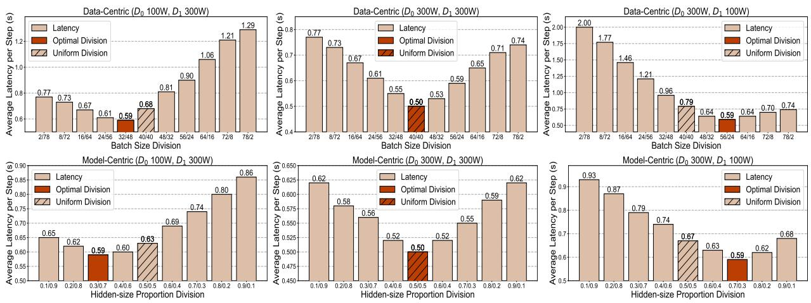

# 4.3. Ablation Studies

We examine the effectiveness of each component for HEXA-MoE via measuring the impact of expert-specific operators, pipeline-shared cache, fused kernel, data- & modelcentric and memory optimization, respectively. 2 metrics are evaluated, including average latency and memory footprint. We take distributed training of Swin-MoE-Base model on homogeneous devices as benchmark for ablation studies.

Figure 8. Latency analysis on heterogeneous devices with both data-centric and model-centric configuration. Experiments are all conducted with Swin-MoE-Small model using 4 global experts and top-2 routing. The average latency falls minimal when the division proportion is close to the computing capacity proportion in each case.

Since dispatch & combine operations are inevitable if we dispense with our expert-specific operators, we directly take the performance of Tutel in this case.

**Memory Footprint Breakdown.** We take 8 experts, top-4 routing, and batch size 40 as an example to break down memory footprint, and visualize the results in Figure 9(a). We can draw some insights from it:

- \* The employment of pipeline-shared cache slightly increases memory footprint, while expert-specific fused kernel has no impact.
- \* Pipeline-shared cache can effectively reduce memory footprint under a data-centric setting, since the memory footprint would surpass Tutel without it.
- HEXA-MoE can reduce memory footprint compared to baseline even without memory optimization, and optimizing it can further reduce memory footprint.

**Latency Breakdown.** We set 4 experts, top-4 routing, and batch size 80 to break down training latency, and visualize results in Figure 9(b). We can draw some insights as:

- \* The employment of expert-specific fused kernel, data-centric setting, and communication-computation overlap can effectively reduce latency. Meanwhile, the combination of data-centric setting and communication-computation overlap can further empower our HEXA-MoE with notably reduced latency.
- \* Expert-specific operators play a significant part in speeding up MoE computing since the latency for Tutel is much longer than our model-centric setting.
- \* Although pipeline-shared cache and memory optimization can slightly increase latency, they can also lead to significant reduction on memory footprint, as demonstrated in memory footprint breakdown.

Figure 9. Memory and latency breakdown. We analyze the effectiveness of our proposed pipeline-shared cache, fused kernel, and memory optimization. We take Tutel as a baseline and visualize the differences with it.

### **5. Conclusion**

We introduce HEXA-MoE, a completely static MoE training framework with minimal memory footprint and heterogeneous-awareness, materialized by the proposed *expert-specific* operators and tensor parallelism. We provide specialized GPU kernels, which can both save memory footprint and reduce overall latency. For different workload scales, we provide data- and model-centric configurations for enhanced efficiency, and propose a memory-efficient communication-computation overlap-

ping scheme to overcome the shortcomings of previous work. Homogeneous experiments show that HEXA-MoE can save 10%-48% memory footprint while achieving 0.5- 4.3× speed up compared to state-of-the-art MoE libraries. Heterogeneous experiments show that HEXA-MoE can substantially minimize runtime and better utilize global computing resources by employing optimal parallel configuration. HEXA-MoE endows MoE computing with an in-place manner, where routing choice would yield almost no impact on hardware workload, which may inspire further research on algorithm designs of MoE.

