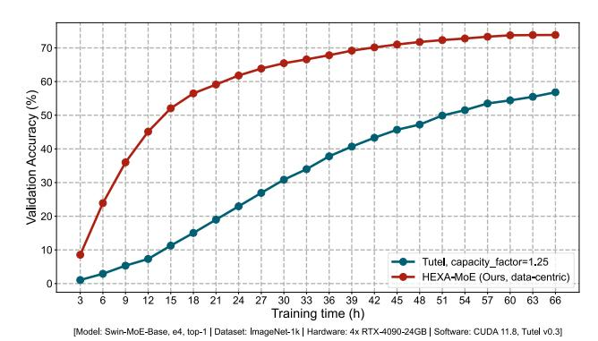

# Shuqing Luo1 Jie Peng2 Pingzhi Li3 Hanrui Wang4 Tianlong Chen3

### **Abstract**

Mixture-of-experts (MoE) has emerged as a practical approach to scale up parameters for Transformer model to achieve better generalization while keeping computational efficiency. Current MoE models are mainly deployed with expert parallelism on distributed devices, which typically depends on homogeneous devices, and suffers from heavy communication overhead as well as computation redundancy under scaled workload. To tackle these teasers, we propose a Heterogeneousaware Expert Allocation framework, **HEXA-MoE**, with significantly enhanced efficiency. It contains two components: (1) Expert-Specific Operators. We replace the typical GeMM or grouped GeMM interfaces with our proposed expert-specific operators, making expert computing to be performed in an in-place manner with almost no redundant FLOPs. (2) Adaptive Data- and Model-Centric configurations for different workload scales. We introduce a memory-efficient computationcommunication overlapping scheme to tackle the heavy memory consumption in current datacentric libraries, which can accelerate training with heavy workloads. Comprehensive experiments on the Swin-MoE benchmark consistently reveal the effectiveness of HEXA-MoE, i.e., reducing  $10\% \sim 48\%$  memory consumption and achieving  $0.5 \sim 4.3 \times$  speed up compared to current state-of-the-art MoE libraries. We further examine HEXA-MoE on heterogeneous devices, and promising results show that employing optimal parallel configuration can better utilize global computation resources, and substantially minimize overall latency. Codes are available at here.

### 1. Introduction

Figure 1. Convergence Analysis. HEXA-MOE can significantly surpass Tutel on MoE training due to the specialized designs.

Transformers have become the *de facto* architecture for a vast range of machine learning tasks including natural language process (Vaswani, 2017; Raffel et al., 2020), computer vision (Liu et al., 2021; He et al., 2022b) and multi-modal learning (Li et al., 2022; Liu et al., 2024). To scale up model parameters for stronger learning capacity and better generalization following the empirical scaling law (Kaplan et al., 2020), Mixture-of-experts (MoE) (Jiang et al., 2024) has been demonstrated as a practical and computation-efficient approach. For a single Transformer layer, MoE expands the feed-forward network (FFN) to a group of experts with the same architecture and different parameters, activated selectively during computing. This dynamic nature poses peculiar challenges to system design. Current MoE frameworks usually present some unique attributes that differentiate them from dense models:

- Distributed computing is required due to its sheer size, and expert parallelism (Lepikhin et al., 2020) is the most commonly used technique, which distributes the experts in one layer on different devices.
- The dynamic workload for each expert makes it necessary to employ additional dispatch and combine operations in expert parallel to utilize the general matrix multiplication (GeMM) or grouped GeMM interface.
- **3** Dispatch and combine rely on synchronous all-to-all communication to assign tokens to distributed experts.

These peculiar designs lead to apparent inefficiency for MoE training. On the one hand, current MoE libraries are either static like Tutel (Hwang et al., 2023), or dynamic like MegaBlocks (Gale et al., 2023). The former depends on an additional hyper-parameter named expert capacity to

&lt;sup>1Peking University, China 2University of Science and Technology of China, China 3University of North Carolina, Chapel Hill, USA 4University of California, Los Angeles, USA. Correspondence to: Tianlong Chen <tianlong@cs.unc.edu>.

calibrate the workload for different experts, which suffers from redundant memory allocation or access, while the latter tends to raise out of memory (OOM) error during runtime due to its uncertainty. Meanwhile, the synchronous all-to-all communication can occupy over 40% runtime with scaled model and devices [\(Hwang et al.,](#page-8-7) [2023\)](#page-8-7). On the other hand, expert parallelism is mainly deployed on homogeneous devices. However, a homogeneous cluster with cutting-edge devices is much more expensive than heterogeneous ones due to the fast iteration of modern GPU and the decrease on prices for outdated ones. Adapting expert parallelism to *heterogeneous* devices would rely on rescheduling expert placement to utilize global computing resources sufficiently. However, the inherent dynamic property of MoE makes it difficult to implement, as the workload of each expert changes dynamically in each step [\(He et al.,](#page-8-9) [2022a;](#page-8-9) [Li et al.,](#page-8-10) [2023\)](#page-8-10). Since heterogeneous devices are cheaper and easier to access, if MoE training can be refactored to be heterogeneous-aware, it would advance wider deployment.

We propose HEXA-MoE, a completely-static MoE training framework with minimized memory consumption and heterogeneous-awareness. We first find that if implementing MoE layer with GeMM, the unnecessary components such as token padding or discarding are unavoidable, while grouped GeMM [\(Gale et al.,](#page-8-8) [2023\)](#page-8-8) would lead to dynamic runtime behavior and uncertainty. To tackle it, we investigate the forward and backward propagation for the MoE layer thoroughly, and propose to replace (grouped) GeMM with *expert-specific* operators. Specifically, the basic MoE operations are essentially build upon 3 operators, *i*.*e*., expertspecific matrix multiplication (*ESMM*), summation (*ESS*) and transposed matrix multiplication (*ESTMM*). The forward propagation only requires *ESMM*, while backward requires all. We implement them with specialized GPU kernels, and distribute the MoE layer with tensor parallelism [\(Narayanan et al.,](#page-9-2) [2021\)](#page-9-2) as an alternative to expert parallelism, which is easy to be heterogeneous-aware.

HEXA-MoE also considers different workload scales for MoE training, and is adapted to both data- and model-centric configurations. Their difference lies in the content of communication. For model-centric, local mini-batches are synchronized among devices and model parameters are kept still, while for data-centric, local parameters are gathered for each device, while local mini-batches are kept still [\(Liu et al.,](#page-8-11) [2023\)](#page-8-11). Data-centric setting outperforms model-centric with scaled workloads. However, previous library preserves all the gathered parameter shards on each device for backward pass, leading to huge memory consumption. To tackle this teaser, we design a novel memory-efficient communicationcommunication overlapping scheme utilizing a pipelineshared cache on each device, which is updated dynamically for both forward and backward pass. Both settings are completely static in runtime, and the workload of each device

can be easily determined from batch size or tensor parallelism configuration (sub-dimension of FFN intermediate size), making it easy to be adapted to heterogeneous devices via specialized expert allocation.

Our contributions can be summarized as follows:

- ⋆ A completely static MoE training framework with minimized memory footprint. To our best knowledge, HEXA-MoE is the first MoE library with completely static and minimal memory footprint, enabling in-place computing with specialized kernel, and employing tensor parallelism for distributed training, delivering exact result with faster speed, as shown in Figure [1.](#page-0-0)
- ⋆ Advanced efficiency. HEXA-MoE is built upon our proposed expert-specific operators, which tackles scaled workload with data-centric strategy via memoryefficient communication-computation overlapping. Experiments on Swin-MoE show that HEXA-MoE can reduce 10% ∼ 48% memory usage and achieve 0.5 ∼ 4.3× speed up compared to SOTA MoE libraries.
- ⋆ Heterogeneous-awareness. HEXA-MoE transforms conventional expert parallelism into data or tensor parallelism, making it heterogeneous-aware. Experiments show that HEXA-MoE can be effectively adapted to heterogeneous devices and substantially minimize overall latency via employing optimal parallel configuration.

