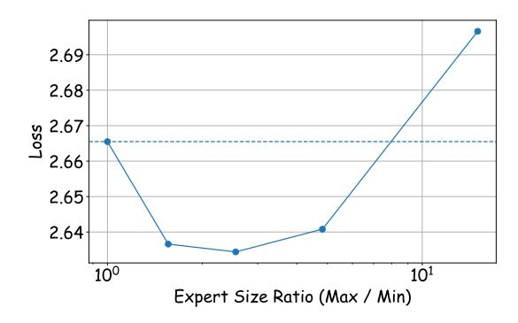
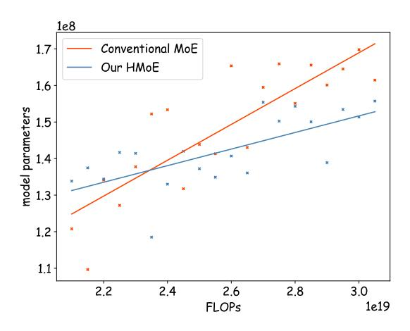
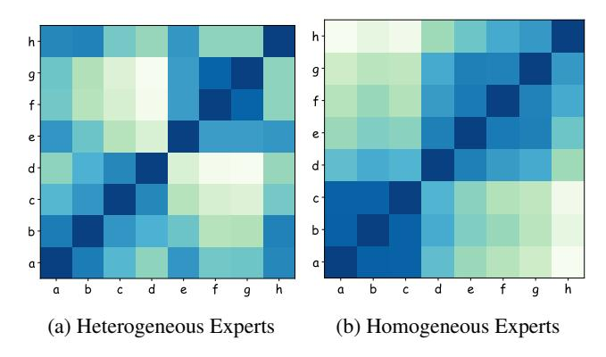

# Efficient Training of Heterogeneous MoE

The efficient training of heterogeneous MoE models presents significant challenges to existing training approaches, necessitating innovative solutions to overcome these obstacles. One primary issue stems from the fact that experts do not have uniform shapes, which invalidates the traditional batched matrix multiplication method for expert computation. To address this challenge, Megablocks (Gale et al. 2022) implements efficient block sparse matrix multiplication kernels, which effectively handle the complexities introduced by variable-sized experts. Another concern is the problem of unbalanced computation and communication arising from the heterogeneous nature of experts, which can lead to inefficient resource utilization. To mitigate these issues, ES-MoE (Kim, Lim, and Han 2024) introduces expertwise offoading and dynamic expert placement strategy. This approach involves performing expert computation in a serialized manner. Expert parameters are offloaded to CPU memory and are fetched back to GPU memory as needed, based on the distribution of tokens. By doing so, ES-MoE not only reduces GPU memory overhead incurred by expert parameters but also alleviates the computation load imbalance issue, leading to better hardware resource utilization. Future research in the area may focus on developing more sophisticated load-balancing techniques and optimizing memory management strategies both for model states and activations.

## Detailed Model Setting

All methods are based on the Transformer decoder-only architecture following LLaMa (Touvron et al. 2023a). We employ the LLaMa2 (Touvron et al. 2023b) tokenizer with a vocabulary size of 32,000. We conducted a small-scale experimental exploration to determine the setting of model parameters. For the Dense-0.4B model, we configure 12 Transformer Blocks, with the hidden dimensions of the FFN layers being 12,288. In the attention layer, we use 12 heads, each with a dimension of 64. For the Dense-1B model, we also configure 12 Transformer Blocks, but the hidden dimensions of the FFN layers are set to 32,768. In the attention layer, there are 16 heads, each maintaining a dimension of 64.

For both MoE (homogeneous MoE) and HMoE models, we utilize two different model sizes. Each layer in the MoE model contains 8 experts. In the configuration with 0.4B total parameters, the total hidden dimension for all experts in each MoE layer sums to 12,288, and there are 12 Transformer Blocks. All other specifications align with Dense-0.4B settings. In the configuration with 3B (2.55B) total parameters, the aggregate hidden dimension for all experts in each MoE layer is 32,768 and there are 12 Transformer Blocks. All other specifications match those of Dense-1B settings. For HMoE, the distribution of expert sizes follows an arithmetic progression.

For Homogeneous MoE, we set the load balancing loss coefficient to 1 × 10−2 , as implemented in Huang et al. (2024). For HMoE, we set the coefficient of parameter penalty loss as 0.1. For the Top-P routing strategy, we set the coefficient of router entropy loss as 3 × 10−2 .

## Detailed Training Setting

Our models are trained utilizing NVIDIA A800 (80G memory) or H800 GPUs (80G memory). The AdamW optimizer is used, with a first-moment decay of β1 = 0.9 and a secondmoment decay of β2 = 0.999. A weight decay of 1 × 10−5 is applied. The learning rate is gradually increased from 0 to 1× 10−4 over the initial 1000 steps and is maintained thereafter. The context length is set to 4096, and the global accumulated batch size is 640. All experiments use a unified random seed value of 12345. We implemented the Zero2 (Rajbhandari et al. 2020) strategy to accelerate model training and gradient checkpointing to save GPU memory. All model and training code is developed with the torch (Paszke et al. 2017) library.

#### **Detailed Introduction of MoE**

**Mixture of Experts** Different from dense models, most MoE models replace the FFN layer of the transformer (Vaswani et al. 2017) block with the MoE layer. The MoE layer consists of a router  $g_i(\cdot)$  and multiple experts  $\{e_1, e_2, ..., e_N\}$ . The experts are composed of a set of independent Feed-Forward Network (FFN) layers. Experts are responsible for processing the input data according to their specialized knowledge. For each token, a subset of experts is activated to execute computations, and the router is responsible for generating a probability distribution. The probability of this distribution indicates the likelihood of assigning the token to each expert. We obtain the output of MoE layer based on following process:

$$MoE(\mathbf{x}) = \sum_{i}^{N} g_i(\mathbf{x}) \cdot e_i(\mathbf{x}),$$

$$e_i(\mathbf{x}) = FFN_i(\mathbf{x}),$$
(6)

where x is the input states of current layer.

**Routing Strategy** The routing strategy is applied to select experts to be activated from N experts. The **Top-K Routing** (Huang et al. 2024) strategy is one of the most widely-used strategy, which always activates a fixed number of experts for each token. We first calculate the probability distribution  $\mathbf{P}$  using a softmax function.  $\mathbf{P}$  represents the initial score of selecting each expert. Then, we keep the highest k scores and normalize them. The detailed computation is as:

$$\mathbf{P} = softmax(\mathbf{W_r} \cdot \mathbf{x}) = \frac{\exp(\mathbf{W_r} \cdot \mathbf{x})}{\sum_{j=1}^{N} \exp(\mathbf{W_r} \cdot \mathbf{x})}, \quad (7)$$

$$g_{i}(\mathbf{x}) = \begin{cases} \frac{P_{i}}{\sum_{j \in \text{Top-K}(\mathbf{P})} P_{j}}, & i \in \text{Top-K}(\mathbf{P})\\ 0, & i \notin \text{Top-K}(\mathbf{P}), \end{cases}$$
(8)

where Top-K(P) returns the indices of the largest k elements in P, and  $W_r$  is a learnable router parameter.

Recently, **Top-P Routing** (Huang et al. 2024) is proposed to dynamically activate different number of experts for each token. Specifically, we first obtain  $\tilde{\mathbf{P}}$  by sorting  $\mathbf{P}$  from highest to lowest. Then given a fixed threshold p, which is a hyperparameter, if the highest probability is larger than threshold, we only use one expert. Otherwise, we progressively add additional experts until the cumulative probability exceeds the threshold p. The detailed computation is as:

$$t = \underset{k \in \{1...,N\}}{\operatorname{argmin}} \sum_{j < =k} \tilde{\mathbf{P}}_j \ge p, \tag{9}$$

$$Top-P(\mathbf{P}) = \{Index(1), ..., Index(t)\}, \tag{10}$$

Figure 11: Various distributions of expert sizes in HMoE and their corresponding losses. All distributions follow arithmetic strategy. The x-axis represents the ratio of the size of the largest expert to the size of the smallest expert within the distribution.

$$g_i(\mathbf{x}) = \begin{cases} \frac{P_i}{\sum_{j \in \text{Top-P}(\mathbf{P})} P_j}, & i \in \text{Top-P}(\mathbf{P}) \\ 0, & i \notin \text{Top-P}(\mathbf{P}), \end{cases}$$
(11)

where t represents the minimum number of experts that need to be activated. Index(j) returns the indices of element  $\tilde{\mathbf{P}}_j$  in original distribution  $\mathbf{P}$ .

## **Further Ablation on Expert Heterogeneity**

Our experiments reveal a strong correlation between loss and the performance of downstream tasks: lower loss generally leads to better performance. With this insight, we investigated how to determine Expert Heterogeneity. Figure 11 illustrates the loss obtained by training HMoE using an arithmetic sequence strategy with varying levels of variance, all within the same computational budget. We observed that as the ratio between the largest and smallest experts increases (i.e., as the variance increases), the model's performance initially degrades but then improves. This suggests that in the heterogeneous design of HMoE, an optimal level of heterogeneity enhances performance compared to either excessive heterogeneity or complete homogeneity. This is consistent with the reason why the geometric distribution strategy has poor results. A large gap in expert ability is not conducive to model training and may lead to representation collapse. Based on these findings, we have adopted a relatively balanced heterogeneous distribution in our main experiment.

#### **Optimal Activated Model Parameters**

We recorded the activated parameters that yielded the lowest loss at different training costs. Figure 12 illustrates that initially, the optimal number of activated parameters for the homogeneous MoE is lower than that for the HMoE. However, as the training FLOPs increase, the optimal number of activated parameters for the HMoE decreases. The crossover point occurs at approximately  $2.4 \times 10^{19}$  FLOPs, which is relatively low for pre-training models. Considering the high computational costs associated with training modern large-scale models, this underscores the superior performance of HMoE as a base model for such training.

Figure 12: Optimal activated model parameters of our HMoE (Top-P) and conventional MoE (Top-P) under different training FLOPs.

| Task          | Activated Parameter Ratio |
|---------------|---------------------------|
| ARC-Challenge | 21.09                     |
| ARC-Easy      | 20.23                     |

Table 2: Average Activated parameter ratios (%) in HMoE layers for ARC (Clark et al. 2018) tasks.

### **Activated Parameter Ratio Analysis**

We present the activated parameter ratios of ARC tasks in HMoE layers in Table 2. Specifically, we observe that ARC-Challenge activates more parameters compared to ARC-Easy. This implies that our model can dynamically activate parameters based on the difficulty of the task. This phenomenon is consistent with that in the MoE with Top-P routing strategy (Huang et al. 2024). By activating more parameters for more difficult tasks, the model achieves better performance, while for simpler tasks, it gains higher efficiency. This approach balances efficiency and performance. To be noted, the difference in activated ratios between difficult and simple tasks is not very large, ensuring stable computational costs.

#### **Expert Activation Patterns**

We have recorded the tokens with the highest activation percentages for different sizes of experts in the ARC tasks. As shown in Table 3, smaller experts are most frequently activated by simpler words or words with less phonetic information. In contrast, larger experts are most frequently activated by suffix tokens. We believe that these suffix tokens are more ambiguous and thus more difficult to understand. Mediumsized experts, on the other hand, are more frequently engaged with tokens that have clearer semantics.

#### **Similarity Analysis**

We compared the behavior of experts in Heterogeneous MoE and Homogeneous MoE models. Figure 13 presents

| Expert Dim | Top Tokens                                                                          |
|------------|-------------------------------------------------------------------------------------|
| 2304       | the, such, your, these, most, you, both, no, they, each                             |
| 3328       | tables, valley, sun, temper, places, day, war, water, through, clean                |
| 3840       | known, least, lowest, immediately, bare, heavy, known, higher, several, independent |
| 5376       | _ly, _zen, _icker, _last, _per, _var, _orous, _next, _end, _flat                    |
| 5888       | _decom, _iz, _ro, _inf, _scra, _coord, _er, problem, _och, _foss                    |

Table 3: Top activated tokens for each expert.

Figure 13: Similarity study of the heterogeneous and homogeneous experts. In the heterogeneous MoE, the relative expert sizes are  $\{9, 11, 13, 15, 17, 19, 21, 23\}$  as experts from a to h. In the homogeneous MoE, all experts have identical sizes.

a similarity analysis of these experts, where each heatmap cell represents the Wasserstein distance between the token distributions of expert pairs on downstream tasks. In the Heterogeneous MoE setup, experts of similar sizes exhibit higher similarity. In contrast, in the Homogeneous MoE setup, where all experts are of equal size, we observed that experts tend to cluster into two groups. Specifically, experts a, b, and c display exceptionally high similarity. This comparison highlights the significant advantage of Heterogeneous MoE in facilitating expert differentiation compared to Homogeneous MoE.