# **HMoE: Heterogeneous Mixture of Experts for Language Modeling**

An Wang\*,1, Xingwu Sun\*,1, Ruobing Xie1,†, Shuaipeng Li1 Jiaqi Zhu1, Zhen Yang1, Pinxue Zhao1, J.N. Han1, Zhanhui Kang1, Di Wang1, Naoaki Okazaki2, Cheng-zhong Xu3

Tencent Hunyuan
 Tokyo Institute of Technology
 University of Macau

#### Abstract

Mixture of Experts (MoE) offers remarkable performance and computational efficiency by selectively activating subsets of model parameters. Traditionally, MoE models use homogeneous experts, each with identical capacity. However, varying complexity in input data necessitates experts with diverse capabilities, while homogeneous MoE hinders effective expert specialization and efficient parameter utilization. In this study, we propose a novel Heterogeneous Mixture of Experts (HMoE), where experts differ in size and thus possess diverse capacities. This heterogeneity allows for more specialized experts to handle varying token complexities more effectively. To address the imbalance in expert activation, we propose a novel training objective that encourages the frequent activation of smaller experts, enhancing computational efficiency and parameter utilization. Extensive experiments demonstrate that HMoE achieves lower loss with fewer activated parameters and outperforms conventional homogeneous MoE models on various pre-training evaluation benchmarks. Codes will be released upon acceptance.

### Introduction

Mixture of Experts (MoE) (Jacobs et al. 1991; Shazeer et al. 2017; Lepikhin et al. 2020; Fedus, Zoph, and Shazeer 2022; Jiang et al. 2024; Dai et al. 2024) is a cutting-edge technique in the field of large language models (LLMs) (Brown et al. 2020; Achiam et al. 2023; Ouyang et al. 2022; Touvron et al. 2023a,b; Dubey et al. 2024) that excels in both performance and computational efficiency. At its core, MoE operates on the principle of dividing a model into multiple components, known as experts (Shazeer et al. 2017), each specializing in different tasks or aspects of the data. This specialization allows MoE to activate a subset of parameters, significantly enhancing the model's robustness and flexibility. The main advantage of MoE lies in that it can scale model parameters without the corresponding increase in computational cost.

Recently, almost all MoE models (Jiang et al. 2024; Dai et al. 2024; Wu et al. 2024) predominantly adopt homogeneous experts for LLM, where all experts are structured identically with the same size. This uniformity inevitably leads to equivalent representational capacities among all experts. As a result, homogeneous experts often exhibit a

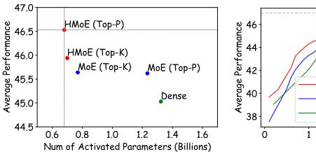

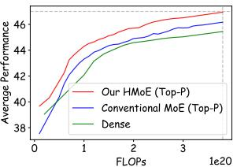

Figure 1: Comparisons of our heterogeneous MoE-3B with conventional homogeneous MoE-3B. Our proposed HMoE is superior on both performance and efficiency.

convergence phenomenon (Zhou et al. 2022), where they learn similar representations over time, diminishing their uniqueness and specialization potential. The lack of diversity among experts becomes a significant bottleneck, particularly when handling inputs that require distinct representational capacities, ultimately hindering the model's overall performance and its ability to generalize across varied tasks. Moreover, the equivalent representational capacity and professional ability of these homogeneous experts limit their functional differentiation, making it challenging to meet the varied complexity demands of different inputs or tokens in NLP tasks (Huang et al. 2024). Consequently, MoE models struggle with suboptimal parameter utilization, as their identical experts may not provide the necessary depth or nuance for more complex inputs.

To address these challenges, a straightforward idea is to change the current homogeneous experts to heterogeneous ones. However, the challenges of heterogeneous MoE are mainly located in the following aspects: (a) *How to introduce appropriate heterogeneity to experts?* This fundamental difference between homogeneous and heterogeneous MoE significantly impacts performance. (b) *How to design and guide the desired load distributions for heterogeneous experts?* The optimal activation of heterogeneous experts is different from that in conventional MoE. We should first conclude what kind of expert activation distribution is optimal for heterogeneous MoE, and then provide effective guidance towards such activation, balancing both parameter efficiency and model effectiveness.

In this study, we propose a novel **Heterogeneous Mixture of Experts (HMoE)** structure as a pre-trained language

\*These authors contributed equally.

&lt;sup>†Corresponding Author

model. Specifically, we empirically assign different sizes for experts to bring in heterogeneity. Our explorations reveal that such intuitive HMoE without any training guidance does not significantly surpass conventional MoE. During training, larger experts are overly activated, while smaller ones are underutilized. This imbalance activation results in a reduction in the model's representational capacity, which hinders the usage of heterogeneous experts.

Therefore, we propose a novel set of HMoE training objectives that *encourages the activation of smaller experts*, leading to a more rational allocation of activated parameters and improved computational efficiency. Besides, we analyze three strategies of designing different heterogeneous expert size distributions, discovering the insights of *optimal heterogeneity of experts in HMoE*. Figure 1 demonstrates that our HMoE achieves better performance with fewer activated parameters, consistently outperforming traditional homogeneous MoE on pre-training evaluation benchmarks. We conduct extensive experiments to verify the effectiveness and efficiency of our proposed HMoE, along with in-depth analyses. We contribute to the success of our enhanced HMoE for following reasons: (a) Experts of varying sizes provide diverse capacities and promote higher specialization. (b) Expert heterogeneity ensures complex tokens get the necessary resources while simpler tokens are processed economically. (c) Leveraging MoE's inherent imbalance by activating more small experts to enhance their overall capability and further reduce computing costs.

We summarize the contributions of this work as follows:

- We introduce a novel HMoE model. It allows for enhanced specialization and a more granular response to diverse token complexities, improving both effectiveness and efficiency. To the best of our knowledge, this work is the first work exploring HMoE as a base language model.
- We propose a new set of training objectives that encourages the activation of smaller experts, leading to more efficient utilization of experts and preventing the disproportionate reliance on larger experts. We also explore different types of heterogeneity strategies for HMoE.
- Our experiments demonstrate that our HMoE achieves stronger performance with fewer activated parameters, thereby enhancing computational efficiency without sacrificing various downstream performances.

## Methodology

## Classical Mixture of Experts

Different from dense models, most MoE models (Lepikhin et al. 2020; Fedus, Zoph, and Shazeer 2022; Huang et al. 2024; Dai et al. 2024; Jiang et al. 2024) replace the FFN layer of the transformer (Vaswani et al. 2017) block with the MoE layer. The MoE layer consists of a router gi(·) and multiple experts {e1, e2, ..., eN }. The experts are composed of a set of independent Feed-Forward Network (FFN) layers. Experts are responsible for processing the input data according to their specialized knowledge. For each token, a subset of experts is activated to execute computations, and the router generates a probability distribution. The probability of this distribution indicates the likelihood of assigning the token to each expert.

Routing Strategy The routing strategy is applied to select experts to be activated from N experts. The Top-K Routing (Shazeer et al. 2017) strategy is the most widely-used strategy, which always activates a fixed number of experts for each token. It calculates the score which represents the probability of selecting each expert. We select the top k experts with the highest scores to activate.

Recently, Top-P Routing (Huang et al. 2024) is proposed to dynamically activate different numbers of experts for each token. Specifically, it first sorts scores from highest to lowest. Then given a fixed threshold p, if the highest probability is larger than the threshold, we only activate one expert. Otherwise, we progressively add additional experts until the cumulative probability exceeds the threshold p.

Issues of Conventional Homogeneous MoE Currently, most work employs MoE layers in a homogeneous design. Each expert in the MoE layer usually has the same structure and size. Undoubtedly, this is a simple design that avoids introducing more hyperparameters. However, it also brings the following problems:

- (1) Lack of Expert Specialization: Different experts within a homogeneous MoE show a tendency towards similarity (Zhou et al. 2022). Since homogeneous experts possess identical modeling capabilities, the router module randomly allocates tokens to these experts during pre-training. Consequently, without additional mechanisms to differentiate them, these experts might converge on similar features and patterns. As a result, the knowledge acquired by each expert lacks significant differentiation, leading to insufficient specialization among the experts.
- (2) Inefficient Parameter Allocation: Most homogeneous MoE methods overlook the varying difficulties of tasks and the different complexities of tokens within the input. Smaller-sized experts can handle simpler tasks or easily understandable tokens effectively, while larger-sized experts are better suited for complex tasks and difficult tokens. However, homogeneous MoE models typically use experts of the same size for all inputs and tokens, leading to inefficient and suboptimal parameter allocation. The dynamic routing of Top-P Routing (Huang et al. 2024) attempts to address this issue by assigning different numbers of experts to different tokens. Nevertheless, it relies on fixed threshold settings and employs a rudimentary approach to difficulty modeling, making it challenging to adapt effectively to diverse inputs.
- (3) Representation Collapse and Load Imbalance: Homogeneous MoE has a trend toward representation collapse (Chi et al. 2022). Representation collapse occurs when the majority of input tokens are assigned to only a few experts. This phenomenon also leads to load imbalance. The interconnected nature of representation collapse and load imbalance hampers the model's performance and efficiency.

## Exploration on Heterogeneous Mixture of Experts

To alleviate the above issues in homogeneous MoE, we propose Heterogeneous Mixture of Experts. HMoE includes a router and expert network, with the key distinction that

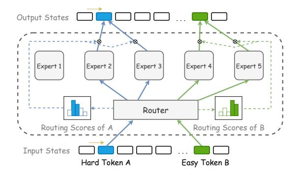

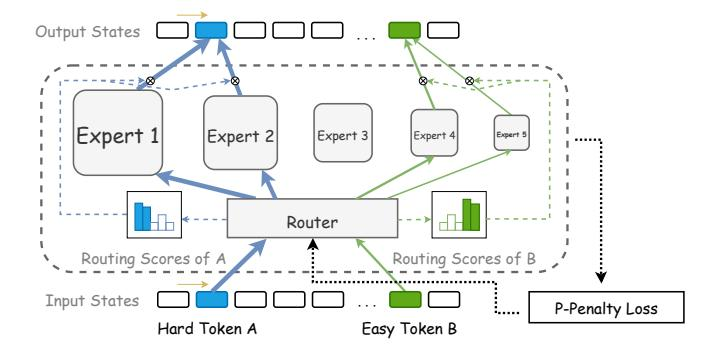

(a) Conventional homogenerous MoE.

(b) Our proposed heterogeneous MoE.

Figure 2: Two distinct model structures for Mixtures of Experts (MoE) are compared: (a) conventional homogeneous MoE model structure with all experts having identical parameter sizes; (b) our proposed heterogeneous MoE model structure characterized by substantial variations in parameter sizes of each expert, incorporating a parameter penalty loss during training to promote utilization of Experts with smaller parameter volumes. In our heterogeneous MoE, harder tokens are assigned to larger experts, while easier tokens are assigned to smaller experts. In conventional homogeneous MoE, all tokens are assigned to the same size experts regardless of their difficulty.

the models of experts within the same layer are different. To achieve an HMoE, we could design different structures and different sizes for experts. However, within the transformer model, experts with different structures make the training process extremely unstable. Therefore, in this work, we mainly explore HMoE with different expert sizes, as shown in Figure 2.

An Intuitive Exploration on HMoE For each expert  $e_i$ , we follow the FFN design in LLaMa (Touvron et al. 2023a). The detailed computation is as follows:

$$e_i(\mathbf{x}) = \mathbf{W}_{o,i} \cdot (\text{SiLU}(\mathbf{W}_{g,i} \cdot \mathbf{x}) \odot (\mathbf{W}_{p,i} \cdot \mathbf{x})),$$
 (1)

$$SiLU(\mathbf{z}) = \mathbf{z} \cdot \sigma(\mathbf{z}), \quad \sigma(\mathbf{z}) = \frac{1}{1 + e^{-\mathbf{z}}},$$
 (2)

where  $\mathbf{W}_{g,i} \in \mathbb{R}^{h_{\text{input}} \times h_{\text{ffn},i}}$ ,  $\mathbf{W}_{p,i} \in \mathbb{R}^{h_{\text{input}} \times h_{\text{ffn},i}}$  and  $\mathbf{W}_{o,i} \in \mathbb{R}^{h_{\text{ffn},i} \times h_{\text{input}}}$  are trainable parameters of expert  $e_i$ .  $h_{\text{input}}$  and  $h_{\text{ffn},i}$  are dim of input x and hidden state in FFN. To bring in heterogeneity for exploration, We intuitively change the hidden dim  $h_{\text{ffn},i}$  to control the size of each expert  $e_i$ .

**Results of Intuitive HMoE** We implement the aforementioned intuitive HMoE and conduct evaluation. Contrary to our expectations, the results do not demonstrate an improvement over the homogeneous MoE setup, as shown in Figure 3.

Upon investigation, we discovered that the primary reason for this underperformance was the highly imbalanced load distribution among experts in the HMoE. Larger experts were activated more frequently, while smaller ones were rarely utilized. This imbalance led to a decline in the model's overall representational capacity. The root cause is that the larger experts possess stronger capabilities compared to the smaller ones, prompting the router to preferentially activate the larger experts more often.

Nevertheless, we maintain that HMoE is still a very promising area of research because it has the potential to

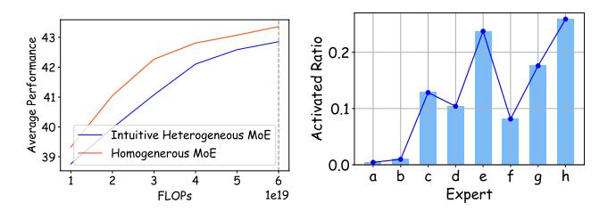

Figure 3: Experimental results of intuitive exploration on HMoE. The left figure compares the performance of intuitive HMoE and conventional Homogeneous MoE. The Homogeneous MoE adapts load balancing loss while the intuitive Hetergeneous MoE does not utilize any auxiliary loss. The right figure shows the activated ratio of experts in the intuitive HMoE. The relative expert sizes in HMoE are  $\{9, 11, 13, 15, 17, 19, 21, 23\}$ , matching experts a to b.

address the issue of **lack of expert specialization** by introducing diversity in the size and capacity of each expert. This inherent diversity allows the routing module to allocate tokens based on their complexity and characteristics, leading each expert to specialize in different aspects of the data. This mitigates the problem of experts converging towards similar representations and ensures that the model leverages a broader range of expertise.

### **Enhanced Heterogeneous Mixture of Experts**

Considering the above-mentioned issues, we propose the following strategies to enhance HMoE.

Activating More Small Experts In HMoE models, the presence of both large and small experts introduces a challenge where the optimization goal of the language model naturally favors the frequent activation of larger experts due to their superior performance. This tendency results in

smaller experts being underutilized, while larger experts are activated more often, leading to a significant increase in activated parameters. This phenomenon diverges from the intended model objective, where we aim for larger experts to be primarily engaged in complex understanding and reasoning tasks, while smaller experts should be more universally applied to simpler tasks.

Previous research (Fedus, Zoph, and Shazeer 2022) adapts load balancing loss  $\mathcal{L}_{lb}$  to eliminate load unbalancing among different experts in Homogeneous MoE:

$$\mathcal{L}_{lb} = N \sum_{i=1}^{N} \mathcal{T}_{i} * \hat{\mathcal{P}}_{i},$$

$$\mathcal{T}_{i} = \frac{1}{T} \sum_{t=1}^{T} 1\{e_{i} \in E^{t}\}, \quad \hat{\mathcal{P}}_{i} = \frac{1}{T} \sum_{t=1}^{T} P_{i,t},$$
(3)

where  $\mathcal{T}_i$  represents the partation of tokens assigned to expert  $e_i$ .  $\hat{\mathcal{P}}_i$  represents the gating probability assigned to  $e_i$ .  $P_{i,t}$  represents the gating probability assigned to  $e_i$  for token  $x_t$ .  $E^t$  represents the set of activated experts for the token  $x_t$ .

The objective of the load balancing loss is to achieve experts evenly activated. Nevertheless, it does not satisfy our motivation for designing HMoE. Because of the disparity in expert sizes, the load-balancing loss fails to stop the model from preferring to activate larger experts. To address the issue where larger experts are predominantly utilized, leading to the underutilization of smaller experts and a considerable rise in activated parameters, we introduce a novel training objective **parameter penalty** (**P-Penalty**) loss  $\mathcal{L}_{\text{P-Penalty}}$  as:

$$\mathcal{L}_{\text{P-Penalty}} = N \sum_{i=1}^{N} \mathcal{M}_{i} * \hat{\mathcal{P}}_{i},$$

$$\mathcal{M}_{i} = \frac{1}{T} \sum_{t=1}^{T} 1\{e_{i} \in E^{t}\} \times h_{\text{ffn},i}.$$
(4)

 $\mathcal{M}_i$  represents the average dimension of the hidden state of the expert  $e_i$  on the entire input x. It imports the influence of expert size into the loss. When the model employs more large experts, the loss rises. Hence, it will direct the model to more economically utilize smaller experts. In contrast, for harder tasks, using larger experts can yield greater benefits than parameter penalties. At this point, larger experts will also be activated to take part in the calculation. To be noted, if all expert has the same size, our parameter penalty loss is equal to the classical load balancing loss.

Besides, with the Top-P routing strategy, we find that MoE tends to activate an increasing number of experts during training, which reduces the efficiency of MoE. Therefore, we implement the router entropy loss (Huang et al. 2024) to prevent the model from using too many parameters, maintaining its ability to selectively activate experts as follows:

$$\mathcal{L}_{\text{entropy}} = N \sum_{i=1}^{N} P_i \times \log(P_i).$$
 (5)

In our HMoE, besides the original *language modeling loss*, the final loss for both Top-K and Top-P routing strategies further includes the *parameter penalty loss*  $\mathcal{L}_{P-Penalty}$ ,

with Top-P additionally incorporating the *router entropy loss*  $\mathcal{L}_{\text{entropy}}$ .

**Designing More Optimal Heterogeneity for Experts** Intuitively, the specific sizes of each heterogeneous expert have a large impact on the final results. In this work, we mainly explore three types of heterogeneity structures:

- (1) Geometric strategy. This strategy assigns the distribution of expert sizes following a geometric sequence. For example, we configure the relative size proportions of the experts to be  $\{1,2,4,8,16,32,64,128\}$  as in the intuitive exploration. It has a relatively high level of heterogeneity of experts. As a result, it highlights key experts, allowing them to play a more significant role in computation. More computing resources are allocated to larger-scale experts when dealing with complex and important tasks. However, it inevitably leads to an unbalanced resource allocation, where smaller-scale experts might be overly neglected in most cases. Therefore, this design may lead to severe load unbalancing. It might also be less applicable to tasks that require balanced handling of various possibilities, as it may overly emphasize certain situations.
- (2) Arithmetic strategy. The distribution can also follow an arithmetic sequence (i.e., the size gap between adjacent experts is constant). For example, we set the relative expert size as  $\{9,11,13,15,17,19,21,23\}$ . The benefits of this strategy include a relatively balanced resource allocation and consistent variation in differences between experts. Compared with geometric progression, the difference between the largest and smallest experts in arithmetic progression is smaller, which makes even small experts have certain expressive abilities. Thus the strategy makes model training more stable. In this study, we mainly adapt this strategy for research HMoE.
- (3) *Hybrid strategy*. The hybrid strategy that jointly combines both homogeneous and heterogeneous such as  $\{1,1,1,1,2,2,4,4\}$  is also a good competitor. We designed this setup based on the assumption that the MoE model requires multiple experts with similar capabilities or functionalities. Especially in scenarios involving expert combinations, completely differentiated experts might have drawbacks. It has the flexibility to adjust the proportion of homogeneous and heterogeneous parts based on different task requirements.

As a pioneer of the exploration of HMoE, we propose three strategies of different heterogeneity levels and conduct extensive evaluations on different settings for more insights. More optimal HMoE distributions and structures will be explored in the future.

### **Experiments**

### **Experimental Settings**

**Pre-training Datasets** For our pre-training data, we utilize the RedPajama (Computer 2023) dataset. It is an open-source dataset consisting of various sources like the common crawl, C4 (Raffel et al. 2020), GitHub, Wikipedia, books (Gao et al. 2020), arXiv, and StackExchange.

| Method                    | Activated Parameters | PIQA  | hellaswag | BoolQ | ARC-Easy | winogrande | SIQA  | AVG   |
|---------------------------|----------------------|-------|-----------|-------|----------|------------|-------|-------|
| 7 × 1019 FLOPs Training   |                      |       |           |       |          |            |       |       |
| Dense-0.4B                | 417M                 | 55.55 | 26.33     | 57.90 | 30.88    | 51.38      | 32.80 | 42.47 |
| MoE-0.4B (Top-K)          | 163M                 | 57.67 | 27.81     | 62.13 | 29.70    | 50.59      | 32.82 | 43.45 |
| MoE-0.4B (Top-P)          | 173M                 | 56.92 | 27.73     | 56.54 | 30.18    | 51.67      | 32.89 | 42.66 |
| HMoE-0.4B (Top-K)         | 153M                 | 56.67 | 28.26     | 59.80 | 31.93    | 52.49      | 32.91 | 43.68 |
| HMoE-0.4B (Top-P)         | 173M                 | 58.98 | 28.10     | 60.78 | 34.14    | 52.21      | 32.83 | 44.51 |
| 2.6 × 1020 FLOPs Training |                      |       |           |       |          |            |       |       |
| Dense-1B                  | 1.32B                | 58.92 | 29.57     | 61.70 | 35.26    | 51.85      | 32.86 | 45.03 |
| MoE-3B (Top-K)            | 0.77B                | 61.92 | 32.80     | 60.06 | 33.96    | 52.51      | 32.58 | 45.64 |
| MoE-3B (Top-P)            | 1.23B                | 61.42 | 32.16     | 61.47 | 33.51    | 52.27      | 32.91 | 45.62 |
| HMoE-3B (Top-K)           | 0.70B                | 61.04 | 32.89     | 60.26 | 36.14    | 52.49      | 32.82 | 45.94 |
| HMoE-3B (Top-P)           | 0.68B                | 61.79 | 33.22     | 61.69 | 36.49    | 52.96      | 33.00 | 46.53 |

Table 1: Results on pre-training model evaluation benchmarks. Our HMoE consistently outperforms Homogenerous MoE.

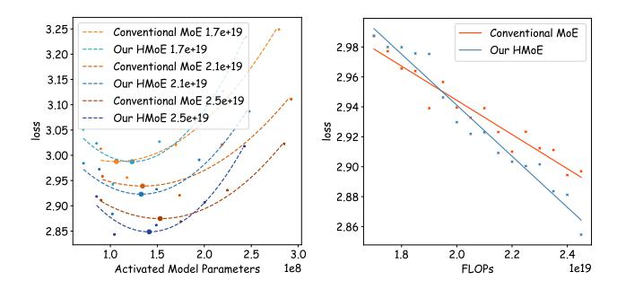

Figure 4: Analysis of isoFLOP for conventional MoE (Top-P) and our poposed HMoE (Top-P). The left figure depicts the optimal activated model parameters for various FLOPs. The right figure illustrates the variations in loss as FLOPs increase, given the optimal settings.

Competitors In our main experiment, we evaluate two types of baseline methods and our HMoE model: (1) Dense, which are standard Transformer decoder-only models without MoE layers, implemented with 0.4B and 1B parameters. (2) Homogeneous MoE, where FFN layers are replaced with MoE Layers including eight homogeneous experts, implemented with 0.4B and 3B total parameters, using both Top-K (k=2) and Top-P (p=0.6) routing strategies. (3) HMoE, our proposed method with Heterogeneous MoE Layers replacing FFN layers, also implemented with 0.4B and 3B parameters with both Top-K (k=2) and Top-P (p=0.6) strategies. To reflect the difference in performance between pure heterogeneous models and conventional homogeneous models, the expert size distribution employs an arithmetic strategy (The relative expert sizes are {9, 11, 13, 15, 17, 19, 21, 23}). The detailed setting is introduced in the Appendix.

Evaluation We evaluate these models on six different benchmarks (Gao et al. 2021) including PIQA (Bisk et al. 2020), hellaswag (Zellers et al. 2019), BoolQ (Clark et al. 2019), ARC (Clark et al. 2018), winogrande (Sakaguchi et al. 2021) and SIQA (Sap et al. 2019). These tasks examine models' language understanding, logical reasoning, knowledge utilization, and social awareness capabilities. Since the activated parameters of different methods are varied, we ensure a fair comparison by basing our model evaluations on identical computational training costs (FLOPs) instead of the number of training tokens.

## Main Results

Table 1 presents a comparative analysis of the performance of various models on pre-training evaluation benchmarks.

- (1) The results demonstrate the superiority of the MoE models over the Dense models across the board. Notably, our proposed HMoE models, utilizing both Top-K and Top-P routing strategies, have outperformed their traditional MoE and Dense counterparts in almost all evaluated metrics.
- (2) Specifically, within the category of models utilizing 7 × 1019 FLOPs, HMoE-0.4B model demonstrates a significant advantage, particularly with the Top-P routing strategy, surpassing Dense-0.4B model by an average of 2.04
- (3) When we shift our focus to models trained with a higher budget of 2.6 × 1020 FLOPs, the HMoE-3B model with Top-P routing once again emerges as the top performer, outperforming the Dense-1B model by an average of 1.50
- (4) Furthermore, the comparison between Top-K and Top-P routing within the HMoE model is also insightful. The Top-P routing strategy generally yields better results, implying that the dynamic routing strategy cooperates well with heterogeneous experts. We attribute this to the fact that both Top-P routing and heterogeneous experts are designed to adapt to the complexity of the input.

We additionally conduct isoFLOP comparisons as shown in Figure 4. We found that due to expert heterogeneity, if the training FLOPs are too few, the performance of HMoE is not significantly superior to traditional MoE. However, at relatively early stages of training (around 2 × 1019 FLOPs), HMoE already shows a stable trend of outperforming its homogeneous counterpart. It can be expected that with larger models and more data, the advantages of heterogeneity will become even more pronounced.

## Efficiency Analyses on HMoE

Activated parameters of different MoE models The left side of figure 5 shows the average activated parameters dur-

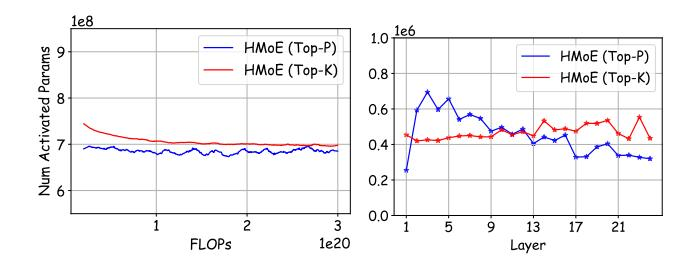

Figure 5: Average activated parameters across training FLOPs (left) or different layers (right).

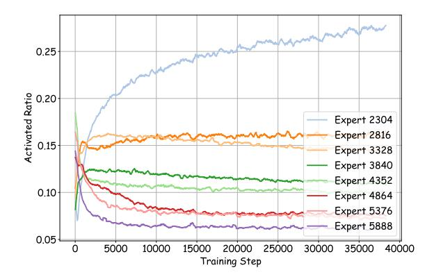

Figure 6: Activated parameters of experts in HMoE (Top-P). The values in the legend indicate the hidden dimensions of the experts, which represent their sizes.

ing training. For HMoE models using Top-P and Top-K routing, the number of activated parameters stays stable and shows a downward trend over time. This is beneficial for large model training, keeping the HMoE's expected sparse activation property, even with more tokens. It is to be noted, that activation parameters for HMoE models are more stable with Top-K routing than with Top-P routing.

Activated parameters of different experts in HMoE We explore the underlying causes of the stable or declining trend in activated parameters within HMoE with Top-P routing. As depicted in Figure 6, the activation of smaller experts increases over the course of training, while larger experts experience a decline in their activation rates. This highlights the effectiveness of our proposed P-Penalty loss. The increased activation rates of smaller experts enhance their capacity to comprehend general knowledge, as further evidenced in Section . This shift causes the role of smaller experts to increasingly resemble that of shared experts (Dai et al. 2024). Additionally, the activation frequency of different experts remains constant throughout the training process, indicating the router's consistent token allocation.

Activated parameters of different layers in HMoE The right side of Figure 5 shows the layer-wise distribution of activated parameters. With Top-P routing, activated parameters decrease with layer depth. The first layer of HMoE with Top-P has a very low activation rate because nearly all tokens are routed to one expert, unlike other layers where activation is more balanced.

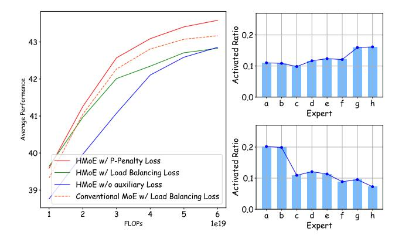

Figure 7: The left figure shows the effectiveness of auxiliary losses. The right figure shows the activated parameter ratio varying by model size across load balancing loss (above subfigure) and P-Penalty loss (below subfigure).

#### **Ablation Study**

Effectiveness of Auxiliary Losses Our proposed P-Penalty loss is crucial for HMoE's performance. We conduct an ablation study to evaluate auxiliary losses. As shown in Figure 7 (left), the P-Penalty loss yields the best results. Figures 3 (right) and 7 (right) illustrate the impact of auxiliary losses on expert activation. Although the load balancing loss fails to reduce the frequent activation of large experts, the P-Penalty loss successfully adjusts the model's goals to favor the activation of smaller experts more often, thereby greatly improving model performance.

Analyses on Expert Heterogeneity The expert size distribution in HMoE significantly influences model performance. Figure 8 (left) compares HMoE across various distributions: geometric, arithmetic, and hybrid. Our results show that the geometric distribution performs the worst. Figure 8 (right) illustrates that smaller experts in the geometric progression are less frequently activated, even with P-Penalty loss, suggesting their capacity is insufficient because of their too-small size. Conversely, the hybrid model outperforms the arithmetic one, indicating that a mix of similar and varied expert sizes optimizes the HMoE model. This indicates that a mix of experts with both similar and varied sizes offers greater potential for exploration and optimization within the HMoE model. More comprehensive and in-depth analyses are provided in the Appendix.

#### **In-depth Analyses on HMoE Experts**

Figure 9 (a) presents a similarity analysis of HMoE's experts of different sizes. Each heatmap cell represents the Wasserstein distance between token distributions of expert pairs on downstream tasks. We find that experts of similar sizes typically show greater similarity. Clustering is seen among experts with similar sizes (e.g., expert a/b, c/d, f/g). This indicates that experts with similar sizes tend to develop analogous capabilities, showing the significance of heterogeneity.

Figure 9 (b) shows the synergy analysis among experts of different sizes. Each cell in the heatmap represents the KL

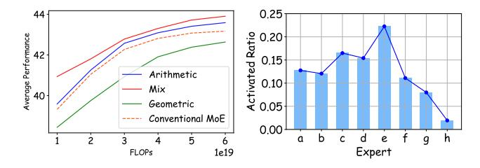

Figure 8: Analysis of expert heterogeneity through ablation. The figure on the left illustrates a performance comparison across various expert-size design strategies. The right figure displays the activation ratios of experts in HMoE using a **geometric** strategy.

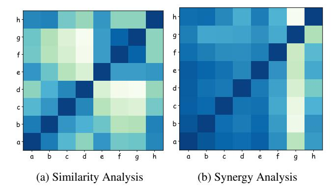

Figure 9: Similarity and synergy analysis of HMoE's experts with the arithmetic strategy. The relative expert sizes are  $\{9, 11, 13, 15, 17, 19, 21, 23\}$  as experts from a to h.

divergence between token distributions of the x-axis and y-axis experts. Results indicate that smaller experts collaborate more than larger ones, while larger experts are more specialized. This suggests smaller experts in our HMoE have more generalized capabilities.

Figure 10 shows the activation ratios of experts for tokens with varying difficulty levels. The activation ratio is the frequency that a token activates each expert divided by the total activations. Complex tokens activate larger experts more often, while smaller experts are consistently activated due to their general capabilities.

It is noteworthy that, although we present only a few examples, this phenomenon is universally observed. This suggests that our HMoE model effectively allocates tokens to appropriate experts.

#### **Related Work**

The Mixture of Experts (MoE) model was first proposed by Jacobs et al. (1991), where each expert independently learns a subset of the complete dataset and is then integrated into a unified system. Building on this, (Shazeer et al. 2017) introduced the Sparsely-Gated Mixture-of-Experts layer (SMoE), which employs a gating network for expert selection and proposes a top-K routing strategy, where a fixed number of experts are selected for each token. Further advancements were made by Gshard (Lepikhin et al.

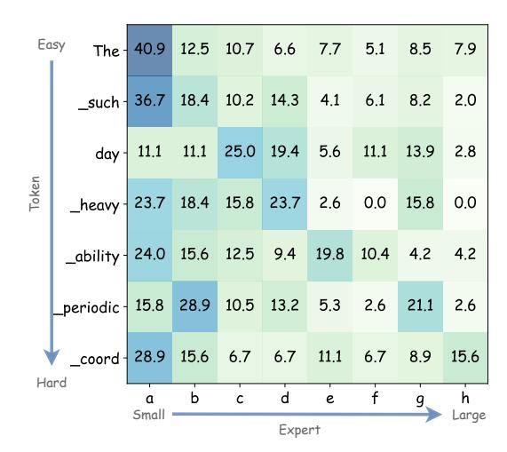

Figure 10: Visualization of activated experts ratio to tokens with different understanding difficulty. The expert size design is the same as Figure 9.

2020) and SwitchTransformer (Fedus, Zoph, and Shazeer 2022), which incorporated MoE into the Transformer architecture's Feed-Forward Network (FFN) layers, utilizing top-1 and top-2 routing strategies, respectively. Expert-choice MoE (Zhou et al. 2022) introduced Expert Choice Routing, allowing each expert to independently select a certain number of tokens, thereby achieving perfect load balancing. AutoMoE (Jawahar et al. 2022) establishes a search space tailored for small-scale heterogeneous MoE utilizing the top-1 routing strategy and employs Neural Architecture Search to derive a sub-network. Their experiments focus on machine translation tasks, and their approach is not suitable for pretrained language models. Lu et al. (2024) illustrate that not all experts are equal in the MoE model. They discard less important experts and find the model that keeps the most performance. More recently, (Huang et al. 2024) introduced the top-P routing strategy, dynamically allocating the number of experts to each token. Our work is the first work exploring HMoE as a base language model based on top-K and top-P routing strategies. Diverse expert sizes in our HMoE inherently result in variances in expert proficiencies. Under the same average activation setting, our expert parameter allocation is more reasonable, ultimately achieving higher performance

#### **Conclusion**

In this work, we propose a novel HMoE model, featuring experts of varying sizes to handle different token complexities. We enhance it by proposing a new training objective and exploring expert size distribution. Our experimental results show that HMoE improves both performance and computational efficiency. We believe that our work opens new avenues for the development of large language models. Future research could explore further optimization techniques and broader applications of heterogeneous expert architectures, potentially extending the benefits observed in this study to

an even wider array of natural language processing tasks.

## References

- Achiam, J.; Adler, S.; Agarwal, S.; Ahmad, L.; Akkaya, I.; Aleman, F. L.; Almeida, D.; Altenschmidt, J.; Altman, S.; Anadkat, S.; et al. 2023. Gpt-4 technical report. *arXiv preprint arXiv:2303.08774*.
- Bisk, Y.; Zellers, R.; Gao, J.; Choi, Y.; et al. 2020. Piqa: Reasoning about physical commonsense in natural language. In *Proceedings of the AAAI conference on artificial intelligence*, volume 34, 7432–7439.
- Brown, T.; Mann, B.; Ryder, N.; Subbiah, M.; Kaplan, J. D.; Dhariwal, P.; Neelakantan, A.; Shyam, P.; Sastry, G.; Askell, A.; et al. 2020. Language models are few-shot learners. *Advances in neural information processing systems*, 33: 1877– 1901.
- Chi, Z.; Dong, L.; Huang, S.; Dai, D.; Ma, S.; Patra, B.; Singhal, S.; Bajaj, P.; Song, X.; Mao, X.-L.; et al. 2022. On the representation collapse of sparse mixture of experts. *Advances in Neural Information Processing Systems*, 35: 34600–34613.
- Clark, C.; Lee, K.; Chang, M.-W.; Kwiatkowski, T.; Collins, M.; and Toutanova, K. 2019. BoolQ: Exploring the surprising difficulty of natural yes/no questions. *arXiv preprint arXiv:1905.10044*.
- Clark, P.; Cowhey, I.; Etzioni, O.; Khot, T.; Sabharwal, A.; Schoenick, C.; and Tafjord, O. 2018. Think you have solved question answering? try arc, the ai2 reasoning challenge. *arXiv preprint arXiv:1803.05457*.
- Computer, T. 2023. RedPajama: an Open Dataset for Training Large Language Models.
- Dai, D.; Deng, C.; Zhao, C.; Xu, R.; Gao, H.; Chen, D.; Li, J.; Zeng, W.; Yu, X.; Wu, Y.; et al. 2024. Deepseekmoe: Towards ultimate expert specialization in mixture-of-experts language models. *arXiv preprint arXiv:2401.06066*.
- Dubey, A.; Jauhri, A.; Pandey, A.; Kadian, A.; Al-Dahle, A.; Letman, A.; Mathur, A.; Schelten, A.; Yang, A.; Fan, A.; et al. 2024. The llama 3 herd of models. *arXiv preprint arXiv:2407.21783*.
- Fedus, W.; Zoph, B.; and Shazeer, N. 2022. Switch Transformers: Scaling to Trillion Parameter Models with Simple and Efficient Sparsity. *Journal of Machine Learning Research*, 23(120): 1–39.
- Gale, T.; Narayanan, D.; Young, C.; and Zaharia, M. 2022. MegaBlocks: Efficient Sparse Training with Mixture-of-Experts. arXiv:2211.15841.
- Gao, L.; Biderman, S.; Black, S.; Golding, L.; Hoppe, T.; Foster, C.; Phang, J.; He, H.; Thite, A.; Nabeshima, N.; et al. 2020. The pile: An 800gb dataset of diverse text for language modeling. *arXiv preprint arXiv:2101.00027*.
- Gao, L.; Tow, J.; Biderman, S.; Black, S.; DiPofi, A.; Foster, C.; Golding, L.; Hsu, J.; McDonell, K.; Muennighoff, N.; et al. 2021. A framework for few-shot language model evaluation. *Version v0. 0.1. Sept*, 10: 8–9.
- Huang, Q.; An, Z.; Zhuang, N.; Tao, M.; Zhang, C.; Jin, Y.; Xu, K.; Chen, L.; Huang, S.; and Feng, Y. 2024. Harder

- Tasks Need More Experts: Dynamic Routing in MoE Models. *arXiv preprint arXiv:2403.07652*.
- Jacobs, R. A.; Jordan, M. I.; Nowlan, S. J.; and Hinton, G. E. 1991. Adaptive Mixtures of Local Experts. *Neural Computation*, 79–87.
- Jawahar, G.; Mukherjee, S.; Liu, X.; Kim, Y. J.; Abdul-Mageed, M.; Lakshmanan, L. V.; Awadallah, A. H.; Bubeck, S.; and Gao, J. 2022. AutoMoE: Heterogeneous Mixtureof-Experts with Adaptive Computation for Efficient Neural Machine Translation. *arXiv preprint arXiv:2210.07535*.
- Jiang, A. Q.; Sablayrolles, A.; Roux, A.; Mensch, A.; Savary, B.; Bamford, C.; Chaplot, D. S.; Casas, D. d. l.; Hanna, E. B.; Bressand, F.; et al. 2024. Mixtral of experts. *arXiv preprint arXiv:2401.04088*.
- Kim, Y.; Lim, H.; and Han, D. 2024. Scaling Beyond the GPU Memory Limit for Large Mixture-of-Experts Model Training. In *Forty-first International Conference on Machine Learning*.
- Lepikhin, D.; Lee, H.; Xu, Y.; Chen, D.; Firat, O.; Huang, Y.; Krikun, M.; Shazeer, N.; and Chen, Z. 2020. GShard: Scaling Giant Models with Conditional Computation and Automatic Sharding. *Cornell University - arXiv,Cornell University - arXiv*.
- Lu, X.; Liu, Q.; Xu, Y.; Zhou, A.; Huang, S.; Zhang, B.; Yan, J.; and Li, H. 2024. Not All Experts are Equal: Efficient Expert Pruning and Skipping for Mixture-of-Experts Large Language Models. *arXiv preprint arXiv:2402.14800*.
- Ouyang, L.; Wu, J.; Jiang, X.; Almeida, D.; Wainwright, C.; Mishkin, P.; Zhang, C.; Agarwal, S.; Slama, K.; Ray, A.; et al. 2022. Training language models to follow instructions with human feedback. *Advances in neural information processing systems*, 35: 27730–27744.
- Paszke, A.; Gross, S.; Chintala, S.; Chanan, G.; Yang, E.; DeVito, Z.; Lin, Z.; Desmaison, A.; Antiga, L.; and Lerer, A. 2017. Automatic differentiation in PyTorch. In *NIPS-W*.
- Raffel, C.; Shazeer, N.; Roberts, A.; Lee, K.; Narang, S.; Matena, M.; Zhou, Y.; Li, W.; and Liu, P. J. 2020. Exploring the limits of transfer learning with a unified text-to-text transformer. *Journal of machine learning research*, 21(140): 1–67.
- Rajbhandari, S.; Rasley, J.; Ruwase, O.; and He, Y. 2020. Zero: Memory optimizations toward training trillion parameter models. In *SC20: International Conference for High Performance Computing, Networking, Storage and Analysis*, 1–16. IEEE.
- Sakaguchi, K.; Bras, R. L.; Bhagavatula, C.; and Choi, Y. 2021. Winogrande: An adversarial winograd schema challenge at scale. *Communications of the ACM*, 64(9): 99–106.
- Sap, M.; Rashkin, H.; Chen, D.; Le Bras, R.; and Choi, Y. 2019. Social IQa: Commonsense Reasoning about Social Interactions. In *Proceedings of the 2019 Conference on Empirical Methods in Natural Language Processing and the 9th International Joint Conference on Natural Language Processing (EMNLP-IJCNLP)*, 4463–4473.
- Shazeer, N.; Mirhoseini, A.; Maziarz, K.; Davis, A.; Le, Q.; Hinton, G.; and Dean, J. 2017. Outrageously Large Neural

Networks: The Sparsely-Gated Mixture-of-Experts Layer. *arXiv: Learning,arXiv: Learning*.

Touvron, H.; Lavril, T.; Izacard, G.; Martinet, X.; Lachaux, M.-A.; Lacroix, T.; Roziere, B.; Goyal, N.; Hambro, E.; ` Azhar, F.; et al. 2023a. Llama: Open and efficient foundation language models. *arXiv preprint arXiv:2302.13971*.

Touvron, H.; Martin, L.; Stone, K.; Albert, P.; Almahairi, A.; Babaei, Y.; Bashlykov, N.; Batra, S.; Bhargava, P.; Bhosale, S.; et al. 2023b. Llama 2: Open foundation and fine-tuned chat models. *arXiv preprint arXiv:2307.09288*.

Vaswani, A.; Shazeer, N.; Parmar, N.; Uszkoreit, J.; Jones, L.; Gomez, A.; Kaiser, L.; and Polosukhin, I. 2017. Attention is All you Need. *Neural Information Processing Systems,Neural Information Processing Systems*.

Wu, X.; Huang, S.; Wang, W.; and Wei, F. 2024. Multi-head mixture-of-experts. *arXiv preprint arXiv:2404.15045*.

Zellers, R.; Holtzman, A.; Bisk, Y.; Farhadi, A.; and Choi, Y. 2019. Hellaswag: Can a machine really finish your sentence? *arXiv preprint arXiv:1905.07830*.

Zhou, Y.; Lei, T.; Liu, H.; Du, N.; Huang, Y.; Zhao, V.; Dai, A. M.; Le, Q. V.; Laudon, J.; et al. 2022. Mixture-of-experts with expert choice routing. *Advances in Neural Information Processing Systems*, 35: 7103–7114.

## Limitation

While our study highlights the substantial benefits of HMoE, several pathways for enhancement and exploration remain. Firstly, our initial experiments have yielded promising results, especially with increased training FLOPs. We anticipate even greater efficacy and scalability with larger datasets and models. Future work will focus on validating these effects on a larger scale and conducting more comprehensive analyses. Secondly, we have begun to explore the heterogeneity among experts. Although our current configurations have shown superior performance compared to traditional MoEs, we recognize the potential for discovering even more optimal setups. Future research will delve deeper into various configurations and routing strategies to identify the best solutions for diverse applications, thereby unlocking even greater performance and efficiency. Lastly, despite our optimized model and training processes achieving faster training speeds for HMoEs compared to traditional MoEs, there is still room for improvement, particularly in hardware adaptation. We believe that HMoE can achieve even faster training speeds with further optimization.

