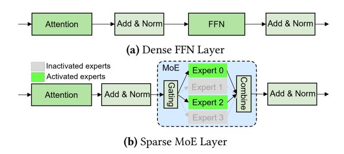
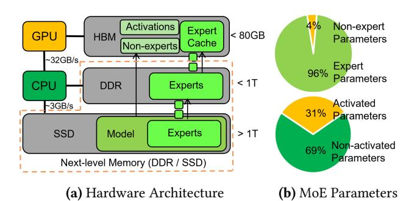
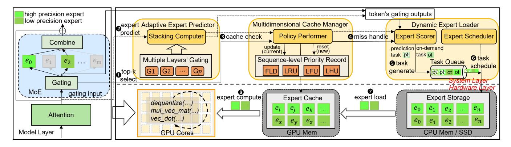
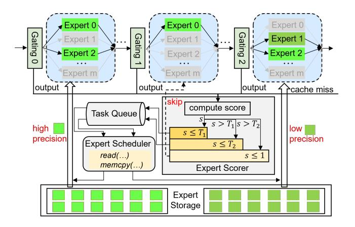
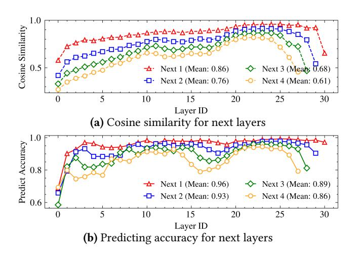
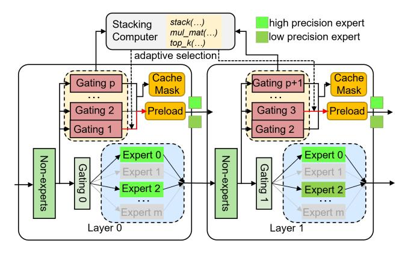
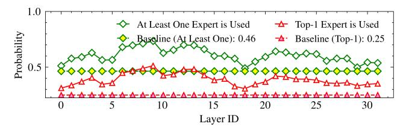
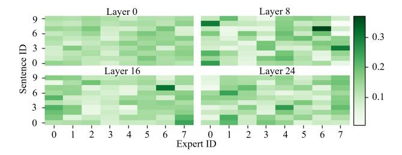

# HOBBIT: A Mixed Precision Expert Offloading System for Fast MoE Inference

Peng Tang1,\*, Jiacheng Liu2,\*, Xiaofeng Hou1,† , Yifei Pu1 , Jing Wang1 , Pheng-Ann Heng2 , Chao Li1,† , Minyi Guo1

1Department of Computer Science and Engineering, Shanghai Jiao Tong University, Shanghai, China 2Department of Computer Science and Engineering, The Chinese University of Hong Kong, China \* Equal contribution, † Corresponding authors

## Abstract

The Mixture-of-Experts (MoE) architecture has demonstrated significant advantages in the era of Large Language Models (LLMs), offering enhanced capabilities with reduced inference costs. However, deploying MoE-based LLMs on memoryconstrained edge devices remains challenging due to their substantial memory requirements. While existing expertoffloading methods alleviate the memory requirements, they often incur significant expert-loading costs or compromise model accuracy. We present HOBBIT, a mixed precision expert offloading system to enable flexible and efficient MoE inference. Our key insight is that dynamically replacing less critical cache-miss experts with low-precision versions can substantially reduce expert-loading latency while preserving model accuracy. HOBBIT introduces three innovative techniques that map the natural hierarchy of MoE computation: (1) a token-level dynamic expert loading mechanism, (2) a layer-level adaptive expert prefetching technique, and (3) a sequence-level multidimensional expert caching policy. These innovations fully leverage the benefits of mixedprecision expert inference. By implementing HOBBIT on top of the renowned LLM inference framework Llama.cpp, we evaluate its performance across different edge devices with representative MoE models. The results demonstrate that HOBBIT achieves up to a 9.93x speedup in decoding compared to state-of-the-art MoE offloading systems.

## 1 Introduction

The rapid explosion of Large Language Models (LLMs) has led to their widespread application across various fields [\[57\]](#page-14-0). Beyond deploying LLM in cloud-based data centers, there is a growing demand to deploy these models at the edge to address issues like high latency, privacy concerns, and dependence on stable network connections inherent in centralized approaches [\[15\]](#page-12-0). Consequently, there is an increasing need to run LLMs on edge devices, bringing intelligence closer to the end-user. Nowadays, both academia [\[6,](#page-12-1) [53,](#page-14-1) [56\]](#page-14-2) and industry [\[4,](#page-12-2) [21,](#page-13-0) [40\]](#page-13-1) are actively accelerating the deployment of LLMs at the edge.

In recent years, the Mixture of Experts (MoE) architecture [\[42\]](#page-13-2) has emerged as a promising approach to enhance LLM capabilities by enabling significant model size expansion while maintaining computational efficiency [\[1,](#page-12-3) [8,](#page-12-4) [13,](#page-12-5) [24,](#page-13-3) [46\]](#page-13-4). However, MoE-based LLMs demand substantial GPU memory for parameter storage. For instance, the Mixtral-8x7B model [\[24\]](#page-13-3), despite activating only 14 billion parameters per token, requires 87GB of memory to store its complete set of 45 billion parameters. This poses significant deployment challenges on memory-constrained edge devices, such as the NVIDIA Jetson AGX Orin with its 32GB memory capacity. To address this limitation, expert-offloading techniques have been developed to enable the execution of these large-scale models on memory-limited devices by exploiting the sparse activation patterns inherent in MoE architectures.

In essence, expert-offloading techniques primarily store all non-expert weights and a subset of important experts in GPU memory (referred to as the "expert cache"), while offloading other experts to CPU memory or SSD (referred to as "next-level memory"). When the required experts are not available in the expert cache, they are loaded from nextlevel memory into the cache, evicting some existing experts. However, due to limited memory bandwidth, loading an expert from next-level memory introduces significant latency, which can severely slow down inference. While existing systems optimize expert-offloading with various methods, they still face several limitations, as outlined below.

Inflexible and aggressive optimizations of expert loading. When an expert cache miss occurs, directly loading a missing expert incurs significant latency. To mitigate this, EdgeMoE [\[54\]](#page-14-3) employs different quantization levels for various experts to reduce I/O costs and AdapMoE [\[58\]](#page-14-4) skips certain experts to decrease loading costs. However, these approaches have notable limitations. EdgeMoE's static approach determines optimal bit widths based on specific dataset profiling, leading to inflexibility across diverse environments and potential accuracy impacts. This method becomes particularly complex when dealing with different models, especially as the number of experts increases. Conversely, AdapMoE's aggressive expert-skipping strategy can

1

cause substantial accuracy degradation, particularly with small top-k values (e.g., k = 2 in Mixtral-8x7B).

**Limited benefits of expert prefetching.** To reduce the waiting time for required experts, prefetching is a valuable technique that overlaps expert loading with GPU computation. However, since MoE models only need the top-k experts for the next layer, accurately predicting these top-k experts is crucial. MoE-Infinity [52] addresses this by prioritizing expert activation ratios for prefetching. MoE-Offloading [11] uses the gate inputs from the current layer as inputs for the next layer to predict the required experts. Pre-gated MoE [22] modifies the model structure by introducing a pregate function to determine the next layer's required experts in the current layer. Although prefetching can overlap expertloading with GPU computation, these prediction methods offer limited benefits because the expert-loading cost is typically much greater than the GPU computation cost in the inference process of MoE-based LLMs.

Inefficient management of expert cache. Given the sparse activation and temporal locality characteristics of experts, designing an appropriate cache replacement policy to manage the expert cache can significantly improve the expert cache hit ratio, reducing the need to load experts from next-level memory and thereby speeding up inference. For instance, EdgeMoE [54] and MoE-Infinity [52] utilize the least frequently used (LFU) policy, while MoE-Offloading [11] adopts the least recently used (LRU) policy. Although these approaches outperform random replacement policies, they are not fully optimal, as they fail to account for the unique characteristics of different models, which requires more tailored strategies to manage the expert cache efficiently.

To address the above challenges, we propose HOBBIT, a system designed to accelerate expert loading across three levels of MoE computation. It significantly accelerates MoE-based LLM inference on memory-limited devices compared to existing systems by utilizing mixed precision expert inference. Our key contributions are as follows:

- We propose a token-level dynamic expert loading mechanism that reduces latency through low-precision replacement of less critical cache-miss experts, maintaining accuracy and flexibility.
- We develop a layer-level adaptive expert prefetching technique with high prediction accuracy and minimal penalties, leveraging mixed-precision prefetching to optimize computation-communication overlap.
- We introduce a sequence-level multidimensional expert caching policy that combines model-specific strategies with mixed-precision features to efficiently manage the expert cache and minimize miss penalties across different models.
- We implement HOBBIT on top of Llama.cpp with 8,000 additional lines of C++/C code, and evaluate it on two popular MoE-based LLMs across two memory-limited

Figure 1. Comparison between different LLM architectures.

platforms, demonstrating up to 9.93x speedup in decoding over state-of-the-art systems.

## 2 Background and Motivation

#### 2.1 Background

**Spare MoE Layers**. Due to the effectiveness of the MoE architecture [23], numerous MoE-based models [10, 19, 47] have emerged. In this work, we focus on the most widely used sparse MoE layer [42], which employs FFNs as experts. As shown in Figure 1, unlike dense layers, the MoE layer uses a gating function to select the K most relevant experts (2 in the figure) for each input token, aggregating their outputs. This approach mimics specialized processing in different brain regions, enhancing model performance without increasing computational complexity. For an input x, the output y of the MoE module can be formulated as:

$$y = \sum_{i=1}^{K} G(x)_{e_i} E_{e_i}(x)$$
 (1)

where  $e_i$  is the i-th selected expert in the current layer,  $G(x)e_i$  represents the gating weight of expert  $e_i$ , and  $E_{e_i}(x)$  is the output of expert  $e_i$ . The gating function G(x) is typically implemented using a linear layer followed by a Top-k operation [8, 13, 24, 46]. By stacking MoE layers with multiple experts, LLMs can scale to massive sizes, improving performance while maintaining computational efficiency.

Expert Offloading. Parameter-offloading techniques typically transfer part of the model's parameters to CPU memory or SSDs when GPU memory is insufficient [3]. However, most offloading systems, such as Zero-Infinity [39] and Accelerate [18], are designed for dense LLMs and load model parameters layer-by-layer on demand. This approach overlooks the sparse activation nature of MoE models, resulting in substantial latency. For instance, loading a layer of the Mixtral-8x7B model from CPU memory via a PCIe 4.0 link (32GB/s) takes approximately 80ms, while computing the same layer on an RTX 4090 GPU requires only about 3ms.

To address the latency issue of MoE models when using parameter offloading, some studies have developed expert-offloading, a specialized form of parameter-offloading tailored to the sparse activation characteristic of MoE [11, 25,

Figure 2. Expert-offloading on hardware architecture and

model parameter distribution for Mixtral-8x7B.

[52\]](#page-14-5). As shown in Figure [2-](#page-2-0)(a), this technique typically considers two levels of hardware memory: GPU memory stores all non-expert weights, a subset of "hot experts" (expert cache), and internal activations, while other experts are offloaded to CPU memory or SSD and loaded on demand. This approach is effective because each token requires all non-expert weights but only a fraction of experts. Figure [2-](#page-2-0)(b) illustrates this efficiency using the Mixtral-8x7B model as an example: nonexpert weights constitute only 4% of the model, and just 31% of the parameters are activated per token. By leveraging this sparse activation pattern, expert-offloading significantly reduces GPU memory requirements while maintaining model functionality, making it possible to deploy large MoE models on memory-constrained devices.

Despite the effectiveness, existing expert-offloading techniques still incur high latency due to on-demand loading. While some of the works focus on optimizing prefetching techniques and cache replacement policies to accelerate inference speed, they remain constrained by the significant cost of expert loading during cache misses.

## 2.2 Motivations

We identify two key observations that motivate our work: Expert loading dominates inference cost. To quantify the bottlenecks in MoE model inference, we measured the time costs of different operations when running a Mixtral-8x7B layer on two memory-limited edge devices: an RTX 4090 (representing an edge server) and a Jetson Orin (representing an end device). As shown in Figure [3-](#page-2-1)(a), expert loading dominates the total inference time, consuming approximately 85.5% on the RTX 4090 and 94.5% on the Jetson Orin, while computation accounts for only a small fraction. While prefetching is commonly used to accelerate offloading by overlapping computation with data loading, its benefits are severely limited in MoE models due to this disproportionate time distribution. Some researchers have attempted to address this by employing dynamic gating to limit the number of experts loaded [\[30,](#page-13-11) [58\]](#page-14-4). However, this approach comes with significant accuracy trade-offs. As shown in Figure [3-](#page-2-1) (b), the "Expert Skip" method results in notable degradation

Figure 3. Analysis of expert loading acceleration chances.

of model performance, with a 10% expert skip rate causing more than a 1% increase in perplexity (PPL).

Mixed precision expert preserves model accuracy. Quantization is an effective method for reducing model parameter size, but directly quantizing the entire model can result in substantial accuracy loss. In MoE models, different experts have varying levels of importance [\[27,](#page-13-12) [54,](#page-14-3) [58\]](#page-14-4), so quantizing only the less important experts minimally impacts accuracy. As shown in Figure [3-](#page-2-1)(b), compared to skipping some experts, replacing them with low-precision versions better maintains model accuracy, and the gap between skipping and replacing grows as the ratio increases. In particular, when fewer than 20% of the experts are quantized, model performance declines by no more than 1%. Thus, applying quantization to low-importance experts in expert-offloading techniques can significantly reduce expert-loading cost. Specifically, if a required expert is not available in GPU memory and its importance is low, we can fetch a lower-precision version to replace it, thereby greatly reducing loading time. For instance, replacing a float16 expert with an int4 version can achieve up to a 4x speedup in the loading process.

These observations motivate the need for a system that can dynamically manage expert precision during inference while maintaining model accuracy.

## 3 HOBBIT System

#### 3.1 Overview of HOBBIT

HOBBIT is a mixed precision expert offloading system designed for the inference of MoE-based LLMs on memorylimited devices. It incorporates three-level innovations: (i) a token-level dynamic expert loading mechanism that selects an appropriate precision expert from CPU memory or SSD through gating networks; (ii) a layer-level adaptive expert prefetching technique that provides highly accurate prefetching decisions for subsequent layers; and (iii) a sequence-level multidimensional expert caching policy that combines multiple cache replacement strategies along with the unique features of the mixed precision experts. The three-level design of HOBBIT directly maps to the natural hierarchy of MoE computation, ensuring comprehensive optimization while avoiding redundant granularities.

Figure 4. System overview of HOBBIT.

As shown in Figure 4, HOBBIT consists of three main modules built upon these mechanisms: Dynamic Expert Loader, Adaptive Expert Predictor, and Multidimensional Cache Manager. The Dynamic Expert Loader implements the dynamic loading mechanism to generate loading tasks for cache-miss experts and load corresponding precision experts. The Adaptive Expert Predictor leverages the adaptive prefetching technique to predict experts required for subsequent layers. The Multidimensional Cache Manager employs the proposed multidimensional caching policy to manage experts stored in GPU memory.

When executing a MoE layer on the GPU, the system first ① selects the top-k required experts (referred to as ondemand experts) for MoE computation based on the gating outputs. Simultaneously, the Adaptive Expert Predictor ② predicts the experts needed for subsequent layers (referred to as prediction experts) using its Stacking Computer, based on the current gating input. The Multidimensional Cache Manager then ③ checks if the required experts are present in the expert cache and updates (for the current processing sequence) or resets (for a new coming sequence) the priority record with its Policy Performer. If all on-demand experts are present in the cache, ③ the expert computation is performed on the GPU cores.

If any on-demand or prediction experts are missing from the cache, the Dynamic Expert Loader uses the Expert Scorer to ① handle the cache miss based on the gating outputs of the current processing token. The Expert Scorer dynamically ② generates the corresponding loading tasks with varying precision requirements, adding them to the Task Queue. The Expert Scheduler module in the Dynamic Expert Loader ③ then fetches tasks from the Task Queue and ② loads the corresponding experts from the Expert Storage into the Expert Cache. If necessary, the Multidimensional Cache Manager will replace older experts in the cache based on the proposed caching policy. The system waits for all on-demand expert loading tasks to complete before ③ computing the outputs of the experts for the MoE module and advancing to the next layer. This process efficiently handles expert cache misses

**Figure 5.** Gating output statistics of Mixtral-8x7B.

and accelerates inference by reducing expert-loading costs through the use of adaptive precision experts.

#### 3.2 Token-level Dynamic Expert Loading

Loading low-precision experts during cache misses effectively mitigates expert loading latency, as demonstrated in Section 2.2. However, to preserve model accuracy, this replacement should target only less important experts. While model profiling on specific datasets can identify expert importance, this static approach is impractical for diverse deployment environments. Instead, we need a dynamic method to assess expert importance based on runtime inputs during the LLM's generation process.

**Expert importance estimation.** Based on the computing pattern of the MoE module in Equation (1), expert  $e_i$  contributes  $G(x)_{e_i}E_{e_i}(x)$  to the output y. We can represent the influence of expert  $e_i$  on the output using the magnitude  $||G(x)_{e_i}E_{e_i}(x)||$  (where  $||\cdot||$  denotes magnitude), as a smaller magnitude implies that the values in the tensor are closer to zero. Since  $E_{e_i}(x)$  cannot be computed without the weight of expert  $e_i$ , we approximate  $||G(x)_{e_i}E_{e_i}(x)||$  using  $||G(x)_{e_i}||$ . This approximation is based on our observation that  $||G(x)_{e_i}||$  and  $||G(x)_{e_i}E_{e_i}(x)||$  are positively correlated. To confirm this positive relationship, we collected both the expert output ||G(x)E(x)|| and the gating output ||G(x)|| from the Mixtral-8x7B model. After normalizing the data, we

Figure 6. Token-level dynamic Expert Loader.

compute the Pearson correlation coefficient matrix and plot a heatmap to visualize their relationship. As shown in Figure 5-(a), the two variables exhibit a strong positive correlation, with a coefficient of 0.99.

<u>Takeaways</u>: We can leverage ||G(x)|| as a computationally efficient proxy for expert importance, given its strong positive correlation with ||G(x)E(x)||.

**Expert loader design.** Based on the observations above, we first rank the selected K experts in descending order of  $||G(x)_{e_i}||$  (where a larger i corresponds to a smaller  $||G(x)_{e_i}||$ , and ||G(x)|| values are normalized). Next, we calculate the unimportance degree score  $s_{e_i}$  for each expert  $e_i$  as follows:

$$s_{e_i}(x) = \begin{cases} \sum_{j=0}^{i-1} ||G(x)_{e_j}||, & i > 0\\ 0, & i = 0 \end{cases}$$
 (2)

Where x is the gating input of current processing token. Thus, each expert  $e_i$  has a score to represent its importance (a higher score indicates lower importance). This score will determine whether the expert is replaced with a low-precision version. Specifically, we set a threshold  $T_1$ (where  $0 \le T_1 \le 1$ ): if  $s_{e_i} \le T_1$ , we consider the expert important and load the high-precision version; otherwise, we opt for the low-precision version to reduce loading overhead due to its minimal influence on the output. Notably, we always treat the first expert  $(e_0)$  as important, keeping it in high precision to maintain model accuracy.

Based on the unimportance degree score, we implement the Dynamic Expert Loader as illustrated in Figure 6. To increase flexibility, we introduce a second threshold  $T_2$ , allowing the system to bypass less important experts. As shown in Figure 6, when a cache miss occurs, the Expert Scorer module computes the scores of the missed experts and generates appropriate tasks based on these scores, adding them to the Task Queue. The Expert Scheduler then fetches tasks from the queue and loads the corresponding precision experts from expert storage via system calls, such as read(...). For instance, in the figure, Gating 0 retrieves a high-precision

**Figure 7.** Cosine similarity and predicting accuracy across layers of Mixtral-8x7B, where "Next i" refers to the next *i*-th layer from the current layer.

expert due to its high importance, Gating 1 skips an expert deemed of very low importance, and Gating 2 fetches a low-precision expert for moderate importance. To select the threshold values, we can profile the score distribution of all experts. As depicted in Figure 5-(b), we set  $T_1 = 0.6$  and  $T_2 = 0.9$  for the Mixtral-8x7B model, dividing the experts into three groups: 67% in high precision, 30% in low precision, and 3% to skip. This configuration maintains model accuracy while significantly reducing expert-loading costs. Due to Mixtral-8x7B's top-2 selection mechanism, all top-1 experts (50% of selections) receive scores of 0, ensuring they remain in the high-precision group.

With this method, HOBBIT can dynamically load experts with the appropriate precision based on the current input when a cache miss occurs, significantly reducing expert-loading latency while maintaining both model accuracy and deployment flexibility.

#### 3.3 Layer-level Adaptive Expert Prefetching

To fully leverage the benefits of overlapping communication with computation, we require a highly accurate method for prefetching mixed precision experts for subsequent layers, while minimizing penalties from incorrect predictions. Due to the layer-by-layer structure of LLMs, we can explore the similarities between model layers to design the method.

Similarity between layers. Due to the residual structure in LLMs, hidden states across consecutive layers exhibit significant similarity [5, 26, 36]. This suggests that the inputs to the gating function in the MoE module also share high similarity across successive layers. As shown in Figure 7-(a), the cosine similarity of gating inputs between two consecutive layers (labeled as "Next 1" in the figure) is notably high in the Mixtral-8x7B model. In fact, even the inputs for the next two and three layers exhibit considerable similarity. As

Figure 8. Layer-level adaptive Expert Predictor.

a result, we can leverage the gating input from the current layer to predict the required experts for subsequent layers. Figure [7-](#page-4-1)(b) demonstrates that the top-1 expert prediction accuracy for the next layer is very high, averaging 96% across layers. Even for the next two or three layers, the accuracy remains around 90% on average across all layers.

Takeaways: We can exploit the strong layer-wise similarity of gating inputs to design an accurate and efficient expert prefetching mechanism.

Expert predictor design. Based on these observations, we build the layer-level Adaptive Expert Predictor. As depicted in Figure [8,](#page-5-0) we begin by predicting the experts required for the next layer. If all predicted experts are present in the expert cache, we then proceed to predict for the subsequent layer. This process continues until either some predicted experts are missing from the cache or all predictions are completed ( gating modules per layer). For example, in layer 0 of the figure, the experts for layer 1 (gating 1) need to be preloaded, while those for layer 3 (gating 3) are required at layer 1 since the experts for layer 2 are already in the expert cache. Furthermore, we will mask all predicted experts to prevent them from being evicted from the expert cache, as they are highly likely to be used in the subsequent layers. And we preload versions of the experts with different precision levels to facilitate faster loading and minimize prediction penalties.

When integrating the predictor into the system, we must consider both the computational overhead of the predictor and the penalties associated with incorrect predictions. In a naive approach, the gating function would be computed sequentially until the required experts are identified, resulting in an overhead that grows linearly with the number of gating computations. Obviously, this method is inefficient. Given that one dimension of the gating module's weight corresponds to the number of experts (typically small values such as 8, 16, or 64), we can optimize the process by stacking all gating modules together and computing them

Figure 9. Preload timeline under different conditions.

simultaneously. This approach nearly matches the computational speed of a single gating module, taking advantage of the high parallel performance offered by GPUs. Therefore, we design the Stacking Computer module to compute all gating modules at once using several tensor operations, including stacking, matrix multiplication, and top-k selection, and to adaptively select the required experts for preloading. This stacking module efficiently identifies the required experts while minimizing the overhead associated with the prefetching technique.

Under ideal conditions, there would be no penalties associated with incorrect predictions from the predictor, as we can halt the memory copy operation upon detecting an error and immediately initiate the loading of the correct expert. However, in practical implementations, such as with cudaMemcpy(), we cannot interrupt the memory copy operation until it completes. As a result, we must wait for the loading of the incorrect expert to finish before we can begin loading the required experts. Given the lengthy expert-loading latency, this can lead to significant penalties when prediction accuracy is low, potentially resulting in worse performance than on-demand loading without predictions. As shown in Figure [9,](#page-5-1) we can gain some benefits when prediction accuracy is high (Figure [9-](#page-5-1)(b)). In contrast, low prediction accuracy results in penalties (Figure [9-](#page-5-1)(c)) due to the time costs associated with loading incorrect experts. However, our approach leverages mixed precision expert loading mechanism to mitigate this issue. Comparing Figure [9-](#page-5-1)(c) with Figure [9-](#page-5-1)(e), we see that even with low prediction accuracy, we can still obtain benefits from using mixed precision expert loading, as it incurs much lower penalties than the original method. Moreover, when prediction accuracy is high, we observe greater benefits (Figure [9-](#page-5-1)(d)).

Therefore, with the mixed precision expert loading method, HOBBIT can fully exploit the benefits of prefetching, achieving high prediction accuracy with minimal penalties from incorrect prefetching.

(a) Probability of experts used between two consecutive tokens

(b) Frequency of experts used in different sequences

**Figure 10.** Statistics of experts usage for Mixtral-8x7B.

