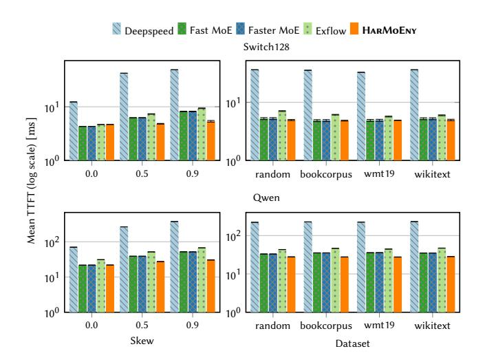
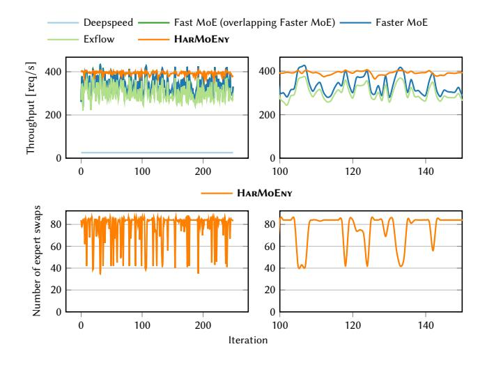
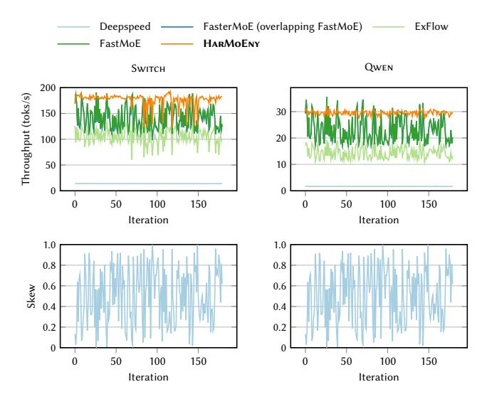
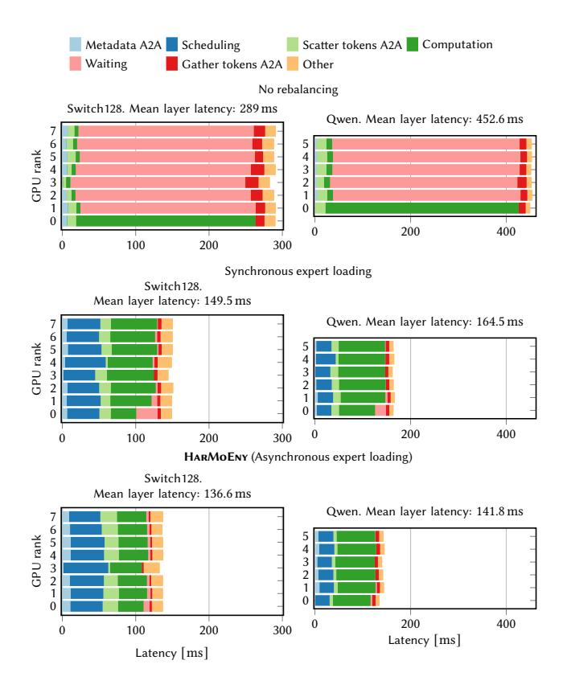
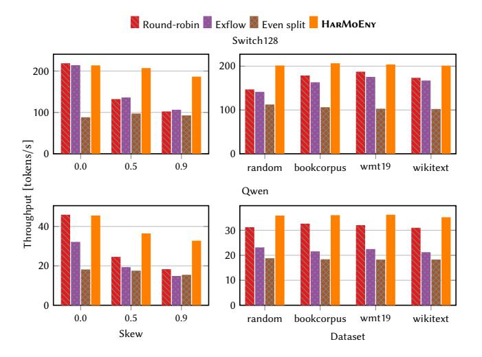
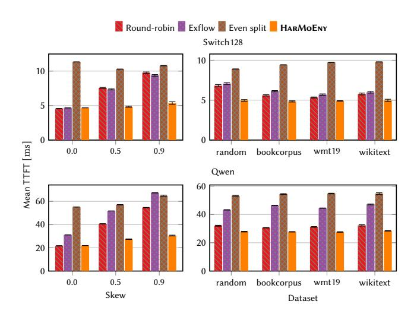

# 5.2 Comparison to state-of-the-art systems

Skewed datasets. HarMoEny performs especially well when workloads exhibit high expert popularity skew. To showcase this feature, we artificially create workloads with 50% and 90% skew, i.e., 50% and 90% of the tokens are routed to one popular expert, as detailed above. Figure [7](#page-8-0) (left) and Figure [8](#page-8-1) (left) show the throughput and mean TTFT for the Constant dataset with different levels of router skew. In the scenario with 90% skew, HarMoEny outperforms Fast-MoE and FasterMoE by 1.5x and 1.7x for both the Switch128 and Qwen models, respectively. HarMoEny beats DeepSpeed by 9.1x for the 90% skew and 8.8x for 50% skew scenario for Switch128. The trend remains the same for Qwen. When compared to the MoE inference solution ExFlow, HarMoEny performs 1.7x and 1.5x better on the 90% and 50% skew, respectively for Switch128. The performance boost is even higher for Qwen that has larger experts with HarMoEny outperforming ExFlow by 2.2x and 1.8x in the 90% and 50% skew scenarios. In the 50% skewed workload, HarMoEny is 1.3x and 1.4x faster than FasterMoE for Switch128 and Qwen, respectively.

<span id="page-7-0"></span><sup>2</sup>DeepSpeed-MII, separate to DeepSpeed, is not evaluated as the framework cannot execute on pre-Ampere GPUs, such as the V100s used in these experiments.

<span id="page-8-0"></span>

Figure 7: Throughput (<sup>↑</sup> is better) for different systems and different skews (left) and datasets (right) when using the Switch128 (top) and Qwen models (bottom).

<span id="page-8-1"></span>

Figure 8: Mean TTFT (<sup>↓</sup> is better) for different systems and different skews (left) and datasets (right) when using the Switch128 (top) and Qwen (bottom) models.

Similar to the baselines, there is a deterioration in the throughput of HarMoEny as the skew increases. This happens because in extremely skewed cases, all the experts except for the popular one have very few tokens to process. Therefore, HarMoEny is not able to efficiently mask the expert fetching with computation leading to slightly lower throughputs. However, it is important to note that HarMoEny outperforms the state-of-the-art baselines in the skewed scenarios.

As expected, there is little difference between most systems when all experts are equally popular (0% skew). FastMoE and Faster-MoE are 8% faster than HarMoEny in the Switch128 workload with no skew due to HarMoEny's increased overhead when scheduling experts for each batch. This overhead is visible as the number

of experts in Switch128 is high (128). The scheduling compute is not noticeable for Qwen, which uses 60 experts per MoE block. Furthermore, HarMoEny outperforms both DeepSpeed and ExFlow in terms of throughput and TTFT in the experiments with Qwen without any skew. The lower performance of DeepSpeed is due to the scheduling policy and that of ExFlow can be attributed to the inability to adapt the expert placement according to runtime skew.

Real-world datasets. Figure [7](#page-8-0) (right) and Figure [8](#page-8-1) (right) show the throughput and mean TTFT of HarMoEny, DeepSpeed, FastMoE, FasterMoE, and ExFlow running the Switch128 (top) and Qwen (bottom) models. The figures show the three real-world datasets and the random dataset described in Section [5.1.2.](#page-7-1) Notably, Har-MoEny maintains steady high throughput (201 tokens/s and 36 tokens/s for Switch128 and Qwen respectively) and low mean TTFT (5ms and 27ms for Switch128 and Qwen respectively) in all real-world datasets. Compared to ExFlow and FasterMoE, this results in a speedup of 20% and 7% on the random and wikitext datasets, respectively. DeepSpeed remains an outlier here with very low throughput and high TTFT. This is due to HarMoEny's lightweight load rebalancing mechanism and asynchronous prefetching that keep all GPUs operating at close to 100% (more details in Section [5.3.2\)](#page-9-0).

For the Switch transformer model, HarMoEny is on par with FasterMoE and FastMoE. Since the size of the experts is relatively small (18MB), FastMoE's and FasterMoE's expert shadowing mechanism is enough to ensure good load balancing because the GPU memory can comfortably host the shadowed experts. Fast-MoE and FasterMoE obtain virtually identical results, within 92% to 98% the throughput of HarMoEny across the four workloads. However, the throughput difference is accentuated for larger models. For Qwen (33MB per expert), the gap widens compared to Switch128. HarMoEny is 15% to 28% faster than FastMoE and FasterMoE because the extent of the expert shadowing is constrained by the GPU memory. ExFlow, while having consistent performance, falls behind HarMoEny for both models because it does not run the expert placement optimization often enough to keep up with expert popularity fluctuations.

Fluctuating expert popularity over time. Figure [9](#page-9-1) shows a scenario where each batch has a different randomly chosen expert popularity skew (between 0% and 50%). From the top row, it is evident that HarMoEny maintains high and steady throughput while the other baselines have drops in throughput by up to 37%. This scenario shows the effectiveness of HarMoEny's lightweight approach, which can sustain rapidly changing load imbalance without affecting throughput. Figure [9](#page-9-1) (bottom) shows the number of expert swaps in HarMoEny for every batch of input request. The dynamic number of expert swaps confirms that the expert pre-fetching mechanism running out of the critical path maintains stable high throughputs. From the zoomed-in version in Figure [9](#page-9-1) (right column), we can observe that baselines FastMoE, Faster-MoE, and ExFlow perform really well and FasterMoE surpasses HarMoEny in batches where HarMoEny swaps the least experts. These are batches where there is almost negligible load imbalance across the GPUs. In other words, the baselines work well when there is almost no skew in expert popularity, and hence, all GPUs

<span id="page-9-1"></span>

Figure 9: Throughput with 0%-50% skew randomly chosen every batch on SWITCH128. Right-hand zooms into a shorter interval. Swaps in HARMOENY maintain high throughput.

<span id="page-9-2"></span>

Figure 10: The throughput of HARMOENY and baselines across iterations (top) and skew in expert popularity (bottom), for the SWITCH128 (left) and QWEN (right) models. HARMOENY maintains consistent throughput while skew varies from 0% to 95% per batch.

perform equal computation. In such scenarios, the lower throughput of Harmoeny is due to the overhead of the token scheduler (see Section 4.2).

Figure 10 extends the analysis from Figure 9 by evaluating a broader range of expert skew values, ranging from 0% to 95%. This figure also includes results for QWEN, and the bottom row annotates the expert skew at each iteration. Harmoeny not only achieves the highest overall throughput but also demonstrates significantly lower variance across batches of the same size but differing skew levels. Specifically, Harmoeny shows a variance of  $152 \ toks^2/s^2$ 

compared to ExFlow's  $206\ toks^2/s^2$ , FasterMoE's  $447\ toks^2/s^2$ , and FastMoE's  $477\ toks^2/s^2$ . While DeepSpeed exhibits the lowest variance, this comes at the cost of throughput due to its input padding strategy, yielding only  $13\ tok/s$  versus Harmoeny's  $176\ tok/s$ . Therefore, this comparison is not entirely fair. For Qwen, Harmoeny achieves a larger variance reduction, with a variance of just  $0.59\ tok^2/s^2$ , significantly outperforming ExFlow's  $4.58\ toks^2/s^2$  ( $7.76\times$ ), FasterMoE's  $22.77\ toks^2/s^2$  ( $38.59\times$ ), and FastMoE's  $22.9\ toks^2/s^2$  ( $38.8\times$ ). In summary, when the expert popularity changes across batches, Harmoeny achieves a high throughput by dynamically adapting to the load imbalance.

## 5.3 Ablation study of HARMOENY

5.3.1 Time breakdown of Harmoeny components. We now conduct a time breakdown of the different operations when serving an MoE with Harmoeny. We adopt the Constant workload and assign 90% tokens to the first 10 experts ( $\alpha=0.9$ ). We use NVIDIA CUDA Events to obtain a fine-grained time breakdown of the operations in the first MoE layer. Figure 11 shows the duration of different operations in Harmoeny without any rebalancing (top), with rebalancing but without asynchronous expert loading (middle), and our original Harmoeny with all its components (bottom). Since the first 10 experts are loaded on GPU 0, we observe significant GPU waiting time for all other GPUs when we do not rebalance the token load using Algorithm 2, which is in line with the discussion in Section 3. Specifically, GPUs 1–7 spend on average 85.7% (QWEN) of the time waiting for GPU 0 to finish processing experts.

Our token rebalancing algorithm shrinks the waiting time on all GPUs. The mean waiting time goes from 82.6% and 85.7% of the total GPU time down to a mere 2.6% and 1% for SWITCH128 and QWEN, respectively across all GPUs, as seen in Figure 11 (middle). For the SWITCH128 model, token rebalancing reduces the mean layer latency from 289 ms to 149.5 ms, a total reduction of 48.3%. This reduction is even more pronounced with the QWEN model: 63.7% compared to when not rebalancing tokens. On average, our scheduling algorithm takes, 30.8% and 20.3% of the mean latency for the SWITCH128 and QWEN model, respectively. While scheduling and rebalancing in HARMOENY takes time, it brings a significant decrease in total latency.

Figure 11 (bottom) shows the timeline of operations of Harmoenv with all components enabled. Asynchronous expert loading further reduces the latency to 136.6 ms (-8.63% over synchronous loading) for Switch128 and to 141.8 ms (-13.8% over synchronous loading) for Qwen. Thus, we conclude that the combination of token rescheduling and asynchronous fetching in Harmoenv effectively minimizes the idling of GPUs and reduces the latency of MoE inference.

<span id="page-9-0"></span>5.3.2 Load balancing policies. We next experiment with HARMOENY and when using different token rebalancing policies and measure the throughput in tokens/s. We implement the token rebalancing policies on top of HARMOENY to account for differences in system baselines implementations.

We evaluate HARMOENY against three other policies for token routing: (1) With the Round-robin policy, tokens are sent to the GPU housing the specified expert, regardless of imbalance, with experts distributed to GPUs in a round-robin manner. This policy

<span id="page-10-0"></span>

Figure 11: Time breakdown of HARMOENY and baselines for the Switch128 (left) and Qwen (right) models.

<span id="page-10-1"></span>

Figure 12: Throughput († is better) for different token load policies and different skews (left) and datasets (right) when using the SWITCH128 (top) and QWEN models (bottom).

is employed by DEEPSPEED, FASTMOE, and FASTERMOE; (2) The EXFLOW policy utilizes an integer programming-based approach to optimize token scheduling and routing by modeling the inter-layer

<span id="page-10-2"></span>

Figure 13: Mean TTFT ( $\downarrow$  is better) for different token load policies and different skews (left) and datasets (right) when using the SWITCH128 (top) and QWEN models (bottom).

affinity between tokens and experts, formulating a placement optimization problem to minimize the communication cost of routing tokens between GPUs; (3) Even Split evenly distributes the tokens for each expert to each GPU and replicates all experts on all GPUs. For example, if there are a tokens for expert 0 and four GPUs then  $\frac{a}{4}$  tokens will be sent to each of the four GPUs. This achieves a perfect load balance across all experts at the cost of replication of all experts across all the GPUs.

**Skewed datasets.** Figure 12 (left) and Figure 13 (left) show the throughput and mean TTFT under different token load policies and different skew levels  $\alpha$ , for the two MoE models. In these experiments, we skew the load of a single expert. Harmoeny, when using Switch128 with  $\alpha=0$  (no skew), reaches a throughput of 213 tokens/s which is comparable to that of the Round-robin and ExFlow policies. However, as  $\alpha$  increases and consequentially, the load imbalance, Harmoeny reaches a significantly higher throughput than the other policies. For  $\alpha=0.9$ , Harmoeny reaches a throughput of 186 tokens/s compared to 106 tokens/s for ExFlow, the best-performing baseline. We observe similar trends when using the Qwen model (Figure 12, bottom left). Even though the even split policy achieves perfect load balance, its performance is relatively low. This is because each GPU has to load and execute every expert, thus increasing the time taken to process a batch of inference requests.

Figure 13 (left) shows that for  $\alpha=0$  and with the SWITCH128 model, Harmoeny has a mean TTFT of 4.68 ms, which is comparable to that of the Round-robin and ExFlow policies. However, when  $\alpha$  increases, so does the mean TTFT of other policies. With  $\alpha=0.9$  and with the SWITCH128 model, Harmoeny has a mean TTFT of 5.36 ms, compared to 9.77 ms and 9.38 ms for the Round-robin and ExFlow policies, respectively. The mean TTFT of Harmoeny is also competitive when using the Qwen model. Thus, Harmoeny exhibits excellent mean TTFT, even under heavy token imbalances.

Real-world datasets. Figure 12 (right) and Figure 13 (right) show the throughput and mean TTFT of Harmoeny and other policies for real-world datasets. For all datasets and models used, Harmoeny reaches the highest throughput. This is the most pronounced when using the random dataset and Switch128 model. Figure 13 (right) shows that Harmoeny exhibits the lowest mean TTFT, thus justifying the token distribution policy in Harmoeny.

#### 6 Related work

In this section, we discuss the related work and present the comparison with HARMOENY.

**Efficient MoE inference.** Recent works address the efficiency problem for MoE inference by optimizing communication overhead, token imbalance, and GPU kernels. DeepSpeed-MoE Inference [29] is a framework for serving MoE models providing flexible parallelization combinations, highly optimized MoE-related kernels, and an efficient communication subsystem. However, the static expert assignment in DeepSpeed-MoE struggles under skewed and dynamic workloads. Tutel improves upon DeepSpeed-MoE by introducing adaptive parallelism at runtime [14]. While Tutel handles dynamic workloads better than DeepSpeed-MoE, its static expert placement limits its ability to handle severe load imbalance. ExFlow reduces the all-to-all communication overhead by exploiting interlayer expert affinity [38]. While effective, it assumes stable expert routing patterns, which may not adapt well to fluctuating inputs. Lina [23] improves inference performance through dynamic resource scheduling to balance skewed workloads with a 2-phase scheme by profiling experts and predicting expert selection. Though effective in scenarios where inference requests are from similar domains, Lina needs to reallocate resources when the expert popularity changes. In contrast, HARMoENY directly targets load imbalance in skewed workloads through token redistribution and dynamic expert placement. In addition, frameworks like DeepSpeed-MII [26] and vLLM [20] are under active development and utilize highly optimized CUDA kernels targeted to specific GPU architecture. Our approach is orthogonal to these. HARMoEny works at the application layer and can be further optimized with specialized GPU kernels as in DeepSpeed-MII or vLLM.

Efficient MoE training. Several frameworks have been proposed to make training of MoE models efficient. FastMoE [12] introduces an MoE training system with hierarchical interfaces and optimized CUDA kernels, enabling scalability but relying on static expert placement. FasterMoE [13] builds on this by addressing load imbalance through dynamic shadowing and fine-grained scheduling, while introducing congestion-avoiding expert selection during training. Since the experts are sparsely activated, Megablocks [10] achieves hardware efficiency by combining expert computations into block-sparse operations. Similar to DeepSpeed-MoE, Smart-MoE [39] supports dynamic and hybrid parallelization strategies for MoE training. Finally, Prophet [34] utilizes a fine-grained planner and exploits similarity in token distribution across training iterations. Contrary to the aforementioned approaches, HARMOENY focuses on dynamic inference load imbalance rather than training.

#### 7 Conclusion

We presented Harmoeny, a novel system that addresses load imbalance in multi-GPU inference of MoE models. Through the combination of dynamic token rebalancing and asynchronous expert fetching, Harmoeny achieves near-perfect load balancing, significantly reducing inference latency. Our comprehensive evaluation using multiple datasets and MoE models demonstrated that Harmoeny outperforms state-of-the-art baselines. With heavy token imbalance, Harmoeny increases throughput by up to 70.1% and reduces time-to-first-token by up to 41.1%, compared to the next-best competitor, while maintaining stable throughput.

## <span id="page-11-1"></span>A Appendix: Model Statistics

<span id="page-11-2"></span>

| Model     | MoE Layers | Experts | Expert size (MB) |
|-----------|------------|---------|------------------|
| Switch128 | 12         | 128     | 18               |
| Qwen      | 24         | 60      | 33               |

Table 1: Specifications of the MoE models used in evaluation.

Table 1 shows the specifications of the two MoE models we have used in our evaluation.

## <span id="page-11-0"></span>B Appendix: Mathematical Estimate for q

Following is a step-by-step breakdown of getting a formula for estimating the minimal size for q given that the expert is a 2-layer MLP. q represents the number of tokens that are required so that its processing time is greater than the time it takes to load an expert. Let the expert have two linear layers with the first being of size  $m \times p$ , and the second being  $p \times m$ . The expert is evaluated as  $xW^1W^2$ . This can be represented as:

$$\frac{\text{Number of Floating Point Operations}}{\text{GPU FLOPS}} > \frac{\text{Expert Size}}{\text{PCIe Bandwidth}} \qquad (5)$$

$$\frac{|O|}{\phi} > \frac{|E|}{\beta} \qquad (6)$$

$$\frac{qp(2m-1) + qm(2p-1)}{\phi} > \frac{(mp+pm)d_{type}}{\beta} \qquad (7)$$

On ignoring small terms and simplifying, we get:

$$\frac{2qpm + 2qpm}{\phi} > \frac{2pm \cdot d_{type}}{\beta} \tag{9}$$

$$\frac{q \cdot 4pm}{\phi} > \frac{2pm \cdot d_{type}}{\beta} \tag{10}$$

$$q > \frac{\phi \cdot d_{type}}{2\beta} \tag{11}$$

(8)

## C Integrating HARMoENY

The following Python code demonstrates how to add Harmoenv to an existing model. The replace\_moe\_layer function injects our MoE implementation based on user-specified parameters.

```
from harmonymoe.utils import replace_moe_layer
from harmonymoe.moe_layer import MoEConfig, MoELayer
```

```
model = create_pytorch_model() # Custom model
     config = MoEConfig(
           rank,
           world_size,
           scheduling_policy,
           expert_cache_size,
10
           eq_tokens,
           d_model,
           num_experts,
14
     replace_moe_layer(
16
         model,
18
         moe_parent_type ,
19
         moe_type,
20
         path_to_experts,
         path_to_router_linear_layer,
         config.
22
23
```

#### References

- <span id="page-12-4"></span>Josh Achiam, Steven Adler, Sandhini Agarwal, Lama Ahmad, Ilge Akkaya, Florencia Leoni Aleman, Diogo Almeida, Janko Altenschmidt, Sam Altman, Shyamal Anadkat, et al. GPT-4 technical report. arXiv:2303.08774, 2023.
- <span id="page-12-6"></span> [2] Jeff Barr. Amazon EC2 update – inf1 instances with AWS inferentia chips for high performance cost-effective inferencing, 2019. Accessed: January 2025.
- <span id="page-12-22"></span>[3] Yoshua Bengio, Réjean Ducharme, and Pascal Vincent. A neural probabilistic language model. In NeurIPS, 2000.
- <span id="page-12-5"></span>[4] Ricardo Bianchini, Christian Belady, and Anand Sivasubramaniam. Datacenter power and energy management: past, present, and future. IEEE Micro, 2024.
- <span id="page-12-3"></span>[5] Tom Brown, Benjamin Mann, Nick Ryder, Melanie Subbiah, Jared D Kaplan, Prafulla Dhariwal, Arvind Neelakantan, Pranav Shyam, Girish Sastry, Amanda Askell, et al. Language models are few-shot learners. NeurIPS, 2020.
- <span id="page-12-27"></span>[6] Jeffrey Dean, Greg Corrado, Rajat Monga, Kai Chen, Matthieu Devin, Mark Mao, Marc' aurelio Ranzato, Andrew Senior, Paul Tucker, Ke Yang, Quoc Le, and Andrew Ng. Large scale distributed deep networks. In NeurlPS, volume 25, 2012.
- <span id="page-12-18"></span>[7] Christina Delimitrou and Christos Kozyrakis. Quasar: Resource-efficient and gos-aware cluster management. ACM Sigplan Notices, 49(4), 2014.
- <span id="page-12-9"></span>[8] William Fedus, Barret Zoph, and Noam Shazeer. Switch transformers: Scaling to trillion parameter models with simple and efficient sparsity. *Journal of Machine Learning Research*, 23(120), 2022.
- <span id="page-12-34"></span>[9] Wikimedia Foundation. Acl 2019 fourth conference on machine translation (wmt19), shared task: Machine translation of news.
- <span id="page-12-38"></span>[10] Trevor Gale, Deepak Narayanan, Cliff Young, and Matei Zaharia. Megablocks: Efficient sparse training with mixture-of-experts. In MLSys, 2023.
- <span id="page-12-24"></span>[11] Rohit Gupta, Laurent Besacier, Marc Dymetman, and Matthias Gallé. Character-based NMT with transformer. arXiv:1911.04997, 2019.
- <span id="page-12-14"></span>[12] Jiaao He, Jiezhong Qiu, Aohan Zeng, Zhilin Yang, Jidong Zhai, and Jie Tang. Fastmoe: A fast mixture-of-expert training system. arXiv:2103.13262, 2021.
- <span id="page-12-15"></span>[13] Jiaao He, Jidong Zhai, Tiago Antunes, Haojie Wang, Fuwen Luo, Shangfeng Shi, and Qin Li. Fastermoe: Modeling and optimizing training of large-scale dynamic pre-trained models. In PPoPP, 2022.
- <span id="page-12-35"></span>[14] Changho Hwang, Wei Cui, Yifan Xiong, Ziyue Yang, Ze Liu, Han Hu, Zilong Wang, Rafael Salas, Jithin Jose, Prabhat Ram, et al. Tutel: Adaptive mixture-of-experts at scale. MLSys, 2023.
- <span id="page-12-8"></span>[15] Robert A Jacobs, Michael I Jordan, Steven J Nowlan, and Geoffrey E Hinton. Adaptive mixtures of local experts. Neural computation, 3(1), 1991.
- <span id="page-12-11"></span>[16] Albert Q. Jiang, Alexandre Sablayrolles, Antoine Roux, Arthur Mensch, Blanche Savary, Chris Bamford, Devendra Singh Chaplot, Diego de las Casas, Emma Bou Hanna, Florian Bressand, Gianna Lengyel, Guillaume Bour, Guillaume Lample, Lélio Renard Lavaud, Lucile Saulnier, Marie-Anne Lachaux, Pierre Stock, Sandeep Subramanian, Sophia Yang, Szymon Antoniak, Teven Le Scao, Théophile Gervet, Thibaut Lavril, Thomas Wang, Timothée Lacroix, and William El Sayed. Mixtral of experts. arXiv:2401.04088, 2024.
- <span id="page-12-1"></span>[17] Jared Kaplan, Sam McCandlish, Tom Henighan, Tom B. Brown, Benjamin Chess, Rewon Child, Scott Gray, Alec Radford, Jeffrey Wu, and Dario Amodei. Scaling laws for neural language models. arXiv:2001.08361, 2020.
- <span id="page-12-28"></span>[18] Alex Krizhevsky. Learning multiple layers of features from tiny images. Technical report, University of Toronto, 2009.
- <span id="page-12-23"></span>[19] Taku Kudo. Subword regularization: Improving neural network translation models with multiple subword candidates. In ACL, 2018.

- <span id="page-12-37"></span>[20] Woosuk Kwon, Zhuohan Li, Siyuan Zhuang, Ying Sheng, Lianmin Zheng, Cody Hao Yu, Joseph E. Gonzalez, Hao Zhang, and Ion Stoica. Efficient memory management for large language model serving with PagedAttention. In SOSP, 2023.
- <span id="page-12-7"></span>[21] George Leopold. AWS to offer nvidia's t4 GPUs for AI inferencing, 2019. Accessed: January 2025.
- <span id="page-12-10"></span>[22] Dmitry Lepikhin, HyoukJoong Lee, Yuanzhong Xu, Dehao Chen, Orhan Firat, Yanping Huang, Maxim Krikun, Noam Shazeer, and Zhifeng Chen. Gshard: Scaling giant models with conditional computation and automatic sharding. In ICLR 2021
- <span id="page-12-16"></span>[23] Jiamin Li, Yimin Jiang, Yibo Zhu, Cong Wang, and Hong Xu. Accelerating distributed MoE training and inference with lina. In USENIX ATC, 2023.
- <span id="page-12-13"></span>[24] Aixin Liu, Bei Feng, Bing Xue, Bingxuan Wang, Bochao Wu, Chengda Lu, Chenggang Zhao, Chengqi Deng, Chenyu Zhang, Chong Ruan, et al. Deepseek-v3 technical report. arXiv:2412.19437, 2024.
- <span id="page-12-33"></span>[25] Stephen Merity, Caiming Xiong, James Bradbury, and Richard Socher. Pointer sentinel mixture models, 2016.
- <span id="page-12-36"></span>[26] Microsoft. Deepspeed-mii: Mii makes low-latency and high-throughput inference possible, powered by deepspeed. https://github.com/microsoft/DeepSpeed-MII, 2022. Accessed: 2025-01-13.
- <span id="page-12-30"></span>[27] Adam Paszke, Sam Gross, Francisco Massa, Adam Lerer, James Bradbury, Gregory Chanan, Trevor Killeen, Zeming Lin, Natalia Gimelshein, Luca Antiga, et al. Pytorch: An imperative style, high-performance deep learning library. In NeurIPS, 2019
- <span id="page-12-31"></span>[28] Colin Raffel, Noam Shazeer, Adam Roberts, Katherine Lee, Sharan Narang, Michael Matena, Yanqi Zhou, Wei Li, and Peter J Liu. Exploring the limits of transfer learning with a unified text-to-text transformer. *Journal of machine learning research*, 21(140), 2020.
- <span id="page-12-20"></span>[29] Samyam Rajbhandari, Conglong Li, Zhewei Yao, Minjia Zhang, Reza Yazdani Aminabadi, Ammar Ahmad Awan, Jeff Rasley, and Yuxiong He. DeepSpeed-MoE: Advancing mixture-of-experts inference and training to power next-generation ai scale. In ICML, 2022.
- <span id="page-12-26"></span>[30] Noam Shazeer, Azalia Mirhoseini, Krzysztof Maziarz, Andy Davis, Quoc Le, Geoffrey Hinton, and Jeff Dean. Outrageously large neural networks: The sparselygated mixture-of-experts layer. In ICLR, 2017.
- <span id="page-12-29"></span>[31] Mohammad Shoeybi, Mostofa Patwary, Raul Puri, Patrick LeGresley, Jared Casper, and Bryan Catanzaro. Megatron-LM: Training multi-billion parameter language models using model parallelism, 2020.
- <span id="page-12-19"></span>[32] Muhammad Tirmazi, Adam Barker, Nan Deng, Md E Haque, Zhijing Gene Qin, Steven Hand, Mor Harchol-Balter, and John Wilkes. Borg: the next generation. In EuroSys, 2020.
- <span id="page-12-21"></span>[33] A Vaswani et al. Attention is all you need. NeurIPS, 2017.
- <span id="page-12-40"></span>[34] Wei Wang, Zhiquan Lai, Shengwei Li, Weijie Liu, Keshi Ge, Yujie Liu, Ao Shen, and Dongsheng Li. Prophet: Fine-grained load balancing for parallel training of large-scale moe models. In *IEEE International Conference on Cluster Computing* (CLUSTER), 2023.
- <span id="page-12-25"></span>[35] Mengwei Xu, Dongqi Cai, Wangsong Yin, Shangguang Wang, Xin Jin, and Xuanzhe Liu. Resource-efficient algorithms and systems of foundation models: A survey. ACM Computing Surveys, 2024.
- <span id="page-12-12"></span>[36] An Yang, Baosong Yang, Beichen Zhang, Binyuan Hui, Bo Zheng, Bowen Yu, Chengyuan Li, Dayiheng Liu, Fei Huang, Haoran Wei, et al. Qwen2. 5 technical report. arXiv:2412.15115, 2024.
- <span id="page-12-2"></span>[37] Jingfeng Yang, Hongye Jin, Ruixiang Tang, Xiaotian Han, Qizhang Feng, Haoming Jiang, Shaochen Zhong, Bing Yin, and Xia Hu. Harnessing the power of LLMs in practice: A survey on chatgpt and beyond. ACM Transactions on Knowledge Discovery from Data, 18(6), 2024.
- <span id="page-12-17"></span>[38] Jinghan Yao, Quentin Anthony, Aamir Shafi, Hari Subramoni, and Dhabaleswar K DK Panda. Exploiting inter-layer expert affinity for accelerating mixture-ofexperts model inference. In *IEEE IPDPS*, 2024.
- <span id="page-12-39"></span>[39] Mingshu Zhai, Jiaao He, Zixuan Ma, Zan Zong, Runqing Zhang, and Jidong Zhai. SmartMoE: Efficiently training Sparsely-Activated models through combining offline and online parallelization. In USENIX ATC, 2023.
- <span id="page-12-32"></span>[40] Yukun Zhu, Ryan Kiros, Richard Zemel, Ruslan Salakhutdinov, Raquel Urtasun, Antonio Torralba, and Sanja Fidler. Aligning books and movies: Towards story-like visual explanations by watching movies and reading books. In arXiv:1506.06724, 2015.