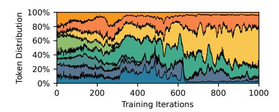

# 2.1 Mixture of Experts in PTMs

A MoE layer comprises a gate and multiple expert networks, as illustrated in Figure [2a](#page-3-1). Given an input, the MoE gate assigns a score to each expert to indicate its affinity with that expert. Based on these gating scores, the input is routed to experts with the top- scores, where is a tunable hyperparameter. These experts process the input independently, and their outputs are then weighted by the corresponding gating scores and aggregated to produce the final output.

MoE layers are typically integrated into Transformerbased PTMs by replacing the feed-forward networks (FFNs) with MoE layers of experts of the same size [\[41\]](#page-12-9). This hybrid architecture is composed of stacked Transformer-MoE blocks, each containing an Attention layer followed by an MoE layer, as shown in Figure [2c](#page-3-1). The inputs to the MoE layers are referred to as tokens, which represent embeddings of different granularities depending on the task domain, such as word or sub-word in natural language processing [\[10\]](#page-11-4) and pixel or image patch in computer vision [\[1\]](#page-11-0).

## 2.2 Distributed Training

MoE has a strong capability to expand model with significantly more parameters. As the scale of MoE PTM continues to grow, distributed training has become crucial.

Data parallelism (DP) [\[27\]](#page-12-10) replicates model parameters and optimizer states across devices, and training data is split among them. Each device computes gradients of the model on the split data, synchronizes the gradients with the other devices via AllReduce which is typically overlapped with backward computation [\[15,](#page-12-11) [23\]](#page-12-12), and then updates the model parameters with the optimizer. However, as the size of an MoE layer grows along with the number of experts or the FFN size in a larger PTM, training MoE layers with solely DP is infeasible, as the working-set memory of experts can easily exceed the capacity of a single device.

Expert parallelism (EP) [\[38\]](#page-12-4) enables larger MoE PTM training by evenly distributing experts of MoE layers across multiple devices, as illustrated in Figure [2b](#page-3-1). Typically, EP is only applied to experts, while leaving the rest of the model to be parallelized with DP. Tokens are dispatched to their experts potentially residing on other devices, and results are gathered back to their original devices to ensure the arithmetic consistency. This exchanges of tokens between devices is facilitated by All-to-All communication. Unfortunately, the skewness of token assignment in MoE gates can lead to workload imbalances among devices, ultimately causing

Figure 2. Illustrations of an MoE layer with a top-2 gate.

straggler effects. As expert loads fluctuate over time (Figure 3), efficient MoE training necessitates adaptive strategies to handle this dynamicity.

**Figure 3.** Expert load distribution during training, with colors indicating token proportions per expert.

#### 2.3 Expert Rearrangement

Recent systems [16, 31, 44] address the straggler effect in MoE by rearranging expert placement during training. Smart-MoE [44] periodically exchanges the positions of experts between devices, aiming to balance device loads with combinations of expert loads, e.g., placing the experts with the most and least tokens on the same device and vice versa. Flex-MoE [31] employs heuristic algorithms to create or remove expert replicas across devices, featuring flexibility in expert placements. FasterMoE [16] selectively replicates experts to every device after obtaining MoE gating decisions.

However, maintaining efficient memory utilization (C1) and manageable communication overhead (C2) when rearranging experts remains challenging. SmartMoE and Flex-MoE rearrange experts along with their optimizer states, whose size are significantly larger than parameters (e.g., when using Adam optimizer [22] under mixed precision training [30, 34], the size of optimizer states is at least 6× larger than parameters), incurring high memory and communication overheads. FlexMoE's replication strategy rapidly exhausts memory, while SmartMoE's permutation-based approach is infeasible when a device cannot hold multiple experts and their optimizer states for every MoE layer. As these

systems place rearrangement communication on the performance critical path, to avoid unacceptable rearrangement overheads, they either impose strict rearrangement conditions [16], reducing sensitivity to load imbalance, or leave the issue to users by offering hyper-parameters to control rearrangement frequency [31, 44].

#### 2.4 FSDP to FSSDP

Fully Sharded Data Parallelism (FSDP) [34, 46] is a DP variant that fully shards model parameters and optimizer states across devices to reduce memory requirements in pre-trained model (PTM) training. Parameters are materialized on-demand using AllGather and released after use, while gradients are reduced via ReduceScatter after backward computation. For models with multiple layers, these communications can be overlapped with computation in preceding layers.

However, FSDP becomes substantially inefficient when applied to MoE layers. When using FSDP, a MoE layer with  $|\mathcal{E}|$  experts incurs  $|\mathcal{E}|$  times more communication overhead than its dense counterpart, which is hardly overlapped with the computation time.

Inspired by FSDP, we propose FSSDP, a novel MoE parallel training paradigm that (1) fully shards MoE layers at a different granularity from FSDP, eliminating redundant memory footprint for expert placements, and (2) proposes sparse collectives to replace AllGather and ReduceScatter to allow a new placement to be materialized in each iteration with manageable communication overhead.

