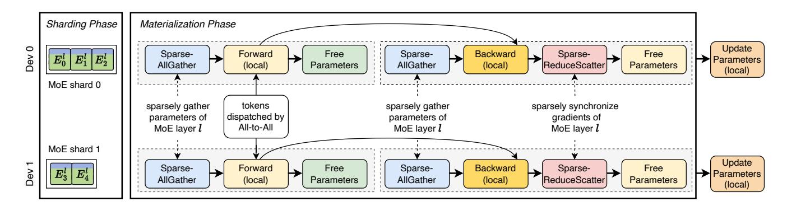
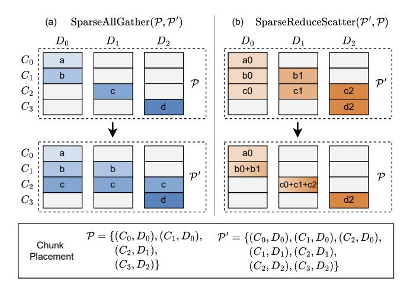

# 3 FSSDP Design

Fully Sharded Sparse Data Parallelism (FSSDP) can be divided into two phases, as depicted in Figure 5: (1) the *sharding phase*, where the parameters and optimizer states of an MoE layer are partitioned into multiple MoE shards and distributed across different devices; and (2) the *materialization phase*, where a timely expert placement is materialized using two novel communication collectives, SparseAllGather

Figure 4. FSDP vs. FSDDP (on a single MoE layer)

and SparseReduceScatter. During both forward and backward pass, SparseAllGather partially materializes the MoE layer parameters to employ a low-latency expert placement. The gradients produced in backward pass of replicated experts are reduced by SparseReduceScatter back to the device where the corresponding MoE shards are located. At the end of each iteration, the MoE shards use the synchronized gradients to update their optimizer states and model parameters. In this sections, we first introduce the two sparse collectives powering FSSDP, and then provide a detailed explanation of FSSDP's parallelization strategies.

## 3.1 Sparse Collectives

The two novel sparse communication collectives both operate on a logical input buffer, which is split into a set of equal-sized chunks  $C = \{C_0, C_1, \ldots\}$ . Denote all devices in the communication group as  $\mathcal{D} = \{D_0, D_1, \ldots\}$ . A chunk placement  $\mathcal{P}$  is defined as  $\mathcal{P} \subseteq C \times \mathcal{D}$ , where each element  $(c,d) \in \mathcal{P}$  indicates that chunk  $c \in C$  is available on device  $d \in \mathcal{D}$ . A collective is defined by a pair of chunk placements, pre-condition  $\mathcal{P}_0$  and post-condition  $\mathcal{P}_1$ , representing the data layout before and after the collective operation.

**SparseAllGather** is designed for materializing a placement of expert parameters of an MoE layer at every iteration in FSSDP, where each chunk corresponds to parameters of an expert. The pre-condition  $\mathcal{P}_0$  of SparseAllGather partitions all blocks into disjoint subsets, each of which is assigned to a unique device. SparseAllGather optionally materializes chunks that devices do not have in the pre-condition. Data layout ends up in a post-condition  $\mathcal{P}_1$  which is a superset of the pre-condition. Thus, a specific SparseAllGather

can be formulated as:

$$\begin{split} & \text{SparseAllGather}(\mathcal{P}_0,\mathcal{P}_1) \\ & \text{s.t. } \mathcal{P}_0 \text{ is surjective and } \mathcal{P}_0 \subseteq \mathcal{P}_1 \end{split}$$

, which we denote concisely as  $spAG(\mathcal{P}_0, \mathcal{P}_1)$ . An example of SparseAllGather is illustrated in Figure 6a, which is used to perform the sparse materialization for the case of Figure 4b.

**SparseReduceScatter** is designed for reducing gradients of the ephemerally materialized experts to specified devices in FSSDP, where each chunk corresponds to gradients of an expert. For SparseReduceScatter, each chunk c in the post-condition  $\mathcal{P}_1$  has a value summing up all chunks c in the pre-condition  $\mathcal{P}_0$ . A specific SparseReduceScatter can be formulated as:

SparseReduceScatter(
$$\mathcal{P}_0, \mathcal{P}_1$$
) s.t.  $\mathcal{P}_1$  is surjective and  $\mathcal{P}_1 \subseteq \mathcal{P}_0$ 

, denoted as  $\operatorname{spRS}(\mathcal{P}_0, \mathcal{P}_1)$ . At each iteration of FSSDP, each  $\operatorname{spAG}(\mathcal{P}, \mathcal{P}')$  is paired with a symmetric  $\operatorname{spRS}(\mathcal{P}', \mathcal{P})$  to reduce the gradients back to source devices where corresponding MoE shard reside. An example of  $\operatorname{SparseReduceScatter}$  is illustrated in Figure 6b, which is used to perform the gradient reduction for the case of Figure 4b.

Comparison with FSDP. A sparse collective practically has lower communication volumes than its counterpart in FSDP, since FSDDP only materializes a subset of MoE layer parameters. An AllGather can be simulated by a collection of Broadcasts, each of which is dedicated to one chunk to be broadcasted to all devices. In this context, for an input buffer of size S, the communication volume of SparseAllGather is O(S). On the other hand, a SparseAllGather can also be regarded as a collection of "broadcasts", each of which is dedicated to one chunk that may be replicated to only a subset of devices. Denote input chunks involved in inter-device communication in SparseAllGather as  $\hat{C}$ , then the size of the inter-device data is  $\lambda S$ , where  $\lambda = |\hat{C}|/|C|$  indicates the sparsity of the collective. The worst-case communication latency occurs when there is one (or more) device that needs to receive all these inter-device chunks and becomes the bottleneck with a communication volume of  $O(\lambda S)$ . Therefore, with sparsity, the upper bound of the communication volume of a SparseAllGather in FSSDP is lower than the AllGather in FSDP, i.e.  $O(\lambda S) \ll O(S)$  when  $\lambda \ll 1$ . Similarly, the communication volume of SparseReduceScatter in FSSDP can be formulated in the same way as Equation 1, and it is also practically lower than that of ReduceScatter in FSDP.

$$Vol(spAG(\mathcal{P}, \mathcal{P}')) = Vol(spRS(\mathcal{P}', \mathcal{P})) = O(\lambda S) \quad (1)$$

This loosely upper-bounded latency is introduced by the communication sparsity of the two new collectives, and is

&lt;sup>1An AllGather may run a ring algorithm [4] with a sightly lower volume of  $O(\frac{|\mathcal{D}|-1}{|\mathcal{D}|}\cdot S)$ , but the value will still approach O(S) when  $|\mathcal{D}|$  scale up.

**Figure 5.** Workflow of FSSDP at MoE layer l in an iteration.  $E_i^l$  represents expert i of MoE layer l in the PTM. The *sharding phase* partitions the MoE layer's parameters and optimizer states into MoE shards placed across devices. The *materialization phase* handles the sparse data parallelism with two novel collectives, SparseAllGather and SparseReduceScatter.

the key to enabling short enough communication to be effectively overlapped.

**Comparison with Rearrangement.** For the same expert placement, the pair of sparse collective in FSSDP has the same latency upper bound as the AllReduce communication in existing rearrangement systems. In rearrangement systems, for each expert (i.e., a chunk of size S/|C|) replicated on more than one device (i.e., a DP group) in a placement  $\mathcal{P}'$ , an AllReduce is required at the end of each iteration to synchronize gradients of the expert across the DP group. Denote the i-th DP group as  $\mathcal{D}_i$ , the overall communication volume of AllReduce operations of all DP groups is

$$Vol(AllReduces) = \sum_{i}^{|\hat{C}|} \frac{2(|\mathcal{D}_{i}| - 1)}{|\mathcal{D}_{i}|} \cdot \frac{S}{|C|}$$
 (2)

When the number of devices in each DP group scale up, Equation 2 approaches  $O(2\lambda S)$ , which is the same as the overall volume upper bound of a spRS( $\mathcal{P}'$ ,  $\mathcal{P}$ ) and a spAG( $\mathcal{P}$ ,  $\mathcal{P}'$ ) used by FSSDP for the same placement. This shows that

Figure 6. An example of two symmetric sparse collectives.

FSSDP achieves the same expert placement for load balancing with only the same communication overhead as the AllReduce communication in existing systems, without the need for additional rearrangement overhead.

#### 3.2 Paralleling Strategies

During the sharding phase, each MoE layer in the PTM is partitioned into  $|\mathcal{D}|$  disjoint *MoE shards*. FSSDP considers an expert as the atomic unit for sharding the MoE layer. Namely, each MoE shard contains of the *model parameters* of a subset of experts along with their *optimizer states*, and is uniquely assigned to a distinct device. A trivial sharding choice is to evenly split each MoE layer.

In the materialization phase, FSSDP performs spAG( $\mathcal{P}, \mathcal{P}'$ ) to sparsely materialized parameters of an MoE layer and  $spRS(\mathcal{P}',\mathcal{P})$  to synchronize gradients. This essentially requires a new placement  $\mathcal{P}'$  of the MoE layer parameters. To determine ideal collectives for expert rearrangement in FSSDP, two factors must be considered: (1) the expert load distribution, which causes the straggler effects to be mitigated by  $\mathcal{P}'$ ; and (2) the latency of attention layer, where communication of the sparse collectives can be hidden. Since computations of the attention layer are all dense, the attention layer latency is contingent on the fixed mini-batch size used during training. Thus attention latency can be either profiled before the training or captured in real-time during the training process. As for expert loads, The temporal locality in the MoE layer's architectural learning leads to smooth changes in expert load distribution over iterations [31]. This allows predicting the next iteration's load distribution based on previous iterations. By using this estimated distribution, the optimal collectives to mitigate load imbalance can be scheduled before the next MoE gate.

It is worth noting that SparseAllGather is launched twice for an MoE layer in each iteration, since the sparsely materialized parameters are discarded immediately after being used for memory reuse across MoE layers. Thus, there are two collective instances to be overlapped with the attention backward computation, i.e. SparseReduceScatter for gradient reduction of the current layer and SparseAllGather for re-materializing the following layer. Typically, the backward computation takes twice as long as the forward computation [24]. Thanks to this characteristic, if judiciously scheduling the SparseAllGather to take time no more than attention forward, there will be enough time during the attention backward for both sparse collectives to be hidden, as shown in Figure 1c.

Having understood how FSSDP parallelizes MoE training, the next question is what algorithms can be used in the two phases for better expert placements and handling token dispatching. For these tasks, we propose a series of algorithms implemented in our system Hecate.

