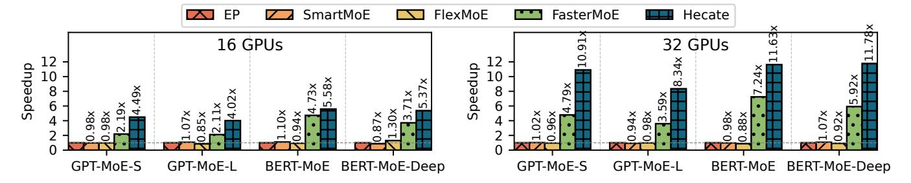
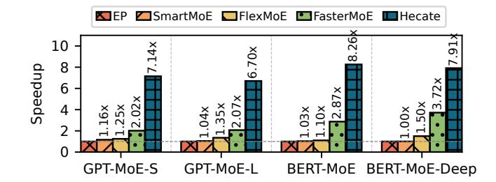
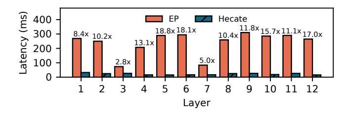
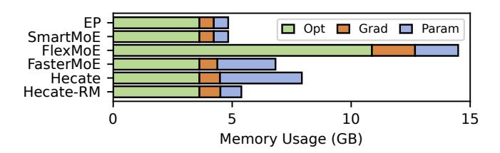

# Algorithm 2: Heterogeneous Sharding

```
Input: F<sup>g</sup>: expert load distribution of all MoE layer
               t: overlap degree
    Output: \mathcal{P}^g: MoE sharding plan
 1 \mathcal{J} \leftarrow \text{top-}t experts by load for each layer;
 _{2} \mathcal{J}' \leftarrow \mathcal{E}^{g} - \mathcal{J};
 s \in |\mathcal{E}^{g}|/|\mathcal{D}|; // Available slots per device
 _{4}\mathcal{P}^{g}\leftarrow\varnothing:
 5 /* Place underloaded experts first. */
 6 \mathcal{L} \leftarrow \{\mathcal{E}_l \cap \mathcal{J}' \mid l = 0, 1, \cdots, L\};
 7 foreach \mathcal{E}'_{l} \in \text{sortByMaxLoadDescending}(\mathcal{L}) do
          \mathcal{P}_l \leftarrow \emptyset;
          foreach e \in \text{sortByLoadDescending}(\mathcal{E}'_t) do
               n \leftarrow least-loaded node, prioritizing nodes
10
                 with less available slots;
               d \leftarrow least-loaded device on node n,
11
                 prioritizing devices with less available slots;
               \mathcal{P}_l \leftarrow \mathcal{P}_l \cup \{(d, e)\};
12
             S_d \leftarrow S_d - 1;
13
          \mathcal{P}^{g} \leftarrow \mathcal{P}^{g} \cup \mathcal{P}_{1}:
14
   /* Place overlappable experts next. */
16 update \mathcal{P}^g by arbitrarily placing \mathcal{J} to rest of slots S;
17 return Pg
```

## <span id="page-8-7"></span><span id="page-8-6"></span><span id="page-8-0"></span>4.4 Token Dispatching

With sparse materialization, an expert's parameters may exist on multiple devices. Tokens assigned to this expert from all devices must select one of the devices where the expert is materialized to be dispatched to. Hecate employs a topology-aware algorithm in its dispatcher to generate a token dispatching plan. The algorithm aims to minimize inter-node communication, as inter-node bandwidths (e.g. NICs [8]) are typically much lower than intra-node high-speed bandwidths (e.g. NVLinks [6]). If an expert is materialized on a device, all tokens assigned to that expert on the device are dispatched locally. Otherwise, the algorithm prioritizes devices within the same node as the token's destination device, only dispatching a token across nodes when no devices in the source node have the expert materialized.

When performing inter-device dispatching, the algorithm evenly distributes the tokens among the selected devices.

#### 5 Evaluation

## 5.1 Experimental Setup

Implementation. Hecate is implemented using PyTorch [32]. We skip overlapping sparse collective communication with expert execution, as there exists a few attempts [16, 18] to overlap it with All-to-All communication, and it is orthogonal to our design. As a prototype system, the two sparse collectives in Hecate are implemented with NCCL [5] by leveraging group calls to simultaneously schedule a series of Broadcast and Reduce operations. While more efficient algorithms for sparse collectives could theoretically exploit the sparsity of data distribution and network topology, our straightforward implementation is sufficiently efficient to meet the upper bound analysis discussed in § 3.1, and we leave an optimized implementation for future work.

**Testbeds.** We conducted experiments on two cloud clusters: Cluster A with 4 AWS p3dn.24xlarge nodes, each having 8 NVIDIA V100-32G GPUs connected via 300 GB/s NVLink [6], and nodes linked by a 100 Gbps network; and Cluster B with 4 AWS p4d.24xlarge nodes, each containing 8 NVIDIA A100-40G GPUs interconnected using 600 GB/s NVSwitch [7], and nodes connected through a 400 Gbps network.

**Models and Metrics.** We evaluate the training workloads of the sparse counterparts of two popular transformer-based language models, GPT-3 [2] and BERT [10], with 4 representative model sizes and architectures to showcase the effectiveness of Hecate, as detailed in Table 1. To sparsify the original models, we replace the feed-forward networks (FFNs) [41] in both models with MoE layers, where experts are still FFNs with the same model dimension  $d_{model}$  and the FFN hidden dimension  $d_{ffn}$  set to twice  $d_{model}$ . We select the widely used GShard [25] Top-2 gating mechanism for assigning tokens to experts. Experiments on varying sequence lengths SeqLen showcase the performance of Hecate under different opportunities for overlapping parameter materialization communication and Attention [41] computation.

<span id="page-8-8"></span>

| Model         | $d_{model}$ | SeqLen | Layers | Experts | Params |
|---------------|-------------|--------|--------|---------|--------|
| GPT-MoE-S     | 768         | 2048   | 12     | 64      | 1.84B  |
| GPT-MoE-L     | 1536        | 2048   | 12     | 64      | 7.36B  |
| BERT-MoE      | 1024        | 512    | 12     | 64      | 3.27B  |
| BERT-MoE-Deep | 1024        | 512    | 24     | 64      | 6.54B  |

**Table 1.** Sizes and architectures of the MoE models.

**Baselines.** We compare Hecate with several baseline systems. FasterMoE [16] is an early effort to mitigate straggler effects in MoE training by replicating overloaded experts to every device. SmartMoE [44] exchanges experts between devices to balance device load, with its strategy relying on the

<span id="page-9-0"></span>

Figure 9. Performance of training MoE models on Cluster A.

presence of multiple experts on each device. FlexMoE [31] supports the most comprehensive expert rearrangement by allowing both replication and relocation of experts. Since FlexMoE does not have an open-source implementation, we implemented its proposed rearrangement strategy based on the description in the paper. To ensure fairness in comparison, we manually tune hyper-parameters (e.g., rearrangement frequencies and reserved memory) of the baseline systems to achieve good performance. Megatron-LM [40] is used as the training framework, and the baseline systems are employed solely to optimize the training of MoE layers. In each set of comparative experiments, we used the largest batch size that did not cause an out-of-memory (OOM) error in any system. Hecate's re-sharding is triggered at a low frequency of every 100 iterations, executing only when shards change, leveraging its insensitivity to frequency. Unless otherwise specified, HECATE's re-materialization feature is not switched on by default.

#### 5.2 End-to-End Performance

To assess the performance of Hecate, we evaluate the overall training speedup of four MoE models on both clusters. Expert parallelism (EP) is used as a baseline for calculating the relative performance improvement.

Figure 9 illustrates the end-to-end performance of training four MoE models on Cluster A. The experiments are conducted in a weak scaling manner, with the number of experts set to 32 for the 16 GPU experiments. Across all cases, Hecate consistently achieves the highest speedup compared to the baseline systems. The speedup exhibits an increasing trend with the number of GPUs. At the smaller scale of 16 GPUs, Hecate achieves a 1.40 - 1.58× speedup, while scaling to 32 GPUs yields a 1.34 - 1.78× speedup. The higher speedup at the larger scale can be attributed to the significantly more expensive All-to-All, which leads to performance degradation in EP. In contrast, Hecate effectively mitigates this cost through efficient placement. Compared to the best performance of all baseline systems, Hecate achieves a geo-mean speedup of 1.645× with 16 GPUs and 2.05× with 32 GPUs.

To further investigate the performance characteristics, we conduct experiments on Cluster B, which offers more powerful computational capabilities and higher communication

<span id="page-9-1"></span>

Figure 10. Training speedup on Cluster B.

bandwidth compared to Cluster A. In Figure 10, HECATE obtains a 1.70 - 1.26× speedup relative to EP. The lower communication bandwidth of Cluster A exacerbates the straggler effect of All-to-All, resulting in more pronounced performance gains for HECATE. HECATE achieves a substantial geo-mean speedup of 2.945× on Cluster B compared to the baseline systems, surpassing the speedup observed on Cluster A. This reveals the consistent superiority of HECATE over the baseline systems across various model architectures and cluster configurations, attributing to the FSSDP paradigm which maximizes load balancing opportunities with minimized system overhead. Systems with restricted rearrangement strategies (e.g., SmartMoE can only exchange experts between devices) are unable to fully unlocking the potential of expert placements to mitigate straggler effects, resulting in suboptimal performance. The load balancing returns of these systems sometimes cannot offset the rearrangement overhead, resulting in slower training than EP.

#### 5.3 Fine-Grained Performance Breakdown

In this section, we conduct an in-depth analysis to examine how Hecate optimizes the training process and identify the critical performance costs.

Figure 11 illustrates the layer-wise speedup of HECATE when training GPT-MoE-S on Cluster B. HECATE consistently outperforms EP across all layers, yielding a 2.8 - 18.8× speedup, with a geo-mean of 11.87×. The figure reveals the significant variations in degrees of load imbalance across layers, resulting in varying execution time of different MoE layers under EP. Under this situation, systems that allocate identical memory resources for load balancing in each MoE layer

<span id="page-10-0"></span>

Figure 11. Layer-wise speedup of HECATE.

(e.g., FlexMoE) may lead to inefficient resource allocation for expert placement across layers, impacting overall training performance. Hecate's heterogeneous sharding effectively utilizes memory resources across MoE layers, enabling heterogeneous memory allocation for expert placement in each layer without incurring additional memory overhead.

<span id="page-10-1"></span>

**Figure 12.** Breakdown of the performance critical path.

Figure 12 breaks down the performance critical path of baseline systems and HECATE of training BERT-MoE-Deep on Cluster B. FasterMoE fuses its computation, All-to-All communication, and rearrangement communication into a single kernel, labeled as FusedKernel (Comp+A2A+Rearr) in the figure. As illustrated in the figure, All-to-All communication (A2A) dominates the MoE training latency of all systems. Hecate attains the lowest All-to-All communication time with its topology-aware algorithm designs, scheduling SparseAllGather (SpAG) and SparseReduceScatter (SpRS) efficiently to maximally mitigate communication stragglers, resulting in a 12.3X reduction in A2A time compared to EP. Compared to FlexMoE's rearrangement overhead (Rearr), Hecate demonstrates a smaller overhead for its sparse collectives due to its reduced communication volume (from communicating optimizer states to only parameters) and overlapping with previous Attention computation. HECATE-RM represents Hecate with releasing and re-materialization of parameters enabled. HECATE-RM incurs additional overhead due to re-materialization, resulting in a 3.6× increase in the sparse collective communication overhead, while still outperforming baseline systems by 1.4×.

We further investigated the peak memory usage of different systems, focusing on the memory consumption of optimizer states, gradients, and parameters, as shown in Figure 13. We omitted the memory footprint of activations

<span id="page-10-2"></span>

**Figure 13.** Peak memory usage in optimizer states (Opt), gradients (Grad), and parameters (Param).

due to the dynamic batch sizes in MoE training. SmartMoE consumes the least memory, comparable to EP, but fails to achieve satisfactory performance improvements, as a result of underperforming expert placement. FlexMoE exhibits the highest memory consumption, requiring 83% more memory than Hecate to accommodate experts on each device, indicating memory-inefficiency in employing an expert placement. With sufficient memory, Hecate utilizes the most memory for parameters (5.73× compared to EP) to materialize the most load-balancing expert placement, resulting in a 64% increase in total memory usage compared to EP. Hecate-RM significantly reduces the additional memory footprint for materialized parameters (by 90.2% compared to Hecate) by releasing the materialized parameters after use, leading to consuming only 11.6% more total memory than EP.

<span id="page-10-3"></span>

Figure 14. Training GPT-MoE-S with different batch sizes.

