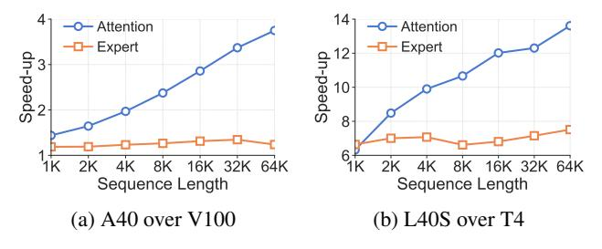

# 2.1 Mixture-of-Experts Models

The mixture-of-expert architecture, shown in [Figure 1,](#page-1-0) has been rapidly adopted in recent LLMs and has demonstrated as a cost-efficient solution for parameter scaling. In MoE models, the dense feed-forward network (FFN) in a transformer layer is replaced by multiple parallel FFNs, which are called experts. For each token, a trainable gate network takes the output embeddings of the attention block and computes a confidence score for each expert. Based on the scores, the token is only routed to the top-*k* experts, whose outputs are weighted by their scores and summed up. The selective activation of experts enables MoE to scale model parameters with a sub-linear increase in computation costs. The attention blocks remain the same as dense LLMs. Unlike experts that mainly consist of GEMM operations, which are highly optimized on most GPUs, attention is less optimized. Only recently have implementations like FlashAttention [\[4,](#page-11-2) [5,](#page-11-4) [36\]](#page-13-8) been proposed, which are specifically tuned to recent GPU architectures and can significantly accelerate attention.

Expert weights have become increasingly dominant in the overall model size as sparsity increases. In Mixtral 8x7B [\[16\]](#page-12-9), 27.6% of the parameters are active, while the number has decreased to 5.5% in DeepSeek v3 [\[21\]](#page-12-1). Expert parallelism is hence proposed for training MoE models, which distributes the experts of a MoE block to multiple GPUs. For each MoE

Figure 2: Speed-up of newer generation GPUs over older ones on attention and expert modules from Mixtral 8x7B [16].

block, a dispatch all-to-all collective is performed to send the embeddings of input tokens to GPUs with target experts, followed by a combine all-to-all that retrieves the outputs.

