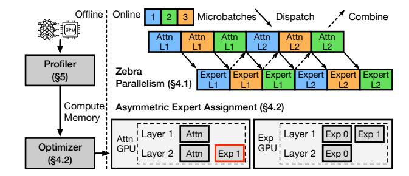
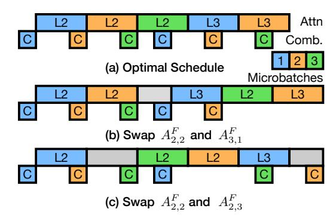
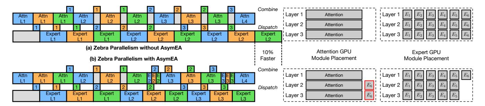

# 2.2 Heterogeneous Training

There is an increasing demand for training LLMs on heterogeneous GPU clusters due to frequent GPU release cycles, high upgrade costs and a lack of supply. Traditional training systems typically assume a homogeneous cluster and split workloads evenly across all GPUs. Under heterogeneous settings, such systems will let faster GPUs idle and wait for slower ones, significantly under-utilizing faster GPUs.

To mitigate the bottlenecks caused by slower GPUs, existing heterogeneity-aware training systems like [15, 42, 45] unevenly split both data and models across different GPUs. They assign different batch sizes for different GPUs accordingly to balance the data load on each GPU, while to split the model, layers are partitioned according to each GPU's compute and memory capabilities.

However, these systems have several limitations for training MoE models. First, they do not differentiate different model components, failing to assign each component only to the GPUs that can efficiently execute it. Second, it is still infeasible to train large MoE models using only layer-based partitioning, as the weights of a single MoE block may exceed the GPU memory. Finally, since the model is partitioned at layer granularity, it can be challenging to find a partition that effectively balance the compute of different GPUs. Furthermore, balancing the compute often conflicts with memory capacities, hence limited by memory, faster GPUs may be assigned fewer layers required to fully utilize their compute capabilities, while slower GPUs may leave their memory underutilized due to their limited compute capabilities.

### 2.3 Opportunities

We find that the relative efficiency of different GPUs differs significantly for different model components. In Figure 2, we show the speed-up of two newer generation GPUs over two older ones. We measure each GPU's total forward and backward time for a single attention and expert module, using the

Figure 3: Major components of HeterMoE. Zebra parallelism overlaps the execution of attention and expert GPUs, while we introduce Asym-EA to minimize bubbles.

model settings from Mixtral 8x7B [16]. We find that V100 GPUs are still quite capable for computing experts, achieving on average 80% of A40's performance, which is equipped with the fully enabled flagship GA102 chip of Ampere generation. The relative performance of V100 compared to A40 on experts also remains stable across different sequence lengths, as each token is independently computed.

V100 suffers from much worse performance on attention modules as it does not support FlashAttention [9] and hence greatly bound by memory bandwidth, although we still use an optimized attention implementation [18]. The performance gap between A40 and V100 also rapidly widens as sequence length increases, contributed by the quadratic complexity of self-attention with respect to the sequence length. For 64K sequences, A40 outperforms V100 by 3.7x. From Figure 2b, since T4 is two generations older with half the SMs of V100, L40S speeds-up MLP over T4 by 7.0x on average. Still, the speed-ups on attention is much more significant, with L40S outperforms T4 by 9.9x for 4K sequences and 13.6x for 64K sequences. We note that although T4 support FlashAttention v1 [5], due to limited SRAM sizes, it offers limited speeds-up and does not support larger attention head dimension [8] as used in [16, 21, 46].

Hence, to efficiently utilize older GPUs, we should avoid assigning them with attention operations. Existing heterogeneous training systems, however, are agnostic to such differences between attention and experts.

### 3 Overview

To efficiently train MoE models on heterogeneous GPU clusters, we propose HeterMoE, a training system that disaggregates attention and expert computation within a transformer layer. HeterMoE assigns only expert blocks to older generation GPUs. Since MoE models are already trained using expert parallelism with all-to-all on homogeneous clusters, our disaggregation introduces no extra communication, as the total amount of data exchanged between GPUs remains unchanged, given the same global batch size. Such disaggregation not only improves the utilization efficiency of older

GPUs, but also reduces memory pressure on newer GPUs by offloading expert weights to many older GPUs. It reduces the cost of MoE training by using fewer newer generation GPUs while having minimal performance degradation.

We present the major components of HeterMoE in Figure 3. We designate older generation GPUs that are only assigned with experts as expert GPUs, while newer GPUs are designated as attention GPUs. Naively computing the attention and expert blocks on separate GPUs results in attention GPUs being idle while waiting for expert GPUs during expert computation (and vice versa). To address this issue, we propose zebra parallelism (§4.1), which divides each transformer layer into two stages, allowing attention and expert GPUs to simultaneously work on different microbatches.

To minimize the idle time, we need to closely balance the execution time of attention and expert GPUs for each microbatch. We introduce asymmetric expert assignment (§4.2), or Asym-EA, to enable fine-grained control of attention and expert computation across GPUs. Asym-EA enables the migration of specific parts of the expert computation to (newer) attention GPUs; for instance, in Figure 3, Exp 1 for Layer 2 is moved from the Expert GPU to the Attention GPU to reduce bubbles in the compute stream. Given this underlying mechanism for migration, we develop a "gather and squeeze" algorithm, which is implemented by the Optimizer (§4.2), to determine the best expert assignment. The Optimizer depends on profiling information from the Profiler (§5), such as the computation time and memory consumption for attention and expert blocks on the different GPUs.

### 4 Design

In §4.1, we first discuss how zebra parallelism works, under the base case where attention GPUs are not assigned with any experts. Next, in §4.2, we discuss how Asym-EA can assign attention GPUs with some experts to reduce bubbles.

#### 4.1 Zebra Parallelism

Zebra parallelism (ZP) takes the place of traditional expert parallelism (EP) under heterogeneous settings. In an EP group, the experts of each layer are evenly split across *E* GPUs, while attention blocks are replicated on each GPU. In contrast, in a ZP group, expert modules are distributed on *N* expert GPUs, while all other components, including attention blocks and input/output embedding layers are replicated on *M* attention GPUs. ZP differs from pipeline parallelism (PP) as PP assigns segments of consecutive layers to different GPUs, while ZP splits modules within each layer to different GPUs. ZP can be used in conjunction with PP, where we have ZP to split experts in each PP stage.

In ZP, computation on attention and expert GPUs are overlapped, as they process different microbatches at a time. Similar to EP. ZP still relies on all-to-all communication to ex-

Figure 4: Zebra parallelism replaces expert parallelism in heterogeneous settings. It overlaps compute on attention and expert GPUs, as well as compute and communication within each GPU.

change tokens. The communication in ZP is bipartite. During the forward phase, each of the *M* attention GPUs only sends tokens to the *N* expert GPUs during dispatch, and only receives from expert GPUs during combine. During the backward phase, the communication is reversed.

We consider network links between attention and expert GPUs have sufficient bandwidth so that dispatch and combine communication is faster than the attention and expert computation, similar to existing MoE training systems [12,20]. We also assume a homogeneous network topology, otherwise, if the interconnect bandwidth within attention or expert GPUs is faster than the links between them, hierarchical all-to-all optimizations [12,27] can be applied for HeterMoE to take advantage of. Still, all-to-all takes up to 30%-50% of the overall training time [12,20,49], hence HeterMoE also overlaps it with computation on each GPU.

To enable the overlapping, we use separate GPU streams for computation and communication. Since dispatch and combine all-to-all communicate in opposite directions and cause no bandwidth contention, they are scheduled on two independent communication streams and are overlapped. Hence, on each GPU, HeterMoE maintains two streams for communication and one stream for computation. To maintain the data dependency between computation and communication tasks, HeterMoE uses GPU events to synchronize different streams. For instance, to receive the input data, an all-to-all kernel is first launched (enqueued) on one of the communication stream, HeterMoE then records the corresponding event. The computation stream would wait for that event and block the execution of attention or expert computation until the all-to-all is finished and the data in the receive buffer is ready.

With zebra parallelism to overlap computation on different GPUs, as well as computation and communication on the same GPU, we still need to feed it with an execution schedule to minimize the per-iteration training time. We use  $A_{i,j}^F, E_{i,j}^F, D_{i,j}^F, C_{i,j}^F$  and  $A_{i,j}^B, E_{i,j}^B, D_{i,j}^B, C_{i,j}^B$  to denote the forward/backward attention computation (*A*), expert computation (*E*), dispatch (*D*) and combine (*C*) all-to-all tasks for the *j*-th

Figure 5: Demonstration of the optimal execution schedule of zebra parallelism, compared to swapping any of the two tasks. We show the forward attention computation and combine all-to-all of the second and third layers.

microbatch on the *i*-th layer. A task can start its execution as long as its dependent task is finished, and all previous tasks on the same stream finishes. For instance,  $A_{i,j}^F$  can start as long as:

$$\begin{cases} t(A_{i,j}^F) \ge t(C_{i-1,j}^F) + T_C, & i \in (1,L], j \in [1,R] \\ \left| t(A_{i,j}^F) - t(A_{i',j'}^F) \right| \ge T_A, & \forall (i',j') \ne (i,j) \end{cases},$$

where  $t(\cdot)$  is the start time of a task, L is the number of layers, R is the number of microbatches.  $T_A$  and  $T_C$  are the duration of attention computation and combine all-to-all communication for a microbatch. The first constraint is for data dependency, the attention computation of a microbatch cannot start before the previous layer's expert outputs are received. The second constraint enforces sequential execution of a stream, i.e., the attention GPU can only compute a single microbatch at a time. Intuitively, an optimal schedule should enable each task to start as soon as possible.

**Theorem 1.** For a MoE model trained using HeterMoE's zebra parallelism, where all experts are placed on expert GPUs while the execution of tasks follow data dependency and stream sequential execution constraints, the following execution schedule on each GPU minimizes the total time of a training iteration:

for computation on attention GPUs:

$$(A_{1,1}^F\cdots A_{1,R}^F)\cdots (A_{L,1}^FA_{L,1}^B\cdots A_{L,R}^FA_{L,R}^B)\cdots (A_{1,1}^B\cdots A_{1,R}^B),$$

for computation on expert GPUs:

$$(E_{1,1}^F \cdots E_{1,R}^F) \cdots (E_{L-1,1}^F \cdots E_{L-1,R}^F)$$
  
 $(E_{L-1,1}^B \cdots E_{L-1,R}^B) \cdots (E_{1,1}^B E_{1,R}^B).$ 

Following the above ordering of compute tasks, the dispatch and combine all-to-all tasks are scheduled to corresponding streams as soon as their dependent tasks are scheduled.

*Proof.* We prove that swapping any two tasks on the same stream will not reduce the total iteration time, regardless of how tasks on other streams are scheduled, as long as data dependencies are maintained. We show the proof for the computation stream on attention GPUs. The schedules for other streams can be similarly proved.

First, if we switch the order of  $A^F_{i,j}$  and  $A^F_{i+1,j'}$ , where  $1 \leq i < L$  and  $1 \leq j' < j \leq R$ , the earliest possible start time  $t'(A^F_{i+1,j'})$  after swapping will not be earlier than  $t(A^F_{i,j})$  when the two tasks are not swapped, as  $A^F_{i+1,j'}$  needs to wait for the completion of  $C^F_{i,j'}$  and  $A^F_{i,j-1}$ . If the compute tasks on expert GPUs are not swapped, we have  $t'(C^F_{i,j'}) > t(C^F_{i-1,j})$ , otherwise we have either  $t'(C^F_{i,j'}) \geq t(C^F_{i-1,j})$  or  $t'(A^F_{i,j-1}) \geq t(A^F_{i,j-1})$ , depending on how the tasks are shuffled. Hence, the earliest start time of subsequent compute tasks will also be equal to or larger than their start time when  $A^F_{i,j}$  is scheduled before  $A^F_{i+1,j'}$ . Figure 5(b) shows this case. Similarly, swapping  $A^B_{i+1,j'}$  with  $A^B_{i,j'}$  leads to sub-optimal schedules.

Second, if we swap  $A_{i,j}^F$  and  $A_{i,j'}^F$ , where  $1 \leq i \leq L$  and  $1 \leq j < j' \leq R$ , the earliest possible start time  $t'(A_{i,j'}^F)$  will be no earlier than the earliest start time  $t(A_{i,j}^F)$  when the two tasks are not swapped, since either  $t'(C_{i-1,j'}^F) \geq t(C_{i-1,j}^F)$  or  $t'(A_{i,j-1}^F) \geq t(A_{i,j-1}^F)$  (for j = 1, it is  $A_{i-1,R}^F$ ). Figure 5(c) shows this case. Similarly, we can prove the total execution time will not decrease if we swap  $A_{i,j}^B$  and  $A_{i,j'}^B$ .

Finally, if we swap  $A_{L,j}^B$  with  $A_{L,j'}^F$  where  $1 \leq j < j' \leq R$ , the start time  $t'(A_{L,j'}^F)$  after swapping will not be earlier than  $t(A_{L,j}^B)$  when not swapped. All subsequent compute tasks will not start earlier. In particular, the execution of  $A_{L,j}^B$  and  $C_{L-1,j}^B$  will be deferred.  $\square$ 

With ZP to overlap the computation, we next explore how HeterMoE further balances the computation of each microbatch between the attention and expert GPUs in a fine-grained manner to minimize bubbles in a training iteration.

### 4.2 Asymmetric Expert Assignment

In HeterMoE's zebra parallelism, the computation time on attention and expert GPUs for a single microbatch and a single layer is determined given the number of attention and expert GPUs in each ZP group, i.e., *M* and *N* respectively. Expert computation takes place on lower-end GPUs and typically dominates the overall computation, especially for shorter sequences. Therefore, attention GPUs may be left with a series of bubbles as a result of waiting for the next microbatch's expert computation (and combine all-to-all) to finish after completing their attention computation. In Figure 6, we analyze a concrete scenario in which computation on expert GPUs is 33% slower than on attention GPUs. Given three microbatches, we show the execution schedule for the forward

Figure 6: Asym-EA enables fine-grained balance of computation load on attention and expert GPUs to minimize bubbles.

pass of the first three layers. For default zebra parallelism (shown in Figure 6a), despite the fact that expert GPUs are fully occupied by computation tasks, attention GPUs only spend 75% time on effective computation.

To increase the utilization of attention GPUs, we propose an asymmetric expert assignment (Asym-EA) strategy where we offload some of the expert computation onto the (more powerful) attention GPUs. Given the ratio of experts to offload, HeterMoE splits the experts across attention and expert GPUs in a ZP group, During dispatch and combine, tokens are sent to and received from both attention and expert GPUs. On each attention GPU, HeterMoE separates attention and expert computation of each microbatch, as it must receives tokens from other attention GPUs before computing experts.

In Figure 6(b), we put one of the experts of the 2nd and 3rd layer to attention GPUs, while expert GPUs only handle five. For each layer, we schedule the expert computation on attention GPUs after attention computation of all microbatches. In this case, although the attention GPUs still have bubbles before the 2nd layer's attention computation, all subsequent computation becomes bubble-free. The 60% reduction in bubbles directly translates to 10% speed-up of the total forward time of the first 3 layers.

However, for a single layer, even if we only offload a single expert in this example, the computation on attention GPUs for each microbatch becomes longer than that on expert GPUs. If we simply offload the same number of experts for every layer, bubbles may shift to expert GPUs. For example, if we also offload an expert in the first layer in Figure 6(b), the total execution time does not decrease, as expert GPUs would then suffer from 6% bubbles. Therefore, we need to selectively offload specific layers.

To balance the total workloads on attention and expert GPUs, hence reducing the bubbles, we propose an algorithm based on a "gather and squeeze" strategy to determine the set of layers to offload experts, and the number of experts to offload. Our high-level insight is to "gather" enough bubbles on attention GPUs across several consecutive layers until we can offload at least one expert to "squeeze" the bubbles. We present this algorithm in Algorithm 1.

First, given the ZP group setup of M and N, we profile (§5) the forward compute time of a single layer's attention Algorithm 1: Asym-EA offload optimization.

**Input** :n: Number of experts of each layer; L: Number of layers; M, N: Number of attention GPU and expert GPUs in a ZP group;  $T_A^{\text{Attn}}, T_E^{\text{Attn}}, T_E^{\text{Exp}}$ : Compute time of attention modules and expert modules on attention and expert GPUs.

**Output:**  $O: \{o_1, o_2, \dots, o_L\}$ : Number of experts to offload from each expert GPU at each layer.

1 
$$n_1 \leftarrow \max(1, \frac{N}{M})$$
  
// #experts each attention GPU acquires for a single chunk

 $n_2 \leftarrow n_1 \cdot \frac{M}{N}$ 

// #experts each expert GPU offloads for a single chunk   
3 
$$T_{\rm gather} \leftarrow T_E^{\rm Exp} - T_A^{\rm Attn}$$
  
// bubble at each layer without Asym-EA

4 
$$T_{\text{squeeze}} \leftarrow \frac{T_E^{\text{Exp}}N}{n} n_1 + \frac{T_E^{\text{Attn}}N}{n} n_2$$
// bubble eliminated by offloading a chunk of  $n_2$  experts

5  $t_{\text{bubble}} \leftarrow 0$  // total accumulated bubble

6 for 
$$l \leftarrow 1$$
 to  $L$  do

7 |  $t_{\text{bubble}} \leftarrow t_{\text{bubble}} + T_{\text{gather}}$ 

8 | if  $t_{\text{bubble}} \geq T_{\text{squeeze}}$  then

9 |  $///////////////////////////////////$ 

module for a microbatch on attention GPUs,  $T_A^{Attn}$ , and a single layer's expert module on expert GPUs,  $T_E^{\text{Exp}}$ . We note that  $T_E^{\text{Exp}}$  depends on the amount of tokens each expert GPU processes instead of the experts it is assigned. We also profile the compute time of a single expert (FFN) with the same batch size on attention GPUs as  $T_E^{\text{Attn}}$ . The profiled time is fed into Algorithm 1 as inputs.

Since each expert GPU and attention GPU must offload or acquire the same number of experts to ensure they have consistent workloads, and the total number of experts offloaded must equal that acquired by all attention GPUs, we define in line 1-2 the minimum number of experts  $n_1$ , that each attention GPU must acquire, and the minimum number of experts  $n_2$  each expert GPU must offload.  $n_1$  and  $n_2$  forms the minimal chunk (unit) for offloading. We can only offload one or multiple chunks at each layer. To make sure  $n_1$  and  $n_2$  are integers, we assume either M is a multiple of N, or N is a multiple of M. The limitation only applies when Asym-EA optimization is used, and is similar to the restriction of traditional EP that the number of GPUs in a EP group must divides the number of experts. We also assume we have enough microbatches to overlap the communication on expert GPUs and fully saturate their computation.

In line 3, we compute  $T_{\rm gather}$ , the bubble formed at each layer for a microbatch when Asym-EA is not used.  $T_{\rm squeeze}$  in line 4 is the bubble we can shrink by offloading a single chunk of  $n_2$  experts from each expert GPU.  $N \cdot T_E^{\rm Exp}/n$  is the compute time reduced on each expert GPU by offloading a single expert, as it receives fewer tokens.  $N \cdot T_E^{\rm Attn}/n$  is the extra compute time added to each attention GPU, for each expert it acquires. We gather the bubbles in line 7 across multiple layers, until they are large enough to offload at least a single chunk. In line 9, we compute how many chunks we can offload, and multiply by  $n_2$  in line 11, we get the number of experts to offload from each expert GPU.

We follow the forward pass to squeeze the bubbles and use profiled forward compute time as inputs. We note that backward time for each module scaled proportionally to the forward time, the assignment optimized from forward pass reduces both forward and backward time.

**Addressing memory limitations.** In practice, however, the number of experts to offload are limited by the memory capacities of both attention and expert GPUs. On the one hand, if the N expert GPUs cannot hold all experts across all layers, HeterMoE must offloads some experts, and the total of experts to offload,  $\sum O$  will be lower bounded by  $n_{\min}$ . On the other hand,  $\sum O$  will be upper bounded by  $n_{\max}$ , as attention GPUs cannot hold too many experts. To take account of such limitations, we modify line 7 as follows:

$$t_{\text{bubble}} \leftarrow t_{\text{bubble}} + \alpha \cdot \beta \cdot T_{\text{gather}}$$

where

$$\begin{split} \alpha &= \min \left( \frac{\lfloor n_{max}/n_2 \rfloor \cdot T_{squeeze}}{L \cdot T_{gather}}, 1 \right) \\ \beta &= \max \left( \frac{\lceil n_{min}/n_2 \rceil \cdot T_{squeeze}}{L \cdot T_{gather}}, 1 \right). \end{split}$$

Without the coefficients  $\alpha$  and  $\beta$ , the amount of bubble we can gather over all L layers is  $L \cdot T_{\text{gather}}$ , and we would offload  $\lfloor \frac{L \cdot T_{\text{gather}}}{T_{\text{squeeze}}} \rfloor$  chunks. If the number of chunks exceeds  $\lfloor n_{\text{max}}/n_2 \rfloor$ , i.e., the maximum allowed by the attention GPU's memory, we add a coefficient  $\alpha < 1$  to  $T_{\text{gather}}$ .  $\alpha$  enforces the upper bound, while line 6-11 spreads the offload chunks across layers. Similarly,  $\beta$  enforces the lower bound of  $\lceil n_{\text{min}}/n_2 \rceil$  chunks. Note that we have either  $\alpha = 1$  or  $\beta = 1$ , since at

most one of them is activated when  $\lfloor \frac{L \cdot T_{\text{gather}}}{T_{\text{squeeze}}} \rfloor$  goes beyond the lower or upper bounds.

### 5 Implementation

We implement HeterMoE in 3K lines of Python based on PyTorch v2.2 [13], with components from Deep-Speed v0.14 [33].

Zebra parallelism engine. Given a user-defined MoE model, using the MoE block provided by HeterMoE and the ZP group setup, our zebra parallelism engine splits the model in each ZP group as in §4.1 and manages the training. During initialization, the ZP engine setups the three streams for compute and communication and allocates the receive buffers for each microbatch. It also establishes required collective communication groups. For all-to-all, HeterMoE creates separate groups for dispatch and combine to enable concurrent communication on separate streams, with each group containing all GPUs in the EP group. HeterMoE feeds unequal split sizes to PyTorch's NCCL all-to-all wrapper to distribute different number of tokens to different GPUs, based on the expert assignment. We implement ZP and data parallelism in our prototype, but HeterMoE can be extended to support ZP in conjunction with other parallelization strategies, e.g., heterogeneity-aware pipeline parallelism [42,45].

We note that the gate network generates a confidence score for each of the top-k experts, which is used to compute weighted sum of the expert outputs. Such computation paradigm forms a "residual" connection. The backward pass from the MoE block's outputs is hence extended to two branches, one of them propagates to confidence scores and the gate network's weights. This branch would propagate all the way back to the first layer, as it does not depend on the gradients from expert GPUs. To prevent repetitive backward on the same weights, HeterMoE stops the backward propagation at attention outputs for each layer. The backward of previous layers would not start until the gradients of attention outputs (expert inputs) are received from expert GPUs and are accumulated with the gradients from the second branch. **Profiler.** We implement a profiler for HeterMoE to obtain the compute time that is required by the Asym-EA optimizer as inputs. The profiler extracts a single expert FFN from a transformer layer. Given the global batch size, sequence length, the number of microbatchs and the ZP group setup, the profiler determines the number of tokens B each expert GPU computes for a single microbatch. It then generates random tensors with a batch size of B and feds it to the FFN to profile the expert compute time on both an attention  $(T_E^{\text{Attn}})$  and an expert GPU  $(T_E^{\rm Exp})$ . The remaining part of the transformer layer, including attention blocks and MoE gate, is extracted and profiled on an attention GPU to get  $T_A^{\rm Attn}$ , where the input size is set to the size of a microbatch.

Our profiler also measures the memory usage of the GPU.

Table 1: Cluster settings used in the evaluation. O refers to our on-premise cluster and C refers to AWS.

| Setup     | O1             | O2  | O3  | C1             | C2  |
|-----------|----------------|-----|-----|----------------|-----|
| #GPUs     | 6xA            | 4xA | 6xA | 2xL            | 2xL |
|           | 6xV            | 8xV | 3xV | 6xT            | 8xT |
| GPU Model | A: A40 (48GB)  |     |     | L: L40S (48GB) |     |
|           | V: V100 (16GB) |     |     | T: T4 (16GB)   |     |
| Network   | 100 Gbps       |     |     | 200 Gbps∗      |     |

On an expert GPU, it constructs a single expert FFN, and executes forward and backward passes with dummy inputs. It then measures the memory usage, which contains activations, weights, gradients, and optimizer states. Based on the remaining available memory, the profiler estimates how many experts in total can expert GPUs hold. Subtracting it from the total number of experts, we get *n*min, the minimal number of experts HeterMoE needs to offload. Similarly, on an attention GPU, the profiler constructs the model by excluding all expert modules. The forward and backward pass is executed by replacing all-to-all with dummy operations. The profiler then estimates *n*max, the maximum number of experts each attention GPU can hold. We only need to run the profiler once for each setup, and it only requires a single attention GPU and a single expert GPU.

