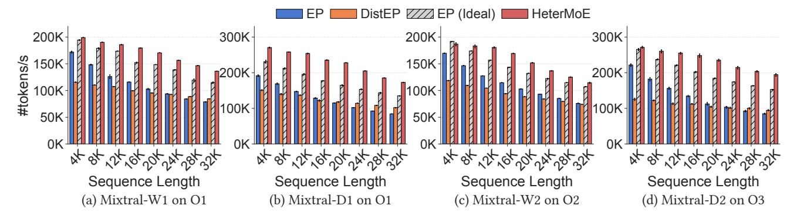
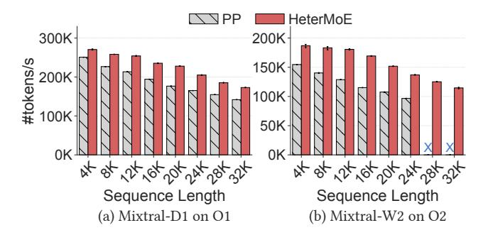

# 6.2 Overall Performance

We report the overall training throughput in [Figure 7](#page-8-0) for our on-premise testbed, with sequence lengths from 4K to 32K. We note that long-context reasoning capabilities have been increasingly sought after, and recent LLMs are trained with context lengths of 32K or even up to 128K [\[6,](#page-11-8) [10,](#page-11-9) [21,](#page-12-1) [46\]](#page-13-1).

Since attention has quadratic computation complexity to the sequence lengths, the training throughput of all compared

Figure 7: **[Overall Performance]:** Overall training throughput under different sequence lengths on the on-premise cluster of A40 and V100 GPUs, with different models and GPU setups. Error bars represent 95% confidence intervals.

Figure 8: [Overall Performance]: Overall training throughput on AWS with L40S and T4 GPUs.

methods drops as sequence length increases. We observe that at shorter sequence lengths, EP still achieves decent performance, since A40 offers limited speed-ups on both attention and experts as shown in Figure 2a. For instance, for 4K sequences, EP maintains 82% of HeterMoE's performance on average, and it even reaches 91% for Mixtral-W2 on ○2. Since EP is not heterogeneity aware and does not balance the compute loads on A40 and V100, it suffers poor performance on longer sequences. For 16K sequences, HeterMoE outperforms EP by 1.67x on average, and it further increases to 1.89x at 32K. In particular, for deeper but narrower Mixtral-D1 and D2, where attention is more dominant and attention-expert disaggregation is more essential, HeterMoE's speed-ups over EP reach 2.05x and 2.29x for 32K sequences.

We also find that naively assigning experts to older GPUs without compute overlapping yields poor performance. DistEP achieves only 55% of HeterMoE' throughput on average across all settings. However, DistEP works relatively better for longer sequences when A40 has significant speed-ups on attention. On average, at 4K, DistEP's throughput is only 56% that of HeterMoE. It performs even worse than EP by 32%. At 32K, DistEP increases to 59% of HeterMoE's performance. It slightly outperforms EP by 8% on average, and up to 21%.

Comparing HeterMoE with the ideal case, EP (Ideal), Het-

erMoE still achieves an average speed-up of 1.18x. The speed-up is up to 1.38x for Mixtral-D1 on 01 for 20K sequences, where HeterMoE can match A40's attention compute time with V100's expert compute time. For shorter sequences, attention is faster and HeterMoE balances the computation on A40 and V100 with Asym-EA, which we provide a detailed breakdown in §6.4.3. Still, for O2 on Mixtral-W2, HeterMoE suffers 3% performance drop compared with EP (Ideal). This is due to the the limited speed-up of attention on A40 at 4K lengths, while expert computation is more intensive for the wider model variants. The limited depth and number of experts per GPU for Mixtral-W2 also reduce the search space for Asym-EA. In shallower models, the penalty of ZP from the 1st microbatch's first forward and first backward is more pronounced, where V100 has to wait for A40.

We show the results on AWS in Figure 8. HeterMoE still consistently outperforms all compared methods. Compared with EP (Ideal), HeterMoE achieves an average speed-up of 1.17x and up to 1.25x. Since the performance gap between L40S and T4 is much larger than that between A40 and V100, EP and DistEP experience severe performance degradation as L40S remains idle most of the time. On average, HeterMoE outperforms EP by 2.89x and DistEP by 1.96x.

Since we use a simulated network connection of 200 Gbps on AWS, unless otherwise specified, we perform subsequent evaluations on our on-premise testbed.

In general, we find that the benefit of HeterMoE over baselines is more significant for deeper models and models with more experts, matching recent model designs [21,46] that use many smaller experts instead of a few large ones. Although we only evaluate sequence lengths up to 32K due to limited GPU resources and memory constraints, we observe that the speed-up of HeterMoE over EP also grows with increasing sequence lengths, which greatly benefits the training of long-context models.

Figure 9: [Pipeline Parallelism]: Performance comparison of HeterMoE's zebra parallelism with heterogeneity-aware pipeline parallelism on the on-premise testbed.

