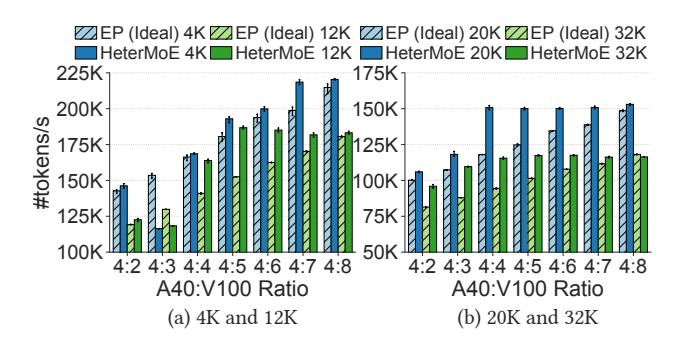
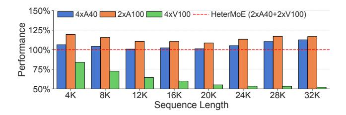

# **6.3** Comparing with Pipeline Parallelism

In this section, we study how our zebra parallelism compares to existing heterogeneity-aware training techniques [15, 42, 45]. They are mainly based on pipeline parallelism, where different pipelines stages are assigned to different GPU models. Each stage is also assigned with a different number of layers to balance the compute time, where faster GPUs are assigned with more layers.

In Figure 9, we present the training throughput of Heter-MoE and heterogeneity-aware pipeline parallelism (PP) on our on-premise testbed. For setup 01, we spin up 6 pipeline instances, with each containing a single A40 and a single V100. Similarly, for setup 02, we use 4 pipeline instances, each with 1x A40 and 2x V100. Training data is distributed across pipeline instances. Each GPU in a pipeline instance corresponds to a pipeline stage. We tune the layers assigned to each stage to balance the load and maximize the throughput, under the memory limitation posed by each GPU. We perform stage balance tuning independently for each model and each sequence length.

We find that HeterMoE consistently outperforms PP across all sequence lengths, achieving an average speed-up of 1.28x and up to 1.47x. HeterMoE even outperforms PP by 7%-21% for 4K sequences, where attention-expert disaggregation provides marginal gains. PP's poor performance is due to several limitations it faces. First, PP does not distinguish between attention and expert modules. Second, the granularity of PP's load balancing is restricted to a single layer, while HeterMoE enables fine-grained load balancing for ZP with Asym-EA. Finally, limited by the GPU memory, PP may fail to achieve an optimal layer assignment that balances the compute of each stage. As PP splits model by layers, a GPU may not fit even a single MoE block. In Figure 9(b), PP cannot fit even a single layer and the activations of a single 28K or 32K sequence into V100's memory. Hence, using PP alone to split a large MoE model is often not enough, it must be used in conjunction with expert parallelism or HeterMoE's zebra parallelism to split experts within a layer.

Figure 10: [Ablation Study]: Impacts of GPU ratios in the setup of a ZP group to HeterMoE's effectiveness.

### 6.4 Ablation Study

### 6.4.1 Impacts of GPU ratios in a ZP group

Next, we study how the GPU ratio in a ZP group impacts HeterMoE's performance. We change the ratio of A40 and V100 GPUs used in a single ZP group to study the best GPU ratio for HeterMoE under different sequence lengths. The amount of compute and communication on each GPU depends solely on the GPU ratio, not their absolute number. Hence, to control the ratio, we fix the number of A40 GPUs to 4 while changing the number of V100 GPUs. We compare HeterMoE's throughput with EP (Ideal) at different sequence lengths under each setup. We use Mixtral-D1 model architecture, but we scale the total number of experts linearly with the number of V100 to ensure that we can evenly distribute experts to GPUs for HeterMoE as well as EP (Ideal). We present the results in Figure 10.

We find that the optimal A40 to V100 ratio varies for different sequence lengths. For example, HeterMoE's effectiveness peaks at 4:5 for 12K sequences with a speed-up of 1.22x over EP (Ideal), while the peak for 4K sequences is at 4:7 with a speed-up of 1.10x. For longer sequences of 20K and 32K, HeterMoE's throughput under 4:4 even reaches that of EP (Ideal) under 4:8 with 2x the number of V100s used, with a difference within 2%. At a fixed sequence length, HeterMoE's throughput does not necessarily increase by simply increasing the relative proportion of expert GPUs (V100) in a single ZP group, as attention may instead dominate the compute time. We also note that Asym-EA is only effective at 4:2, 4:4 and 4:8, due to the divisibility requirement in §4.2. This leads to a significant 24% performance drop compared to EP (Ideal) under 4:3 for 4K sequences, while HeterMoE is 3% faster under 4:2. For a target sequence length, a ZP group should be configured using the optimal GPU ratio with enough expert GPUs to hold all experts, while setting up multiple such ZP groups to utilize all available GPUs. We have also implemented a simulator to estimate the training throughput under different ZP group setups, where in addition to compute time, we also profile the communication time of NCCL send/recv

Figure 11: [Ablation Study]: HeterMoE's performance comparison with EP on fully homogeneous setups.

under different message sizes.2

### **6.4.2** Comparing with fully homogeneous setups

We also study how HeterMoE compares to running EP, i.e., DeepSpeed MoE on fully homogeneous cluster setups. We compare the performance of HeterMoE using 2xA40 and 2xV100, to that of EP on 4xA40, 4xV100 and 2xA100 (80 GB). The 2xA100 are connected with PCIe Gen4. We use Mixtral-D1 model, but we set the total number of experts to 8 to match the number of GPUs. In Figure 11, we report the relative training throughput of EP compared to HeterMoE, under different sequence lengths.

We note that an A100 delivers 2.1x FP16 tensor TFLOPS than an A40 while having 2.8x memory bandwidth [30,31]. Still, 2xA100 achieves only up to 1.20x speed-up over HeterMoE, and is only 1.14x on average. Since V100 has performance similar to A40 for computing experts according to Figure 2a, HeterMoE can efficiently harvest V100's compute. With half of the A40 replaced by V100, HeterMoE still achieves 95% the performance of 4xA40 on average. The performance gap is as little as 1%-2% for 12K-20K sequences, where HeterMoE realizes decent load balancing. V100's inefficiency on attention leads to the poor performance of 4xV100. With 2xA40 and 2xV100, HeterMoE achieves 1.66x speed-up over 4xV100 on average. Although for 4K sequences, 4xV100 still reaches 84% the performance of HeterMoE, it drops to 52% for 32K sequences.

### 6.4.3 Effects of asymmetric expert assignment

We study the effectiveness of Asym-EA in Figure 12 on 01 setup, where we compare the speed-up brought by Asym-EA for two settings under different sequence lengths. Asym-EA is most effective for shorter sequences where attention's compute time  $T_A^{\rm Attn}$  on A40 is significantly faster than the compute time  $T_E^{\rm Exp}$  of experts on V100. For 4K sequences, Asym-EA provides 1.20x speed-up on Mixtral-W1 and 1.14x on Mixtral-D1. As the gap between  $T_A^{\rm Attn}$  and  $T_E^{\rm Exp}$  closes with increasing sequence lengths, the additional contribution of Asym-EA gradually reduces. For instance, the speed-up of

Figure 12: [Ablation Study]: Speed-up provided by Heter-MoE's Asym-EA in terms of training throughput, compared to HeterMoE without Asym-EA.

Table 3: [Ablation Study]: Impacts of HeterMoE's ZP (w/o Asym-EA) and Asym-EA to GPU utilization (percentage of time spent on effective compute) for Mixtral-D1 on O1 setup. We also include the utilization improvement against DistEP in the parentheses.

| Seq. Len | Asym-EA | A40 Util.   | V100 Util.  |
|----------|---------|-------------|-------------|
| 8K       | X       | 55% (1.69x) | 89% (1.73x) |
|          | ✓       | 83% (2.51x) | 78% (1.52x) |
| 16K      | Х       | 77% (1.90x) | 89% (1.97x) |
|          | ✓       | 86% (2.12x) | 84% (1.87x) |

Asym-EA decreases to 1.04x on Mixtral-W1 at 24K. For sequences longer than 20K on Mixtral-D1 and sequences longer than 28K on Mixtral-W1, Asym-EA is no longer required, as we have  $T_A^{\rm Attn} \geq T_E^{\rm Exp}$ . Instead, we should increase the number of A40 in a ZP group to decrease  $T_A^{\rm Attn}$ .

We also provide the breakdown of how HeterMoE improves GPU utilization, with and without Asym-EA. We show GPU utilization and the improvement compared to DistEP in Table 3. We find that with ZP's ability to overlap computation on attention and expert GPUs, both A40 and V100's utilization are greatly improved, as DistEP without such overlapping spends 30%-70% of training time on idle waiting. Since Asym-EA moves some expert computation to A40, A40's utilization is significantly increased, at the expense of a small decrease in V100's utilization.

### 7 Related Work

**MoE training systems.** Extensive literature has been proposed to specifically optimize MoE training with expert parallelism. MegaBlocks [7] proposes a grouped GEMM kernel to accelerate expert computation. A series of work [11,26,44,47] optimize expert placement to handle the dynamic loads on experts. All-to-all communication is also optimized, with both collective implementation optimizations [12,27,37,49,50] and compute-communication overlapping [20,37,49]. In partic-

&lt;sup>2PyTorch's all-to-all is implemented using NCCL send/recv operations.

ular, DeepSeek [\[21\]](#page-12-1) introduces DualPipe to overlap computation and communication within a pair of forward and backward chunks, while optimized kernels with tuned SM allocations are used for cross-node communication. Heter-MoE, on the other hand, disaggregates attention and experts by taking advantage of their differences in performance characteristics. Most of these optimizations are orthogonal and can be incorporated into HeterMoE.

Heterogeneity-aware training systems. Training LLMs on heterogeneous clusters requires partitioning both data and model. Whale [\[15\]](#page-12-7) balances the data load within a pipeline stage by considering heterogeneous compute and memory, but it only addresses uneven memory demands across pipeline stages by considering device assignment. Metis [\[42\]](#page-13-6) and FlashFlex [\[45\]](#page-13-7) further balance layers across stages. SDPipe [\[23\]](#page-12-20) targets dynamic heterogeneity where GPUs suffer from uncontrollable performance variations. HAP [\[48\]](#page-13-15) unevenly distributes workloads in both data and tensor parallelism. However, tensor parallelism requires frequent synchronization and HAP cannot overlap communication. Cephalo [\[1\]](#page-11-1) targets FSDP and only balances compute by adjusting batch sizes. Recently, HEXA-MoE [\[22\]](#page-12-21) is proposed for MoE training on heterogeneous GPUs. However, similar to Cephalo, it only balances compute by unevenly splitting data. These approaches are complementary to HeterMoE and can be combined with zebra parallelism.

