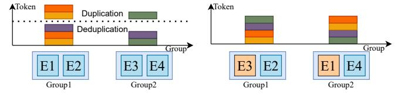

# B. Expert Parallelism

Since a single GPU has limited memory to accommodate all experts, the expert parallelism (EP) [1,2,8] is required to place different experts at each layer to different GPUs during training. Let E indicate the number of experts at each MoE layer and G the number of GPUs in the cluster. EP would place E/G experts every MoE layer on each GPU. Together with data parallelism (DP) [36,37], which is a de facto training paradigm in distributed training of LLMs, the input data in each device is different. Therefore, the token distribution generated by the gating function requires an AlltoAll collective method to dispatch tokens to particular experts (referred to as AlltoAll Dispatch), illustrated as "Dispatch" shown in Fig. 2b. It ensures that data is routed to the correct experts for processing. After dispatch, the tokens undergo processing by their designated experts. The results from the experts then need to be processed by subsequent layers (e.g., Attention) of the MoE layer, requiring another AlltoAll operation to merge the expert outputs (termed as AlltoAll Combine) illustrated as "Combine" shown in Fig. 2b. The two AlltoAll operations at every MoE layer generally introduce significant communication overheads, which limit the scaling efficiency of training systems. Modern systems like Tutel [8] and DeepSeed-MoE [18] try to use the two-dimensional hierarchical AlltoAll (2DH-AlltoAll) algorithm [8,18] that is a dedicated design for the hierarchical topology of GPUs.

&lt;sup>1https://github.com/NVIDIA/Megatron-LM/

(a) Tokens assigned to each expert (b) Tokens assigned to each group

(c) Tokens assigned to each group after deduplication (d) Tokens assigned to each group after expert swap

Fig. 3: The illustration of tokens assignment with different configurations. Different colors represent different tokens.

TABLE II: Token duplication rates with different K and R.

|    |     | K   |     |     |  |  |  |  |  |
|----|-----|-----|-----|-----|--|--|--|--|--|
| R  | 2   | 4   | 6   | 8   |  |  |  |  |  |
| 32 | 2%  | 4%  | 7%  | 9%  |  |  |  |  |  |
| 16 | 3%  | 9%  | 14% | 18% |  |  |  |  |  |
| 8  | 6%  | 17% | 27% | 34% |  |  |  |  |  |
| 4  | 12% | 32% | 46% | 55% |  |  |  |  |  |

