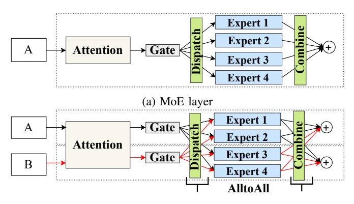

# II. PRELIMINARIES AND MOTIVATIONS

In this section, we present some preliminaries of MoE training and our motivations. For convenience, we provide a summary of the commonly used notation in Table I.

(b) Expert parallelism

Fig. 2: A typical structure of the MoE model.

