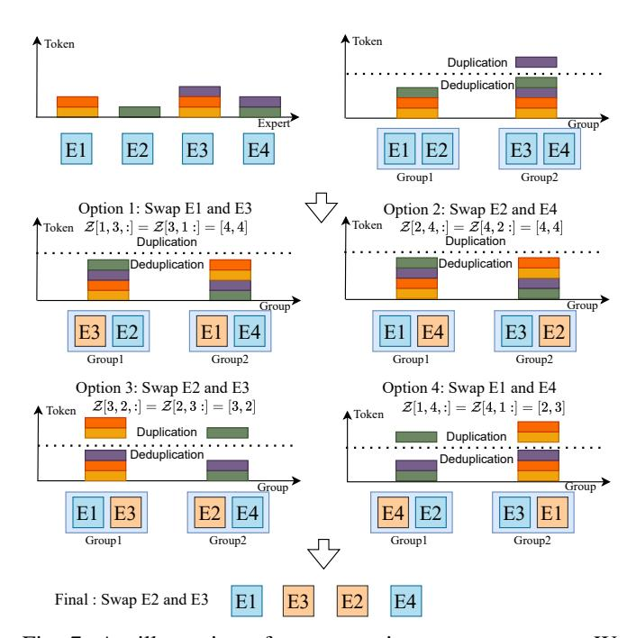
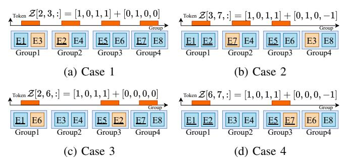
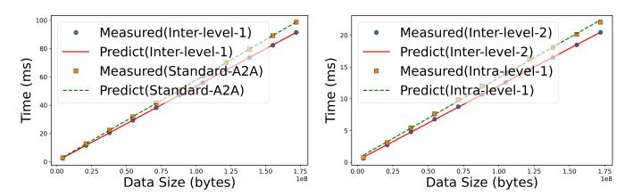
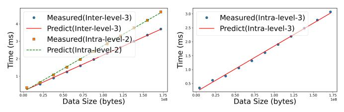

# Algorithm 1 Find the Optimal Dimension for HierD-AlltoAll

Input: 
$$\mathcal{I}_{route}^{(1,E)}, U, M, G, E, D, \beta_{a2a}, \alpha_{a2a},$$
1:  $\beta_{a2a}^{\text{Inter}(l)}, \alpha_{a2a}^{\text{Inter}(l)}, \beta_{a2a}^{\text{Inter}(l)}, \alpha_{a2a}^{\text{Inter}(l)}, \alpha_{a2a}^{\text{Inter}(l)}, 0 < l < D$ 
Output: Optimal dimension  $d^*$ 
2:  $m \leftarrow E/G$ 
3:  $\mathcal{I}_{route}^{(1,G)}[i,j] \leftarrow \bigvee_{j_1=(j-1)m+1}^{j \cdot m} \mathcal{I}_{route}^{(1,E)}[i,j_1], \quad 1 \leq j \leq G$ 
4:  $p[j] \leftarrow \sum_i \mathbb{I}(\mathcal{I}_{route}^{(1,G)}[i,j])$ 
5: for  $0 < k < D$  do
6:  $m \leftarrow E/U[k]$ 
7:  $\mathcal{I}_{route}^{(k,U[k])}[i,j] \leftarrow \bigvee_{j_1=(j-1)m+1}^{j \cdot m} \mathcal{I}_{route}^{(k,E)}[i,j_1], 1 \leq j \leq U[k]$ 
8:  $p_{a2a}^{(k,U[k])}[j] \leftarrow \sum_i \mathbb{I}(\mathcal{I}_{route}^{(k,U[k])}[i,j])$ 
9:  $\mathcal{I}_{route}^{(k+1,E)} \leftarrow process(\mathcal{I}_{route}^{(k,E)}) \succ \text{monitoring the change after performing Inter-level-}(k) \text{ communication}}$ 
10:  $p_{a2a}^{(k+1,G)}[j] \leftarrow \sum_i \mathbb{I}(\mathcal{I}_{a2a}^{(k+1,E)}[i,j])$ 
11: end for
12:  $d^* \leftarrow \text{Eq.}$  (6)
13: return  $d^*$ 

#### IV. HIERARCHICAL EXPERT SWAP

Our HierD-AlltoAll addresses the token duplication problem, but the workloads of different GPUs may still be imbalanced. Earlier methods, such as SmartMoE [23], swap experts by counting allocated tokens without considering duplicated tokens to determine the distribution across GPUs, which is incompatible with our proposed HierD-AlltoAll. To address this, we introduce a hierarchical expert swap strategy (HierD-ES) tailored for our HierD-AlltoAll communication that counts duplicate-free tokens assigned to each hierarchical group. Specifically, in HierD-ES, the key idea is to swap the positions of two experts during training, and the two experts are iteratively chosen to minimize communication overhead with the time model of Eq. (3). The main challenge is to formulate the optimization problem and develop the optimal solution with minimal overhead.

#### A. Problem Formulation and Solution

HierD-ES needs to count the duplicate-free tokens assigned to each hierarchical group after swapping two experts. So we combine  $t_1$  and  $t_d$  on Eq. (1) and Eq. (3) and extend to  $\mathcal{Q}_d \in \mathbb{R}^{E \times E}$ . Each element  $\mathcal{Q}_d[r,c]$  represents the estimated time cost of d-dimensional hierarchical deduplication AlltoAll after swapping the positions of r-th and c-th experts. And we formulate  $\mathcal{Q}_d$  by  $\mathcal{N}_{a2a}^{\text{Inter-}i} \in \mathbb{R}^{E \times E}$  and  $\mathcal{N}_{a2a}^{\text{Intra-}(d-1)} \in \mathbb{R}^{E \times E}$ . Each element  $\mathcal{N}_{a2a}^{\text{Inter-}i}[r,c]$  and  $\mathcal{N}_{a2a}^{\text{Intra-}(d-1)}[r,c]$  are communication bytes for Inter-level-(i) and Intra-level-(d-1) AlltoAll after swapping the positions of r-th and c-th experts.

$$Q_{d}[r,c] = \sum_{i=1}^{d-1} \left( \mathcal{N}_{a2a}^{\text{Inter}(i)}[r,c] \cdot \beta_{a2a}^{\text{Inter}(i)} + \alpha_{a2a}^{\text{Inter}(i)} \right) + \mathcal{N}_{a2a}^{\text{Intra}(d-1)}[r,c] \cdot \beta_{a2a}^{\text{Intra}(d-1)} + \alpha_{a2a}^{\text{Intra}(d-1)},$$

$$0 < d < D$$
(8)

Fig. 7: An illustration of our strategies to swap experts. We count the duplicate-free tokens assigned to each group after swapping any two experts and select the expert pair that minimizes the communication overhead.

Specially, we set  $\alpha_{a2a}^{\text{Intra}(0)}=\alpha_{a2a}$  and  $\beta_{a2a}^{\text{Intra}(0)}=\beta_{a2a}$  to cover one dimensional AlltoAll. And similar to Eq. (2), Eq. (4) and Eq. (5), we can formulate  $\mathcal{N}_{a2a}^{\text{Intra-}i}[r,c]$  and  $\mathcal{N}_{a2a}^{\text{Intra-}(d-1)}[r,c]$  as the product among the number of GPUs in the corresponding AlltoAll, the number of tokens sent to each GPU, the embedding dimension of a token M and bytes per dimension v.

$$\begin{cases} \mathcal{N}_{a2a}^{\mathsf{Inter}(i)}[r,c] = \frac{U[i]}{U[i-1]} \cdot \max(\mathcal{Z}_{a2a}^{\mathsf{Inter}(i)}[r,c,:]) \cdot M \cdot v, \\ \mathcal{N}_{a2a}^{\mathsf{Intra}(d-1)}[r,c] = \frac{G}{U[d-1]} \cdot \max(\mathcal{Z}_{a2a}^{\mathsf{Intra}(d-1)}[r,c,:]) \cdot M \cdot v. \end{cases}$$
(9)

 $\frac{U[i]}{U[i-1]} \text{ and } \frac{G}{U[d-1]} \text{ are the number of GPUs involved in an Inter-level-}(i) AlltoAll and Intra-level-}(d-1) AlltoAll which have been discussed on Eq. (4) and Eq. (5). We use <math display="block">\max(\mathcal{Z}_{a2a}^{\text{Inter-}i}[r,c,:]) \text{ and } \max(\mathcal{Z}_{a2a}^{\text{Intra-}(d-1)}[r,c,:]) \text{ to represent the number of tokens sent to each GPU in Inter-level-}(i) AlltoAll and Intra-level-}(d-1) AlltoAll after swapping <math>r$ -th and c-th experts. And each element  $\mathcal{Z}_{a2a}^{\text{Inter-}i}[r,c,k]$  of  $\mathcal{Z}_{a2a}^{\text{Inter-}i}\in\mathbb{R}^{E\times E\times U[i]}$  denotes the duplicate-free number of tokens assigned to k-th expert group of size U[i] after swapping the positions of r-th and c-th experts given that Inter-level-}(i) AlltoAll will first categorize experts into U[i] groups to count tokens assigned to each group and then select corresponding  $\frac{U[i]}{U[i-1]}$  groups to dispatch tokens. Similarly, each element  $\mathcal{Z}_{a2a}^{\text{Intra-}(d-1)}[r,c,k]$  in  $\mathcal{Z}_{a2a}^{\text{Intra-}(d-1)}\in\mathbb{R}^{E\times E\times G}$  denotes the number assigned to k-th expert group of size G after swapping the positions of r-th and c-th experts before Intra-level-}(d-1) AlltoAll.

Fig. 8: Four cases after swapping two experts with the one selected by the token while the other is not. An orange core indicates swapped experts, while an underline signifies experts selected by the token.

Taking the configuration shown in Fig. 7 as the example where experts number and groups number are four and two, we use  $\mathcal{Z}$  to show the duplicate-free number of tokens to two groups after swapping any two experts. After swapping E1 with E3, the duplicate-free number of tokens to two groups is both four, so  $\mathcal{Z}[1,3,:] = \mathcal{Z}[3,1,:] = [4,4]$ . Similarly,  $\mathcal{Z}[2,4,:] = \mathcal{Z}[4,2,:] = [4,4]$ ,  $\mathcal{Z}[2,3,:] = \mathcal{Z}[3,2,:] = [3,2]$  and  $\mathcal{Z}[1,4,:] = \mathcal{Z}[4,1,:] = [2,3]$ .

However, directly calculating  $\mathcal{Z}^{\text{Inter-}i}_{a2a}$  and  $\mathcal{Z}^{\text{Intra-}(d-1)}_{a2a}$  is expensive, which requires a time complexity of  $O(D \cdot T \cdot K \cdot E^2)$  as the experts number can be large (256 in DeepSeek-V3 [7] and 2048 in Switch [15]), where T is the total number of tokens for an MoE layer.

To reduce the complexity, we design a strategy to calculate  $Z_{a2a}^{\text{Inter-}i}$  and  $Z_{a2a}^{\text{Intra-}(d-1)}$ . Taking the configuration shown in Fig. 8 as the example where experts number and groups number are eight and four, we use Z to count the duplicatefree number of tokens to four groups after swapping any two experts. When a token arrives, it will select K experts. If both swapped experts A and B are either selected or not by the token, the token number to each group remains unchanged, just as if there were no swapping. If one expert A is selected while the other B is not, there are four possible cases illustrated in Fig. 8. In the first and second cases, if the group of the not selected expert B has no selected experts (termed as "Group2"), we must raise the "Group2" count after the swap. In the first case, if the group of the selected expert A has at least two selected experts (illustrated as "Group1"), no adjustment is needed for the "Group1" count. However, in the second case, with only one selected expert in the group (shown as "Group4"), the "Group4" count must be decreased. In the third and fourth cases, if the group of the not selected expert Bhas selected experts (termed as "Group3"), the "Group3" count remains unchanged. For the group of the selected expert A, no change is required if there are at least two selected experts (illustrated as "Group1"), as in the third case, but the value should be decreased if there is only one selected expert (shown as "Group4"), as in the fourth case. Therefore, we initially assign  $\mathcal{Z}_{a2a}^{\text{Inter-}i}$  and  $\mathcal{Z}_{a2a}^{\text{Intra-}(d-1)}$  to the value without swapping

TABLE III: The server configurations in our testbed.

| Name    | Configuration                                 |
|---------|-----------------------------------------------|
| CPU     | Dual Intel(R) Xeon(R) Platinum 8358 @ 2.60GHz |
| GPU     | 8x Nvidia RTX A6000-48G @1.46GHz              |
| Memory  | 512GB DDR4                                    |
| NVlink  | 112.5GB/s (4x)                                |
| PCIe    | 4.0 (x16)                                     |
| Network | Mellanox MT28908 @ 200Gb/s                    |

and then adjust them across all cases to obtain the final value. The time complexity is reduced to  $O(D \cdot T \cdot K \cdot E)$ .

Then, we follow Eq. (6) to get the final estimation matrix  $Q^* = Q_{d^*}$  that represents the estimated time matrix of our HierD-AlltoAll after swapping the positions of any two experts.

**Theorem 1.** Given an MoE layer running on a cluster with expert parallelism using HierD-AlltoAll for communication, we can reduce the communication overhead by swapping the position of two experts. To achieve minimal communication time, the expert pair  $(r^*, c^*)$  should satisfy

$$(r^*, c^*) = \arg\min \mathcal{Q}^*[r, c]. \tag{10}$$

*Proof.* As discussed in Eq. (8) and Eq. (9), we have covered all cases for swapping the position of two experts. Therefore, the optimal expert pair  $(r^*, c^*)$  is identified by evaluating all cases to find the one minimizing communication time, i.e.,  $\arg\min \mathcal{Q}^*[r,c]$ , which completes the proof.

To improve the landscape of  $Q_d$ , we choose a smoother max function [39] to avoid abrupt changes in values as follows

smooth-max
$$(x, \gamma) = \max(x) \cdot \left(\sum_{i=1}^{n} \left(\frac{x[i]}{\max(x)}\right)^{\gamma}\right)^{1/\gamma}, (11)$$

where  $\gamma$  is a parameter to control the smoothness of the function. We set  $\gamma=10$  by default (will verify in §V-E).

#### V. EVALUATION

#### A. Experimental Settings

**Testbeds.** Experiments are carried out on a 32-GPU cluster comprising four interconnected nodes, each of which is equipped with eight Nvidia A6000 GPUs. The details of the server configuration are shown in Table III. The software environments are Ubuntu-20.04, CUDA-12.1, PyTorch-2.1.2 and NCCL-2.18.5.

**Baselines.** We implement our HierMoE atop the prominent Megatron-LM training system, which supports various MoE models such as, DeepSeek and Qwen. We compare our HierMoE with three representative baselines Megatron-LM, SmartMoE and Tutel with 2DH-AlltoAll (Tutel-2DH).

**Real-World MoE Models.** To assess the end-to-end training performance on real-world MoE models, we exploit two commonly used MoE models based on DeepSeek-V3 and Qwen3-30B-A3B. Due to the GPU memory constraints of our testbed, we configure the hidden dimension and model dimension to be half of the original DeepSeek-V3 with 6 layers. For Qwen3-30B-A3B, we use 32 layers. For other

(a) Inter-level-1 and standard (b) Intra-level-1 and Inter-AlltoAll. level-2.

(c) Intra-level-2 and Inter- (d) Intra-level-3 AlltoAl level-3.

Fig. 9: Performance models. Markers are measured values and lines are predicted values with estimated parameters. (a)  $\alpha_{a2a}^{\rm inter(1)}=4.97\times 10^{-1},~\beta_{a2a}^{\rm inter(1)}=5.29\times 10^{-7},~\alpha_{a2a}=7.22\times 10^{-1},~\beta_{a2a}=5.70\times 10^{-7}.$  (b)  $\alpha_{a2a}^{\rm inter(2)}=3.01\times 10^{-1},~\beta_{a2a}^{\rm inter(2)}=1.17\times 10^{-7},~\alpha_{a2a}^{\rm intra(1)}=5.71\times 10^{-1},~\beta_{a2a}^{\rm intra(1)}=1.27\times 10^{-7}.$  (c)  $\alpha_{a2a}^{\rm inter(3)}=1.49\times 10^{-1},~\beta_{a2a}^{\rm inter(3)}=2.06\times 10^{-8},~\alpha_{a2a}^{\rm intra(2)}=1.14\times 10^{-1},~\beta_{a2a}^{\rm intra(2)}=2.63\times 10^{-8}.$  (d)  $\alpha_{a2a}^{\rm intra(3)}=2.04\times 10^{-1},~\beta_{a2a}^{\rm intra(3)}=1.64\times 10^{-8}.$ 

configurations on the end-to-end experiments, we set micro batch size to 1, sequence length to 1024, the EP degree to 32, the same as the number of GPUs.

