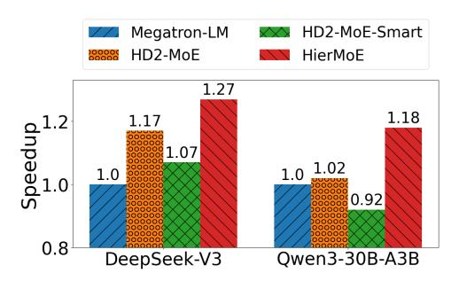
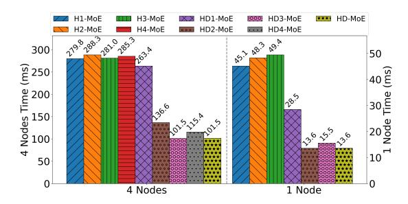

# B. Verification of Performance Models

We require the input parameters that are related to the cluster for the performance models of AlltoAll communication. We measure the elapsed time with a range of sizes for seven types of AlltoAll communication to fit the performance models in Eq. (1) and Eq. (3) using micro-benchmark tools. In particular, we utilize the NCCL collective communication primitives along with nccl-tests2 to evaluate communication durations across diverse message sizes. As shown in Fig. 9, our linear models with intercept terms (i.e., startup time) can well fit the measured performance. Specifically, the  $r^2$ for the communication tasks are as follows: standard Allto All: 0.999997, Inter-level-1 Allto All: 0.999991, Intra-level-1 AlltoAll: 0.998922, Inter-level-2 AlltoAll: 0.998682, Intralevel-2 AlltoAll: 0.999051, Inter-level-3 AlltoAll: 0.999031, Intra-level-3 AlltoAll: 0.997245. The total time required for communication in the performance models is under 300 seconds. Fitting through the least squares method takes under 10 milliseconds. When dealing with a new GPU cluster, it only needs to estimate the parameters one time using micro-

Fig. 10: The end-to-end speedup  $(\times)$  of HierMoE, HD2-MoE and HD2-MoE-Smart over Megatron-LM on DeepSeek-V3 and Qwen3-30B-A3B.

Fig. 11: The AlltoAll communication speedup (×) of Tutel-2DH, HD2-MoE, HD2-MoE-Smart, HD-MoE and HierMoE over Megatron-LM on DeepSeek-V3 and Qwen3-30B-A3B.

benchmarks prior to model training, without impacting the training efficiency.

#### C. End-to-end Training Time Comparison

To evaluate the effectiveness of HierMoE, we compare HierMoE with Megatron-LM and SmartMoE on DeepSeek-V3 and Qwen3-30B-A3B models. For better comparison, we further perform experiments on an additional schedule, HD2-MoE, which only implements the two-dimensional hierarchical deduplication as shown in Fig. 4b. We also integrate our HD2-MoE with SmartMoE (termed as HD2-MoE-Smart). The experimental results are shown in Fig. 10, which indicates that HierMoE achieves speedups of  $1.18\times$  to  $1.27\times$  compared to Megatron-LM. Additionally, HD2-MoE-Smart performs even worse than HD2-MoE, which validates that careful expert swap strategies are required on our HierD-AlltoAll. Compared to HD2-MoE, HierMoE can still achieve speedups of  $1.10\times$  to  $1.15\times$ , validating the improvement of our HierD-AlltoAll and HierD-ES.

#### D. AlltoAll Communication Time Comparison

To further evaluate the effectiveness of HierMoE on AlltoAll communication. We compare the AlltoAll time of HierMoE with that of Megatron-LM, Tutel-2DH, HD2-MoE, HD2-MoESmart and HD-MoE (HierMoE w/o HierD-ES) on Deepseek-V3 and Qwen3-30B-A3B as shown in Fig. 11. The experimental results reveal that our HierMoE provides  $1.55 \times$  to  $1.64 \times$  speedups over HD2-MoE-Smart,  $1.99 \times$  to  $2.72 \times$  speedups

&lt;sup>2https://github.com/NVIDIA/nccl-tests

Fig. 12: The curve's smoothness comparing the time cost of AlltoAll for HierMoE and Megatron as iterations rise at the first layer of Qwen3-30B-A3B.

Fig. 13: The time cost of AlltoAll for different configurations on 4 nodes and 1 node.

over Megatron-LM, and 2.34× to 3.32× over Tutel-2DH, showing the effectiveness of our approach. It can be seen that Tutel-2DH performs worse than Megatron-LM, whereas our HD2-MoE achieves 1.26× to 1.76× speedups over Megatron-LM. Furthermore, HD2-MoE-Smart is less effective than HD2-MoE, illustrating the limitations of SmartMoE. Furthermore, HD-MoE achieves a speedup of 1.37× to 1.45× compared to HD2-MoE, demonstrating the efficacy of our HierD-AlltoAll. In addition, HierMoE boosts the performance by 2.55× to 2.72× on DeepSeek-V3 and 1.72× to 1.99× on Qwen3-30B-A3B by implementing HierD-ES atop HierD-AlltoAll, further highlighting the importance of HierD-ES.

Furthermore, we assess the iteration time during the training iterations as shown in Fig. [12.](#page-8-1) It is seen that our HierMoE is much more stable than that of Megatron-LM.

