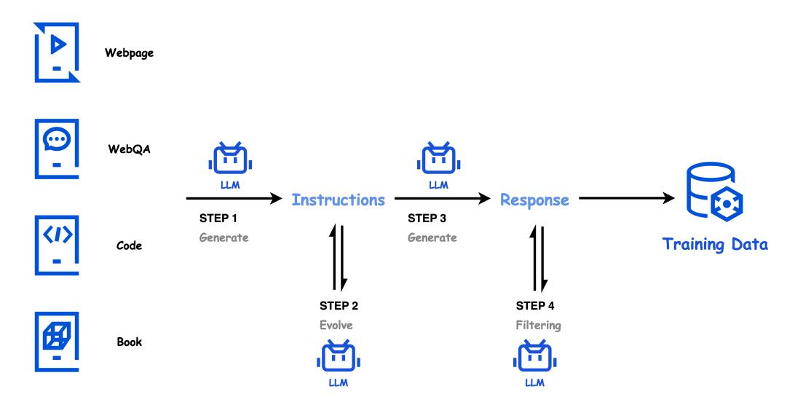
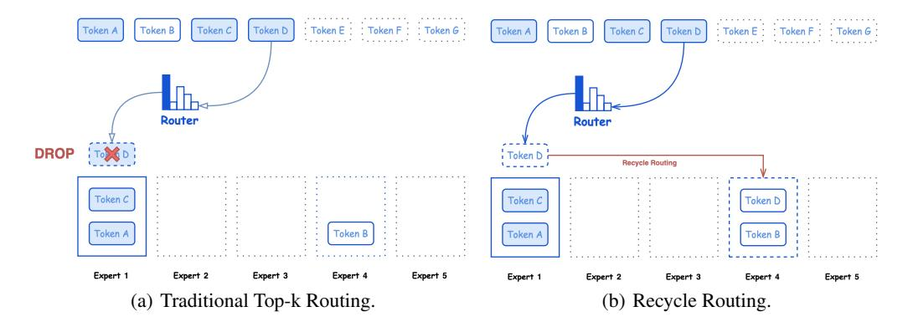

# 2.1 Data and Tokenizer

We first give the overview of our data, which is viewed as the fuel of our powerful model, with its preprocessing steps and data synthesis strategies essential for the quantity and quality of data. We also introduce the tokenizer employed for converting text data into an appropriate format suitable for Hunyuan-Large.

Figure 1: The four-step process of data synthesis in Hunyuan-Large's pre-training: (1) Instruction generation, (2) Instruction evolution, (3) Response generation, and (4) Response filtering.

## 2.1.1 Data Processing and Synthesis

To start with, we provide a brief overview of the used pre-training data, and then delve deeper into the specifics of our synthetic data generation process, which is essential for acquiring capabilities also verified in various LLMs [\(Dubey et al., 2024;](#page-14-2) [Abdin et al., 2024;](#page-14-5) [Liu et al., 2024\)](#page-15-2).

Data Overview and Processing. We aim to create a high-quality, safe, and diverse training dataset for pre-training, primarily consisting of Chinese and English languages for practical demands. We filter the data based on criteria such as writing quality, educational value, and toxicity to ensure its high quality. Additionally, we anonymize all privacy-sensitive data and other harmful data. We have also implemented an elaborate system of category labels, which allows us to flexibly adjust the proportions of various types of data in the training dataset.

Data Synthesis. Besides the existing natural text corpus, we construct large amounts of synthetic data to specifically boost the knowledge acquisition against the relative capability deficiency merely learned from natural data. To make full use of synthetic data to enhance model performance, we mainly focus on the mathematics, coding, low-resource, and high-educational-value fields that are good supplements to naturally distributed corpus, meeting three key requirements of quality, diversity, and quantity.

As shown in Figure [1,](#page-2-0) we synthesize high-quality instruction data through a four-step process, including instruction generation, instruction evolution, response generation, and response filtering.

- Step 1: Instruction Generation. To ensure the diversity of instructions, we use high-quality, knowledge-rich data sources such as web pages, web-based question-answering data, code repositories, books, and other resources as seeds. Cooperating with diverse instruction generation prompts, these seeds enable us to generate a wide variety of instructions that cover various domains with different desired instruction styles and complexities.
- Step 2: Instruction Evolution. To further improve the quality of these initial instructions, we refine them by three guidelines: (a) Enhancing their clarity and informativeness. (b) Expanding low-resource domain instructions through self-instruct augmentation. (c) Evolving the instructions to increase their difficulty levels. These evolved high-quality and challenging instructions enable our model to benefit more efficiently from synthetic data to cross the original capability boundaries.
- Step 3: Response Generation. We utilize several specialized models to generate informative and accurate answers for the above evolved instructions. These models vary in size and are well-designed specialized models to synthesize expert-level responses for instructions in various domains.

• Step 4: Response Filtering. To filter the synthetic instruction-response pairs, we employ a critique model and conduct self-consistency checks, in which we generate multiple answers to perform selfconsistency filtering for tasks such as objective question-answering tasks, ensuring the reliability and accuracy. This process allows us to effectively remove any low-quality or inconsistent data, ensuring the utilization of high-quality text in pre-training.

## 2.1.2 Tokenizer

The tokenizer is a vital component for effectiveness and efficiency in pre-training, which should balance two critical factors: (a) achieving a high compression rate for efficient training and inference, and (b) maintaining an appropriately large vocabulary to ensure adequate learning of each word embedding. In Hunyuan-Large, we carefully consider both aspects and employ a vocabulary consisting of 128K tokens. This token vocabulary is a combination of 100K tokens from the tiktoken tokenizer [\(OpenAI, 2023\)](#page-16-7) and an additional 28K tokens specifically designed to enhance Chinese language support. Notably, when compared to the LLama3.1 tokenizer, our new tokenizer exhibits improved compression rates, increasing from 2.78 to 3.13 characters per token.

## 2.2 Model Structure

Hunyuan-Large is equipped with superior model structure and training strategies to achieve impressive LLM capabilities. We first show the overview of model architecture and hyper-parameters, and then delve into the KV cache compression, expert routing strategy, and expert-specific learning rate scaling used in our model with details.

## 2.2.1 Overview of Hunyuan-Large

The model structure of Hunyuan-Large mainly follows the classical MoE structure that uses multiple experts to replace the original FFN in Transformer. Tokens will be assigned to different experts, and only a small ratio of experts will be activated in training. Hunyuan-Large consists of both shared and specialized experts. We use Rotary Position Embedding (RoPE) for position learning [\(Su et al.,](#page-16-8) [2024\)](#page-16-8) and SwiGLU for activation [\(Shazeer, 2020\)](#page-16-9). Table [1](#page-3-0) displays the overview of our model's architecture and key hyper-parameters.

Table 1: Overview of the architecture and key hyper-parameters of Hunyuan-Large. This model has 389B total parameters and 52B activated parameters. There are 1 shared expert and 1 specialized expert activated for each token.

| Configuration                   | Hunyuan-Large |
|---------------------------------|---------------|
| # Layers                        | 64            |
| # Attention Heads               | 80            |
| # Key/Value Heads               | 8             |
| # Shared Experts                | 1             |
| # Specialized Experts           | 16            |
| # Activated Specialized Experts | 1             |
| # Trained Tokens                | 7T            |
| Activation Function             | SwiGLU        |
| Vocabulary Size                 | 128K          |
| Hidden Size                     | 6,400         |

## 2.2.2 KV Cache Compression

To alleviate memory pressure of KV cache and reduce the cost during inference, we jointly integrate two classical strategies for KV cache compression: (a) Grouped-Query Attention (GQA) [\(Ainslie](#page-14-6) [et al., 2023\)](#page-14-6), which uses an intermediate number of KV heads to form head groups, compressing KV cache from the head aspect, and (b) Cross-Layer Attention (CLA) [\(Brandon et al., 2024\)](#page-14-7), which shares the KV cache between adjacent layers, compressing KV cache from the layer aspect. In Hunyuan-Large, we set 8 groups of KV heads for GQA, and share KV cache every 2 layers, jointly considering both effectiveness and efficiency. Table [2](#page-4-0) presents a comparison of the KV cache memory usage across different mechanisms. The adopted GQA+CLA technique in Hunyuan-Large saves nearly 95% KV cache in total compared to the original MHA mechanism, significantly improving the inference efficiency without much side effect on model performance.

Table 2: Comparisons of KV cache memory (in bytes on bf16) for different attention mechanisms. The attention mechanisms include Multi-Head Attention (MHA), Grouped-Query Attention (GQA), Multi-Query Attention (MQA), Cross-Layer Attention (CLA), and GQA+CLA (the final setting in Hunyuan-Large). nh, dh, l, and ng represent the number of attention heads, the dimension per head, the number of layers, and the number of groups in GQA (ng<nh), respectively. Our CLA shares the KV cache every 2 layers.

| Attention Mechanism | KV Cache Memory |
|---------------------|-----------------|
| MHA                 | 4nhdhl          |
| GQA                 | 4ngdhl          |
| MQA                 | 4dhl            |
| CLA                 | 2nhdhl          |
| GQA+CLA             | 2ngdhl          |

## 2.2.3 Expert Routing Strategy

Shared and Specialized Experts. The expert routing strategy of MoE is essential to efficiently activate each expert's capability while maintaining a relatively balanced load. Conventional routing strategies, such as the classical top-k routing strategy, selects the top-k scoring experts to process each token [\(Jiang et al., 2024;](#page-15-3) [Qwen, 2024b\)](#page-16-10). Hunyuan-Large adopts a mixed routing strategy, that uses both a shared expert consumed by all tokens and several routable experts employing the classical top-k routing strategy [1](#page-4-1) . Hunyuan-Large sets 1 expert as the shared expert to capture the common knowledge required by all tokens. Besides, 16 specialized experts are allocated to dynamically learn domain-specific knowledge, activating the top-1 scoring specialized expert for each token. Recycle Routing. Conventional top-k routing often cooperates with a capacity factor that defines the maximum load of an expert in MoE, where tokens of overloaded experts are discarded during training. A larger capacity factor results in less dropped tokens but reduced training efficiency. Excessive token dropping may cause the loss of crucial information, which in turn negatively impacts training stability. To address this problem and achieve more balanced training in efficiency and stability, we develop a new recycle routing strategy for tokens discarded during the original top-k routing process, as displayed in Figure [2.](#page-5-0) This technique entails an additional random allocation for tokens originally routed to overloaded experts to other specialized experts which have not exceeded their capacity. This approach strives to preserve vital information while simultaneously optimizing training efficiency, thus ensuring the overall effectiveness and efficiency of model training.

## 2.2.4 Expert-Specific Learning Rate Scaling

We adopt AdamW [\(Loshchilov & Hutter, 2019\)](#page-16-11) as our optimizer. To expedite training, we can increase the learning rate in tandem with the growth of batch size in pre-training. Previous work has explored the square root scaling [\(Krizhevsky, 2014\)](#page-15-4) or linear scaling [\(Goyal et al., 2017\)](#page-15-5) when discovering the optimal learning rate based on the batch size for SGD-style optimizers. Recent work has elucidated a more appropriate connection between the optimal learning rates and batch sizes for Adam-style optimizers in LLMs. According to [Li et al.](#page-15-6) [\(2024a\)](#page-15-6), the optimal learning rate ϵopt(B) for a batch size B is calculated as:

$$\epsilon_{opt}(B) = \frac{2\epsilon_{max}}{\sqrt{\frac{\mathcal{B}_{noise}}{B} + \sqrt{\frac{B}{\mathcal{B}_{noise}}}}}.$$
(1)

Here, ϵmax represents the learning rate of AdamW. Bnoise indicates the trade-off point between training speed and data efficiency noted in [Kaplan et al.](#page-15-7) [\(2020\)](#page-15-7).

However, in Hunyuan-Large, different experts are imbalanced in the aspect of trained tokens (e.g., comparing the shared expert with other specialized experts). The number of tokens processed by

1This mixed routing strategy was first introduced in our closed-source trillion-parameter model (training starts from November, 2023) concurrently to Deepseek v2.

Figure 2: An illustration of the recycle routing strategy in Hunyuan-Large, where each expert's maximum capacity is set to 2. Token D, which was initially allocated to the overloaded Expert 1, is reassigned to a randomly selected Expert 4. This approach helps alleviate the potential loss of valuable information. In traditional routing strategies, tokens from overloaded experts would be dropped as shown in (a). However, our strategy involves randomly reassigning these tokens to other experts, as demonstrated in (b), where Token D is routed to Expert 4.

each expert during a single iteration will vary, which indicates that each expert will experience a different effective batch size within one training iteration. Hence, it is essential to necessitate expertspecific learning rates to optimize training efficiency. Considering the load balance losses, we could safely assume that different specialized experts have approximately similar numbers of effectively trained tokens. Specifically for specialized experts, the effective batch size should be roughly divided by the number of specialized experts, resulting in their optimal learning rate being expressed as ϵopt(B/n) (we activate 1 in 16 specialized experts and thus n = 16). The learning rate scaling ratio between the shared and specialized experts is ϵopt(B)/ϵopt(B/n), which is approximately 0.31 in our setting. Consequently, when configuring the learning rate for Hunyuan-Large, we assign the optimal ϵopt(B) for the shared expert, and deliberately scale down the learning rate of specialized experts in accordance with this ratio ϵopt(B)/ϵopt(B/n).

## 2.3 Pre-Training Recipes

The effectiveness of LLM pre-training is not solely determined by the dataset and model structure, but also significantly ascribed to the pre-training recipes obtained from empirical experiments. We first explore the scaling laws of MoE functioned as a guidebook for our model design. Secondly, we introduce the detailed process of annealing and long-context pre-training, which further enhance LLM's capability.

