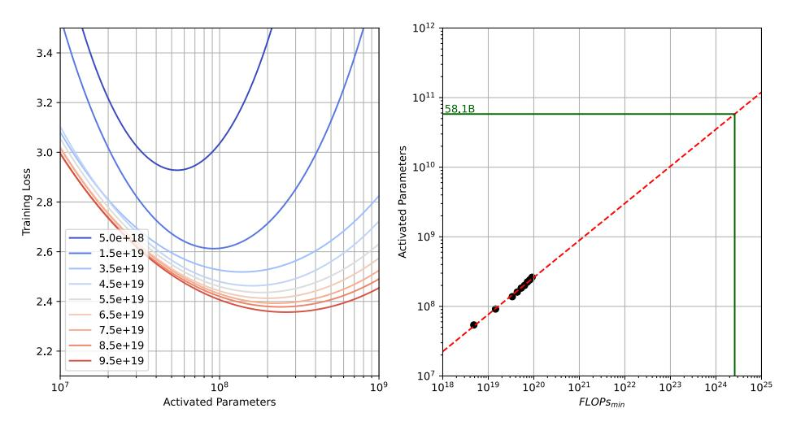
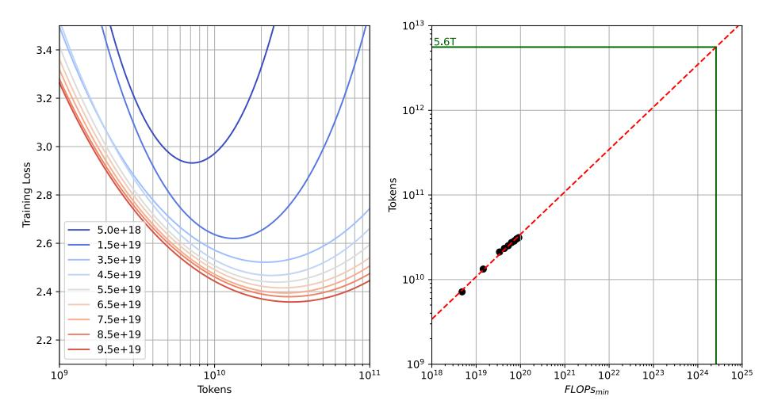

# 2.3.1 MoE Scaling Law

Initially, we investigate the scaling laws of MoE models to identify optimal settings and gain insights before pre-training. Typically, the training compute budget for dense models is estimated using C = 6ND, where N represents the number of parameters and D denotes the training tokens. However, for MoE models with longer sequences (e.g., 8K, 32K, and 256K), the compute budget formula varies due to attention complexity and sparse activation. Upon meticulous computation, we ascertain the precise compute budget C for MoE models, where N in our formula represents the number of activated parameters, is as follows:

$$C \approx 9.59ND + 2.3 \times 10^8 D. \tag{2}$$

Drawing on the insights of [Kaplan et al.](#page-15-7) [\(2020\)](#page-15-7) and [Li et al.](#page-15-6) [\(2024a\)](#page-15-6), we acknowledge that batch size B has a significant impact on compute budget C during training. To isolate this effect and derive precise estimates, we employ the critical batch size Bcrit(L), which optimizes the trade-off between time and computational efficiency, ultimately resulting in minimal compute budget Cmin:

Figure 3: Using quadratic polynomial fitting, we obtain the scaling law of the optimal number of activation parameters under different minimum compute budgets.

$$C_{min} = \frac{C}{1 + \frac{B}{B_{crit}(L)}}. (3)$$

Subsequently, we meticulously trained a series of MoE models, spanning from 10 M to 1B activation parameters, utilizing 100B tokens of pre-training data. By leveraging the isoFLOPs (Hoffmann et al., 2022) curve, we determined the optimal number of active parameters and training data volume within a restricted compute budget, adjusted according to the actual training token batch size, through an exploration of these models across data sizes ranging from 10B to 100B tokens.

By fitting the formula  $N_{opt} = N_c C_{min}^{\alpha}$  in Figure 3, we obtain  $N_c = 5.9 \times 10^{-3}$  and  $\alpha = 0.5305$ , indicating that the optimal number of activated parameters is approximately 58.1B. Inspired by Dubey et al. (2024), due to the smoothness of the quadratic curve around the optimal value, we ultimately select 52B as the number of activated parameters in our model.

Further, by fitting the formula  $D_{opt} = D_c C_{min}^{\beta}$  in Figure 4, we obtain  $D_c = 3.2$  and  $\beta = 0.50$ , estimating the optimal number of trained tokens to be approximately 5.6T. Based on the same principle of smooth curves, and aiming to maximize the use of training data within the optimal cost-performance range to achieve the best possible model outcomes, we ultimately selected approximately 7T tokens for pre-training. These analyses ensure that Hunyuan-Large achieves optimal performance at the best possible cost-efficiency, while also facilitating the development of a future series of MoE models.

#### 2.3.2 Learning Rate Scheduling

An optimal learning rate schedule is crucial for effective and stable training. Hunyuan-Large's learning rate schedule is delineated into three sequential phases: an initial warmup phase, succeeded by a prolonged phase of gradual decay, and culminating in a concise annealing phase.

The merit of the extended phase of gradual decay is its adeptness at balancing the exploration of the solution space with the convergence toward an optimal solution. By sustaining an elevated learning rate during the initial pre-training phase, the model is enabled to efficaciously navigate through diverse regions of the solution space, thereby averting premature convergence to suboptimal local minima. The incremental reduction in the learning rate as training progresses ensures a methodical convergence to a more optimal solution.

In the concluding 5% of the pre-training tokens, we introduce a brief annealing phase, wherein the learning rate is reduced to one-tenth of its peak value. This approach facilitates the model in meticulously fine-tuning its parameters, thereby achieving a superior degree of generalization and,

Figure 4: Employing the same fitting strategy as Figure 3, we derive the scaling law of the optimal amount of training data under different minimum compute budgets.

consequently, enhancing its overall performance. Furthermore, during this phase, we prioritize the use of the highest-quality dataset available, which plays a pivotal role in augmenting the model's performance in the annealing phase.

#### 2.3.3 Long-Context Pre-Training

After the annealing phase, Hunyuan-Large is trained on longer sequences (up to 256K tokens) to enable its long-context capability. Specifically, the long-context pre-training phase contains two stages (i.e., gradually increases the token length as 32K $\rightarrow$ 256K). We adopt RoPE (Su et al., 2024) for building position embeddings, and scale the RoPE base frequency to 1 billion during the 256K pre-training stage inspired by Xiong et al. (2023).

For the data, we solely rely on natural long-context data obtained from books and codes (comprising nearly 25% of the corpus) and mix it with normal-length pre-training data (nearly 75%) to form our long-context pre-training corpus, sharing similar conclusions observed in Gao et al. (2024). We also discover that it does not require too much training for LLM to acquire long-context capabilities. In each of the 32K and 256K stages, we employ a long-context pre-training corpus of approximately 10 billion tokens. The long-context pre-training at each stage can achieve satisfactory long-context abilities, while maintaining good LLM capabilities on tasks with normal lengths.

