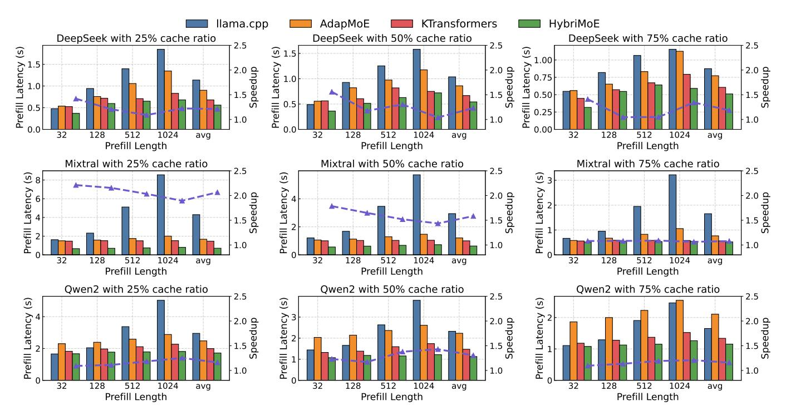
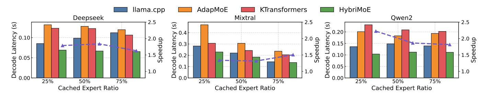
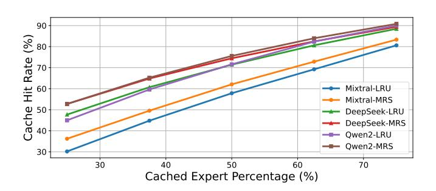

# D. Score-aware Caching

Traditionally, the Least Frequently Used (LFU) and Least Recently Used (LRU) algorithms have been employed for MoE cache management. However, these strategies fail to account for the specific activation patterns observed in MoE models, where expert scores provide valuable predictive signals for future activations. As discussed in III, not only are currently activated experts likely to be reused in the future, but experts with high scores that were not activated also exhibit a higher probability of being selected in subsequent iterations.

To leverage this insight, we propose Score-Aware Caching, a novel cache replacement strategy tailored for MoE models. Specifically, we introduce the **Minus Recent Score** (MRS) replacement policy, which prioritizes retaining experts based on their routing scores.

Define s as the routing scores of all experts in the current iteration, S as the estimated priority score,  $\alpha$  as the averaging coefficient, the update of the estimated priority can be expressed as:

$$S = \alpha \times TopP(s) + (1 - \alpha) \times S \tag{3}$$

Here, only the top p expert scores will be accumulated. This is derived from the observation in figure 3(b) that the reuse probability

TABLE II CONFIGURATION OF THREE EVALUATED MOE MODELS.

|                    | Mixtral       | Qwen2         | DeepSeek     |
|--------------------|---------------|---------------|--------------|
| #Layers            | 32            | 28            | 26           |
| #Shared Experts    | 0             | 1             | 2            |
| #Routed Experts    | 8             | 64            | 64           |
| #Activated Experts | 2             | 8             | 6            |
| Shared Expert Size | /             | (3584, 20480) | (2048, 1408) |
| Routed Expert Size | (4096, 14336) | (3584, 18944) | (2048, 1408) |

of experts with lower scores does not exhibit significant differences. Typically, we set p to twice the number of activated experts.

#### V. SYSTEM IMPLEMENTATION

We implement the HybriMoE system on top of the kTransformers framework and llama.cpp kernels. KTransformers provides a flexible infrastructure for kernel injection, enabling seamless support for hybrid CPU-GPU execution. To optimize the system workflow, we incorporate parallel execution across CPU, GPU, and PCIe transfers, utilizing fine-grained CUDA stream scheduling for efficient resource management. Additionally, we modify the C++ kernels to handle expert computation task allocation directly, minimizing redundant Python overhead and improving execution efficiency. For quantization, we leverage Marlin quantization, a state-of-the-art 4-bit quantization kernel from llama.cpp, to significantly enhance computational efficiency and reduce memory usage.

## VI. EXPERIMENTAL RESULTS

#### *A. Experimental Setup*

- *1) Platforms:* We evaluate HybriMoE on the NVIDIA RTX A6000. For the CPU, we utilize an Intel Xeon Gold 5220R processor, restricting usage to 10 cores to simulate real-world edge deployment scenarios with limited resources. To assess the system's performance and scalability under varying hardware configurations, we adjust the upper bound of the GPU expert cache ratio.
- *2) Models:* We evaluate our system using three widely adopted MoE models with distinct characteristics: Mixtral-8x7B-Instruct [\[17\]](#page-6-14) (Mixtral), DeepSeek-V2-Lite-Chat [\[18\]](#page-6-15) (DeepSeek), and Qwen2- 57B-A14B-Instruct [\[16\]](#page-6-13) (Qwen2). As summarized in Table [II,](#page-4-0) these models differ in the number and size of experts, as well as their architectural configurations. Mixtral represents MoE models with a smaller number of larger experts, while Qwen2 and DeepSeek are representative of models with a larger number of smaller experts. Notably, Qwen2 and DeepSeek also incorporate shared experts, which are activated for all input tokens.
- *3) Baselines:* We evaluate HybriMoE against three representative open-source MoE inference frameworks: llama.cpp [\[27\]](#page-6-21), AdapMoE [\[5\]](#page-6-22), and kTransformers [\[13\]](#page-6-10), each representing a distinct scheduling approach. llama.cpp is a CPU-GPU hybrid scheduling baseline that statically maps model layers to CPU or GPU. AdapMoE is the SOTA for GPU-centric MoE scheduling, minimizing on-demand loading overhead through adaptive prefetching and caching. kTransformers is the SOTA for CPU-GPU hybrid MoE scheduling, mapping highactivation-frequency experts (e.g., shared experts) to the GPU to maximize efficiency.
- *4) Metrics:* Auto-regressive decoding consists of two stages: the prefill stage and the decoding stage. We evaluate the performance of HybriMoE separately for these two stages. For the prefill stage, we use Time To First Token (TTFT), which measures the latency from receiving the input prompt to generating the first token. For the

TABLE III MOE INFERENCE SPEEDUP BREAKDOWN OF PROPOSED TECHNIQUES.

|         | Technique            | Latency(s) | Speedup |
|---------|----------------------|------------|---------|
| Prefill | Baseline             | 1.47       |         |
|         | Baseline+Scheduling  | 1.17       | 1.26×   |
|         | Baseline+Prefetching | 1.39       | 1.06×   |
|         | All                  | 1.13       | 1.31×   |
| Decode  | Baseline             | 0.21       |         |
|         | Baseline+Scheduling  | 0.14       | 1.46×   |
|         | Baseline+Prefetching | 0.18       | 1.15×   |
|         | Baseline+Caching     | 0.15       | 1.38×   |
|         | All                  | 0.11       | 1.86×   |

decoding stage, we use Time Between Tokens (TBT), which captures the time taken to generate each subsequent token. These metrics provide a clear assessment of both initial latency and sustained efficiency during inference.

*5) Datasets:* For the prefill stage, we evaluate performance under varying input lengths by sampling traces of different lengths from multiple datasets, including MT Bench [\[28\]](#page-6-23), Vicuna Bench [\[29\]](#page-6-24) and ChatGPT Prompts [\[30\]](#page-6-25). In contrast, for the decoding stage, as performance is not sensitive to input length, we use only the ChatGPT Prompts dataset to evaluate the TBT metric.

#### *B. End-to-End Performance*

*1) Prefill Stage:* We evaluate the prefill stage performance of HybriMoE by comparing it against three baselines: llama.cpp, AdapMoE, and kTransformers. Figure [7](#page-5-0) presents the TTFT results across various input legnths(around 32, 128, 512 and 1024 tokens) and different GPU expert cache ratios(25%, 50% and 75%).

HybriMoE demonstrates consistent improvements over the baselines across all input lengths and cache configurations. llama.cpp exhibits significantly higher prefill latency due to its naive static mapping strategy, which allocates entire layers of experts to the CPU. This approach fails to balance workloads effectively, particularly in the prefill stage where computational demand is high, leading to substantial delays. Compared to kTransformers, HybriMoE achieves an average speedup of 1.33× across different input lengths and cache configurations. This improvement is driven by HybriMoE's hybrid scheduling and impact-driven prefetching mechanisms, which dynamically balance workloads and reduce cache misses, enabling more efficient resource utilization.

*2) Decode Stage:* Figure [8](#page-5-1) illustrates the decode performance results for three MoE models. HybriMoE consistently achieves the highest throughput across all cache ratios and models, demonstrating its ability to dynamically balance workloads and fully utilize hardware resources during the decode stage. Compared to kTransformers, HybriMoE achieves an average throughput improvement of 1.70×. Also, it is worth noting that llama.cpp demonstrates relatively strong performance in this stage, especially compared to its prefill stage results. This is primarily due to the smaller computational load per expert in the decode stage, which allows CPU-based computation to proceed faster. Additionally, the impact of uneven expert mapping is less pronounced compared to the prefill stage, and the overall resource overhead remains low, favoring llama.cpp's static scheduling strategy in this specific context.

## *C. Ablation Study*

We further explore how the components of our method contribute to the result. Performance was measured for Qwen2 under 25%

Fig. 7. Prefill stage performance comparison across different input lengths and cache ratios, highlighting relative speedups against kTransformers.

Fig. 8. Decode stage performance comparison across different cache ratios.

Fig. 9. Cache Hit Rate Comparison Between MRS and LRU Across Different Cached Expert Percentages.

expert cache ratio for the two stages. The baseline is ktransformers framework. The results are illustrated in table III.

#### D. Discussions

1) Score-aware Cache Management Analysis: Figure 9 compares the cache hit rates of HybriMoE's Minus Recent Score (MRS) strategy and the traditional Least Recently Used (LRU) strategy

across three models under varying cached expert percentages. At 25% cache capacity, MRS outperforms LRU by 6% to 8%, with Mixtral improving from 30.2% to 36.2%, DeepSeek from 47.7% to 52.7%, and Qwen2 from 45.0% to 52.8%. As cache capacity increases to 75%, the gap narrows (e.g., Mixtral: 83.3% vs. 80.6%), as higher capacities reduce expert competition, diminishing the relative impact of the caching strategy. These results highlight MRS's effectiveness, particularly under limited cache settings.

## VII. CONCLUSION

This paper presents HybriMoE, a hybrid CPU-GPU scheduling and cache management system designed to address the challenges of MoE inference, including dynamic expert activations and workload imbalances. By incorporating dynamic intra-layer scheduling, impact-driven prefetching, and score-aware caching, HybriMoE achieves efficient resource utilization and reduced latency. Experiments on various MoE models demonstrate that HybriMoE achieves an average speedup of 1.33x in prefill latency and 1.70x in decode latency compared to state-of-the-art methods. These results highlight HybriMoE's effectiveness in optimizing hybrid MoE inference and its potential for scalable deployment on resource-constrained devices.

## REFERENCES

- [1] N. Shazeer, A. Mirhoseini, K. Maziarz, A. Davis, Q. Le, G. Hinton, and J. Dean, "Outrageously large neural networks: The sparsely-gated mixture-of-experts layer," *arXiv preprint arXiv:1701.06538*, 2017.
- [2] S. Masoudnia and R. Ebrahimpour, "Mixture of experts: a literature survey," *Artificial Intelligence Review*, vol. 42, pp. 275–293, 2014.
- [3] A. Eliseev and D. Mazur, "Fast inference of mixture-of-experts language models with offloading," *arXiv preprint arXiv:2312.17238*, 2023.
- [4] R. Hwang, J. Wei, S. Cao, C. Hwang, X. Tang, T. Cao, M. Yang, and M. Rhu, "Pre-gated moe: An algorithm-system co-design for fast and scalable mixture-of-expert inference," *arXiv preprint arXiv:2308.12066*, 2023.
- [5] S. Zhong, L. Liang, Y. Wang, R. Wang, R. Huang, and M. Li, "Adapmoe: Adaptive sensitivity-based expert gating and management for efficient moe inference," *arXiv preprint arXiv:2408.10284*, 2024.
- [6] X. Song, Z. Zhong, and R. Chen, "Promoe: Fast moe-based llm serving using proactive caching," *arXiv preprint arXiv:2410.22134*, 2024.
- [7] P. Tang, J. Liu, X. Hou, Y. Pu, J. Wang, P.-A. Heng, C. Li, and M. Guo, "Hobbit: A mixed precision expert offloading system for fast moe inference," *arXiv preprint arXiv:2411.01433*, 2024.
- [8] J. You, J. Wu, X. Jin, and M. Chowdhury, "Ship compute or ship data? why not both?" in *18th USENIX Symposium on Networked Systems Design and Implementation (NSDI 21)*, 2021, pp. 633–651.
- [9] D. Park and B. Egger, "Improving throughput-oriented llm inference with cpu computations," in *Proceedings of the 2024 International Conference on Parallel Architectures and Compilation Techniques*, 2024, pp. 233–245.
- [10] Y. Song, Z. Mi, H. Xie, and H. Chen, "Powerinfer: Fast large language model serving with a consumer-grade gpu," *arXiv preprint arXiv:2312.12456*, 2023.
- [11] S. Li, H. Lu, T. Wu, M. Yu, Q. Weng, X. Chen, Y. Shan, B. Yuan, and W. Wang, "Caraserve: Cpu-assisted and rank-aware lora serving for generative llm inference," *arXiv preprint arXiv:2401.11240*, 2024.
- [12] K. Kamahori, Y. Gu, K. Zhu, and B. Kasikci, "Fiddler: Cpu-gpu orchestration for fast inference of mixture-of-experts models," *arXiv preprint arXiv:2402.07033*, 2024.
- [13] KVCache-AI, "Ktransformers: A flexible framework for experiencing cutting-edge llm inference optimizations," 2024, [https://github.com/](https://github.com/kvcache-ai/ktransformers) [kvcache-ai/ktransformers.](https://github.com/kvcache-ai/ktransformers)
- [14] W. Fedus, B. Zoph, and N. Shazeer, "Switch transformers: Scaling to trillion parameter models with simple and efficient sparsity," *Journal of Machine Learning Research*, vol. 23, no. 120, pp. 1–39, 2022.
- [15] M. R. Costa-jussa, J. Cross, O. C¸ elebi, M. Elbayad, K. Heafield, ` K. Heffernan, E. Kalbassi, J. Lam, D. Licht, J. Maillard *et al.*, "No language left behind: Scaling human-centered machine translation," *arXiv preprint arXiv:2207.04672*, 2022.
- [16] A. Yang, B. Yang, B. Hui, B. Zheng, B. Yu, C. Zhou, C. Li, C. Li, D. Liu, F. Huang *et al.*, "Qwen2 technical report," *arXiv preprint arXiv:2407.10671*, 2024.
- [17] A. Q. Jiang, A. Sablayrolles, A. Roux, A. Mensch, B. Savary, C. Bamford, D. S. Chaplot, D. d. l. Casas, E. B. Hanna, F. Bressand *et al.*, "Mixtral of experts," *arXiv preprint arXiv:2401.04088*, 2024.
- [18] A. Liu, B. Feng, B. Wang, B. Wang, B. Liu, C. Zhao, C. Dengr, C. Ruan, D. Dai, D. Guo *et al.*, "Deepseek-v2: A strong, economical, and efficient mixture-of-experts language model," *arXiv preprint arXiv:2405.04434*, 2024.
- [19] D. Dai, C. Deng, C. Zhao, R. Xu, H. Gao, D. Chen, J. Li, W. Zeng, X. Yu, Y. Wu *et al.*, "Deepseekmoe: Towards ultimate expert specialization in mixture-of-experts language models," *arXiv preprint arXiv:2401.06066*, 2024.
- [20] R. Y. Aminabadi, S. Rajbhandari, A. A. Awan, C. Li, D. Li, E. Zheng, O. Ruwase, S. Smith, M. Zhang, J. Rasley *et al.*, "Deepspeed-inference: enabling efficient inference of transformer models at unprecedented scale," in *SC22: International Conference for High Performance Computing, Networking, Storage and Analysis*. IEEE, 2022, pp. 1–15.
- [21] Y. Sheng, L. Zheng, B. Yuan, Z. Li, M. Ryabinin, B. Chen, P. Liang, C. Re, I. Stoica, and C. Zhang, "Flexgen: High-throughput generative ´ inference of large language models with a single gpu," in *International Conference on Machine Learning*. PMLR, 2023, pp. 31 094–31 116.
- [22] J. Li, Q. Su, Y. Yang, Y. Jiang, C. Wang, and H. Xu, "Adaptive gating in mixture-of-experts based language models," *arXiv preprint arXiv:2310.07188*, 2023.

- [23] Y. Wei, J. Du, J. Jiang, X. Shi, X. Zhang, D. Huang, N. Xiao, and Y. Lu, "Aptmoe: Affinity-aware pipeline tuning for moe models on bandwidthconstrained gpu nodes," in *2024 SC24: International Conference for High Performance Computing, Networking, Storage and Analysis SC*. IEEE Computer Society, 2024, pp. 1436–1449.
- [24] P. Li, X. Jin, Y. Cheng, and T. Chen, "Examining post-training quantization for mixture-of-experts: A benchmark," *arXiv preprint arXiv:2406.08155*, 2024.
- [25] L. Xue, Y. Fu, Z. Lu, L. Mai, and M. Marina, "Moe-infinity: Activationaware expert offloading for efficient moe serving," *arXiv preprint arXiv:2401.14361*, 2024.
- [26] X. He, S. Zhang, Y. Wang, H. Yin, Z. Zeng, S. Shi, Z. Tang, X. Chu, I. Tsang, and O. Y. Soon, "Expertflow: Optimized expert activation and token allocation for efficient mixture-of-experts inference," 2024. [Online]. Available:<https://arxiv.org/abs/2410.17954>
- [27] G. Gerganov, "ggerganov/llama.cpp: Port of facebook's llama model in c/c++," 2023. [Online]. Available: [https://github.com/ggerganov/llama.](https://github.com/ggerganov/llama.cpp) [cpp](https://github.com/ggerganov/llama.cpp)
- [28] L. Zheng, W.-L. Chiang, Y. Sheng, S. Zhuang, Z. Wu, Y. Zhuang, Z. Lin, Z. Li, D. Li, E. Xing *et al.*, "Judging llm-as-a-judge with mt-bench and chatbot arena," *Advances in Neural Information Processing Systems*, vol. 36, 2024.
- [29] L. Zheng, W.-L. Chiang, Y. Sheng, S. Zhuang, Z. Wu, Y. Zhuang, Z. Lin, Z. Li, D. Li, E. P. Xing, H. Zhang, J. E. Gonzalez, and I. Stoica, "Judging llm-as-a-judge with mt-bench and chatbot arena," 2023. [Online]. Available:<https://arxiv.org/abs/2306.05685>
- [30] MohamedRashad, "Chatgpt-prompts," 2023. [Online]. Available: [https:](https://huggingface.co/datasets/MohamedRashad/ChatGPT-prompts) [//huggingface.co/datasets/MohamedRashad/ChatGPT-prompts](https://huggingface.co/datasets/MohamedRashad/ChatGPT-prompts)