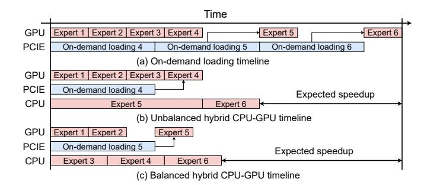
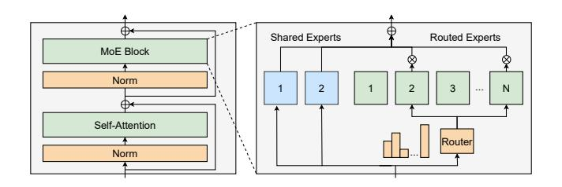

# HybriMoE: Hybrid CPU-GPU Scheduling and Cache Management for Efficient MoE Inference

Shuzhang Zhong1,2, Yanfan Sun5, Ling Liang2, Runsheng Wang2,3,4, Ru Huang2,3,4, Meng Li1,2,4\*

1Institute for Artificial Intelligence, Peking University, Beijing, China

2School of Integrated Circuits, Peking University, Beijing, China

3Institute of Electronic Design Automation, Peking University, Wuxi, China

4Beijing Advanced Innovation Center for Integrated Circuits, Beijing, China

5School of Computer Science and Engineering, Beihang University, Beijing, China

Abstract-The Mixture of Experts (MoE) architecture has demonstrated significant advantages as it enables to increase the model capacity without a proportional increase in computation. However, the large MoE model size still introduces substantial memory demands, which usually requires expert offloading on resource-constrained platforms and incurs significant overhead. Hybrid CPU-GPU inference has been proposed to leverage CPU computation to reduce expert loading overhead but faces major challenges: on one hand, the expert activation patterns of MoE models are highly unstable, rendering the fixed mapping strategies in existing works inefficient; on the other hand, the hybrid CPU-GPU schedule for MoE is inherently complex due to the diverse expert sizes, structures, uneven workload distribution, etc. To address these challenges, this paper, we propose HybriMoE, a hybrid CPU-GPU inference framework that improves resource utilization through a novel CPU-GPU scheduling and cache management system. HybriMoE introduces (i) a dynamic intra-layer scheduling strategy to balance workloads across CPU and GPU, (ii) an impact-driven inter-layer prefetching algorithm, and (iii) a score-based caching algorithm to mitigate expert activation instability. We implement HybriMoE on top of the kTransformers framework and evaluate it on three widely used MoE-based LLMs. Experimental results demonstrate that HybriMoE achieves an average speedup of  $1.33\times$  in the prefill stage and  $1.70\times$  in the decode stage compared to state-ofthe-art hybrid MoE inference framework. Our code is available at: https://github.com/PKU-SEC-Lab/HybriMoE.

#### I. INTRODUCTION

Mixture of Experts (MoE) has emerged as a promising solution to enhance computational efficiency of Large Language Models (LLMs) without compromising model performance [1], [2]. By employing dynamic routing functions that allocate input tokens to a subset of experts, MoE enables the scaling of LLM parameters and capabilities without a proportional increase in computational demands.

Despite its advantages, MoE introduces significant memory requirements, which pose a particular challenge for deployment on edge devices with limited memory resources. To mitigate this issue, expert offloading techniques store expert weights in secondary storage, such as CPU memory or SSDs, and load them into GPU memory through PCIE on demand [3]. In such offloading scenarios, the primary bottleneck becomes the overhead associated with on-demand loading, driven by the large communication scale and limited bandwidth. To mitigate this problem, several studies have explored quantization, prefetching or caching techniques to reduce latency [4]–[7].

Previous works in other offloading scenarios have further explored leveraging CPU computation to reduce the frequency of memory

This work was supported in part by NSFC under Grant 62495102 and Grant 92464104, in part by the National Key Research and Development Program under Grant 2024YFB4505004, in part by Beijing Municipal Science and Technology Program under Grant Z241100004224015, and in part by 111 Project under Grant B18001.

\*Corresponding author: meng.li@pku.edu.cn

Fig. 1. Execution timeline of three scenarios. Expert computation time on the GPU remains constant, while CPU execution time increases linearly with workload. The balanced scheduling in (c) achieves improved utilization and reduces overall execution time.

transfers [8], [9]. Techniques such as PowerInfer [10] and Caraserve [11] have achieved notable success by exploiting activation patterns or optimizing adapter usage during inference. Similarly, MoE-specific offloading approaches, including Fiddler [12] and kTransformers [13], utilize the CPU to execute expert layers during cache misses. As illustrated in Figure 1, when a cache miss occurs, the CPU processes the corresponding expert computation instead of transferring the layer to the GPU, reducing data transfer overhead.

While CPU computation is effective for traditional inference tasks, MoE models present unique challenges that complicate their application. Expert activations in MoE models are typically less skewed and exhibit significant variability across iterations, making it difficult to predict which experts will be activated [6]. This dynamic behavior complicates the balancing of workloads between CPU and GPU, as static task allocation strategies fail to adapt to real-time changes in workload distribution. However, existing solutions rely on **fixed mapping strategies** based on historical activation frequencies, neglecting the dynamic and unpredictable nature of MoE inference. These limitations result in suboptimal resource utilization and increased inference latency as illustrated in figure 1(b) and (c).

In light of these challenges and opportunities, we propose **Hybri-MoE**, a hybrid CPU-GPU scheduling and cache management system to improve the efficiency of MoE inference. Reducing latency in hybrid systems requires maximizing hardware resource utilization, which depends on effective task-to-hardware mapping. However, the dynamic nature of MoE models poses significant challenges to designing optimal mapping strategies. To address this, HybriMoE introduces a comprehensive optimization framework to improve mapping efficiency through three key directions: (i) intra-layer hybrid scheduling, (ii) inter-layer prefetching, and (iii) inter-iteration cache

Fig. 2. An example of MoE architecture with shared and routed experts.

management. The key contributions of HybriMoE are as follows:

- Hybrid MoE CPU-GPU Scheduling. An efficient hybrid scheduling algorithm for MoE inference that dynamically balances workloads across GPUs and CPUs, optimizing resource utilization and minimizing latency through prioritized task execution and data transfer management.
- Impact-driven prefetching. A prefetching mechanism that simulates the potential impact of preloading experts from subsequent layers and prioritizes those with the higher expected gains.
- MoE-specialized Cache Management. An expert score-based caching strategy that prioritizes high-demand experts across layers to minimize cache misses.
- **System Implementation.** We implement HybriMoE on top of ktransformers framework. We evaluate HybriMoE on three popular MoE-based LLMs and various platforms. Compared to existing hybrid scheduling methods, HybriMoE achieves 1.33× and 1.70x speedup on prefill and decode stages respectively.

#### II. BACKGROUND

#### A. Mixture-of-Experts

Mixture-of-Experts (MoE) models offer an efficient solution for handling the computational demands of LLMs by activating only a subset of experts [2], [14]–[16]. Unlike traditional dense networks, MoE models use a gating function G to select which experts process a given input token, reducing the number of active parameters and improving computational efficiency. Given an input x and N experts  $E_0, ... E_{N-1}$  the output y of the MoE layer can be expressed as:

$$y = \sum_{i=0}^{N-1} \text{Softmax}(\text{TopK}(x \cdot W_g))_i E_i(x)$$
 (1)

The total number of experts N and the number of activated experts K vary among different MoE implementations. For instance, the Mixtral model employs 8 experts, with only 2 being active at a time [17]. In contrast, DeepSeek utilizes 64 experts, activating 6 at once. This larger, finer-grained expert pool allows for greater specialization and more efficient knowledge acquisition [18], [19]. Additionally, as shown in figure 2, DeepSeek employs a shared expert strategy, where a subset of experts—known as shared experts—are activated for all tokens. The original experts are defined as routed experts. This reduces redundancy among experts, ensuring efficient processing by minimizing unnecessary computational overlap, thus enhancing overall model efficiency.

